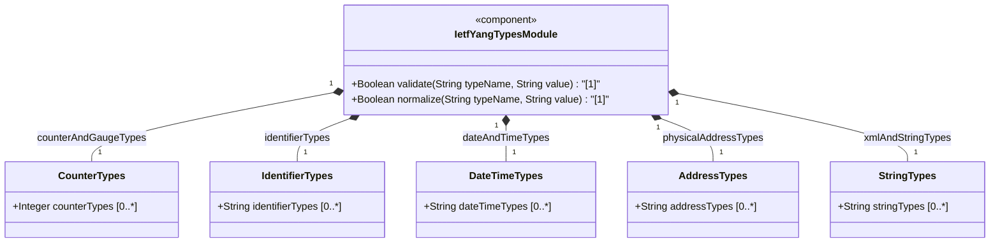
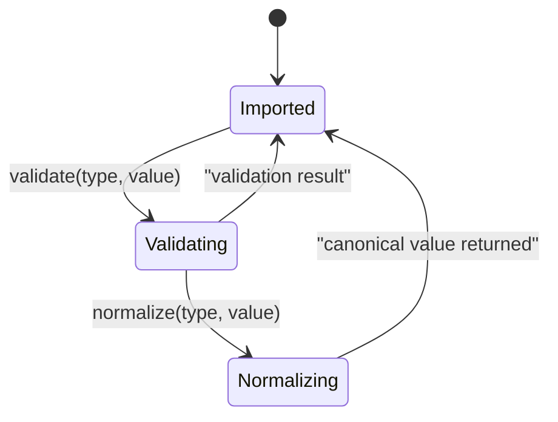

# Epic: [RFC9911-YANG] Common YANG Data Types

## 1. Context
This Epic encompasses the `ietf-yang-types` YANG utility module defined in RFC 9911 Section 3. The module provides a collection of generally useful derived YANG data types organized into semantic categories: counter and gauge types for network statistics, identifier-related types for registration-hierarchical-name trees, date and time types following ISO 8601 with RFC 3339/9557 extensions, physical address types for hardware addressing, and general-purpose string types (XPath, hex, UUID, dotted-quad, language tags, YANG identifiers). As a utility module containing only `typedef` statements, this module serves as a shared type library consumed by other YANG modules via `import`. All types maintain SMIv2 equivalence where applicable.

## 2. Requirements & Checklist
- [ ] #1 - [RFC9911-YANG Counter and Gauge Types](https://github.com/gintatkinson/3dgs-039/blob/main/docs/features/feat-01-rfc9911-yang-counter-and-gauge-types.md) (defines counter32, zero-based-counter32, counter64, zero-based-counter64, gauge32, gauge64 -- Section 3)
- [ ] #2 - [RFC9911-YANG Identifier Types](https://github.com/gintatkinson/3dgs-039/blob/main/docs/features/feat-02-rfc9911-yang-identifier-types.md) (defines object-identifier, object-identifier-128 -- Section 3)
- [ ] #3 - [RFC9911-YANG Date and Time Types](https://github.com/gintatkinson/3dgs-039/blob/main/docs/features/feat-03-rfc9911-yang-date-and-time-types.md) (defines date-and-time, date, date-no-zone, time, time-no-zone, hours32-nanoseconds64, timeticks, timestamp -- Section 3)
- [ ] #4 - [RFC9911-YANG Physical Address Types](https://github.com/gintatkinson/3dgs-039/blob/main/docs/features/feat-04-rfc9911-yang-physical-address-types.md) (defines phys-address, mac-address -- Section 3)
- [ ] #5 - [RFC9911-YANG XML and String Types](https://github.com/gintatkinson/3dgs-039/blob/main/docs/features/feat-05-rfc9911-yang-xml-and-string-types.md) (defines xpath1.0, hex-string, uuid, dotted-quad, language-tag, yang-identifier -- Section 3)

### Associated Use Cases & User Stories

#### Associated Use Cases
Use Cases are deferred to Phase 2 specification engineering.

#### Associated User Stories
User Stories are deferred to Phase 2 specification engineering.

## 3. Architecture

### Subsystem Component Definition
The ietf-yang-types module defines a reusable type library with no runtime state. It exports 29 derived YANG types organized by semantic category. Downstream modules import these types via `import ietf-yang-types` and reference them with the `yang:` prefix.

### System-Level UML Class Diagram

### State Machine Definitions

### System State Machine Diagram

## 4. Operational Considerations
The module is stateless -- all types are pure data type definitions. There is no startup, shutdown, or persistence lifecycle. Importing modules must ensure that their YANG compiler or runtime supports the typedefs defined here. For YANG 1.0 contexts, the yang-identifier type excludes identifiers starting with 'xml' (any case) as specified in RFC 6020.

## 5. Security & Governance
- No writable data nodes exist in this utility module; security considerations apply only to schema nodes in importing modules that use these types.
- The language-tag type accepts well-formed BCP 47 tags; implementations may restrict to validating processor to limit tag injection.
- The xpath1.0 type carries expressions evaluated in a specified context; importing schema nodes MUST describe the XPath context to prevent arbitrary path injection.
- UUID values should not be assumed to guarantee global uniqueness without additional validation.
- Refer to RFC 9911 Section 6 for full security considerations.

## Specification Context
From RFC 9911, Section 3:

> This module contains a collection of generally useful derived YANG data types. The "ietf-yang-types" YANG module references IEEE 802, ISO 8601, ISO 9834-1, RFC 2578, RFC 2579, RFC 2856, RFC 3339, RFC 4502, RFC 5131, RFC 5646, RFC 7950, RFC 9557, RFC 9562, XPATH, and XSD-TYPES.

From RFC 9911, Section 1:

> The "ietf-yang-types" module defines generally useful data types such as types for counters and gauges, types related to date and time, and types for common string values (e.g., UUIDs, dotted-quad notation, and language tags).

## 6. Source References
Structural Schema: [ietf-yang-types@2025-12-22.yang](https://github.com/gintatkinson/3dgs-039/blob/main/schema/ietf-yang-types%402025-12-22.yang)
Normative Specification: [RFC 9911](https://datatracker.ietf.org/doc/rfc9911/) (Section 3: Core YANG Types)
