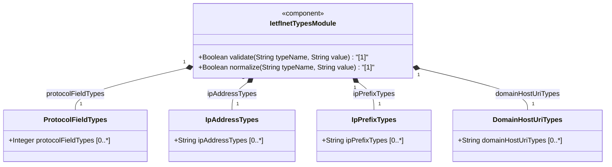
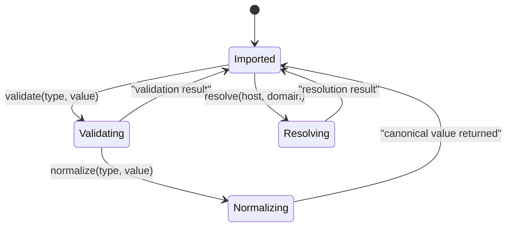

# Epic: [RFC9911-INET] Internet Protocol Suite Types

## 1. Context
This Epic encompasses the `ietf-inet-types` YANG utility module defined in RFC 9911 Section 4. The module provides a collection of derived YANG data types for Internet addresses and related concepts organized into semantic categories: protocol field types for IP header fields and transport-layer identifiers, IP address types supporting IPv4 and IPv6 with zone indices, IP prefix and address-and-prefix types for network prefix representation, and domain/host/URI/email types for naming and resource identification. As a utility module containing only `typedef` statements, this module serves as a shared type library consumed by other YANG modules. Several types maintain SMIv2 equivalence where applicable.

## 2. Requirements & Checklist
- [ ] #6 - [RFC9911-INET Protocol Field Types](https://github.com/gintatkinson/3dgs-039/blob/main/docs/features/feat-06-rfc9911-inet-protocol-field-types.md) (defines ip-version, dscp, ipv6-flow-label, port-number, protocol-number, upper-layer-protocol-number, as-number -- Section 4)
- [ ] #7 - [RFC9911-INET IP Address Types](https://github.com/gintatkinson/3dgs-039/blob/main/docs/features/feat-07-rfc9911-inet-ip-address-types.md) (defines ip-address, ipv4-address, ipv6-address, ip-address-no-zone, ipv4-address-no-zone, ipv6-address-no-zone, ip-address-link-local, ipv4-address-link-local, ipv6-address-link-local -- Section 4)
- [ ] #8 - [RFC9911-INET IP Prefix Types](https://github.com/gintatkinson/3dgs-039/blob/main/docs/features/feat-08-rfc9911-inet-ip-prefix-types.md) (defines ip-prefix, ipv4-prefix, ipv6-prefix, ip-address-and-prefix, ipv4-address-and-prefix, ipv6-address-and-prefix -- Section 4)
- [ ] #9 - [RFC9911-INET Domain, Host, and URI Types](https://github.com/gintatkinson/3dgs-039/blob/main/docs/features/feat-09-rfc9911-inet-domain-host-and-uri-types.md) (defines domain-name, host-name, host, uri, email-address -- Section 4)

### Associated Use Cases & User Stories

#### Associated Use Cases
Use Cases are deferred to Phase 2 specification engineering.

#### Associated User Stories
User Stories are deferred to Phase 2 specification engineering.

## 3. Architecture

### Subsystem Component Definition
The ietf-inet-types module defines a reusable type library for Internet Protocol Suite addressing and identification. It exports 29 derived YANG types organized by semantic category. Downstream modules import these types via `import ietf-inet-types` and reference them with the `inet:` prefix. This module imports no other modules; all types are derived from YANG built-in types.

### System-Level UML Class Diagram

### State Machine Definitions

### System State Machine Diagram

## 4. Operational Considerations
The module is stateless -- all types are pure data type definitions requiring no runtime lifecycle. Importing modules must ensure their YANG compiler or runtime supports the typedefs defined here. URI normalization per RFC 3986 and IPv6 canonical formatting per RFC 5952 are required for conforming implementations. Domain name resolution behavior MUST be described in the schema node descriptions of importing modules. Zone indices in IP addresses require local interface name-to-UTF-8 transformation for non-UTF-8 systems.

## 5. Security & Governance
- No writable data nodes exist in this utility module; security considerations apply only to schema nodes in importing modules.
- IP address types may carry zone indices identifying local interfaces; exporting interface names across trust boundaries may leak internal topology.
- The email-address type supports internationalized addresses per RFC 6532; implementations should be aware of homograph attacks in internationalized domain names.
- The uri type does not restrict permitted schemes by default; importing schema nodes should restrict schemes (e.g., disallow data or javascript) where appropriate.
- Refer to RFC 9911 Section 6 for full security considerations.

## Specification Context
From RFC 9911, Section 4:

> The "ietf-inet-types" module defines data types relevant for the Internet Protocol suite such as types related to IP addresses, types for domain name, host name, URI, and email, and types for values in common protocol fields (e.g., port numbers).

From RFC 9911, Section 1:

> The "ietf-inet-types" module defines data types relevant for the Internet Protocol suite.

## 6. Source References
Structural Schema: [ietf-inet-types@2025-12-22.yang](https://raw.githubusercontent.com/gintatkinson/3dgs-039/main/schema/ietf-inet-types%402025-12-22.yang)
Normative Specification: [RFC 9911](https://datatracker.ietf.org/doc/rfc9911/) (Section 4: Internet Protocol Suite Types)
