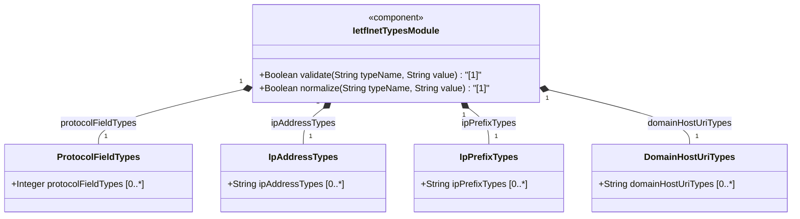
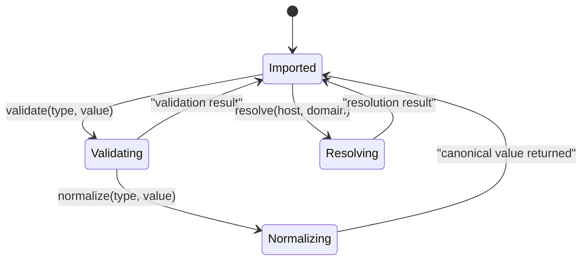

# Epic: [RFC6991-INET] Internet Protocol Suite Types

## 1. Context
This Epic encompasses the `ietf-inet-types` YANG utility module defined in RFC 6991 Section 4 (2013-07-15 revision, obsoletes RFC 6021). The module provides a collection of derived YANG data types for Internet addresses and related concepts organized into four semantic categories: Protocol Field Types for IP header fields and transport-layer identifiers (ip-version, dscp, ipv6-flow-label, port-number, as-number), IP Address Types supporting IPv4 and IPv6 with zone indices including the new no-zone variants added in this revision (ip-address, ipv4-address, ipv6-address, ip-address-no-zone, ipv4-address-no-zone, ipv6-address-no-zone), IP Prefix Types for CIDR prefix notation (ip-prefix, ipv4-prefix, ipv6-prefix), and Domain, Host, and URI Types for naming and resource identification (domain-name, host, uri). As a utility module containing only `typedef` statements, this module serves as a shared type library consumed by other YANG modules via `import`. Several types maintain SMIv2 textual convention equivalence where applicable. This revision adds ip-address-no-zone, ipv4-address-no-zone, and ipv6-address-no-zone types for contexts where zone indices are known implicitly. This module is obsoleted by RFC 9911 (2025).

## 2. Requirements & Checklist
- [ ] #25 - [RFC6991-INET Protocol Field Types](https://github.com/gintatkinson/3dgs-039/blob/main/docs/features/feat-10-rfc6991-inet-protocol-field-types.md) (defines ip-version, dscp, ipv6-flow-label, port-number, and as-number typedefs -- RFC 6991 Section 4)
- [ ] #26 - [RFC6991-INET IP Address Types](https://github.com/gintatkinson/3dgs-039/blob/main/docs/features/feat-11-rfc6991-inet-ip-address-types.md) (defines ip-address, ipv4-address, ipv6-address, ip-address-no-zone, ipv4-address-no-zone, and ipv6-address-no-zone typedefs -- RFC 6991 Section 4)
- [ ] #27 - [RFC6991-INET IP Prefix Types](https://github.com/gintatkinson/3dgs-039/blob/main/docs/features/feat-12-rfc6991-inet-ip-prefix-types.md) (defines ip-prefix, ipv4-prefix, and ipv6-prefix typedefs -- RFC 6991 Section 4)
- [ ] #28 - [RFC6991-INET Domain, Host, and URI Types](https://github.com/gintatkinson/3dgs-039/blob/main/docs/features/feat-13-rfc6991-inet-domain-host-and-uri-types.md) (defines domain-name, host, and uri typedefs -- RFC 6991 Section 4)

### Associated Use Cases & User Stories

#### Associated Use Cases
- [ ] #35 - [[RFC6991-INET] Validate IP Address Instance Against RFC 6991 Type Constraint](https://github.com/gintatkinson/3dgs-039/blob/main/docs/use-cases/uc-05-rfc6991-inet-validate-ip-address-instance.md) (validates IP address typed data against RFC 6991 type patterns and constraints)
- [ ] #36 - [[RFC6991-INET] Resolve Host and Domain Identifiers Using RFC 6991 Types](https://github.com/gintatkinson/3dgs-039/blob/main/docs/use-cases/uc-06-rfc6991-inet-resolve-host-and-domain-identifiers.md) (resolves host identifiers through IP address parsing and domain-name validation)
Use Cases are deferred to Phase 2 specification engineering.

#### Associated User Stories
- [ ] #30 - [[RFC6991-INET] IP Address Scope and Zone Handling](https://github.com/gintatkinson/3dgs-039/blob/main/docs/user-stories/us-10-rfc6991-inet-ip-address-scope-and-zone-handling.md) (specifies IPv4/IPv6 address parsing, zone index handling, and address union resolution)
- [ ] #34 - [[RFC6991-INET] IP Prefix and Mask Validation](https://github.com/gintatkinson/3dgs-039/blob/main/docs/user-stories/us-11-rfc6991-inet-ip-prefix-and-mask-validation.md) (specifies IPv4/IPv6 prefix notation validation and prefix union resolution)
- [ ] #32 - [[RFC6991-INET] Domain Name Validation Rules](https://github.com/gintatkinson/3dgs-039/blob/main/docs/user-stories/us-12-rfc6991-inet-domain-name-validation-rules.md) (specifies domain-name label format, length limits, and TLD constraints)
- [ ] #31 - [[RFC6991-INET] Host Identifier Resolution](https://github.com/gintatkinson/3dgs-039/blob/main/docs/user-stories/us-13-rfc6991-inet-host-identifier-resolution.md) (specifies host union resolution strategy for IP address vs domain-name disambiguation)
- [ ] #33 - [[RFC6991-INET] Port Number and Protocol Field Validation](https://github.com/gintatkinson/3dgs-039/blob/main/docs/user-stories/us-14-rfc6991-inet-port-number-and-protocol-field-validation.md) (specifies port-number range validation, dscp 6-bit encoding, and ipv6-flow-label 20-bit constraints)
User Stories are deferred to Phase 2 specification engineering.

## 3. Architecture

### Subsystem Component Definition
The ietf-inet-types module (RFC 6991 revision, 2013-07-15) defines a reusable type library for Internet Protocol Suite addressing and identification. It exports 14 derived YANG types organized by four semantic categories. Downstream modules import these types via `import ietf-inet-types` and reference them with the `inet:` prefix. This module imports no other modules; all types are derived from YANG built-in types. This revision added ip-address-no-zone, ipv4-address-no-zone, and ipv6-address-no-zone types.

### System-Level UML Class Diagram

### State Machine Definitions

### System State Machine Diagram

## 4. Operational Considerations
The module is stateless -- all types are pure data type definitions requiring no runtime lifecycle. Importing modules must ensure their YANG compiler or runtime supports the typedefs defined here. URI normalization per RFC 3986 and IPv6 canonical formatting per RFC 5952 are required for conforming implementations. Domain name resolution behavior MUST be described in the schema node descriptions of importing modules. Zone indices in IP addresses require local interface name transformation for non-UTF-8 systems. The ip-address-no-zone, ipv4-address-no-zone, and ipv6-address-no-zone types (added in this 2013-07-15 revision) are for use where the zone is known from context. This module is obsoleted by RFC 9911 which adds link-local address variants, protocol-number, upper-layer-protocol-number, host-name, and email-address types.

## 5. Security & Governance
Network address and hostname data types may reveal internal network topology when exported or logged. URI values may contain sensitive information including authentication credentials if not properly sanitized. Security considerations for DNS resolution include cache poisoning risks when resolving domain names in YANG schema nodes. AS number assignments are managed by IANA and regional Internet registries; unauthorized AS number values in configuration may enable BGP route hijacking. Port number scanning and enumeration may reveal active services and attack surfaces. URI scheme restrictions should be enforced at the schema node level to prevent data exfiltration via schemes like "file:" or "javascript:". Zone indices in scoped addresses may leak interface names and internal network architecture.

## Specification Context
From RFC 6991, Section 4 (ietf-inet-types module):

> This module contains a collection of generally useful derived YANG data types for Internet addresses and related things.

The module revision 2013-07-15 adds ip-address-no-zone, ipv4-address-no-zone, and ipv6-address-no-zone data types. The previous revision 2010-09-24 was the initial revision published in RFC 6021.

The ietf-inet-types module defines 17 derived YANG types in 4 semantic collections:
- Types related to protocol fields: ip-version, dscp, ipv6-flow-label, port-number
- Types related to autonomous systems: as-number
- Types related to IP addresses and hostnames: ip-address, ipv4-address, ipv6-address, ip-address-no-zone, ipv4-address-no-zone, ipv6-address-no-zone
- Types related to IP prefixes: ip-prefix, ipv4-prefix, ipv6-prefix
- Types related to domain names and URIs: domain-name, host, uri

Table 2 of RFC 6991 maps each type to its equivalent SMIv2 type where applicable.

## 6. Source References
Structural Schema: [ietf-inet-types@2013-07-15.yang](https://raw.githubusercontent.com/gintatkinson/3dgs-039/main/schema/ietf-inet-types%402013-07-15.yang) (module ietf-inet-types, revision 2013-07-15)
Normative Specification: [RFC 6991](https://datatracker.ietf.org/doc/rfc6991/) (Section 4: Internet-Specific Derived Types, obsoletes RFC 6021)
