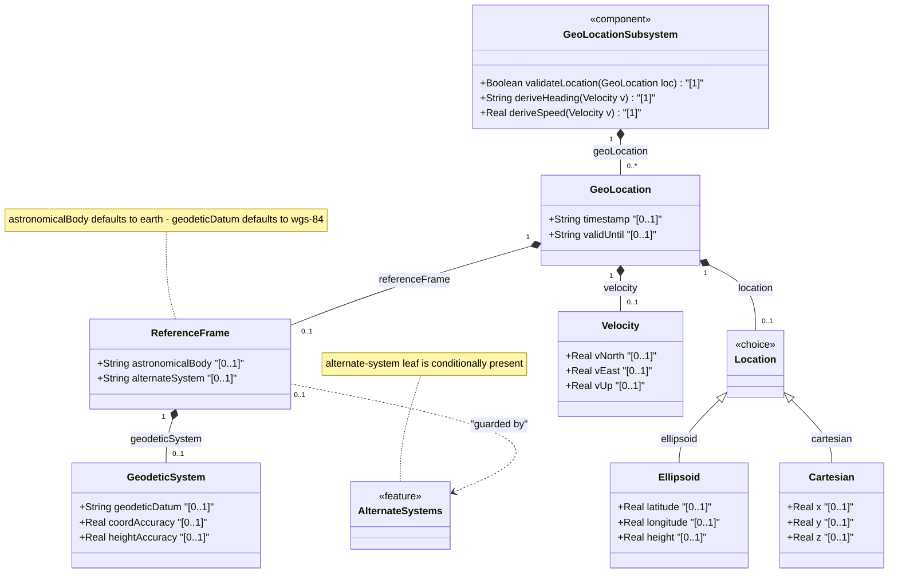
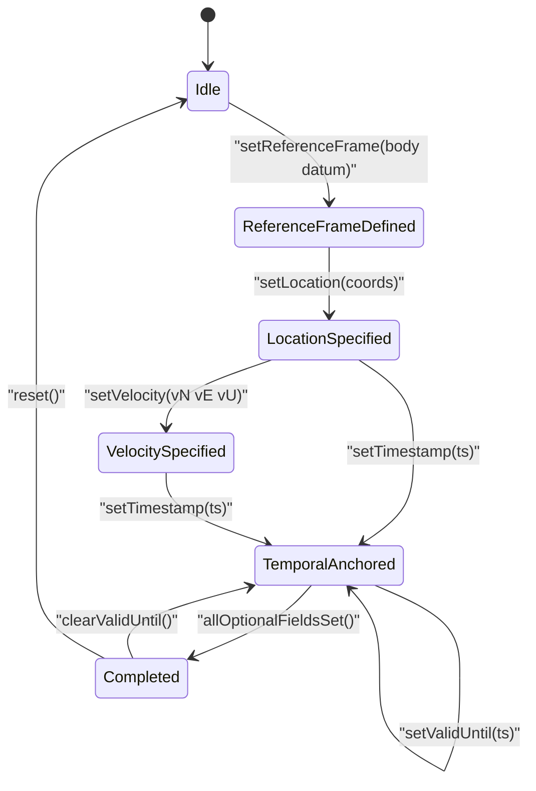

# Epic: [RFC9179-GEO] A YANG Grouping for Geographic Locations

## 1. Context
This Epic encompasses the `ietf-geo-location` YANG module defined in RFC 9179 (2022-02-11 revision). The module defines a reusable `geo-location` grouping for specifying locations on or around astronomical objects (Earth, Moon, Mars, etc.). The grouping supports two coordinate systems (ellipsoidal latitude/longitude/height and Cartesian x/y/z), a configurable reference frame with geodetic datum and accuracy parameters, a velocity vector for objects in motion, and temporal attributes (timestamp and valid-until). An optional `alternate-systems` feature flag enables non-natural-universe coordinate systems for virtual realities or simulations. The module imports `ietf-yang-types` (RFC 6991) for the `date-and-time` type. The grouping is designed for use by other YANG modules that need to express geographic or astronomical locations, conforming to ISO 6709:2008 and mapping to W3C Geolocation API, GML, and KML standards.

## 2. Requirements & Checklist
- [ ] #37 - [RFC9179-GEO Reference Frame Definition](https://github.com/gintatkinson/3dgs-039/blob/main/docs/features/feat-14-rfc9179-geo-reference-frame-definition.md) (defines the reference-frame container with astronomical-body default "earth", alternate-system conditional leaf guarded by alternate-systems feature flag, and nested geodetic-system sub-container with geodetic-datum, coord-accuracy, and height-accuracy -- RFC 9179 Section 2.1)
- [ ] #38 - [RFC9179-GEO Ellipsoid Coordinate Location](https://github.com/gintatkinson/3dgs-039/blob/main/docs/features/feat-15-rfc9179-geo-ellipsoid-coordinate-location.md) (defines the ellipsoid case of the location choice with latitude dec64 fr16, longitude dec64 fr16, and height dec64 fr6 -- RFC 9179 Section 2.2)
- [ ] #39 - [RFC9179-GEO Cartesian Coordinate Location](https://github.com/gintatkinson/3dgs-039/blob/main/docs/features/feat-16-rfc9179-geo-cartesian-coordinate-location.md) (defines the cartesian case of the location choice with x, y, z dec64 fr6 in meters -- RFC 9179 Section 2.2)
- [ ] #40 - [RFC9179-GEO Velocity Vector](https://github.com/gintatkinson/3dgs-039/blob/main/docs/features/feat-17-rfc9179-geo-velocity-vector.md) (defines the velocity container with v-north, v-east, v-up dec64 fr12 in meters per second, with derived speed and heading formulas -- RFC 9179 Section 2.3)
- [ ] #41 - [RFC9179-GEO Temporal Location Attributes](https://github.com/gintatkinson/3dgs-039/blob/main/docs/features/feat-18-rfc9179-geo-temporal-location-attributes.md) (defines timestamp and valid-until leaves using yang:date-and-time at the geo-location container level -- RFC 9179 Section 3)

### Associated Use Cases & User Stories

#### Associated Use Cases
Use Cases are deferred to Phase 2 specification engineering.

#### Associated User Stories
User Stories are deferred to Phase 2 specification engineering.

## 3. Architecture

### Subsystem Component Definition
The ietf-geo-location module (RFC 9179, 2022-02-11 revision) defines a geo-location grouping providing a reusable location specification subsystem. It exports a single grouping that downstream modules reference via `uses geo:geo-location`. The subsystem maps geodetic and Cartesian coordinates onto astronomical bodies, provides a velocity vector for objects in stable motion, and anchors data temporally. It imports `ietf-yang-types` for the date-and-time type and exposes the `alternate-systems` feature for conditional compilation of non-natural-universe coordinate systems.

### System-Level UML Class Diagram

## State Machine Definitions

### System State Machine Diagram

## 4. Operational Considerations
- The geo-location grouping is a reusable definition; it has no standalone deployment footprint — operability depends on the hosting YANG module.
- When nesting geo-location instances (e.g., building containing routers with locations), the hosting module SHOULD indicate whether reference-frame is inherited from the parent to avoid redundant data.
- The `alternate-systems` feature is declared in the module but not activated by default; activation is at the hosting device's feature-set level.
- Coordinate and height accuracy values are optional and may be omitted when the geodetic-datum provides sufficient default accuracy for the application.
- Timestamp precision is arbitrarily large (string-based yang:date-and-time), covering sub-second resolution needed for high-velocity tracking applications.

## 5. Security & Governance
- All data nodes in the geo-location grouping are writable/creatable/deletable (config true, which is the default in YANG).
- Authors using this grouping in other modules SHOULD consider privacy issues when location data is readable (e.g., customer device locations).
- Access control is governed by the NETCONF Access Control Model (RFC 8341) in the hosting module — the grouping itself defines no access control rules.
- The IANA "Geodetic System Values" registry (First Come First Served policy per RFC 8126) governs standardized geodetic-datum values and is managed per RFC 9179 Section 6.1.
- SECURITY: None of the writable/creatable/deletable data nodes are by themselves considered more sensitive or vulnerable than standard configuration, per RFC 9179 Section 7.

## Specification Context
From RFC 9179 Abstract:
"This document defines a generic geographical location YANG grouping. The geographical location grouping is intended to be used in YANG data models for specifying a location on or in reference to Earth or any other astronomical object."

From RFC 9179 Section 1:
"In many applications, we would like to specify the location of something geographically. Some examples of locations in networking might be the location of data centers, a rack in an Internet exchange point, a router, a firewall, a port on some device, or it could be the endpoints of a fiber, or perhaps the failure point along a fiber."

"while this location is typically relative to Earth, it does not need to be. Indeed, it is easy to imagine a network or device located on the Moon, on Mars, on Enceladus (the moon of Saturn), or even on a comet (e.g., 67p/churyumov-gerasimenko)."

"This document defines a 'geo-location' YANG grouping that allows for all the above data to be captured. This specification conforms to ISO.6709.2008."

From RFC 9179 Section 2.4 (Nested Locations):
"When locations are nested (e.g., a building may have a location that houses routers that also have locations), the module using this grouping is free to indicate in its definition that the 'reference-frame' is inherited from the containing object so that the 'reference-frame' need not be repeated in every instance of location data."

## 6. Source References
Structural Schema: ietf-geo-location@2022-02-11.yang (schema/ietf-geo-location@2022-02-11.yang) (Clause: full module)
Normative Specification: [RFC 9179: A YANG Grouping for Geographic Locations](https://datatracker.ietf.org/doc/rfc9179/) (Clause: Sections 1-7)
