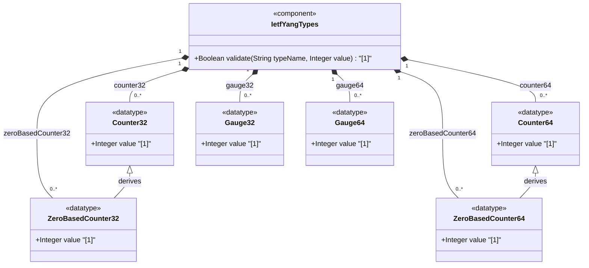

# Feature: [RFC9911-YANG] Counter and Gauge Types

## Parent Epic
- [ ] #10 - [RFC9911-YANG] Common YANG Data Types (semantic linkage: this feature defines counter and gauge typedefs declared in the ietf-yang-types module per RFC 9911 Section 3)

## Description
Defines non-negative integer types for monotonically increasing counters (counter32, zero-based-counter32, counter64, zero-based-counter64) and variable gauges (gauge32, gauge64). Counters represent cumulative values that wrap at maximum; zero-based-counter variants initialize at zero. Gauges represent values that may increase or decrease within bounded ranges, pegging at min/max when the modeled information exceeds the range. All types are semantically equivalent to their SMIv2 counterparts.

## UML Class Diagram


## Interface Requirements

### 1. Payload Schema
```json
{
  "counter32": 0,
  "zero-based-counter32": 0,
  "counter64": 0,
  "zero-based-counter64": 0,
  "gauge32": 0,
  "gauge64": 0
}
```

### 2. Validation & Constraints

**counter32:**
- Base type: uint32
- Range: 0 to 4294967295 (2^32-1)
- Behavior: monotonically increasing, wraps to 0 after reaching maximum
- No defined initial value; single counter value has no inherent information content
- Not for configuration schema nodes
- SHOULD NOT use default statement

**zero-based-counter32:**
- Base type: counter32 (uint32)
- Default value: 0
- Range: 0 to 4294967295 (2^32-1)
- Behavior: initialized to 0 on creation, monotonically increases, wraps to 0
- Delta value is meaningful if detected within minimum wrap time

**counter64:**
- Base type: uint64
- Range: 0 to 18446744073709551615 (2^64-1)
- Behavior: monotonically increasing, wraps to 0
- No defined initial value
- Not for configuration schema nodes
- SHOULD NOT use default statement

**zero-based-counter64:**
- Base type: counter64 (uint64)
- Default value: 0
- Range: 0 to 18446744073709551615 (2^64-1)
- Behavior: initialized to 0 on creation, monotonically increases, wraps to 0

**gauge32:**
- Base type: uint32
- Range: 0 to 4294967295 (2^32-1)
- Behavior: may increase or decrease; pegs at max when modeled info exceeds max; pegs at min when modeled info subceeds min

**gauge64:**
- Base type: uint64
- Range: 0 to 18446744073709551615 (2^64-1)
- Behavior: may increase or decrease; pegs at max/min boundaries

### 3. Logical Operations & Interface Messages
- **READ**: Retrieve current counter/gauge value as unsigned integer
- **SUBSCRIBE**: Subscribe to value change notifications when any counter/gauge updates
- **VALIDATE**: Validate that a value falls within the type's range [0, max]
- **RESET** (zero-based-counter only): Reset to default value of 0

### 4. Logical Exception States & Validation Failures
- **Overflow detection**: Counter wrap-around from max to 0 constitutes a discontinuity event
- **Negative value rejection**: Any negative integer value presented as a counter or gauge is rejected
- **Range violation**: Value exceeding 2^32-1 (counter32/gauge32) or 2^64-1 (counter64/gauge64) triggers validation failure
- **Configuration misuse**: Using counter types in configuration schema nodes triggers a design-time warning

## Given-When-Then Acceptance Criteria

**Scenario: counter32 monotonically increases and wraps**
- Given a counter32 instance with value 4294967294
- When the counter increments by 2
- Then the value wraps to 1, and a discontinuity event is recorded

**Scenario: zero-based-counter32 initializes at zero**
- Given a new schema node of type zero-based-counter32
- When the node is first created
- Then its initial value is 0

**Scenario: gauge32 pegs at maximum**
- Given a gauge32 instance with value 4294967294
- When the modeled information exceeds 4294967295
- Then the gauge value is 4294967295

**Scenario: gauge32 decreases from pegged maximum**
- Given a gauge32 instance pegged at 4294967295
- When the modeled information drops below 4294967295
- Then the gauge value decreases to track the actual information

**Scenario: counter value rejection - negative input**
- Given a schema node typed as counter32
- When an attempt is made to set its value to -1
- Then validation fails with a type constraint violation error

**Scenario: gauge64 pegs at minimum**
- Given a gauge64 instance with value 1
- When the modeled information drops below 0
- Then the gauge value is 0

**Scenario: counter64 wraps around at 2^64-1**
- Given a counter64 instance at value 18446744073709551615
- When the counter increments by 1
- Then the value wraps to 0

**Scenario: zero-based-counter64 provides meaningful delta**
- Given a zero-based-counter64 instance initialized to 0 at creation time T0
- When the value is read at time T1 within the minimum wrap time
- Then the read value represents the cumulative count since T0

## Specification Context (Verbatim)

From RFC 9911, Section 3:

> The counter32 type represents a non-negative integer that monotonically increases until it reaches a maximum value of 2^32-1 (4294967295 decimal), when it wraps around and starts increasing again from zero. Counters have no defined 'initial' value, and thus, a single value of a counter has (in general) no information content.

> The zero-based-counter32 type represents a counter32 that has the defined 'initial' value zero. A data tree node using this type will be set to zero (0) on creation and will thereafter increase monotonically until it reaches a maximum value of 2^32-1 (4294967295 decimal), when it wraps around and starts increasing again from zero.

> The counter64 type represents a non-negative integer that monotonically increases until it reaches a maximum value of 2^64-1 (18446744073709551615 decimal), when it wraps around and starts increasing again from zero.

> The zero-based-counter64 type represents a counter64 that has the defined 'initial' value zero.

> The gauge32 type represents a non-negative integer, which may increase or decrease, but shall never exceed a maximum value, nor fall below a minimum value. The maximum value cannot be greater than 2^32-1 (4294967295 decimal), and the minimum value cannot be smaller than 0. The value of a gauge32 has its maximum value whenever the information being modeled is greater than or equal to its maximum value, and has its minimum value whenever the information being modeled is smaller than or equal to its minimum value.

> The gauge64 type represents a non-negative integer, which may increase or decrease, but shall never exceed a maximum value, nor fall below a minimum value. The maximum value cannot be greater than 2^64-1 (18446744073709551615), and the minimum value cannot be smaller than 0.

## Source References
Structural Schema: [ietf-yang-types@2025-12-22.yang](https://github.com/gintatkinson/3dgs-039/blob/main/schema/ietf-yang-types%402025-12-22.yang) (Collection: counter and gauge types)
Normative Specification: [RFC 9911](https://datatracker.ietf.org/doc/rfc9911/) (Section 3: Core YANG Types)

## Logical UI & Interface Bindings
- **Target LUI Component:** Deferred to Feature #X Task Y
- **Target Layout Container ID:** Deferred to Feature #X Task Y
- **Data Source Bindings:** Deferred to Feature #X Task Y
