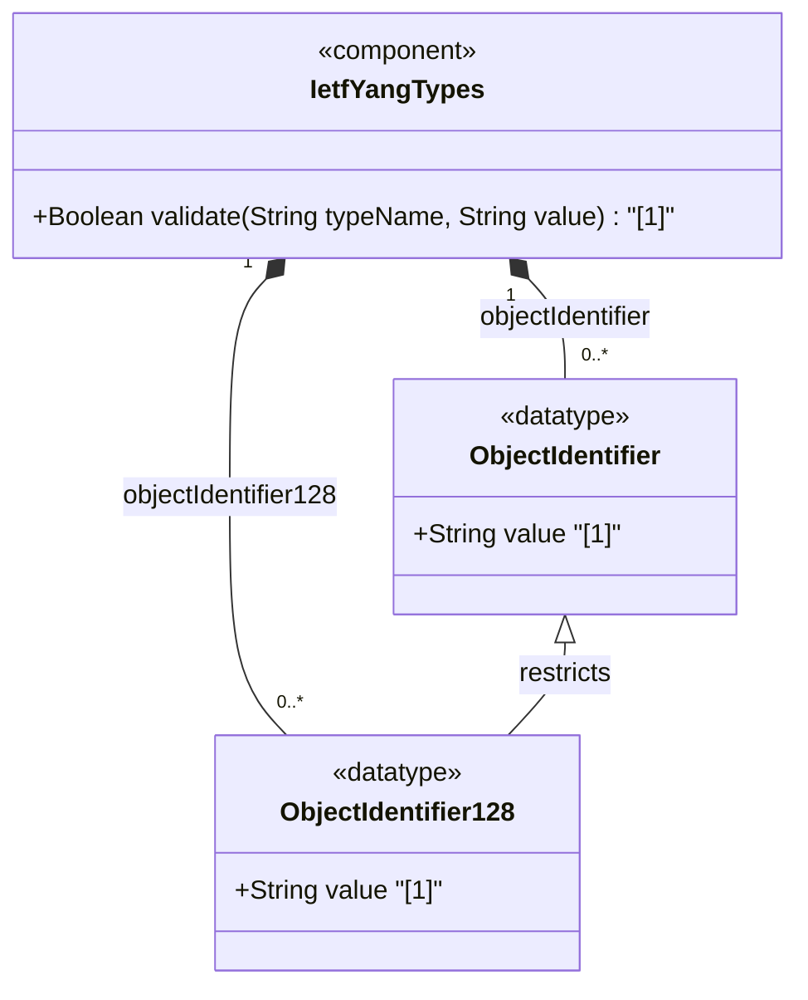

# Feature: [RFC9911-YANG] Identifier Types

## Parent Epic
- [ ] #10 - [RFC9911-YANG] Common YANG Data Types (semantic linkage: this feature defines object-identifier and object-identifier-128 typedefs declared in the ietf-yang-types module per RFC 9911 Section 3)

## Description
Defines string-based types for ASN.1 object identifiers used in administrative registration-hierarchical-name trees. The object-identifier type supports an unlimited number of sub-identifiers with ASN.1-compliant first-two-arc restrictions. The object-identifier-128 type restricts sub-identifier count to 128 for SMIv2 OBJECT IDENTIFIER compatibility. Both types are semantically equivalent to their SMIv2 counterparts.

## UML Class Diagram


## Interface Requirements

### 1. Payload Schema
```json
{
  "object-identifier": "1.3.6.1.2.1.1.3.0",
  "object-identifier-128": "1.3.6.1.2.1.1.3.0"
}
```

### 2. Validation & Constraints

**object-identifier:**
- Base type: string with pattern validation
- Each sub-identifier MUST NOT exceed 2^32-1 (4294967295)
- Sub-identifiers are separated by single dots, no intermediate whitespace
- First sub-identifier restricted to 0, 1, or 2
- Second sub-identifier restricted to 0..39 when first is 0 or 1
- At least two sub-identifiers required
- Sub-identifiers validated per the typedef pattern specified in the YANG module
- No upper limit on sub-identifier count
- SHOULD NOT be used where SMIv2 OBJECT IDENTIFIER (128-sub-identifier limit) is expected; use object-identifier-128 instead

**object-identifier-128:**
- Base type: object-identifier with additional pattern restriction
- Maximum 128 sub-identifiers
- Sub-identifiers validated per the typedef pattern specified in the YANG module
- Semantically equivalent to SMIv2 OBJECT IDENTIFIER

### 3. Logical Operations & Interface Messages
- **READ**: Retrieve object identifier string value
- **VALIDATE**: Validate OID string against ASN.1 structural constraints (minimum 2 arcs, first arc 0/1/2, second arc range-checked)
- **COMPARE**: Compare two OIDs for prefix/containment relationships
- **CONVERT**: Convert between object-identifier and object-identifier-128 where value fits within 128 sub-identifiers

### 4. Logical Exception States & Validation Failures
- **Single sub-identifier**: OID with fewer than 2 sub-identifiers fails ASN.1 validation
- **First arc violation**: OID starting with value other than 0, 1, or 2 is rejected
- **Second arc overflow**: OID with first arc 0 or 1 and second arc greater than 39 is rejected
- **Sub-identifier overflow**: Any sub-identifier exceeding 2^32-1 triggers validation failure
- **128-limit overflow** (object-identifier-128): OID with more than 128 sub-identifiers is rejected
- **Whitespace contamination**: OID containing spaces or non-standard separators is rejected

## Given-When-Then Acceptance Criteria

**Scenario: Valid object identifier passes validation**
- Given an OID string "1.3.6.1.2.1.1.3.0"
- When the object-identifier type validates the value
- Then validation passes with no errors

**Scenario: Object identifier with invalid first arc is rejected**
- Given an OID string "3.6.1.2.1"
- When the object-identifier type validates the value
- Then validation fails because the first sub-identifier is 3, which is not 0, 1, or 2

**Scenario: Object identifier with single sub-identifier is rejected**
- Given an OID string "1"
- When the object-identifier type validates the value
- Then validation fails because at least two sub-identifiers are required

**Scenario: Second arc overflow with first arc 1 is rejected**
- Given an OID string "1.40.1"
- When the object-identifier type validates the value
- Then validation fails because the second sub-identifier is 40, exceeding the 0..39 range

**Scenario: object-identifier-128 rejects more than 128 sub-identifiers**
- Given an OID with 129 sub-identifiers
- When the object-identifier-128 type validates the value
- Then validation fails with a length constraint violation

**Scenario: object-identifier-128 accepts exactly 128 sub-identifiers**
- Given an OID with exactly 128 sub-identifiers
- When the object-identifier-128 type validates the value
- Then validation passes

**Scenario: OID with whitespace is rejected**
- Given an OID string "1.3. 6.1"
- When the object-identifier type validates the value
- Then validation fails due to pattern violation from whitespace

**Scenario: object-identifier accepts more than 128 sub-identifiers**
- Given an OID with 200 sub-identifiers
- When the object-identifier type validates the value
- Then validation passes as object-identifier has no upper sub-identifier limit

## Specification Context (Verbatim)

From RFC 9911, Section 3:

> The object-identifier type represents administratively assigned names in a registration-hierarchical-name tree. Values of this type are denoted as a sequence of numerical non-negative sub-identifier values. Each sub-identifier value MUST NOT exceed 2^32-1 (4294967295). Sub-identifiers are separated by single dots and without any intermediate whitespace.

> The ASN.1 standard restricts the value space of the first sub-identifier to 0, 1, or 2. Furthermore, the value space of the second sub-identifier is restricted to the range 0 to 39 if the first sub-identifier is 0 or 1. Finally, the ASN.1 standard requires that an object identifier has always at least two sub-identifiers.

> This type is a superset of the SMIv2 OBJECT IDENTIFIER type since it is not restricted to 128 sub-identifiers. Hence, this type SHOULD NOT be used to represent the SMIv2 OBJECT IDENTIFIER type; the object-identifier-128 type SHOULD be used instead.

> This type represents object-identifiers restricted to 128 sub-identifiers. In the value set and its semantics, this type is equivalent to the OBJECT IDENTIFIER type of the SMIv2.

## Source References
Structural Schema: [ietf-yang-types@2025-12-22.yang](https://raw.githubusercontent.com/gintatkinson/3dgs-039/main/schema/ietf-yang-types%402025-12-22.yang) (Collection: identifier-related types)
Normative Specification: [RFC 9911](https://datatracker.ietf.org/doc/rfc9911/) (Section 3: Core YANG Types)

## Logical UI & Interface Bindings
- **Target LUI Component:** Deferred to Feature #X Task Y
- **Target Layout Container ID:** Deferred to Feature #X Task Y
- **Data Source Bindings:** Deferred to Feature #X Task Y
