# Feature: [RFC9911-YANG] Date and Time Types

## Parent Epic
- [ ] #10 - [RFC9911-YANG] Common YANG Data Types (semantic linkage: this feature defines date-and-time, date, date-no-zone, time, time-no-zone, hours32 through nanoseconds64, timeticks, and timestamp typedefs declared in the ietf-yang-types module per RFC 9911 Section 3)

## Description
Defines types for representing dates, times, timestamps, and time durations. The date-and-time type is a profile of ISO 8601 with RFC 3339/RFC 9557 extensions supporting leap seconds and time zone offsets. Calendar date types (date, date-no-zone) and wall-clock time types (time, time-no-zone) provide granular temporal representation. A hierarchy of 32-bit and 64-bit signed integer duration types spans hours through nanoseconds. The timeticks type measures elapsed time in hundredths of seconds modulo 2^32. The timestamp type records the timeticks value at which an event occurred.

## UML Class Diagram

```mermaid
classDiagram
    class IetfYangTypes {
        <<component>>
        +Boolean validate(String typeName, String value) "[1]"
    }
    class DateTimeType {
        <<datatype>>
        +String value "[1]"
    }
    class DateType {
        <<datatype>>
        +String value "[1]"
    }
    class DateNoZone {
        <<datatype>>
        +String value "[1]"
    }
    class TimeType {
        <<datatype>>
        +String value "[1]"
    }
    class TimeNoZone {
        <<datatype>>
        +String value "[1]"
    }
    class Hours32 {
        <<datatype>>
        +Integer value "[1]"
    }
    class Minutes32 {
        <<datatype>>
        +Integer value "[1]"
    }
    class Seconds32 {
        <<datatype>>
        +Integer value "[1]"
    }
    class Centiseconds32 {
        <<datatype>>
        +Integer value "[1]"
    }
    class Milliseconds32 {
        <<datatype>>
        +Integer value "[1]"
    }
    class Microseconds32 {
        <<datatype>>
        +Integer value "[1]"
    }
    class Microseconds64 {
        <<datatype>>
        +Integer value "[1]"
    }
    class Nanoseconds32 {
        <<datatype>>
        +Integer value "[1]"
    }
    class Nanoseconds64 {
        <<datatype>>
        +Integer value "[1]"
    }
    class Timeticks {
        <<datatype>>
        +Integer value "[1]"
    }
    class Timestamp {
        <<datatype>>
        +Integer value "[1]"
    }
    IetfYangTypes "1" *-- "0..*" DateTimeType : dateAndTime
    IetfYangTypes "1" *-- "0..*" DateType : date
    IetfYangTypes "1" *-- "0..*" DateNoZone : dateNoZone
    IetfYangTypes "1" *-- "0..*" TimeType : time
    IetfYangTypes "1" *-- "0..*" TimeNoZone : timeNoZone
    IetfYangTypes "1" *-- "0..*" Hours32 : hours32
    IetfYangTypes "1" *-- "0..*" Minutes32 : minutes32
    IetfYangTypes "1" *-- "0..*" Seconds32 : seconds32
    IetfYangTypes "1" *-- "0..*" Centiseconds32 : centiseconds32
    IetfYangTypes "1" *-- "0..*" Milliseconds32 : milliseconds32
    IetfYangTypes "1" *-- "0..*" Microseconds32 : microseconds32
    IetfYangTypes "1" *-- "0..*" Microseconds64 : microseconds64
    IetfYangTypes "1" *-- "0..*" Nanoseconds32 : nanoseconds32
    IetfYangTypes "1" *-- "0..*" Nanoseconds64 : nanoseconds64
    IetfYangTypes "1" *-- "0..*" Timeticks : timeticks
    IetfYangTypes "1" *-- "0..*" Timestamp : timestamp
    DateTimeType <|-- DateType : constrains
    DateTimeType <|-- TimeType : constrains
    DateType <|-- DateNoZone : restricts
    TimeType <|-- TimeNoZone : restricts
    Timeticks <|-- Timestamp : derives
```


## Interface Requirements

### 1. Payload Schema
```json
{
  "date-and-time": "2025-12-22T14:30:00Z",
  "date": "2025-12-22+01:00",
  "date-no-zone": "2025-12-22",
  "time": "14:30:00.5+01:00",
  "time-no-zone": "14:30:00.5",
  "hours32": 48,
  "minutes32": 90,
  "seconds32": 3600,
  "centiseconds32": 500,
  "milliseconds32": 5000,
  "microseconds32": 5000000,
  "microseconds64": 5000000000,
  "nanoseconds32": 1000000000,
  "nanoseconds64": 60000000000,
  "timeticks": 360000,
  "timestamp": 180000
}
```

### 2. Validation & Constraints

**date-and-time:**
- Base type: string
- Pattern: YYYY-MM-DDTHH:MM:SS[.fraction][Z|(+|-)HH:MM]
- Profile of ISO 8601; date-time production per RFC 3339 Section 5.6 updated by RFC 9557 Section 2
- Allows leap seconds: seconds value of 60 permitted
- No negative years
- Z offset: UTC with unknown local time zone reference point
- +00:00 offset: UTC with known local time zone reference point UTC
- Canonical format with known time zone: numeric time zone offset using device's configured UTC offset
- Canonical format for UTC with unknown local TZ: SHOULD use Z, MAY use -00:00

**date:**
- Base type: string
- Pattern: YYYY-MM-DD[Z|(+|-)HH:MM]
- Represents a time-interval of 24 hours
- Includes optional time zone offset
- No negative years

**date-no-zone:**
- Base type: date (restricted pattern)
- Pattern: YYYY-MM-DD
- Date without optional time zone offset information

**time:**
- Base type: string
- Pattern: HH:MM:SS[.fraction][Z|(+|-)HH:MM]
- Instance of time of zero duration that recurs every day
- Allows leap seconds: seconds value of 60 permitted
- Includes optional time zone offset

**time-no-zone:**
- Base type: time (restricted pattern)
- Pattern: HH:MM:SS[.fraction]
- Time without optional time zone offset information

**hours32:**
- Base type: int32
- Units: hours
- Range: int32 range, approximately -89478485 days to +89478485 days
- SHOULD be range-restricted to non-negative (range '0..max') where appropriate

**minutes32:**
- Base type: int32
- Units: minutes
- Range: int32 range, approximately -1491308 days to +1491308 days

**seconds32:**
- Base type: int32
- Units: seconds
- Range: int32 range, approximately -24855 days to +24855 days

**centiseconds32:**
- Base type: int32
- Units: centiseconds (10^-2 seconds)
- Range: approximately -248 days to +248 days

**milliseconds32:**
- Base type: int32
- Units: milliseconds (10^-3 seconds)
- Range: approximately -24 days to +24 days

**microseconds32:**
- Base type: int32
- Units: microseconds (10^-6 seconds)
- Range: approximately -35 minutes to +35 minutes

**microseconds64:**
- Base type: int64
- Units: microseconds (10^-6 seconds)
- Range: approximately -106751991 days to +106751991 days

**nanoseconds32:**
- Base type: int32
- Units: nanoseconds (10^-9 seconds)
- Range: approximately -2 seconds to +2 seconds

**nanoseconds64:**
- Base type: int64
- Units: nanoseconds (10^-9 seconds)
- Range: approximately -106753 days to +106752 days

**timeticks:**
- Base type: uint32
- Represents time modulo 2^32 in hundredths of a second between two epochs
- Range: 0 to 4294967295 (~497 days)
- Schema node description MUST identify both reference epochs

**timestamp:**
- Base type: timeticks (uint32)
- Value of associated timeticks instance at which a specific occurrence happened
- Zero when occurrence happened prior to last timeticks zero
- All timestamp values reset to zero when associated timeticks wraps (497+ days)
- Schema node description MUST specify the associated timeticks schema node

### 3. Logical Operations & Interface Messages
- **READ**: Retrieve date/time/duration value in canonical format
- **VALIDATE**: Validate string against ISO 8601 / RFC 3339 / RFC 9557 patterns
- **COMPARE**: Chronologically compare two date/time values
- **ARITHMETIC**: Add/subtract duration from date-and-time; compute difference between two timestamps
- **CONVERT**: Convert between time zone offsets; strip/add time zone information
- **SUBSCRIBE**: Subscribe to timestamp or timeticks change events

### 4. Logical Exception States & Validation Failures
- **Invalid month**: Month outside 01-12 range triggers validation failure
- **Invalid day**: Day outside valid range for given month triggers validation failure
- **Invalid hour**: Hour outside 00-23 range triggers validation failure
- **Invalid minute/second**: Minute or second outside 00-59 range (except leap second 60) triggers validation failure
- **Negative year**: Year value less than 0000 triggers validation failure
- **Time zone syntax error**: Malformed time zone offset triggers validation failure
- **Duration overflow**: Duration value exceeding int32/int64 range triggers overflow condition
- **Timeticks wrap**: When associated timeticks reaches 497+ days and wraps, all timestamps reset to zero
- **Missing epoch reference**: Using timeticks/timestamp without specifying reference epochs in schema node description is a semantic error

## Given-When-Then Acceptance Criteria

**Scenario: date-and-time with UTC Z offset passes validation**
- Given a date-and-time value "2025-12-22T14:30:00Z"
- When the date-and-time type validates the value
- Then validation passes

**Scenario: date-and-time with leap second passes validation**
- Given a date-and-time value "2025-12-31T23:59:60Z"
- When the date-and-time type validates the value
- Then validation passes with seconds value 60

**Scenario: date-and-time rejects negative year**
- Given a date-and-time value "-0001-01-01T00:00:00Z"
- When the date-and-time type validates the value
- Then validation fails because negative years are not allowed

**Scenario: date with numeric time zone offset passes**
- Given a date value "2025-12-22+01:00"
- When the date type validates the value
- Then validation passes

**Scenario: date-no-zone rejects time zone suffix**
- Given a date-no-zone value "2025-12-22+01:00"
- When the date-no-zone type validates the value
- Then validation fails because time zone offset is not allowed

**Scenario: duration type range-restricted to non-negative accepts valid value**
- Given an hours32 type with range restriction "0..max"
- When the value 48 is assigned
- Then validation passes

**Scenario: duration type range-restricted to non-negative rejects negative**
- Given an hours32 type with range restriction "0..max"
- When the value -1 is assigned
- Then validation fails with range constraint violation

**Scenario: timeticks wraps at modulo 2^32**
- Given timeticks value 4294967295 (one less than wrap)
- When the timeticks increments by 1
- Then the value wraps to 0

**Scenario: timestamp resets to zero on associated timeticks wrap**
- Given a timestamp associated with a timeticks schema node
- When the associated timeticks reaches 497+ days and wraps to 0
- Then all timestamp values derived from that timeticks reset to 0

**Scenario: time with leap second and time zone passes**
- Given a time value "23:59:60+00:00"
- When the time type validates the value
- Then validation passes

**Scenario: time-no-zone rejects fractional seconds beyond pattern allowed range**
- Given a time-no-zone value "25:00:00"
- When the time-no-zone type validates the value
- Then validation fails because hour 25 exceeds the 00-23 range

## Specification Context (Verbatim)

From RFC 9911, Section 3:

> The date-and-time type is a profile of the ISO 8601 standard for representation of dates and times using the Gregorian calendar. The profile is defined by the date-time production in Section 5.6 of RFC 3339 and the update defined in Section 2 of RFC 9557. The value of 60 for seconds is allowed only in the case of leap seconds.

> The date-and-time type is compatible with the dateTime XML schema dateTime type with the following notable exceptions: (a) The date-and-time type does not allow negative years. (b) The time-offset Z indicates that the date-and-time value is reported in UTC and that the local time zone reference point is unknown. The time-offset +00:00 indicates that the date-and-time value is reported in UTC and that the local time zone reference point is UTC (see Section 2 of RFC 9557).

> The date type represents a time-interval of the length of a day, i.e., 24 hours. It includes an optional time zone offset.

> The time type represents an instance of time of zero duration that recurs every day. It includes an optional time zone offset. The value of 60 for seconds is allowed only in the case of leap seconds.

From RFC 9911, Table 1:
> The timeticks type represents a non-negative integer that represents the time, modulo 2^32 (4294967296 decimal), in hundredths of a second between two epochs.

> The timestamp type represents the value of an associated timeticks schema node instance at which a specific occurrence happened. The specific occurrence must be defined in the description of any schema node defined using this type.

## Source References
Structural Schema: [ietf-yang-types@2025-12-22.yang](https://raw.githubusercontent.com/gintatkinson/3dgs-039/main/schema/ietf-yang-types%402025-12-22.yang) (Collection: types related to date and time)
Normative Specification: [RFC 9911](https://datatracker.ietf.org/doc/rfc9911/) (Section 3: Core YANG Types)

## Logical UI & Interface Bindings
- **Target LUI Component:** Deferred to Feature #X Task Y
- **Target Layout Container ID:** Deferred to Feature #X Task Y
- **Data Source Bindings:** Deferred to Feature #X Task Y
