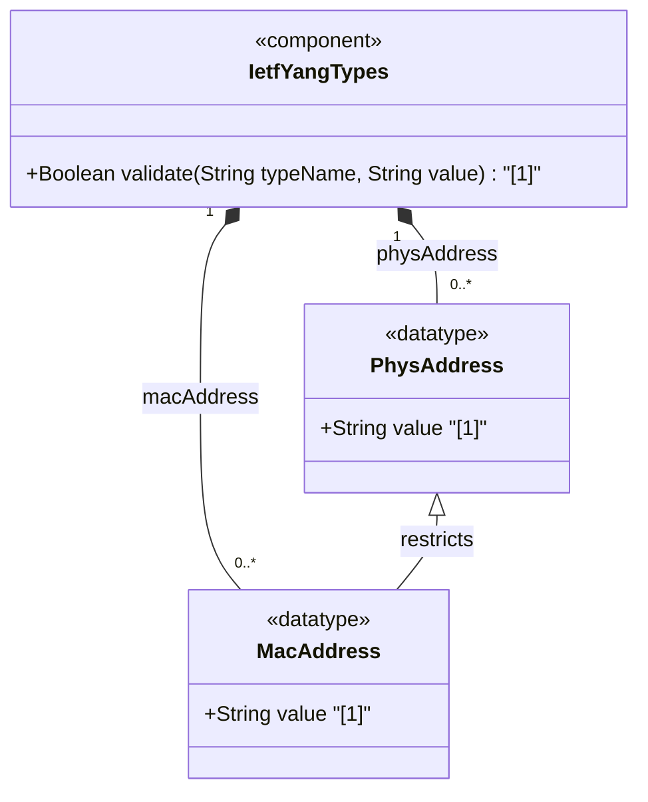

# Feature: [RFC9911-YANG] Physical Address Types

## Parent Epic
- [ ] #10 - [RFC9911-YANG] Common YANG Data Types (semantic linkage: this feature defines phys-address and mac-address typedefs declared in the ietf-yang-types module per RFC 9911 Section 3)

## Description
Defines types for representing media-level and physical-level hardware addresses as colon-separated hexadecimal octet sequences. The phys-address type supports variable-length address representations for any media type. The mac-address type restricts representation to exactly six octets (48-bit IEEE 802 MAC addresses). Both types use lowercase canonical representation and are semantically equivalent to their SMIv2 textual conventions.

## UML Class Diagram


## Interface Requirements

### 1. Payload Schema
```json
{
  "phys-address": "00:1a:2b:3c:4d:5e:6f",
  "mac-address": "00:1a:2b:3c:4d:5e"
}
```

### 2. Validation & Constraints

**phys-address:**
- Base type: string with pattern validation
- Pattern: `([0-9a-fA-F]{2}(:[0-9a-fA-F]{2})*)?`
- Each octet is represented by two hexadecimal digits
- Octets separated by colons
- Canonical representation uses lowercase characters
- May be empty (zero-length string)
- Variable number of octets (not fixed to 6)

**mac-address:**
- Base type: string with pattern validation
- Pattern: `[0-9a-fA-F]{2}(:[0-9a-fA-F]{2}){5}`
- Exactly 48 bits: six octets of two hex digits each
- Represents IEEE 802 MAC addresses
- Canonical representation uses lowercase characters
- Cannot represent non-48-bit MAC addresses; use phys-address for those

### 3. Logical Operations & Interface Messages
- **READ**: Retrieve physical or MAC address string in canonical lowercase format
- **VALIDATE**: Validate address string against hex-octet colon-separated pattern
- **NORMALIZE**: Convert address to canonical lowercase form
- **COMPARE**: Compare two addresses for equality after normalization

### 4. Logical Exception States & Validation Failures
- **Invalid hex digit**: Non-hexadecimal characters in octet representation trigger validation failure
- **Wrong octet count** (mac-address): Address with more or fewer than 6 octets is rejected
- **Missing colon separator**: Consecutive hex digits without colon separation trigger pattern violation
- **Trailing/leading colons**: Address starting or ending with colon is rejected
- **Mixed case accepted**: Uppercase hex digits are accepted on input but normalized to lowercase in canonical form

## Given-When-Then Acceptance Criteria

**Scenario: MAC address in lowercase passes validation**
- Given a mac-address string "00:1a:2b:3c:4d:5e"
- When the mac-address type validates the value
- Then validation passes

**Scenario: MAC address in uppercase is accepted and normalized**
- Given a mac-address string "00:1A:2B:3C:4D:5E"
- When the mac-address type validates and normalizes the value
- Then the value is accepted and the canonical form "00:1a:2b:3c:4d:5e" is returned

**Scenario: MAC address with wrong octet count is rejected**
- Given a string "00:1a:2b:3c:4d" with only 5 octets
- When the mac-address type validates the value
- Then validation fails because exactly 6 octets are required

**Scenario: phys-address accepts variable-length address**
- Given a phys-address string "00:1a:2b:3c:4d:5e:6f:7g" is rejected due to 'g' being non-hex
- When a valid phys-address "00:1a:2b:3c:4d:5e:6f" is validated
- Then validation passes for variable-length representation

**Scenario: phys-address accepts empty string**
- Given an empty string ""
- When the phys-address type validates the value
- Then validation passes (empty address is allowed)

**Scenario: Non-hex characters in address are rejected**
- Given a phys-address string "00:1g:2b:3c"
- When the phys-address type validates the value
- Then validation fails because 'g' is not a valid hex digit

**Scenario: MAC address with missing colons is rejected**
- Given a string "001a2b3c4d5e" without colons
- When the mac-address type validates the value
- Then validation fails due to pattern violation

## Specification Context (Verbatim)

From RFC 9911, Section 3:

> Represents media- or physical-level addresses represented as a sequence of octets, each octet represented by two hexadecimal numbers. Octets are separated by colons. The canonical representation uses lowercase characters. In the value set and its semantics, this type is equivalent to the PhysAddress textual convention of the SMIv2.

> The mac-address type represents a 48-bit IEEE 802 Media Access Control (MAC) address. The canonical representation uses lowercase characters. Note that there are IEEE 802 MAC addresses with a different length that this type cannot represent. The phys-address type may be used to represent physical addresses of varying length. In the value set and its semantics, this type is equivalent to the MacAddress textual convention of the SMIv2.

## Source References
Structural Schema: [ietf-yang-types@2025-12-22.yang](https://github.com/gintatkinson/3dgs-039/blob/main/schema/ietf-yang-types%402025-12-22.yang) (Collection: generic address types)
Normative Specification: [RFC 9911](https://datatracker.ietf.org/doc/rfc9911/) (Section 3: Core YANG Types, Table 1)

## Logical UI & Interface Bindings
- **Target LUI Component:** Deferred to Feature #X Task Y
- **Target Layout Container ID:** Deferred to Feature #X Task Y
- **Data Source Bindings:** Deferred to Feature #X Task Y
