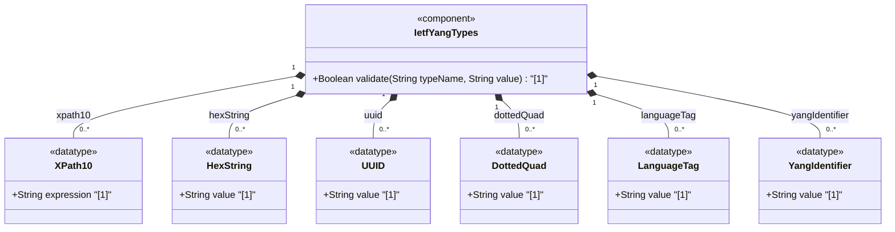

# Feature: [RFC9911-YANG] XML and String Types

## Parent Epic
- [ ] #10 - [RFC9911-YANG] Common YANG Data Types (semantic linkage: this feature defines xpath1.0, hex-string, uuid, dotted-quad, language-tag, and yang-identifier typedefs declared in the ietf-yang-types module per RFC 9911 Section 3)

## Description
Defines general-purpose string-based types for structured data identifiers and expressions. The xpath1.0 type stores XML Path Language expressions. The hex-string type stores colon-separated hexadecimal octet sequences. The uuid type stores RFC 9562 Universally Unique Identifiers in canonical 8-4-4-4-12 format. The dotted-quad type represents unsigned 32-bit numbers as four dotted decimal octets. The language-tag type stores BCP 47 language tags. The yang-identifier type represents valid YANG identifier strings per RFC 7950 Section 14.

## UML Class Diagram


## Interface Requirements

### 1. Payload Schema
```json
{
  "xpath1.0": "/network/node/interface[name='eth0']/address",
  "hex-string": "00:1a:2b:3c:4d:5e",
  "uuid": "f81d4fae-7dec-11d0-a765-00a0c91e6bf6",
  "dotted-quad": "192.0.2.1",
  "language-tag": "en-us",
  "yang-identifier": "my-network-interface"
}
```

### 2. Validation & Constraints

**xpath1.0:**
- Base type: string (no pattern restriction)
- Represents an XPATH 1.0 expression
- Schema node description MUST specify the XPath context for evaluation

**hex-string:**
- Base type: string with pattern validation
- Pattern: `([0-9a-fA-F]{2}(:[0-9a-fA-F]{2})*)?`
- Octets represented as hex digits separated by colons
- Canonical representation uses lowercase characters
- May be empty (zero-length string)

**uuid:**
- Base type: string with pattern validation
- Pattern: `[0-9a-fA-F]{8}-[0-9a-fA-F]{4}-[0-9a-fA-F]{4}-[0-9a-fA-F]{4}-[0-9a-fA-F]{12}`
- UUID string representation per RFC 9562
- Canonical representation uses lowercase characters
- Example format: f81d4fae-7dec-11d0-a765-00a0c91e6bf6

**dotted-quad:**
- Base type: string with pattern validation
- Pattern: `(([0-9]|[1-9][0-9]|1[0-9][0-9]|2[0-4][0-9]|25[0-5])\.){3}([0-9]|[1-9][0-9]|1[0-9][0-9]|2[0-4][0-9]|25[0-5])`
- Represents unsigned 32-bit number in dotted-quad notation
- Four octets (0-255 each) separated by dots

**language-tag:**
- Base type: string (no pattern restriction)
- Language tag per RFC 5646 (BCP 47)
- Must be well-formed per BCP 47 definition
- Implementations MAY restrict to validating processor as defined in BCP 47
- Canonical representation uses lowercase characters

**yang-identifier:**
- Base type: string with length and pattern constraints
- Length: 1 to max
- Pattern: `[a-zA-Z_][a-zA-Z0-9\-_.]*`
- Must start with alphabetic character or underscore
- Followed by arbitrary sequence of alphanumeric, underscore, hyphen, or dot
- Conforms to YANG 1.1 identifier rule per RFC 7950 Section 14
- In YANG 1 context: identifiers starting with any case combination of 'xml' are excluded

### 3. Logical Operations & Interface Messages
- **READ**: Retrieve typed string value
- **VALIDATE**: Validate string against type-specific pattern and length constraints
- **NORMALIZE**: Convert to canonical lowercase form where applicable (hex-string, uuid, language-tag)
- **RESOLVE**: For xpath1.0, evaluate expression against a node-set context
- **COMPARE**: Compare two UUIDs or language tags for equality after normalization

### 4. Logical Exception States & Validation Failures
- **UUID format violation**: String not matching 8-4-4-4-12 hex digit pattern triggers validation failure
- **Dotted-quad octet overflow**: Any octet exceeding 255 triggers validation failure
- **Dotted-quad too few octets**: Fewer than 4 octets triggers validation failure
- **Language tag not well-formed**: String violating BCP 47 well-formedness triggers validation failure
- **YANG identifier starts with digit**: Identifier beginning with numeric character triggers validation failure
- **YANG identifier empty**: Zero-length yang-identifier triggers length constraint violation
- **YANG 1 context xml-prefix**: In YANG 1, identifier starting with 'xml' (any case) is rejected
- **XPath evaluation failure**: Malformed XPath expression triggers evaluation error at resolution time

## Given-When-Then Acceptance Criteria

**Scenario: UUID in canonical format passes validation**
- Given a uuid string "f81d4fae-7dec-11d0-a765-00a0c91e6bf6"
- When the uuid type validates the value
- Then validation passes

**Scenario: UUID with uppercase is accepted and normalized**
- Given a uuid string "F81D4FAE-7DEC-11D0-A765-00A0C91E6BF6"
- When the uuid type validates and normalizes the value
- Then the value is accepted and canonical lowercase form is produced

**Scenario: UUID with wrong segment lengths is rejected**
- Given a string "f81d4fae-7dec-11d0-a765-00a0c91e6bf" with truncated last segment
- When the uuid type validates the value
- Then validation fails due to pattern mismatch

**Scenario: Dotted-quad with valid octets passes validation**
- Given a dotted-quad string "192.0.2.1"
- When the dotted-quad type validates the value
- Then validation passes

**Scenario: Dotted-quad with octet overflow is rejected**
- Given a dotted-quad string "192.0.2.256"
- When the dotted-quad type validates the value
- Then validation fails because octet 256 exceeds the 0-255 range

**Scenario: YANG identifier starting with underscore passes**
- Given a yang-identifier string "_privateVar"
- When the yang-identifier type validates the value
- Then validation passes

**Scenario: YANG identifier starting with digit is rejected**
- Given a yang-identifier string "1stEntry"
- When the yang-identifier type validates the value
- Then validation fails because identifier must start with alpha or underscore

**Scenario: Language tag in lowercase passes validation**
- Given a language-tag string "en-us"
- When the language-tag type validates the value
- Then validation passes for well-formed BCP 47 tag

**Scenario: Empty hex-string passes validation**
- Given an empty hex-string ""
- When the hex-string type validates the value
- Then validation passes (empty hex-string is allowed)

## Specification Context (Verbatim)

From RFC 9911, Section 3:

> This type represents an XPATH 1.0 expression. When a schema node is defined that uses this type, the description of the schema node MUST specify the XPath context in which the XPath expression is evaluated.

> A hexadecimal string with octets represented as hex digits separated by colons. The canonical representation uses lowercase characters.

> A Universally Unique IDentifier in the string representation defined in RFC 9562. The canonical representation uses lowercase characters.

> An unsigned 32-bit number expressed in the dotted-quad notation, i.e., four octets written as decimal numbers and separated with the '.' (full stop) character.

> A language tag according to RFC 5646 (BCP 47). The canonical representation uses lowercase characters. Values of this type must be well-formed language tags, in conformance with the definition of well-formed tags in BCP 47. Implementations MAY further limit the values they accept to those permitted by a 'validating' processor, as defined in BCP 47.

> A YANG identifier string as defined by the 'identifier' rule in Section 14 of RFC 7950. An identifier must start with an alphabetic character or an underscore followed by an arbitrary sequence of alphabetic or numeric characters, underscores, hyphens, or dots.

## Source References
Structural Schema: [ietf-yang-types@2025-12-22.yang](https://github.com/gintatkinson/3dgs-039/blob/main/schema/ietf-yang-types%402025-12-22.yang) (Collections: XML-specific types, string types, YANG-specific types)
Normative Specification: [RFC 9911](https://datatracker.ietf.org/doc/rfc9911/) (Section 3: Core YANG Types, Table 1)

## Logical UI & Interface Bindings
- **Target LUI Component:** Deferred to Feature #X Task Y
- **Target Layout Container ID:** Deferred to Feature #X Task Y
- **Data Source Bindings:** Deferred to Feature #X Task Y
