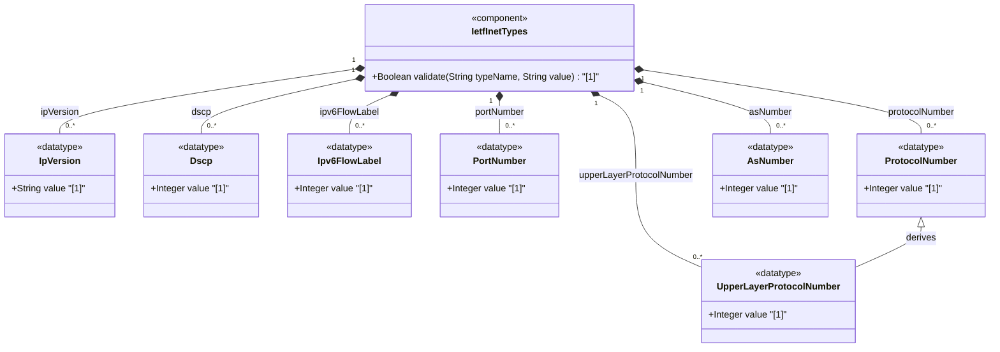

# Feature: [RFC9911-INET] Protocol Field Types

## Parent Epic
- [ ] #11 - [RFC9911-INET] Internet Protocol Suite Types (semantic linkage: this feature defines ip-version, dscp, ipv6-flow-label, port-number, protocol-number, upper-layer-protocol-number, and as-number typedefs declared in the ietf-inet-types module per RFC 9911 Section 4)

## Description
Defines types for Internet Protocol header fields and protocol identifiers. The ip-version enumeration distinguishes IPv4 and IPv6. The dscp type represents 6-bit Differentiated Services Code Points for packet marking. The ipv6-flow-label type carries 20-bit IPv6 flow identifiers. The port-number type covers 16-bit transport-layer ports (0-65535). The protocol-number and upper-layer-protocol-number types represent 8-bit IP protocol identifiers from the IANA registry. The as-number type identifies 32-bit Autonomous System numbers for BGP routing.

## UML Class Diagram


## Interface Requirements

### 1. Payload Schema
```json
{
  "ip-version": "ipv4",
  "dscp": 46,
  "ipv6-flow-label": 12345,
  "port-number": 443,
  "protocol-number": 6,
  "upper-layer-protocol-number": 6,
  "as-number": 64496
}
```

### 2. Validation & Constraints

**ip-version:**
- Base type: enumeration
- Valid values: unknown (0), ipv4 (1), ipv6 (2)
- Semantically equivalent to SMIv2 InetVersion

**dscp:**
- Base type: uint8
- Range: 0 to 63 (6-bit DSCP field)
- Used for marking packets in a traffic stream per RFC 2474
- Semantically equivalent to SMIv2 Dscp

**ipv6-flow-label:**
- Base type: uint32
- Range: 0 to 1048575 (20-bit flow label field)
- Flow identifier in IPv6 packet header per RFC 8200
- Semantically equivalent to SMIv2 IPv6FlowLabel

**port-number:**
- Base type: uint16
- Range: 0 to 65535
- 16-bit port number for UDP, TCP, DCCP, or SCTP
- Port 0 is reserved by IANA; may be excluded by subtyping
- Semantically equivalent to SMIv2 InetPortNumber

**protocol-number:**
- Base type: uint8
- Range: 0 to 255
- 8-bit Internet Protocol number from IPv4 Protocol field or IPv6 Next Header field
- Assigned by IANA

**upper-layer-protocol-number:**
- Base type: protocol-number (uint8)
- Represents the upper-layer protocol in an IP packet
- For IPv6 with extension headers: the protocol number in the last Next Header field
- Range: 0 to 255

**as-number:**
- Base type: uint32
- No range restriction (originally 16-bit, extended to 32-bit by RFC 6793)
- Assigned by IANA; regional registries manage delegated blocks
- Semantically equivalent to SMIv2 InetAutonomousSystemNumber

### 3. Logical Operations & Interface Messages
- **READ**: Retrieve protocol field value
- **VALIDATE**: Validate value against type-specific range or enumeration constraints
- **LOOKUP**: Resolve protocol number to protocol name via IANA registry
- **CLASSIFY**: Use DSCP value for traffic classification and QoS marking
- **SUBSCRIBE**: Subscribe to changes in routing-related fields (e.g., AS number reassignment)

### 4. Logical Exception States & Validation Failures
- **DSCP range violation**: Value outside 0-63 triggers validation failure
- **IPv6 flow label range violation**: Value outside 0-1048575 triggers validation failure
- **Port number range violation**: Value outside 0-65535 triggers validation failure
- **Port zero reserved**: Port 0 is reserved; specific schema nodes may exclude it
- **IP version unknown enumeration**: Value other than unknown(0), ipv4(1), ipv6(2) is rejected
- **Protocol number out of range**: Value outside 0-255 triggers validation failure
- **AS number overflow**: Negative value or value exceeding uint32 range triggers validation failure

## Given-When-Then Acceptance Criteria

**Scenario: DSCP valid value passes validation**
- Given a DSCP value of 46 (EF - Expedited Forwarding)
- When the dscp type validates the value
- Then validation passes

**Scenario: DSCP value exceeding 63 is rejected**
- Given a DSCP value of 64
- When the dscp type validates the value
- Then validation fails with range constraint violation

**Scenario: Port number 443 passes validation**
- Given a port number 443
- When the port-number type validates the value
- Then validation passes

**Scenario: Port number 0 is valid at type level**
- Given a port number 0
- When the port-number type validates the value
- Then validation passes (subtyping may exclude it at the schema node level)

**Scenario: Port number exceeding 65535 is rejected**
- Given a port number 65536
- When the port-number type validates the value
- Then validation fails with range constraint violation

**Scenario: IPv6 flow label within range passes**
- Given an IPv6 flow label 1048575 (max)
- When the ipv6-flow-label type validates the value
- Then validation passes

**Scenario: IP version enumeration rejects invalid string**
- Given an IP version string "ipv5"
- When the ip-version enumeration validates the value
- Then validation fails because "ipv5" is not a valid enum value

**Scenario: Protocol number 6 (TCP) validates**
- Given a protocol number 6
- When the protocol-number type validates the value
- Then validation passes

**Scenario: Upper-layer protocol number for IPv6 with extension headers**
- Given an IPv6 packet with Hop-by-Hop Options header (protocol 0) and Destination Options header (protocol 60), followed by TCP (protocol 6)
- When the upper-layer-protocol-number type is evaluated
- Then the value is 6 (protocol number from the last Next Header field in the extension header chain)

**Scenario: AS number in 32-bit range validates**
- Given an AS number 131072 (beyond original 16-bit range)
- When the as-number type validates the value
- Then validation passes as the type supports 32-bit AS numbers

## Specification Context (Verbatim)

From RFC 9911, Section 4:

> This value represents the version of the Internet Protocol. In the value set and its semantics, this type is equivalent to the InetVersion textual convention of the SMIv2.

> The dscp type represents a Differentiated Services Code Point that may be used for marking packets in a traffic stream. In the value set and its semantics, this type is equivalent to the Dscp textual convention of the SMIv2.

> The ipv6-flow-label type represents the flow identifier or Flow Label in an IPv6 packet header that may be used to discriminate traffic flows.

> The port-number type represents a 16-bit port number of an Internet transport-layer protocol such as UDP, TCP, DCCP, or SCTP. Port numbers are assigned by IANA. Note that the port number value zero is reserved by IANA. In situations where the value zero does not make sense, it can be excluded by subtyping the port-number type.

> The protocol-number type represents an 8-bit Internet Protocol number, carried in the 'protocol' field of the IPv4 header or in the 'next header' field of the IPv6 header. Protocol numbers are assigned by IANA.

> The upper-layer-protocol-number represents the upper-layer protocol number carried in an IP packet. For IPv6 packets with extension headers, this is the protocol number carried in the last 'next header' field of the chain of IPv6 extension headers.

> The as-number type represents autonomous system numbers that identify an Autonomous System (AS). Autonomous system numbers were originally limited to 16 bits. BGP extensions have enlarged the autonomous system number space to 32 bits. This type therefore uses an uint32 base type without a range restriction in order to support a larger autonomous system number space.

## Source References
Structural Schema: [ietf-inet-types@2025-12-22.yang](https://raw.githubusercontent.com/gintatkinson/3dgs-039/main/schema/ietf-inet-types%402025-12-22.yang) (Collections: types related to protocol fields, types related to autonomous systems)
Normative Specification: [RFC 9911](https://datatracker.ietf.org/doc/rfc9911/) (Section 4: Internet Protocol Suite Types, Table 2)

## Logical UI & Interface Bindings
- **Target LUI Component:** Deferred to Feature #X Task Y
- **Target Layout Container ID:** Deferred to Feature #X Task Y
- **Data Source Bindings:** Deferred to Feature #X Task Y
