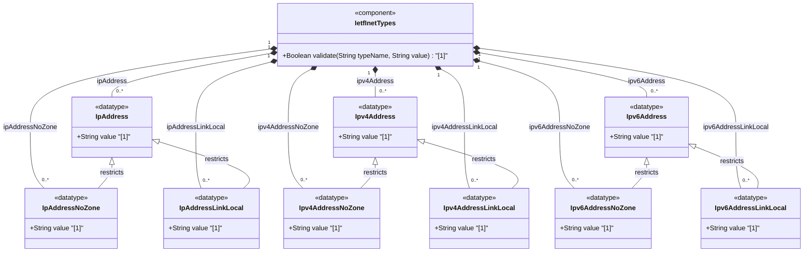

# Feature: [RFC9911-INET] IP Address Types

## Parent Epic
- [ ] #11 - [RFC9911-INET] Internet Protocol Suite Types (semantic linkage: this feature defines ip-address, ipv4-address, ipv6-address, ip-address-no-zone, ipv4-address-no-zone, ipv6-address-no-zone, ip-address-link-local, ipv4-address-link-local, and ipv6-address-link-local typedefs declared in the ietf-inet-types module per RFC 9911 Section 4)

## Description
Defines types for representing Internet Protocol addresses in version-agnostic and version-specific forms. IPv4 addresses use dotted-quad notation with optional zone indices. IPv6 addresses support full, mixed, shortened, and shortened-mixed notations with zone indices per RFC 4007 and canonical formatting per RFC 5952. IP-version-neutral union types (ip-address, ip-address-no-zone, ip-address-link-local) aggregate both address families. No-zone variants exclude scoped address zone identifiers for contexts where the zone is implicit. Link-local variants restrict addresses to the link-local address space (169.254.0.0/16 for IPv4, fe80::/10 for IPv6).

## UML Class Diagram


## Interface Requirements

### 1. Payload Schema
```json
{
  "ip-address": "2001:db8::1",
  "ipv4-address": "192.0.2.1",
  "ipv6-address": "2001:db8::1",
  "ip-address-no-zone": "192.0.2.1",
  "ipv4-address-no-zone": "192.0.2.1",
  "ipv6-address-no-zone": "2001:db8::1",
  "ip-address-link-local": "169.254.1.1",
  "ipv4-address-link-local": "169.254.1.1",
  "ipv6-address-link-local": "fe80::1"
}
```

### 2. Validation & Constraints

**ip-address:**
- Base type: union of ipv4-address and ipv6-address
- IP version neutral; textual format implies version
- Supports scoped addresses via zone identifiers
- IPv4: dotted-quad notation with optional zone index (% suffix)
- IPv6: full, mixed, shortened, shortened-mixed notation with optional zone index

**ipv4-address:**
- Base type: string with pattern validation
- Pattern: `(([0-9]|[1-9][0-9]|1[0-9][0-9]|2[0-4][0-9]|25[0-5])\.){3}([0-9]|[1-9][0-9]|1[0-9][0-9]|2[0-4][0-9]|25[0-5])(%.+)?`
- Dotted-quad notation: four decimal octets (0-255)
- Optional zone index separated by % sign
- Zone index used to disambiguate identical address values (e.g., link-local)
- Canonical zone index format: numerical

**ipv6-address:**
- Base type: string with dual pattern validation
- Patterns cover full, mixed, shortened, and shortened-mixed notations
- Optional zone index separated by % sign
- Zone index pattern: `%[A-Za-z0-9][A-Za-z0-9\-\._~/]*`
- Canonical format per RFC 5952 Section 4
- Canonical zone index: numerical format per RFC 4007 Section 11.2

**ip-address-no-zone:**
- Base type: union of ipv4-address-no-zone and ipv6-address-no-zone
- IP version neutral; no zone identifiers allowed
- For contexts where the zone is implicit

**ipv4-address-no-zone:**
- Base type: ipv4-address with restricted pattern `[0-9\.]*`
- IPv4 address without zone index
- Use when zone is known from context

**ipv6-address-no-zone:**
- Base type: ipv6-address with restricted pattern `[0-9a-fA-F:\.]*`
- IPv6 address without zone index
- Use when zone is known from context

**ip-address-link-local:**
- Base type: union of ipv4-address-link-local and ipv6-address-link-local
- IP version neutral; restricted to link-local address space

**ipv4-address-link-local:**
- Base type: ipv4-address with pattern restriction `169\.254\..*`
- Link-local IPv4 address in prefix 169.254.0.0/16 per RFC 3927 Section 2.1

**ipv6-address-link-local:**
- Base type: ipv6-address with pattern restriction `[fF][eE][89aAbB][0-9a-fA-F]:.*`
- Link-local IPv6 address in prefix fe80::/10 per RFC 4291 Section 2.4

### 3. Logical Operations & Interface Messages
- **READ**: Retrieve IP address in canonical format
- **VALIDATE**: Validate address against version-specific syntax patterns
- **NORMALIZE**: Convert address to canonical form (lowercase for IPv6 hex, compressed zeros)
- **COMPARE**: Compare two addresses for equality after normalization
- **RESOLVE**: Distinguish IPv4 from IPv6 in ip-address union
- **STRIP_ZONE**: Extract address without zone index
- **EXTRACT_ZONE**: Extract zone identifier from scoped address

### 4. Logical Exception States & Validation Failures
- **IPv4 octet overflow**: Any octet exceeding 255 triggers validation failure
- **IPv4 too few octets**: Fewer than 4 octets triggers validation failure
- **IPv6 malformed**: Non-hex characters in IPv6 segments trigger validation failure
- **IPv6 excessive compression**: Multiple :: compression markers trigger validation failure
- **IPv6 segment overflow**: Segments with more than 4 hex digits trigger validation failure
- **Zone index in no-zone type**: Zone identifier present in ip-address-no-zone or its subtypes triggers rejection
- **Non-link-local address**: Address outside link-local prefix in link-local type triggers rejection
- **Mixed notation invalid**: IPv4-embedded IPv6 address with invalid dotted-quad triggers validation failure
- **UTF-8 zone name**: Non-UTF-8 zone names require transformation mechanism; if absent, validation may fail

## Given-When-Then Acceptance Criteria

**Scenario: IPv4 dotted-quad address passes validation**
- Given an IPv4 address "192.0.2.1"
- When the ipv4-address type validates the value
- Then validation passes

**Scenario: IPv6 shortened notation passes validation**
- Given an IPv6 address "2001:db8::1"
- When the ipv6-address type validates the value
- Then validation passes

**Scenario: IPv6 full notation passes validation**
- Given an IPv6 address "2001:0db8:0000:0000:0000:0000:0000:0001"
- When the ipv6-address type validates and normalizes the value
- Then the canonical form "2001:db8::1" (per RFC 5952) is produced

**Scenario: IPv4 address with zone index passes validation**
- Given an IPv4 address "192.0.2.1%eth0"
- When the ipv4-address type validates the value
- Then validation passes

**Scenario: IPv4 address with zone index rejected by no-zone type**
- Given an IPv4 address "192.0.2.1%eth0"
- When the ipv4-address-no-zone type validates the value
- Then validation fails because zone indices are not allowed

**Scenario: Link-local IPv4 address passes link-local type validation**
- Given an IPv4 address "169.254.1.1"
- When the ipv4-address-link-local type validates the value
- Then validation passes

**Scenario: Non-link-local IPv4 address rejected by link-local type**
- Given an IPv4 address "192.0.2.1"
- When the ipv4-address-link-local type validates the value
- Then validation fails because the address is not in 169.254.0.0/16

**Scenario: Link-local IPv6 address passes link-local type validation**
- Given an IPv6 address "fe80::1"
- When the ipv6-address-link-local type validates the value
- Then validation passes

**Scenario: ip-address union correctly identifies IPv4**
- Given an ip-address value "192.0.2.1"
- When the ip-address union type resolves the address family
- Then the value is identified as IPv4 (ipv4-address member of union)

**Scenario: ip-address union correctly identifies IPv6**
- Given an ip-address value "2001:db8::1"
- When the ip-address union type resolves the address family
- Then the value is identified as IPv6 (ipv6-address member of union)

## Specification Context (Verbatim)

From RFC 9911, Section 4:

> The ip-address type represents an IP address and is IP version neutral. The format of the textual representation implies the IP version. This type supports scoped addresses by allowing zone identifiers in the address format.

> The ipv4-address type represents an IPv4 address in dotted-quad notation. The IPv4 address may include a zone index, separated by a % sign. The zone index is used to disambiguate identical address values. For link-local addresses, the zone index will typically be the interface index number or the name of an interface. If the zone index is not present, the default zone of the device will be used. The canonical format for the zone index is the numerical format.

> The ipv6-address type represents an IPv6 address in full, mixed, shortened, and shortened-mixed notation. The IPv6 address may include a zone index, separated by a % sign. The canonical format of IPv6 addresses uses the textual representation defined in Section 4 of RFC 5952. The canonical format for the zone index is the numerical format as described in Section 11.2 of RFC 4007.

> The ip-address-no-zone type represents an IP address and is IP version neutral. This type does not support scoped addresses since it does not allow zone identifiers in the address format.

> An IPv4 address without a zone index. This type, derived from the type ipv4-address, may be used in situations where the zone is known from the context and no zone index is needed.

> An IPv6 address without a zone index.

> The ip-address-link-local type represents a link-local IP address and is IP version neutral.

> The ipv4-address-link-local type represents a link-local IPv4 address in the prefix 169.254.0.0/16 as defined in Section 2.1 of RFC 3927.

> The ipv6-address-link-local type represents a link-local IPv6 address in the prefix fe80::/10 as defined in Section 2.4 of RFC 4291.

## Source References
Structural Schema: [ietf-inet-types@2025-12-22.yang](https://raw.githubusercontent.com/gintatkinson/3dgs-039/main/schema/ietf-inet-types%402025-12-22.yang) (Collection: types related to IP addresses and hostnames)
Normative Specification: [RFC 9911](https://datatracker.ietf.org/doc/rfc9911/) (Section 4: Internet Protocol Suite Types, Table 2)

## Logical UI & Interface Bindings
- **Target LUI Component:** Deferred to Feature #X Task Y
- **Target Layout Container ID:** Deferred to Feature #X Task Y
- **Data Source Bindings:** Deferred to Feature #X Task Y
