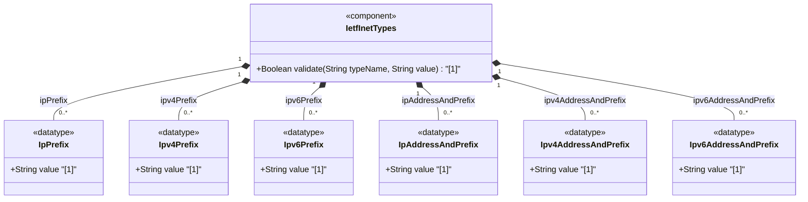

# Feature: [RFC9911-INET] IP Prefix Types

## Parent Epic
- [ ] #11 - [RFC9911-INET] Internet Protocol Suite Types (semantic linkage: this feature defines ip-prefix, ipv4-prefix, ipv6-prefix, ip-address-and-prefix, ipv4-address-and-prefix, and ipv6-address-and-prefix typedefs declared in the ietf-inet-types module per RFC 9911 Section 4)

## Description
Defines types for representing IP network prefixes (address plus prefix length) and combined address-and-prefix pairs. IPv4 prefixes use dotted-quad notation with slash-delimited prefix lengths 0-32. IPv6 prefixes use standard IPv6 notation with slash-delimited prefix lengths 0-128. IP-version-neutral union types (ip-prefix, ip-address-and-prefix) aggregate both address families. Canonical forms require non-prefix bits to be zero. The address-and-prefix variants carry both a specific host address and its associated network prefix length in a single string value.

## UML Class Diagram


## Interface Requirements

### 1. Payload Schema
```json
{
  "ip-prefix": "192.0.2.0/24",
  "ipv4-prefix": "192.0.2.0/24",
  "ipv6-prefix": "2001:db8::/32",
  "ip-address-and-prefix": "192.0.2.1/24",
  "ipv4-address-and-prefix": "192.0.2.1/24",
  "ipv6-address-and-prefix": "2001:db8::1/64"
}
```

### 2. Validation & Constraints

**ip-prefix:**
- Base type: union of ipv4-prefix and ipv6-prefix
- IP version neutral; format implies version

**ipv4-prefix:**
- Base type: string with pattern validation
- Pattern: dotted-quad followed by `/` and prefix length 0-32
- Prefix length n = n contiguous 1-bits from MSB, rest 0
- Non-prefix bits SHOULD be set to zero (canonical format)
- Non-canonical values (e.g., 192.0.2.1/24) MUST be accepted and converted to canonical form (192.0.2.0/24)

**ipv6-prefix:**
- Base type: string with dual pattern validation
- Pattern: IPv6 address notation followed by `/` and prefix length 0-128
- Prefix length n = n contiguous 1-bits from MSB, rest 0
- Canonical format: non-prefix bits set to zero, address per RFC 5952 Section 4
- Non-canonical values (e.g., 2001:db8::1/64) MUST be accepted and converted to canonical form (2001:db8::/64)

**ip-address-and-prefix:**
- Base type: union of ipv4-address-and-prefix and ipv6-address-and-prefix
- IP version neutral

**ipv4-address-and-prefix:**
- Base type: string with pattern validation
- Pattern: dotted-quad followed by `/` and prefix length 0-32
- Represents a specific IPv4 address AND its associated prefix length
- Unlike ipv4-prefix, non-prefix bits are NOT required to be zero (carries actual host address)
- Prefix length <= 32

**ipv6-address-and-prefix:**
- Base type: string with dual pattern validation
- Pattern: IPv6 notation followed by `/` and prefix length 0-128
- Represents a specific IPv6 address AND its associated prefix length
- Canonical format: address per RFC 5952 Section 4
- Prefix length <= 128

### 3. Logical Operations & Interface Messages
- **READ**: Retrieve prefix or address-and-prefix value
- **VALIDATE**: Validate prefix syntax and prefix length range
- **NORMALIZE**: Convert prefix to canonical form (zero non-prefix bits for ipv4-prefix/ipv6-prefix)
- **CONTAINS**: Check if an IP address falls within a given prefix
- **COMPARE**: Compare two prefixes for equality or containment
- **SUBNET**: Derive network address from address-and-prefix value

### 4. Logical Exception States & Validation Failures
- **Prefix length out of range**: IPv4 prefix length > 32 or IPv6 prefix length > 128 triggers validation failure
- **Negative prefix length**: Negative prefix length triggers validation failure
- **Missing slash separator**: Address without `/prefix-length` triggers pattern violation
- **IPv4 octet overflow**: Address octet exceeding 255 triggers validation failure
- **IPv6 malformed address**: Non-hex characters or invalid IPv6 syntax triggers validation failure
- **Canonical conversion failure**: Implementation failure to canonicalize non-zero non-prefix bits is a conformance issue (for ipv4-prefix/ipv6-prefix)

## Given-When-Then Acceptance Criteria

**Scenario: IPv4 prefix in canonical form passes validation**
- Given an IPv4 prefix "192.0.2.0/24"
- When the ipv4-prefix type validates the value
- Then validation passes

**Scenario: IPv4 prefix with non-zero host bits is accepted and canonicalized**
- Given an IPv4 prefix "192.0.2.1/24"
- When the ipv4-prefix type validates the value
- Then the value is accepted and the canonical form "192.0.2.0/24" is returned

**Scenario: IPv6 prefix in canonical form passes validation**
- Given an IPv6 prefix "2001:db8::/32"
- When the ipv6-prefix type validates the value
- Then validation passes

**Scenario: IPv6 prefix with non-zero host bits is accepted and canonicalized**
- Given an IPv6 prefix "2001:db8::1/64"
- When the ipv6-prefix type validates the value
- Then the canonical form "2001:db8::/64" is returned

**Scenario: IPv4 prefix length exceeding 32 is rejected**
- Given an IPv4 prefix "192.0.2.0/33"
- When the ipv4-prefix type validates the value
- Then validation fails with prefix length constraint violation

**Scenario: IPv4 address-and-prefix retains host bits**
- Given an IPv4 address-and-prefix "192.0.2.1/24"
- When the ipv4-address-and-prefix type validates the value
- Then the value is accepted as-is (host bits are preserved, unlike ipv4-prefix)

**Scenario: IPv4 address-and-prefix with out-of-range prefix length is rejected**
- Given an IPv4 address-and-prefix "192.0.2.1/33"
- When the ipv4-address-and-prefix type validates the value
- Then validation fails

**Scenario: IPv6 address-and-prefix accepts mixed notation**
- Given an IPv6 address-and-prefix "::ffff:192.0.2.1/96"
- When the ipv6-address-and-prefix type validates the value
- Then validation passes

**Scenario: ip-prefix union correctly identifies IPv4**
- Given an ip-prefix value "10.0.0.0/8"
- When the ip-prefix union type resolves the family
- Then the value is identified as IPv4 (ipv4-prefix member)

**Scenario: Prefix length zero is valid**
- Given an ipv4-prefix "0.0.0.0/0" representing the default route
- When the ipv4-prefix type validates the value
- Then validation passes

## Specification Context (Verbatim)

From RFC 9911, Section 4:

> The ip-prefix type represents an IP prefix and is IP version neutral. The format of the textual representations implies the IP version.

> The ipv4-prefix type represents an IPv4 prefix. The prefix length is given by the number following the slash character and must be less than or equal to 32. A prefix length value of n corresponds to an IP address mask that has n contiguous 1-bits from the most significant bit (MSB) and all other bits set to 0.

> The canonical format of an IPv4 prefix has all bits of the IPv4 address set to zero that are not part of the IPv4 prefix. The definition of ipv4-prefix does not require that bits that are not part of the prefix be set to zero. However, implementations have to return values in canonical format, which requires non-prefix bits to be set to zero. This means that 192.0.2.1/24 must be accepted as a valid value, but it will be converted into the canonical format 192.0.2.0/24.

> The ipv6-prefix type represents an IPv6 prefix. The prefix length is given by the number following the slash character and must be less than or equal to 128.

> The ip-address-and-prefix type represents an IP address and prefix and is IP version neutral. The format of the textual representations implies the IP version.

> The ipv4-address-and-prefix type represents an IPv4 address and an associated IPv4 prefix. The prefix length is given by the number following the slash character and must be less than or equal to 32.

> The ipv6-address-and-prefix type represents an IPv6 address and an associated IPv6 prefix. The prefix length is given by the number following the slash character and must be less than or equal to 128.

## Source References
Structural Schema: [ietf-inet-types@2025-12-22.yang](https://github.com/gintatkinson/3dgs-039/blob/main/schema/ietf-inet-types%402025-12-22.yang) (Collection: types related to IP addresses and hostnames)
Normative Specification: [RFC 9911](https://datatracker.ietf.org/doc/rfc9911/) (Section 4: Internet Protocol Suite Types, Table 2)

## Logical UI & Interface Bindings
- **Target LUI Component:** Deferred to Feature #X Task Y
- **Target Layout Container ID:** Deferred to Feature #X Task Y
- **Data Source Bindings:** Deferred to Feature #X Task Y
