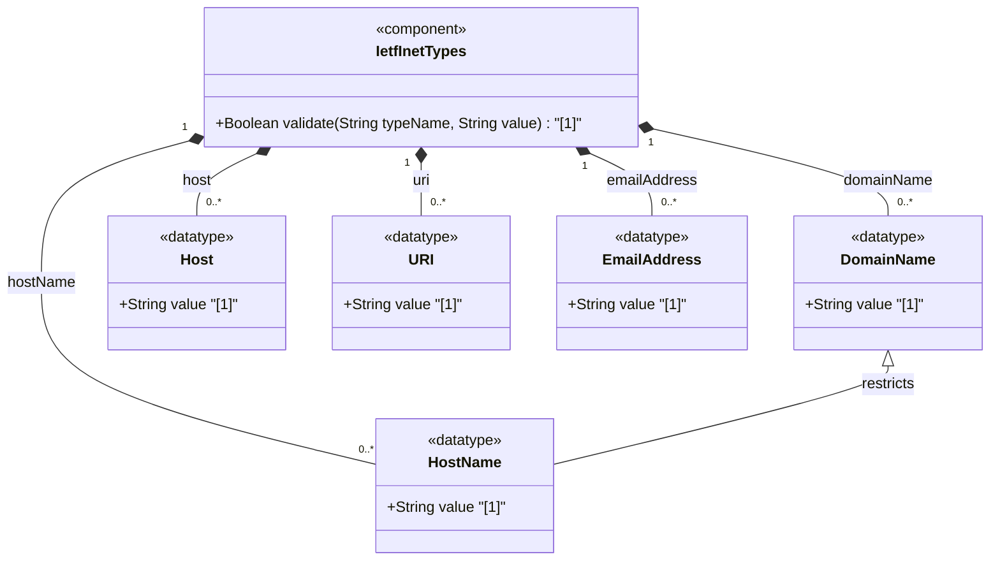

# Feature: [RFC9911-INET] Domain, Host, and URI Types

## Parent Epic
- [ ] #11 - [RFC9911-INET] Internet Protocol Suite Types (semantic linkage: this feature defines domain-name, host-name, host, uri, and email-address typedefs declared in the ietf-inet-types module per RFC 9911 Section 4)

## Description
Defines types for representing DNS domain names, host names, URIs, and email addresses. The domain-name type represents DNS domain names with validation for RFC 1034/1123 syntax, length limits (1-253 characters), and internationalized domain name support via A-labels. The host-name type restricts domain names to valid host syntax (letters, digits, hyphens, dots; minimum 2 characters). The host union type accepts either an IP address or a host name. The uri type represents RFC 3986 Uniform Resource Identifiers with normalization requirements. The email-address type supports internationalized email addresses per RFC 5322/6532 with basic format validation.

## UML Class Diagram


## Interface Requirements

### 1. Payload Schema
```json
{
  "domain-name": "example.com",
  "host-name": "server1.example.com",
  "host": "server1.example.com",
  "uri": "https://example.com/resource?id=1",
  "email-address": "user@example.com"
}
```

### 2. Validation & Constraints

**domain-name:**
- Base type: string with length and pattern constraints
- Length: 1 to 253 characters (DNS protocol limits to 255 bytes with length-prefix encoding and NUL)
- Pattern: validates label structure (labels of 1-63 alphanumeric/hyphen/underscore, separated by dots)
- SHOULD be fully qualified whenever possible
- Does NOT support wildcards (RFC 4592) or classless in-addr.arpa delegations (RFC 2317)
- ASCII encoding; canonical format uses lowercase
- Internationalized domain names MUST be A-labels per RFC 5890
- Schema node description MUST describe name-to-IP resolution behavior

**host-name:**
- Base type: domain-name with length and pattern restrictions
- Length: 2 to max (minimum 2 characters per RFC 952)
- Pattern: `[a-zA-Z0-9\-\.]+`
- Labels consist of letters, digits, and hyphens separated by dots (RFC 1123, RFC 952)
- Fully qualified host names

**host:**
- Base type: union of ip-address and host-name
- Accepts either an IP address (IPv4 or IPv6) or a fully qualified host name

**uri:**
- Base type: string with pattern validation
- Pattern: `[a-z][a-z0-9+.-]*:.*` (scheme followed by colon)
- MUST use ASCII encoding
- MUST be normalized per RFC 3986 Sections 6.2.1, 6.2.2.1, and 6.2.2.2
- Percent-encoding: characters representable without encoding are NOT percent-encoded
- Case normalization: scheme and host are lowercase; percent-encoded hex digits are uppercase
- Zero-length URI is not valid (can express "URI absent")
- Schema nodes using uri may restrict permitted schemes (e.g., exclude "data:" and "urn:")
- Semantically equivalent to SMIv2 Uri

**email-address:**
- Base type: string with pattern validation
- Pattern: `.+@.+` (basic presence of @ separator)
- Format per addr-spec ABNF rule in RFC 5322 Section 3.4.1
- Extended for internationalized email per RFC 6532
- Implementations MUST support RFC 6532 internationalization extensions
- Support for obsolete obs-local-part, obs-domain, and obs-qtext NOT required
- Domain part may use both A-labels and U-labels (RFC 5890)
- Canonical format: lowercase domain part with U-labels where applicable

### 3. Logical Operations & Interface Messages
- **READ**: Retrieve domain name, host, URI, or email address value
- **VALIDATE**: Validate against type-specific syntax and length constraints
- **NORMALIZE**: Convert to canonical lowercase form; normalize URI per RFC 3986
- **RESOLVE**: Resolve domain name or host name to IP address(es) via DNS
- **COMPARE**: Compare two URIs for logical equivalence after normalization
- **DECOMPOSE**: Extract local part and domain part from email address; extract scheme, authority, path from URI

### 4. Logical Exception States & Validation Failures
- **Domain name too long**: String exceeding 253 characters triggers length constraint violation
- **Domain name empty**: Zero-length string triggers length constraint violation (minimum 1)
- **Host name too short**: String shorter than 2 characters triggers length constraint violation
- **Host name invalid character**: Non-alphanumeric, non-hyphen, non-dot character triggers pattern violation
- **URI missing scheme**: String without `scheme:` prefix triggers pattern violation
- **URI invalid scheme**: Scheme not starting with alpha character triggers validation failure
- **URI normalization incomplete**: Failure to normalize per RFC 3986 is a conformance issue
- **Email missing at-sign**: Email address without @ separator triggers pattern violation
- **Email empty local part**: `@domain` with empty local part matches `.+@.+` pattern but is semantically invalid
- **Internationalized domain not A-label**: Non-ASCII domain name not encoded as A-label triggers validation failure
- **DNS resolution failure**: Host name that cannot be resolved to an IP address triggers a runtime resolution error

## Given-When-Then Acceptance Criteria

**Scenario: Fully qualified domain name passes validation**
- Given a domain name "example.com"
- When the domain-name type validates the value
- Then validation passes

**Scenario: Domain name with valid hyphenated labels passes**
- Given a domain name "my-server.example.com"
- When the domain-name type validates the value
- Then validation passes

**Scenario: Domain name exceeding 253 characters is rejected**
- Given a domain name with 254 characters
- When the domain-name type validates the value
- Then validation fails with length constraint violation

**Scenario: Host name with valid syntax passes validation**
- Given a host name "server1.example.com"
- When the host-name type validates the value
- Then validation passes

**Scenario: Host name shorter than 2 characters is rejected**
- Given a host name "a"
- When the host-name type validates the value
- Then validation fails with length constraint violation

**Scenario: Host union accepts IP address**
- Given a host value "192.0.2.1"
- When the host union type resolves the value
- Then the value is accepted as an ip-address member

**Scenario: Host union accepts host name**
- Given a host value "server.example.com"
- When the host union type resolves the value
- Then the value is accepted as a host-name member

**Scenario: URI with standard scheme passes validation**
- Given a URI "https://example.com/resource?id=1"
- When the uri type validates the value
- Then validation passes

**Scenario: URI without scheme prefix is rejected**
- Given a string "example.com/resource" without scheme
- When the uri type validates the value
- Then validation fails with pattern violation

**Scenario: URI normalization lowercases scheme and host**
- Given a URI "HTTPS://EXAMPLE.COM/Path"
- When the uri type normalizes the value
- Then the normalized form is "https://example.com/Path" (host lowercased, path case preserved)

**Scenario: Email address with internationalized domain part passes**
- Given an email address "user@münchen.example.com" (U-label)
- When the email-address type validates the value
- Then the value is accepted (implementations MUST support RFC 6532 internationalization)

**Scenario: Email missing at-sign is rejected**
- Given a string "userexample.com" without @
- When the email-address type validates the value
- Then validation fails with pattern violation

**Scenario: Domain name with trailing dot (fully qualified) passes**
- Given a domain name "example.com." (with trailing dot)
- When the domain-name type validates the value
- Then validation passes (optional trailing dot is accepted)

## Specification Context (Verbatim)

From RFC 9911, Section 4:

> The domain-name type represents a DNS domain name. The name SHOULD be fully qualified whenever possible. This type does not support wildcards (see RFC 4592) or classless in-addr.arpa delegations (see RFC 2317).

> Internet domain names are only loosely specified. Section 3.5 of RFC 1034 recommends a syntax (modified in Section 2.1 of RFC 1123). The pattern above is intended to allow for current practice in domain name use and some possible future expansion. Note that Internet host names have a stricter syntax (described in RFC 952) than the DNS recommendations in RFCs 1034 and 1123. Schema nodes representing host names should use the host-name type instead of the domain-type.

> The encoding of DNS names in the DNS protocol is limited to 255 characters. Since the encoding consists of labels prefixed by a length byte and there is a trailing NUL byte, only 253 characters can appear in the textual dotted notation.

> The description clause of schema nodes using the domain-name type MUST describe when and how these names are resolved to IP addresses. Domain-name values use the ASCII encoding. Their canonical format uses lowercase ASCII characters. Internationalized domain names MUST be A-labels as per RFC 5890.

> The host-name type represents fully qualified host names. Host names must be at least two characters long (see RFC 952), and they are restricted to labels consisting of letters, digits, and hyphens separated by dots (see RFCs 1123 and 952).

> The host type represents either an IP address or a fully qualified host name.

> The uri type represents a Uniform Resource Identifier (URI) as defined by the rule 'URI' in RFC 3986. Objects using the uri type MUST be in ASCII encoding and MUST be normalized as described in Sections 6.2.1, 6.2.2.1, and 6.2.2.2 of RFC 3986.

> The email-address type represents an internationalized email address. The email address format is defined by the addr-spec ABNF rule in Section 3.4.1 of RFC 5322. This format has been extended by RFC 6532 to support internationalized email addresses. Implementations MUST support the internationalization extensions of RFC 6532.

## Source References
Structural Schema: [ietf-inet-types@2025-12-22.yang](https://github.com/gintatkinson/3dgs-039/blob/main/schema/ietf-inet-types%402025-12-22.yang) (Collection: domain name and URI types)
Normative Specification: [RFC 9911](https://datatracker.ietf.org/doc/rfc9911/) (Section 4: Internet Protocol Suite Types, Table 2)

## Logical UI & Interface Bindings
- **Target LUI Component:** Deferred to Feature #X Task Y
- **Target Layout Container ID:** Deferred to Feature #X Task Y
- **Data Source Bindings:** Deferred to Feature #X Task Y
