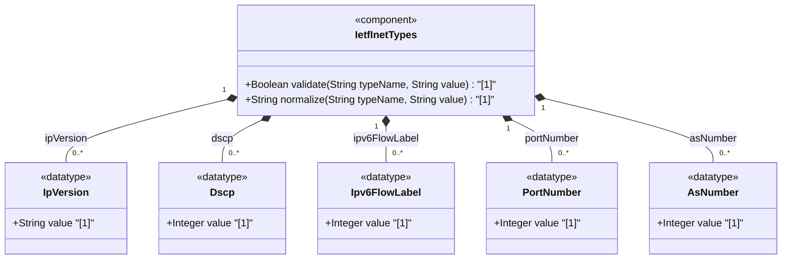

# Feature: [RFC6991-INET] Protocol Field Types

## Parent Epic
- [ ] #29 - [RFC6991-INET] Internet Protocol Suite Types (semantic linkage: this feature defines ip-version, dscp, ipv6-flow-label, port-number, and as-number typedefs declared in the ietf-inet-types module per RFC 6991 Section 4)

## Description
Defines types for Internet Protocol header fields and protocol identifiers. The ip-version enumeration distinguishes IPv4 and IPv6 with an additional unknown sentinel. The dscp type represents 6-bit Differentiated Services Code Points for packet marking. The ipv6-flow-label type carries 20-bit IPv6 flow identifiers. The port-number type covers 16-bit transport-layer ports (0-65535). The as-number type identifies 32-bit Autonomous System numbers for BGP routing without range restriction. All types except ip-version maintain SMIv2 textual convention equivalence where applicable.

## UML Class Diagram


## Interface Requirements

### 1. Payload Schema
```json
{
  "ip-version": "ipv4",
  "dscp": 46,
  "ipv6-flow-label": 12345,
  "port-number": 443,
  "as-number": 64496
}
```

### 2. Validation & Constraints

**ip-version:**
- Base type: enumeration
- Valid enumeration values: unknown (0), ipv4 (1), ipv6 (2)
- Semantically equivalent to SMIv2 InetVersion (INET-ADDRESS-MIB)
- References: RFC 791, RFC 2460, RFC 4001

**dscp:**
- Base type: uint8
- Range: 0 to 63 (6-bit DSCP field)
- Used for marking packets in a traffic stream per RFC 2474
- Semantically equivalent to SMIv2 Dscp (DIFFSERV-DSCP-TC)
- References: RFC 3289, RFC 2474, RFC 2780

**ipv6-flow-label:**
- Base type: uint32
- Range: 0 to 1048575 (20-bit flow label field)
- Flow identifier in IPv6 packet header per RFC 2460, used to discriminate traffic flows
- Semantically equivalent to SMIv2 IPv6FlowLabel (IPV6-FLOW-LABEL-MIB)
- References: RFC 3595, RFC 2460

**port-number:**
- Base type: uint16
- Range: 0 to 65535
- 16-bit port number for Internet transport-layer protocols (UDP, TCP, DCCP, SCTP)
- Port numbers are assigned by IANA; port number value zero is reserved by IANA
- In situations where the value zero does not make sense, it can be excluded by subtyping the port-number type
- Semantically equivalent to SMIv2 InetPortNumber (INET-ADDRESS-MIB)
- References: RFC 768, RFC 793, RFC 4960, RFC 4340, RFC 4001

**as-number:**
- Base type: uint32
- No range restriction (originally 16-bit, extended to 32-bit by RFC 6793)
- Identifies an Autonomous System (AS): a set of routers under a single technical administration
- IANA maintains the AS number space; regional registries manage delegated blocks
- Semantically equivalent to SMIv2 InetAutonomousSystemNumber (INET-ADDRESS-MIB)
- References: RFC 1930, RFC 4271, RFC 4001, RFC 6793

### 3. Logical Operations & Interface Messages
- **READ**: Retrieve protocol field value
- **VALIDATE**: Validate value against type-specific range or enumeration constraints
- **LOOKUP**: Resolve DSCP code point to per-hop behavior name or AS number to organization
- **CLASSIFY**: Use DSCP value for traffic classification and QoS marking
- **SUBSCRIBE**: Subscribe to changes in protocol field values

### 4. Logical Exception States & Validation Failures
- **DSCP range violation**: Value outside 0-63 triggers validation failure
- **IPv6 flow label range violation**: Value outside 0-1048575 triggers validation failure
- **Port number range violation**: Value outside 0-65535 triggers validation failure
- **Port zero usage**: Port 0 is reserved; specific schema nodes may exclude it via subtyping
- **IP version unknown enumeration**: Value other than unknown(0), ipv4(1), or ipv6(2) is rejected
- **AS number overflow**: Negative value or value exceeding uint32 range triggers validation failure

## Given-When-Then Acceptance Criteria

**Scenario: DSCP valid value passes validation**
- Given a DSCP value of 46 (EF - Expedited Forwarding)
- When the dscp type validates the value
- Then validation passes

**Scenario: DSCP value exceeding 63 is rejected**
- Given a DSCP value of 64
- When the dscp type validates the value
- Then validation fails with range constraint violation

**Scenario: Port number 443 passes validation**
- Given a port number 443
- When the port-number type validates the value
- Then validation passes

**Scenario: Port number 0 is valid at type level**
- Given a port number 0
- When the port-number type validates the value
- Then validation passes (subtyping may exclude it at the schema node level per RFC 6991 description)

**Scenario: Port number exceeding 65535 is rejected**
- Given a port number 65536
- When the port-number type validates the value
- Then validation fails with range constraint violation

**Scenario: IPv6 flow label within range passes**
- Given an IPv6 flow label 1048575 (maximum)
- When the ipv6-flow-label type validates the value
- Then validation passes

**Scenario: IPv6 flow label negative value rejected**
- Given an IPv6 flow label -1
- When the ipv6-flow-label type validates the value
- Then validation fails with range constraint violation

**Scenario: IP version enumeration rejects invalid string**
- Given an IP version string "ipv5"
- When the ip-version enumeration validates the value
- Then validation fails because "ipv5" is not a valid enum value

**Scenario: IP version "unknown" passes validation**
- Given an IP version value of "unknown" (enum value 0)
- When the ip-version type validates the value
- Then validation passes

**Scenario: AS number in 32-bit range validates**
- Given an AS number 131072 (beyond original 16-bit range)
- When the as-number type validates the value
- Then validation passes as the type supports 32-bit AS numbers per RFC 6793

**Scenario: AS number zero validates**
- Given an AS number 0
- When the as-number type validates the value
- Then validation passes (reserved AS number, valid per base type uint32)

## Specification Context (Verbatim)

From RFC 6991, Section 4 (ietf-inet-types module):

> This value represents the version of the IP protocol. In the value set and its semantics, this type is equivalent to the InetVersion textual convention of the SMIv2.

> The dscp type represents a Differentiated Services Code Point that may be used for marking packets in a traffic stream. In the value set and its semantics, this type is equivalent to the Dscp textual convention of the SMIv2.

> The ipv6-flow-label type represents the flow identifier or Flow Label in an IPv6 packet header that may be used to discriminate traffic flows. In the value set and its semantics, this type is equivalent to the IPv6FlowLabel textual convention of the SMIv2.

> The port-number type represents a 16-bit port number of an Internet transport-layer protocol such as UDP, TCP, DCCP, or SCTP. Port numbers are assigned by IANA. Note that the port number value zero is reserved by IANA. In situations where the value zero does not make sense, it can be excluded by subtyping the port-number type. In the value set and its semantics, this type is equivalent to the InetPortNumber textual convention of the SMIv2.

> The as-number type represents autonomous system numbers which identify an Autonomous System (AS). An AS is a set of routers under a single technical administration, using an interior gateway protocol and common metrics to route packets within the AS, and using an exterior gateway protocol to route packets to other ASes. Autonomous system numbers were originally limited to 16 bits. BGP extensions have enlarged the autonomous system number space to 32 bits. This type therefore uses an uint32 base type without a range restriction in order to support a larger autonomous system number space. In the value set and its semantics, this type is equivalent to the InetAutonomousSystemNumber textual convention of the SMIv2.

## Source References
Structural Schema: [ietf-inet-types@2013-07-15.yang](https://raw.githubusercontent.com/gintatkinson/3dgs-039/main/schema/ietf-inet-types%402013-07-15.yang) (Collections: types related to protocol fields, types related to autonomous systems)
Normative Specification: [RFC 6991](https://datatracker.ietf.org/doc/rfc6991/) (Section 4: Internet Protocol Suite Types, Table 2)

## Logical UI & Interface Bindings
- **Target LUI Component:** Deferred to Feature #X Task Y
- **Target Layout Container ID:** Deferred to Feature #X Task Y
- **Data Source Bindings:** Deferred to Feature #X Task Y
