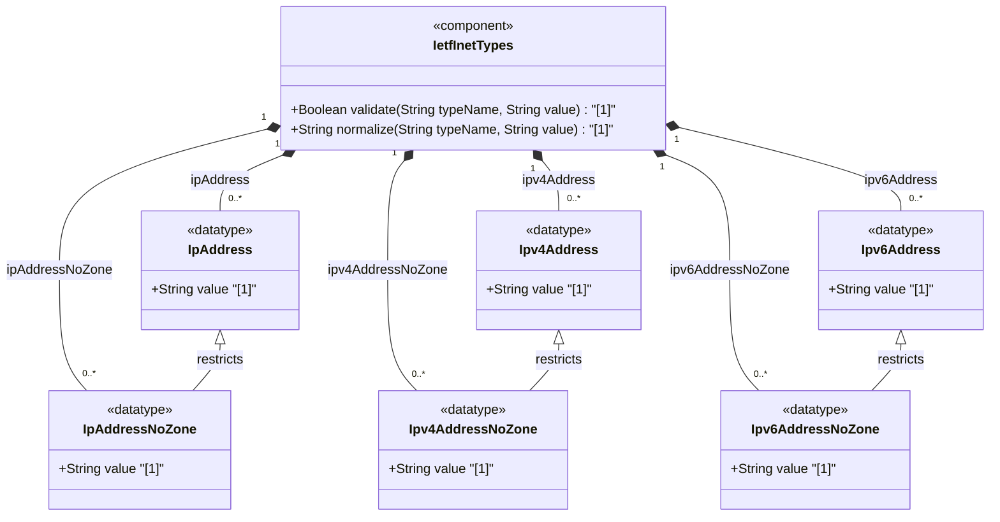

# Feature: [RFC6991-INET] IP Address Types

## Parent Epic
- [ ] #29 - [RFC6991-INET] Internet Protocol Suite Types (semantic linkage: this feature defines ip-address, ipv4-address, ipv6-address, ip-address-no-zone, ipv4-address-no-zone, and ipv6-address-no-zone typedefs declared in the ietf-inet-types module per RFC 6991 Section 4)

## Description
Defines types for representing Internet Protocol addresses in version-agnostic and version-specific forms. IPv4 addresses use dotted-quad notation with optional zone indices. IPv6 addresses support full, mixed, shortened, and shortened-mixed notations with zone indices per RFC 4007 and canonical formatting per RFC 5952. IP-version-neutral union types (ip-address, ip-address-no-zone) aggregate both address families. No-zone variants exclude scoped address zone identifiers for contexts where the zone is known implicitly. The no-zone types were added in the 2013-07-15 revision of RFC 6991.

## UML Class Diagram


## Interface Requirements

### 1. Payload Schema
```json
{
  "ip-address": "2001:db8::1",
  "ipv4-address": "192.0.2.1",
  "ipv6-address": "2001:db8::1",
  "ip-address-no-zone": "192.0.2.1",
  "ipv4-address-no-zone": "192.0.2.1",
  "ipv6-address-no-zone": "2001:db8::1"
}
```

### 2. Validation & Constraints

**ip-address:**
- Base type: union of inet:ipv4-address and inet:ipv6-address
- IP version neutral -- format of textual representation implies the IP version
- Supports scoped addresses by allowing zone identifiers in the address format
- References: RFC 4007

**ipv4-address:**
- Base type: string with regex pattern for dotted-quad notation
- Pattern: four octets (0-255) separated by periods, with optional zone index (% sign followed by alphanumeric characters)
- Zone index disambiguates identical address values (e.g., link-local addresses)
- If zone index is not present, the default zone of the device is used
- Canonical format for zone index is the numerical format
- No SMIv2 equivalent

**ipv6-address:**
- Base type: string with two regex patterns
- Supports full, mixed, shortened, and shortened-mixed notation
- Optional zone index suffix (% sign followed by alphanumeric characters)
- Zone index disambiguates identical address values
- If zone index is not present, the default zone of the device is used
- Canonical format defined in RFC 5952 Section 4; canonical zone index is numerical per RFC 4007 Section 11.2
- References: RFC 4291, RFC 4007, RFC 5952

**ip-address-no-zone:**
- Base type: union of inet:ipv4-address-no-zone and inet:ipv6-address-no-zone
- IP version neutral -- format implies IP version
- Does NOT support scoped addresses; does not allow zone identifiers
- Added in 2013-07-15 revision of RFC 6991
- References: RFC 4007

**ipv4-address-no-zone:**
- Base type: inet:ipv4-address restricted with pattern '[0-9\.]*'
- An IPv4 address without a zone index
- Derived from ipv4-address; for use where the zone is known from context
- Added in 2013-07-15 revision of RFC 6991

**ipv6-address-no-zone:**
- Base type: inet:ipv6-address restricted with pattern '[0-9a-fA-F:\.]*'
- An IPv6 address without a zone index
- Derived from ipv6-address; for use where the zone is known from context
- Added in 2013-07-15 revision of RFC 6991
- References: RFC 4291, RFC 4007, RFC 5952

### 3. Logical Operations & Interface Messages
- **READ**: Retrieve IP address value
- **VALIDATE**: Validate IP address against type-specific pattern constraints and union member resolution
- **NORMALIZE**: Convert IP address to canonical format per RFC 5952 for IPv6, lowercase hexadecimal digits
- **RESOLVE**: Resolve IP address to determine IP version (IPv4 or IPv6) from textual representation
- **PARSE_ZONE**: Extract and validate zone index for scoped address types

### 4. Logical Exception States & Validation Failures
- **IPv4 octet out of range**: Any octet value > 255 triggers validation failure
- **IPv4 malformed**: Missing octets or extra periods trigger pattern match failure
- **IPv6 malformed**: Text not matching any valid IPv6 notation (full, mixed, shortened, shortened-mixed) triggers validation failure
- **IPv6 compressed syntax invalid**: Multiple "::" compressions or invalid group count triggers validation failure
- **Zone index in no-zone types**: Zone index present in ip-address-no-zone, ipv4-address-no-zone, or ipv6-address-no-zone triggers validation failure
- **IPv4 embedded in IPv6 mixed notation**: Malformed embedded IPv4 address in IPv6 mixed notation triggers validation failure

## Given-When-Then Acceptance Criteria

**Scenario: IPv4 address dotted-quad notation passes validation**
- Given an IPv4 address "192.0.2.1"
- When the ipv4-address type validates the value
- Then validation passes

**Scenario: IPv4 address with zone index passes validation**
- Given an IPv4 address "169.254.1.1%eth0"
- When the ipv4-address type validates the value
- Then validation passes

**Scenario: IPv4 address octet out of range fails**
- Given an IPv4 address "192.0.2.256"
- When the ipv4-address type validates the value
- Then validation fails because octet 256 exceeds the maximum value 255

**Scenario: IPv6 address full notation passes validation**
- Given an IPv6 address "2001:0db8:85a3:0000:0000:8a2e:0370:7334"
- When the ipv6-address type validates the value
- Then validation passes

**Scenario: IPv6 address shortened notation passes validation**
- Given an IPv6 address "2001:db8::1"
- When the ipv6-address type validates the value
- Then validation passes

**Scenario: IPv6 address with zone index passes validation**
- Given an IPv6 address "fe80::1%eth0"
- When the ipv6-address type validates the value
- Then validation passes

**Scenario: IP-version-neutral ip-address resolves correctly**
- Given a value "2001:db8::1" assigned to an ip-address typed field
- When the ip-address union type validates the value
- Then the IPv6 member type is selected and validation passes

**Scenario: IPv4 address without zone passes ipv4-address-no-zone**
- Given an IPv4 address "192.0.2.1" without a zone index
- When the ipv4-address-no-zone type validates the value
- Then validation passes

**Scenario: Zone index rejected by no-zone type**
- Given an IPv4 address "192.0.2.1%eth0" with a zone index
- When the ipv4-address-no-zone type validates the value
- Then validation fails because zone indices are not permitted

**Scenario: IP-address-no-zone rejects zone index in IPv6 address**
- Given an IPv6 address "fe80::1%eth0" with a zone index
- When the ip-address-no-zone union type validates the value
- Then validation fails because neither ipv4-address-no-zone nor ipv6-address-no-zone allows zone indices

## Specification Context (Verbatim)

From RFC 6991, Section 4 (ietf-inet-types module):

> The ip-address type represents an IP address and is IP version neutral. The format of the textual representation implies the IP version. This type supports scoped addresses by allowing zone identifiers in the address format.

> The ipv4-address type represents an IPv4 address in dotted-quad notation. The IPv4 address may include a zone index, separated by a % sign. The zone index is used to disambiguate identical address values. For link-local addresses, the zone index will typically be the interface index number or the name of an interface. If the zone index is not present, the default zone of the device will be used. The canonical format for the zone index is the numerical format.

> The ipv6-address type represents an IPv6 address in full, mixed, shortened, and shortened-mixed notation. The IPv6 address may include a zone index, separated by a % sign. The canonical format of IPv6 addresses uses the textual representation defined in Section 4 of RFC 5952. The canonical format for the zone index is the numerical format as described in Section 11.2 of RFC 4007.

> The ip-address-no-zone type represents an IP address and is IP version neutral. The format of the textual representation implies the IP version. This type does not support scoped addresses since it does not allow zone identifiers in the address format.

> An IPv4 address without a zone index. This type, derived from ipv4-address, may be used in situations where the zone is known from the context and hence no zone index is needed.

> An IPv6 address without a zone index. This type, derived from ipv6-address, may be used in situations where the zone is known from the context and hence no zone index is needed.

## Source References
Structural Schema: [ietf-inet-types@2013-07-15.yang](https://raw.githubusercontent.com/gintatkinson/3dgs-039/main/schema/ietf-inet-types%402013-07-15.yang) (Collection: types related to IP addresses and hostnames)
Normative Specification: [RFC 6991](https://datatracker.ietf.org/doc/rfc6991/) (Section 4: Internet Protocol Suite Types, Table 2)

## Logical UI & Interface Bindings
- **Target LUI Component:** Deferred to Feature #X Task Y
- **Target Layout Container ID:** Deferred to Feature #X Task Y
- **Data Source Bindings:** Deferred to Feature #X Task Y
