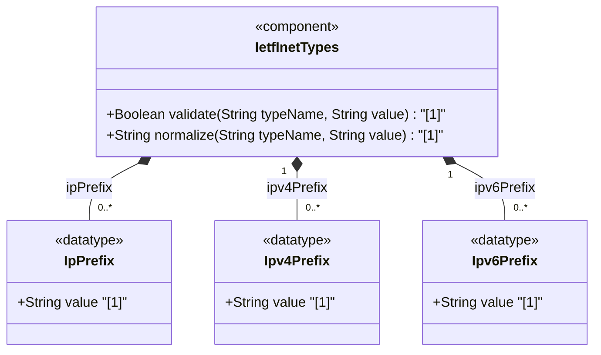

# Feature: [RFC6991-INET] IP Prefix Types

## Parent Epic
- [ ] #29 - [RFC6991-INET] Internet Protocol Suite Types (semantic linkage: this feature defines ip-prefix, ipv4-prefix, and ipv6-prefix typedefs declared in the ietf-inet-types module per RFC 6991 Section 4)

## Description
Defines types for representing Internet Protocol address prefixes (CIDR notation). The ip-prefix type is an IP-version-neutral union aggregating both IPv4 and IPv6 prefix forms. The ipv4-prefix type represents an IPv4 address followed by a slash and a prefix length (0-32), where the prefix length indicates the number of contiguous 1-bits from the MSB in the subnet mask. The ipv6-prefix type represents an IPv6 address followed by a slash and a prefix length (0-128). Canonical format for both sets all host bits to zero and uses RFC 5952 Section 4 formatting for IPv6 addresses.

## UML Class Diagram


## Interface Requirements

### 1. Payload Schema
```json
{
  "ip-prefix": "2001:db8::/32",
  "ipv4-prefix": "192.0.2.0/24",
  "ipv6-prefix": "2001:db8::/32"
}
```

### 2. Validation & Constraints

**ip-prefix:**
- Base type: union of inet:ipv4-prefix and inet:ipv6-prefix
- IP version neutral -- format of textual representation implies the IP version
- No zone indices supported (prefix types do not include zone identifier syntax)
- No SMIv2 equivalent

**ipv4-prefix:**
- Base type: string with regex pattern
- Format: IPv4 dotted-quad address followed by slash and prefix length
- Prefix length must be less than or equal to 32
- Valid prefix length range: 0 to 32
- Prefix length of n corresponds to a mask with n contiguous 1-bits from MSB
- Canonical format: all host bits set to zero (bits not part of the prefix)
- No SMIv2 equivalent

**ipv6-prefix:**
- Base type: string with two regex patterns
- Format: IPv6 address (full, mixed, shortened, shortened-mixed) followed by slash and prefix length
- Prefix length must be less than or equal to 128
- Valid prefix length range: 0 to 128
- Prefix length of n corresponds to a mask with n contiguous 1-bits from MSB
- IPv6 address should have all bits not belonging to the prefix set to zero
- Canonical format: all host bits set to zero, IPv6 address formatted per RFC 5952 Section 4
- References: RFC 5952

### 3. Logical Operations & Interface Messages
- **READ**: Retrieve IP prefix value
- **VALIDATE**: Validate prefix against type-specific pattern constraints (address format, prefix length range)
- **NORMALIZE**: Convert IP prefix to canonical format (zero host bits, RFC 5952 formatting for IPv6)
- **DECOMPOSE**: Extract address and prefix length components from the prefix string
- **COMPUTE_MASK**: Derive subnet mask from prefix length for routing table operations

### 4. Logical Exception States & Validation Failures
- **IPv4 prefix length out of range**: Prefix length > 32 triggers validation failure
- **IPv4 prefix length negative**: Negative prefix length triggers validation failure
- **IPv6 prefix length out of range**: Prefix length > 128 triggers validation failure
- **IPv6 prefix length negative**: Negative prefix length triggers validation failure
- **IPv4 prefix address malformed**: Non-dotted-quad address before slash triggers pattern match failure
- **IPv6 prefix address malformed**: Text not matching valid IPv6 notation before slash triggers validation failure
- **Missing slash separator**: No "/" character present triggers validation failure
- **Multiple slash separators**: More than one "/" character triggers validation failure

## Given-When-Then Acceptance Criteria

**Scenario: IPv4 prefix /24 passes validation**
- Given an IPv4 prefix "192.0.2.0/24"
- When the ipv4-prefix type validates the value
- Then validation passes

**Scenario: IPv4 prefix with maximum prefix length passes validation**
- Given an IPv4 prefix "192.0.2.0/32"
- When the ipv4-prefix type validates the value
- Then validation passes

**Scenario: IPv4 prefix length 33 is rejected**
- Given an IPv4 prefix "192.0.2.0/33"
- When the ipv4-prefix type validates the value
- Then validation fails because prefix length exceeds 32

**Scenario: IPv4 prefix length 0 passes validation**
- Given an IPv4 prefix "0.0.0.0/0"
- When the ipv4-prefix type validates the value
- Then validation passes (represents default route)

**Scenario: IPv6 prefix /32 passes validation**
- Given an IPv6 prefix "2001:db8::/32"
- When the ipv6-prefix type validates the value
- Then validation passes

**Scenario: IPv6 prefix with maximum prefix length passes validation**
- Given an IPv6 prefix "2001:db8::1/128"
- When the ipv6-prefix type validates the value
- Then validation passes

**Scenario: IPv6 prefix length 129 is rejected**
- Given an IPv6 prefix "2001:db8::/129"
- When the ipv6-prefix type validates the value
- Then validation fails because prefix length exceeds 128

**Scenario: IP-version-neutral ip-prefix resolves IPv4 correctly**
- Given an ip-prefix value "192.0.2.0/24"
- When the ip-prefix union type validates the value
- Then the ipv4-prefix member type is selected and validation passes

**Scenario: IP-version-neutral ip-prefix resolves IPv6 correctly**
- Given an ip-prefix value "2001:db8::/32"
- When the ip-prefix union type validates the value
- Then the ipv6-prefix member type is selected and validation passes

## Specification Context (Verbatim)

From RFC 6991, Section 4 (ietf-inet-types module):

> The ip-prefix type represents an IP prefix and is IP version neutral. The format of the textual representations implies the IP version.

> The ipv4-prefix type represents an IPv4 address prefix. The prefix length is given by the number following the slash character and must be less than or equal to 32. A prefix length value of n corresponds to an IP address mask that has n contiguous 1-bits from the most significant bit (MSB) and all other bits set to 0. The canonical format of an IPv4 prefix has all bits of the IPv4 address set to zero that are not part of the IPv4 prefix.

> The ipv6-prefix type represents an IPv6 address prefix. The prefix length is given by the number following the slash character and must be less than or equal to 128. A prefix length value of n corresponds to an IP address mask that has n contiguous 1-bits from the most significant bit (MSB) and all other bits set to 0. The IPv6 address should have all bits that do not belong to the prefix set to zero. The canonical format of an IPv6 prefix has all bits of the IPv6 address set to zero that are not part of the IPv6 prefix. Furthermore, the IPv6 address is represented as defined in Section 4 of RFC 5952.

## Source References
Structural Schema: [ietf-inet-types@2013-07-15.yang](https://raw.githubusercontent.com/gintatkinson/3dgs-039/main/schema/ietf-inet-types%402013-07-15.yang) (Collection: types related to IP prefixes)
Normative Specification: [RFC 6991](https://datatracker.ietf.org/doc/rfc6991/) (Section 4: Internet Protocol Suite Types, Table 2)

## Logical UI & Interface Bindings
- **Target LUI Component:** Deferred to Feature #X Task Y
- **Target Layout Container ID:** Deferred to Feature #X Task Y
- **Data Source Bindings:** Deferred to Feature #X Task Y
