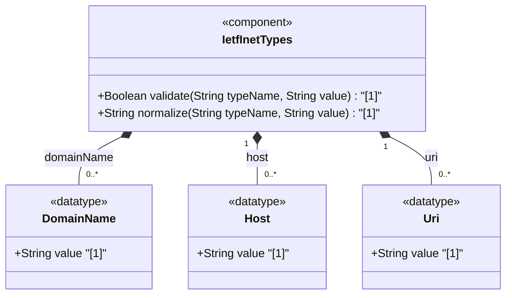

# Feature: [RFC6991-INET] Domain, Host, and URI Types

## Parent Epic
- [ ] #29 - [RFC6991-INET] Internet Protocol Suite Types (semantic linkage: this feature defines domain-name, host, and uri typedefs declared in the ietf-inet-types module per RFC 6991 Section 4)

## Description
Defines types for Internet naming and resource identification. The domain-name type represents fully qualified DNS domain names with dot-separated labels, constrained to 1-253 characters in total length. The host type is a union of ip-address and domain-name, allowing either an IP address or a DNS domain name as a host identifier. The uri type represents a Uniform Resource Identifier per RFC 3986 (STD 66), with US-ASCII encoding and normalization requirements. All three types reference IANA and IETF standards for canonical form and validation.

## UML Class Diagram


## Interface Requirements

### 1. Payload Schema
```json
{
  "domain-name": "example.com",
  "host": "192.0.2.1",
  "uri": "https://example.com/resource"
}
```

### 2. Validation & Constraints

**domain-name:**
- Base type: string with regex pattern and length constraint
- Pattern: dot-separated labels, each 1-63 characters, allowing alphanumeric, hyphen, and underscore characters
- Length: 1 to 253 characters (DNS encoding limited to 255 bytes minus length-byte and trailing NULL)
- Canonical format uses lowercase US-ASCII characters
- Internationalized domain names MUST be A-labels per RFC 5890 (IDNA)
- The name SHOULD be fully qualified whenever possible
- Designed to hold various types of domain names including A/AAAA records (host names) and SRV records
- Internet host names have stricter syntax (RFC 952) than the general domain-name pattern
- Schema nodes using domain-name MUST describe when and how names are resolved to IP addresses
- Resolution may require querying multiple DNS records (A for IPv4, AAAA for IPv6); precedence may be defined explicitly or depend on resolver configuration
- References: RFC 952, RFC 1034, RFC 1123, RFC 2782, RFC 5890

**host:**
- Base type: union of inet:ip-address and inet:domain-name
- Represents either an IP address or a DNS domain name
- Validation succeeds if the value parses as either member type
- IP address resolution via ip-address union (ipv4-address or ipv6-address)
- DNS domain name resolution via domain-name pattern validation
- No SMIv2 equivalent

**uri:**
- Base type: string (no additional pattern constraint at type level)
- Represents a Uniform Resource Identifier (URI) per RFC 3986 (STD 66)
- MUST use US-ASCII encoding
- MUST be normalized per RFC 3986 Sections 6.2.1, 6.2.2.1, and 6.2.2.2:
  - All unnecessary percent-encoding removed
  - Case-insensitive characters set to lowercase
  - Hexadecimal digits normalized to uppercase (Section 6.2.2.1)
- Zero-length URI is not valid; may be used to express "URI absent"
- Schema nodes using uri may restrict permitted schemes (e.g., exclude "data:" or "urn:")
- Semantically equivalent to SMIv2 Uri (URI-TC-MIB) per RFC 5017
- References: RFC 3986, RFC 3305, RFC 5017

### 3. Logical Operations & Interface Messages
- **READ**: Retrieve domain name, host, or URI value
- **VALIDATE**: Validate domain name against length and pattern constraints; validate URI encoding and scheme
- **NORMALIZE**: Convert to canonical form (lowercase US-ASCII for domain names; RFC 3986 normalization for URIs)
- **RESOLVE**: Resolve domain name to IP addresses via DNS (A/AAAA records)
- **DECOMPOSE**: Extract host type (IP address vs domain name) from host union value

### 4. Logical Exception States & Validation Failures
- **Domain name length zero**: Empty string violates minimum length 1 constraint
- **Domain name length exceeds 253**: String longer than 253 characters triggers validation failure
- **Domain name label exceeds 63 characters**: Individual label longer than 63 characters triggers pattern match failure
- **Domain name label starts or ends with hyphen**: RFC 952 host name constraint violation (if schema node enforces stricter host name rules)
- **Domain name contains invalid characters**: Characters outside alphanumeric, hyphen, underscore, and dot trigger pattern match failure
- **Internationalized domain name not A-label**: Non-ASCII domain name not encoded as A-label per RFC 5890 triggers validation failure
- **Host union resolution failure**: Value matches neither IP address nor domain name, triggering union validation failure
- **URI encoding error**: Non-US-ASCII characters in URI trigger encoding validation failure
- **URI scheme restricted**: URI scheme (e.g., "data:") not permitted by schema node restriction triggers validation failure
- **URI zero-length**: Zero-length string represents "URI absent" and should be handled as null/absent case rather than a validation failure

## Given-When-Then Acceptance Criteria

**Scenario: Fully qualified domain name passes validation**
- Given a domain name "www.example.com"
- When the domain-name type validates the value
- Then validation passes

**Scenario: Domain name with hyphen passes validation**
- Given a domain name "my-host.example.com"
- When the domain-name type validates the value
- Then validation passes

**Scenario: Domain name exceeding 253 characters is rejected**
- Given a domain name consisting of 254 characters
- When the domain-name type validates the value
- Then validation fails with length constraint violation

**Scenario: Empty domain name is rejected**
- Given an empty string as a domain name
- When the domain-name type validates the value
- Then validation fails with length constraint violation (minimum 1)

**Scenario: Single-label domain name passes validation**
- Given a domain name "localhost"
- When the domain-name type validates the value
- Then validation passes

**Scenario: Root domain represented by dot passes validation**
- Given a domain name "." (representing the DNS root)
- When the domain-name type validates the value
- Then validation passes

**Scenario: Host resolves as IP address**
- Given a host value "192.0.2.1"
- When the host union type validates the value
- Then the ip-address member type is selected via ipv4-address and validation passes

**Scenario: Host resolves as domain name**
- Given a host value "example.com"
- When the host union type validates the value
- Then the domain-name member type is selected and validation passes

**Scenario: URI with scheme and path passes validation**
- Given a URI "https://example.com/path?query=value"
- When the uri type validates the value
- Then validation passes

**Scenario: RFC 3986 normalized URI passes validation**
- Given a URI "HTTPS://EXAMPLE.COM/Path" with mixed case
- When the uri type normalizes and validates the value
- Then the scheme and host are lowercased and validation passes

**Scenario: URI with percent-encoding passes validation**
- Given a URI "https://example.com/path%20with%20spaces"
- When the uri type validates the value
- Then validation passes (percent-encoding is valid per RFC 3986)

## Specification Context (Verbatim)

From RFC 6991, Section 4 (ietf-inet-types module):

> The domain-name type represents a DNS domain name. The name SHOULD be fully qualified whenever possible. Internet domain names are only loosely specified. Section 3.5 of RFC 1034 recommends a syntax (modified in Section 2.1 of RFC 1123). The pattern above is intended to allow for current practice in domain name use, and some possible future expansion. It is designed to hold various types of domain names, including names used for A or AAAA records (host names) and other records, such as SRV records. Note that Internet host names have a stricter syntax (described in RFC 952) than the DNS recommendations in RFCs 1034 and 1123, and that systems that want to store host names in schema nodes using the domain-name type are recommended to adhere to this stricter standard to ensure interoperability.

> The encoding of DNS names in the DNS protocol is limited to 255 characters. Since the encoding consists of labels prefixed by a length bytes and there is a trailing NULL byte, only 253 characters can appear in the textual dotted notation.

> The description clause of schema nodes using the domain-name type MUST describe when and how these names are resolved to IP addresses. Note that the resolution of a domain-name value may require to query multiple DNS records (e.g., A for IPv4 and AAAA for IPv6). The order of the resolution process and which DNS record takes precedence can either be defined explicitly or may depend on the configuration of the resolver.

> Domain-name values use the US-ASCII encoding. Their canonical format uses lowercase US-ASCII characters. Internationalized domain names MUST be A-labels as per RFC 5890.

> The host type represents either an IP address or a DNS domain name.

> The uri type represents a Uniform Resource Identifier (URI) as defined by STD 66. Objects using the uri type MUST be in US-ASCII encoding, and MUST be normalized as described by RFC 3986 Sections 6.2.1, 6.2.2.1, and 6.2.2.2. All unnecessary percent-encoding is removed, and all case-insensitive characters are set to lowercase except for hexadecimal digits, which are normalized to uppercase as described in Section 6.2.2.1. The purpose of this normalization is to help provide unique URIs. Note that this normalization is not sufficient to provide uniqueness. Two URIs that are textually distinct after this normalization may still be equivalent. Objects using the uri type may restrict the schemes that they permit. A zero-length URI is not a valid URI. This can be used to express 'URI absent' where required. In the value set and its semantics, this type is equivalent to the Uri SMIv2 textual convention defined in RFC 5017.

## Source References
Structural Schema: [ietf-inet-types@2013-07-15.yang](https://raw.githubusercontent.com/gintatkinson/3dgs-039/main/schema/ietf-inet-types%402013-07-15.yang) (Collection: domain name and URI types)
Normative Specification: [RFC 6991](https://datatracker.ietf.org/doc/rfc6991/) (Section 4: Internet Protocol Suite Types, Table 2)

## Logical UI & Interface Bindings
- **Target LUI Component:** Deferred to Feature #X Task Y
- **Target Layout Container ID:** Deferred to Feature #X Task Y
- **Data Source Bindings:** Deferred to Feature #X Task Y
