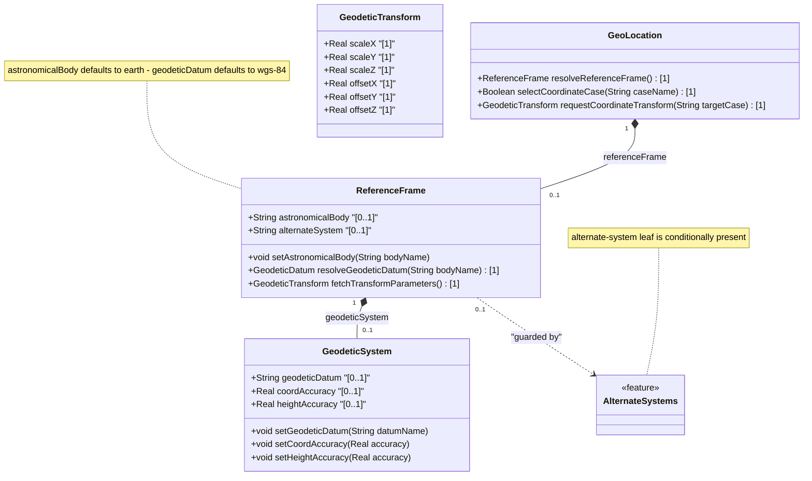

# Feature: [RFC9179-GEO] Reference Frame Definition

## Parent Epic
- [ ] #42 - [RFC9179-GEO] A YANG Grouping for Geographic Locations (semantic linkage: this feature defines the reference-frame container with astronomical-body, alternate-system (conditional), and nested geodetic-system sub-container per RFC 9179 Section 2.1)

## Description
Defines the frame of reference for geo-location coordinate values. The reference-frame specifies the astronomical body (default "earth"), an optional alternate system for non-natural-universe coordinates (guarded by the `alternate-systems` feature flag), and a nested geodetic-system container holding the geodetic datum and coordinate/height accuracy values. The reference-frame provides the semantic context that gives meaning to latitude, longitude, height, or Cartesian coordinate values in downstream location data.

## UML Class Diagram


## Interface Requirements

### 1. Test Data Shape
```json
{
  "reference-frame": {
    "astronomical-body": "earth",
    "alternate-system": null,
    "geodetic-system": {
      "geodetic-datum": "wgs-84",
      "coord-accuracy": 0.000001,
      "height-accuracy": 0.001
    }
  }
}
```

### 2. Validation & Constraints

**astronomical-body:**
- Base type: string with regex pattern `[ -@\[-\^_-~]*`
- Default value: "earth"
- Character constraints: ASCII printable values 32-64 and 91-126 only (no control characters)
- Uppercase values SHOULD be converted to lowercase
- Preceding "the" in the name SHOULD NOT be included
- Valid examples: "earth", "moon", "mars", "enceladus", "ceres", "67p/churyumov-gerasimenko"
- Reference: International Astronomical Union (IAU) naming conventions (https://www.iau.org/)

**alternate-system:**
- Base type: string (no additional pattern constraint)
- Conditional presence: guarded by the `alternate-systems` feature flag (`if-feature "alternate-systems"`)
- When not present, the natural universe is the default system
- When present, modifies the definition (but not the type) of other reference-frame values
- Intended for virtual realities or alternate coordinate systems
- No default value (optional leaf)

**geodetic-datum:**
- Base type: string with regex pattern `[ -@\[-\^_-~]*`
- Character constraints: ASCII printable values 32-64 and 91-126 only (no control characters)
- Default (when astronomical-body is "earth"): "wgs-84" (World Geodetic System 1984)
- Uppercase values SHOULD be converted to lowercase
- IANA registry further restricts values by converting spaces to dashes
- Defines meaning of latitude, longitude, height coordinates and height reference zero
- Indicates how accurately the system models the astronomical body
- IANA registry reference: Geodetic System Values Registry per RFC 9179 Section 6.1
- Initial registry values: "wgs-84", "wgs-84-96", "wgs-84-08", "me" (Mean Earth/Polar Axis for Moon)

**coord-accuracy:**
- Base type: decimal64 with 6 fraction-digits
- Specifies accuracy of latitude/longitude pair (ellipsoidal) or X/Y/Z components (Cartesian)
- Indicates how precisely coordinates have been determined with respect to the geodetic-datum
- Accounts for measurement uncertainty (e.g., experimental measurement error)
- When specified, overrides default accuracy implied by geodetic-datum
- No default value (optional leaf)
- No unit attribute on the YANG leaf (unitless precision value, context-dependent)

**height-accuracy:**
- Base type: decimal64 with 6 fraction-digits
- Units: meters
- Specifies accuracy of height value for ellipsoidal coordinates only
- NOT used with Cartesian coordinates
- When specified, overrides default height accuracy implied by geodetic-datum
- Indicates how precisely heights have been determined
- No default value (optional leaf)

### 3. Visual Layout & Arrangement
- The reference-frame container SHALL render within a PropertyGrid (container ID: properties_view) in a collapsible section labeled "Reference Frame"
- astronomical-body SHALL render as a StringInputField with a dropdown of known IAU body names (earth, moon, mars, enceladus, ceres) with support for free-text entry
- alternate-system SHALL render as a conditionally visible StringInputField, shown only when the application supports the alternate-systems feature
- geodetic-system SHALL render as a nested PropertyGrid subsection labeled "Geodetic System" within the reference-frame section
- geodetic-datum SHALL render as a StringInputField with IANA registry autocomplete suggestions
- coord-accuracy and height-accuracy SHALL render as DecimalInputField components with 6 decimal places and unit labels ("meters" for height-accuracy)
- Layout containment MUST be restricted to outer layout splitters; scrollable child panels MUST NOT use css-contain
- CSS box-sizing MUST be border-box across all layout elements
- Scoped naming MUST use CSS Modules or BEM methodology to prevent specificity conflicts

### 4. Interactive Flow & States
- **EMPTY State**: When no reference-frame data exists, all fields display placeholder values (astronomical-body defaults to "earth", geodetic-datum defaults to "wgs-84")
- **READ-ONLY State**: All fields display values as non-editable text with muted styling
- **EDIT State**: Fields become editable with validation on blur; astronomical-body free-text entry with IAU autocomplete; geodetic-datum free-text entry with IANA registry autocomplete
- **LOADING State**: Show skeleton placeholder indicators while data is being fetched
- **ERROR State**: Highlight fields with invalid values (e.g., astronomical-body containing control characters, geodetic-datum with illegal characters); display inline error messages
- **ALTERNATE-SYSTEM DISABLED**: When the alternate-systems feature is not supported, the alternate-system field MUST be hidden entirely (not merely disabled)
- Computed-style assertions in tests MUST verify: highlight colors on error fields, visibility property on alternate-system field, and input border styles on validation failure

## Given-When-Then Acceptance Criteria

### Pattern C (Decoupled Operator Console)

**AC-1: Default Reference Frame**
- Given a geo-location has been created without specifying a reference-frame
- When the reference-frame data is displayed
- Then the astronomical-body SHALL default to "earth" and the geodetic-datum SHALL default to "wgs-84"

**AC-2: Custom Astronomical Body**
- Given an operator has selected a reference-frame for a geo-location
- When the operator sets astronomical-body to "mars"
- Then the system SHALL store the value "mars" and display it in the reference-frame section

**AC-3: Alternate System Conditional Visibility**
- Given the application does NOT support the alternate-systems feature
- When the reference-frame section is rendered
- Then the alternate-system field MUST NOT be visible or present in the DOM

**AC-4: Alternate System Activation**
- Given the application supports the alternate-systems feature
- When the operator enters an alternate-system value of "simulation-vr-1"
- Then the system SHALL store the value and display it; all other reference-frame values retain their types but their definitions are modified according to the alternate system

**AC-5: Geodetic Datum Validation**
- Given an operator enters a geodetic-datum value containing control characters (values outside 32-64 and 91-126)
- When the input is validated
- Then the system SHALL reject the value and display an error indicating invalid character range

**AC-6: Coordinate Accuracy Specification**
- Given an operator specifies a coord-accuracy of 0.000001 (6 decimal digits)
- When the value is validated and saved
- Then the system SHALL store the value with full 6-digit decimal precision and display it in the geodetic-system subsection

**AC-7: Height Accuracy Not Applied to Cartesian**
- Given a geo-location uses the Cartesian coordinate case
- When the reference-frame display is computed
- Then the height-accuracy field SHALL be accompanied by a note indicating it applies only to ellipsoidal coordinates

**AC-8: Empty Reference Frame Allowed**
- Given no reference-frame sub-elements have been specified
- When the geo-location is validated
- Then the system SHALL accept the empty reference-frame container as valid (all leaves are optional)

## Specification Context (Verbatim)

From RFC 9179 Section 2.1:

"The frame of reference ('reference-frame') defines what the location values refer to and their meaning. The referred-to object can be any astronomical body. It could be a planet such as Earth or Mars, a moon such as Enceladus, an asteroid such as Ceres, or even a comet such as 1P/Halley. This value is specified in 'astronomical-body' and is defined by the International Astronomical Union. The default 'astronomical-body' value is 'earth'."

"In addition to identifying the astronomical body, we also need to define the meaning of the coordinates (e.g., latitude and longitude) and the definition of 0-height. This is done with a 'geodetic-datum' value. The default value for 'geodetic-datum' is 'wgs-84' (i.e., the World Geodetic System), which is used by the Global Positioning System (GPS) among many others. We define an IANA registry for specifying standard values for the 'geodetic-datum'."

"In addition to the 'geodetic-datum' value, we allow overriding the coordinate and height accuracy using 'coord-accuracy' and 'height-accuracy', respectively. When specified, these values override the defaults implied by the 'geodetic-datum' value."

"Finally, we define an optional feature that allows for changing the system for which the above values are defined. This optional feature adds an 'alternate-system' value to the reference frame. This value is normally not present, which implies the natural universe is the system. The use of this value is intended to allow for creating virtual realities or perhaps alternate coordinate systems. The definition of alternate systems is outside the scope of this document."

## Source References
Structural Schema: ietf-geo-location@2022-02-11.yang (schema/ietf-geo-location@2022-02-11.yang) (Clause: reference-frame container, astronomical-body leaf, alternate-system leaf, geodetic-system container)
Normative Specification: [RFC 9179: A YANG Grouping for Geographic Locations](https://datatracker.ietf.org/doc/rfc9179/) (Clause: Section 2.1, Frame of Reference)

## Logical UI & Interface Bindings
- **Target LUI Component:** PropertyGrid
- **Target Layout Container ID:** properties_view
- **Data Source Bindings:** Deferred to Feature #Feat-14 Task 2
