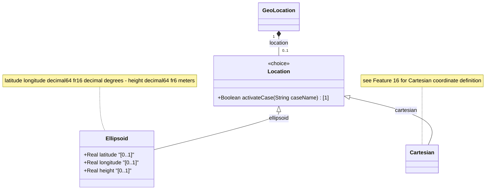

# Feature: [RFC9179-GEO] Ellipsoid Coordinate Location

## Parent Epic
- [ ] #42 - [RFC9179-GEO] A YANG Grouping for Geographic Locations (semantic linkage: this feature defines the ellipsoid case of the location choice with latitude, longitude, and height leaves per RFC 9179 Section 2.2)

## Description
Defines the ellipsoidal (latitude/longitude/height) coordinate case within the geo-location choice. Latitude and longitude are specified in decimal degrees with 16 fraction-digit precision. Height is specified in meters with 6 fraction-digit precision, measured from a reference zero defined by the reference-frame. This case represents the standard geographic coordinate system used by GPS and WGS-84. The semantics of all coordinate values are defined by the parent reference-frame's geodetic-datum.

## UML Class Diagram


## Interface Requirements

### 1. Test Data Shape
```json
{
  "location": {
    "ellipsoid": {
      "latitude": 40.7127753000000000,
      "longitude": -74.0059728000000000,
      "height": 10.000000
    }
  }
}
```

### 2. Validation & Constraints

**latitude:**
- Base type: decimal64 with 16 fraction-digits
- Units: decimal degrees
- Standard range: -90.0 to 90.0 decimal degrees (enforced by geodetic reference system, not by a YANG range constraint)
- No YANG `range` substatement — the reference-frame defines precision and validity bounds
- The definition and precision of this measurement is indicated by the reference-frame
- No explicit default value (optional leaf)

**longitude:**
- Base type: decimal64 with 16 fraction-digits
- Units: decimal degrees
- Standard range: -180.0 to 180.0 decimal degrees (enforced by geodetic reference system)
- No YANG `range` substatement — the reference-frame defines precision and validity bounds
- The definition and precision of this measurement is indicated by the reference-frame
- No explicit default value (optional leaf)

**height:**
- Base type: decimal64 with 6 fraction-digits
- Units: meters
- Height measured from a reference zero value defined by the reference-frame
- The precision and zero value are defined by the reference-frame
- No YANG `range` substatement — bounds are context-dependent
- No explicit default value (optional leaf)

**Choice Constraint:**
- The ellipsoid case is mutually exclusive with the cartesian case within the location choice
- Only one case (ellipsoid OR cartesian) may be present at a time
- All three leaves within the ellipsoid case are independent and optional

### 3. Visual Layout & Arrangement
- The ellipsoid case SHALL render within a PropertyGrid (container ID: properties_view) in a section labeled "Location (Ellipsoidal)"
- The location choice SHALL be presented as a segmented control or radio group: "Ellipsoidal" | "Cartesian" with ellipsoidal selected
- latitude and longitude SHALL render as paired DecimalInputField components in a horizontal row layout with "decimal degrees" unit labels
- height SHALL render as a DecimalInputField with "meters" unit label, visually grouped below the latitude/longitude pair
- A coordinate preview or readout SHALL display the formatted degree values with up to 16 decimal places
- Layout containment MUST be restricted to outer layout splitters; scrollable child panels MUST NOT use css-contain
- CSS box-sizing MUST be border-box; scoped naming MUST use CSS Modules or BEM

### 4. Interactive Flow & States
- **EMPTY State**: All coordinate fields display empty with placeholder text ("e.g., 40.7128")
- **READ-ONLY State**: Coordinates display as formatted decimal-degree values with full precision truncated for display (showing 6 significant decimal places by default, expandable to 16)
- **EDIT State**: Fields become editable numeric inputs with per-field validation on blur
- **CHOICE TOGGLE State**: When operator switches from Cartesian to Ellipsoidal via the segmented control, any Cartesian values are hidden and ellipsoid fields are shown
- **LOADING State**: Skeleton placeholder inputs while coordinate data is being fetched
- **ERROR State**: Highlight fields with implausible values (latitude outside -90..90, longitude outside -180..180); note: these bounds are informational, not schema-enforced — the geodetic datum defines validity
- Computed-style assertions in tests MUST verify: coordinate formatting, error highlight colors, and visibility toggle when switching between ellipsoidal and Cartesian cases

## Given-When-Then Acceptance Criteria

### Pattern C (Decoupled Operator Console)

**AC-1: Standard Latitude/Longitude Entry**
- Given an operator has selected the ellipsoid location case
- When the operator enters latitude 40.7127753 and longitude -74.0059728
- Then the system SHALL store both values with full 16-digit decimal precision and display them in the location section

**AC-2: Height Entry with Reference-Frame Dependency**
- Given an operator has defined a reference-frame with geodetic-datum "wgs-84"
- When the operator enters a height of 10.5 meters
- Then the system SHALL store the height as 10.500000 (6 fraction-digits) and display it with the "meters" unit label

**AC-3: Ellipsoid and Cartesian Mutual Exclusivity**
- Given a geo-location has existing ellipsoid coordinate values (latitude, longitude, height)
- When the operator switches to the Cartesian case
- Then the Cartesian fields SHALL be displayed and the ellipsoid fields SHALL be hidden; the stored ellipsoid values remain intact but only one case is active

**AC-4: Implausible Latitude Rejection Warning**
- Given an operator enters a latitude of 95.0 decimal degrees
- When the field loses focus (on blur validation)
- Then the system SHALL display a warning indicating the value is outside the standard -90..90 range for Earth-based geodetic datums (informational, not a hard schema rejection)

**AC-5: Implausible Longitude Warning**
- Given an operator enters a longitude of 200.0 decimal degrees
- When the field loses focus
- Then the system SHALL display a warning indicating the value is outside the standard -180..180 range

**AC-6: Empty Coordinate Set Valid**
- Given no ellipsoid leaves have been specified (latitude, longitude, height all absent)
- When the geo-location is validated
- Then the system SHALL accept the empty ellipsoid case as valid (all leaves are optional)

## Specification Context (Verbatim)

From RFC 9179 Section 2.2:

"This is the location on, or relative to, the astronomical object. It is specified using two or three coordinate values. These values are given either as 'latitude', 'longitude', and an optional 'height', or as Cartesian coordinates of 'x', 'y', and 'z'. For the standard location choice, 'latitude' and 'longitude' are specified as decimal degrees, and the 'height' value is in fractions of meters."

"the exact meanings of all the values are defined by the 'geodetic-datum' value in Section 2.1."

From RFC 9179 Section 4 (ISO 6709:2008 Conformance):

"For test 'A.1.2.4', representation of horizontal position: latitude/longitude values conform. For test 'A.1.2.5', representation of vertical position: height value conforms."

## Source References
Structural Schema: ietf-geo-location@2022-02-11.yang (schema/ietf-geo-location@2022-02-11.yang) (Clause: choice location, case ellipsoid, latitude/longitude/height leaves)
Normative Specification: [RFC 9179: A YANG Grouping for Geographic Locations](https://datatracker.ietf.org/doc/rfc9179/) (Clause: Section 2.2, Location)

## Logical UI & Interface Bindings
- **Target LUI Component:** PropertyGrid
- **Target Layout Container ID:** properties_view
- **Data Source Bindings:** Deferred to Feature #Feat-15 Task 2
