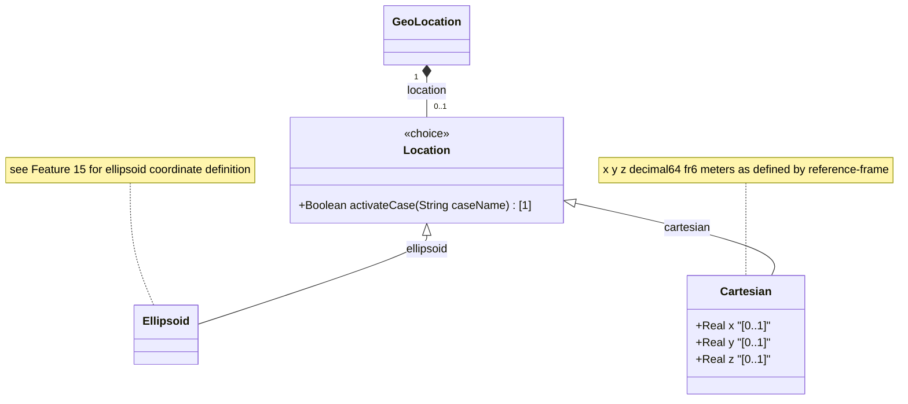

# Feature: [RFC9179-GEO] Cartesian Coordinate Location

## Parent Epic
- [ ] #42 - [RFC9179-GEO] A YANG Grouping for Geographic Locations (semantic linkage: this feature defines the cartesian case of the location choice with x, y, and z coordinate leaves per RFC 9179 Section 2.2)

## Description
Defines the Cartesian coordinate case within the geo-location choice. X, Y, and Z values are specified in meters with 6 fraction-digit precision, relative to a coordinate origin defined by the parent reference-frame's geodetic datum. This case provides an alternative to ellipsoidal coordinates for reference frames that use a Cartesian coordinate system. The semantics of all coordinate values are defined by the reference-frame.

## UML Class Diagram


## Interface Requirements

### 1. Test Data Shape
```json
{
  "location": {
    "cartesian": {
      "x": 1330585.123456,
      "y": -4652198.654321,
      "z": 4136871.000000
    }
  }
}
```

### 2. Validation & Constraints

**x:**
- Base type: decimal64 with 6 fraction-digits
- Units: meters
- Defined relative to the reference-frame coordinate origin
- No YANG `range` substatement — valid range is defined by the geodetic datum
- No explicit default value (optional leaf)

**y:**
- Base type: decimal64 with 6 fraction-digits
- Units: meters
- Defined relative to the reference-frame coordinate origin
- No YANG `range` substatement — valid range is defined by the geodetic datum
- No explicit default value (optional leaf)

**z:**
- Base type: decimal64 with 6 fraction-digits
- Units: meters
- Defined relative to the reference-frame coordinate origin
- No YANG `range` substatement — valid range is defined by the geodetic datum
- No explicit default value (optional leaf)

**Choice Constraint:**
- The cartesian case is mutually exclusive with the ellipsoid case within the location choice
- Only one case (ellipsoid OR cartesian) may be present at a time
- All three leaves within the cartesian case are independent and optional

**Accuracy Note:**
- The coord-accuracy leaf in reference-frame/geodetic-system applies to Cartesian X, Y, Z components
- The height-accuracy leaf in reference-frame/geodetic-system is NOT used with Cartesian coordinates (per RFC 9179)

### 3. Visual Layout & Arrangement
- The cartesian case SHALL render within a PropertyGrid (container ID: properties_view) in a section labeled "Location (Cartesian)"
- The location choice SHALL be presented as a segmented control or radio group: "Ellipsoidal" | "Cartesian" with Cartesian selected
- x, y, z SHALL render as three DecimalInputField components arranged in a vertical stack with "meters" unit labels and axis identifiers (X, Y, Z)
- A 3D axis orientation diagram (platform-independent abstract representation) SHALL accompany the coordinate fields to indicate axis directions as defined by the reference-frame
- Layout containment MUST be restricted to outer layout splitters; scrollable child panels MUST NOT use css-contain
- CSS box-sizing MUST be border-box; scoped naming MUST use CSS Modules or BEM

### 4. Interactive Flow & States
- **EMPTY State**: All coordinate fields display empty with placeholder text ("e.g., 1330585.123456")
- **READ-ONLY State**: Coordinates display as formatted decimal values with 6 decimal places and "m" unit suffix
- **EDIT State**: Fields become editable numeric inputs with per-field validation on blur
- **CHOICE TOGGLE State**: When operator switches from Ellipsoidal to Cartesian via the segmented control, any ellipsoid values are hidden and Cartesian fields are shown
- **LOADING State**: Skeleton placeholder inputs while coordinate data is being fetched
- **ERROR State**: Highlight fields with non-numeric or malformed input values
- Computed-style assertions in tests MUST verify: coordinate formatting with full 6-digit precision, error highlight colors on invalid input, and visibility toggle when switching between coordinate cases

## Given-When-Then Acceptance Criteria

### Pattern C (Decoupled Operator Console)

**AC-1: Cartesian Coordinate Entry**
- Given an operator has selected the Cartesian location case
- When the operator enters x=1330585.123456, y=-4652198.654321, z=4136871.000000
- Then the system SHALL store all three values with full 6-digit decimal precision and display them in the location section with "meters" unit labels

**AC-2: Cartesian and Ellipsoid Mutual Exclusivity**
- Given a geo-location has existing Cartesian coordinate values (x, y, z)
- When the operator switches to the Ellipsoid case
- Then the ellipsoid fields SHALL be displayed and the Cartesian fields SHALL be hidden; the stored Cartesian values remain intact but only one case is active

**AC-3: Height Accuracy Not Relevant for Cartesian**
- Given a geo-location uses the Cartesian coordinate case
- When the reference-frame geodetic-system displays height-accuracy
- Then the display SHALL indicate that height-accuracy does not apply to Cartesian coordinates (per RFC 9179 specification)

**AC-4: Coordinate Accuracy Applies to Cartesian**
- Given a reference-frame specifies coord-accuracy of 0.001 meters
- When Cartesian coordinates are entered
- Then the display SHALL show the coord-accuracy value as applicable to X, Y, and Z components

**AC-5: Empty Cartesian Set Valid**
- Given no Cartesian leaves have been specified (x, y, z all absent)
- When the geo-location is validated
- Then the system SHALL accept the empty Cartesian case as valid (all leaves are optional)

**AC-6: Negative Coordinate Values**
- Given an operator enters a negative Z value of -500.000000 meters
- When the value is validated
- Then the system SHALL accept the negative value and store it correctly (no YANG range restriction on Cartesian coordinates)

## Specification Context (Verbatim)

From RFC 9179 Section 2.2:

"This is the location on, or relative to, the astronomical object. It is specified using two or three coordinate values. These values are given either as 'latitude', 'longitude', and an optional 'height', or as Cartesian coordinates of 'x', 'y', and 'z'. For the Cartesian choice, 'x', 'y', and 'z' are in fractions of meters. In both choices, the exact meanings of all the values are defined by the 'geodetic-datum' value in Section 2.1."

From the YANG module description for the cartesian case:

"The X value as defined by the reference-frame. The Y value as defined by the reference-frame. The Z value as defined by the reference-frame."

## Source References
Structural Schema: ietf-geo-location@2022-02-11.yang (schema/ietf-geo-location@2022-02-11.yang) (Clause: choice location, case cartesian, x/y/z leaves)
Normative Specification: [RFC 9179: A YANG Grouping for Geographic Locations](https://datatracker.ietf.org/doc/rfc9179/) (Clause: Section 2.2, Location)

## Logical UI & Interface Bindings
- **Target LUI Component:** PropertyGrid
- **Target Layout Container ID:** properties_view
- **Data Source Bindings:** Deferred to Feature #Feat-16 Task 2
