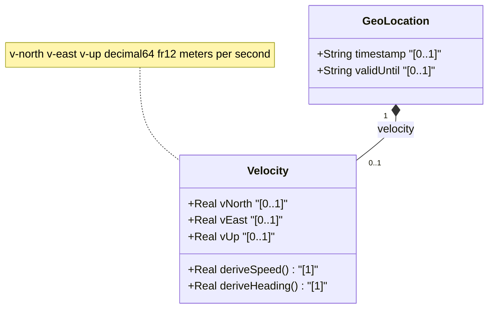

# Feature: [RFC9179-GEO] Velocity Vector

## Parent Epic
- [ ] #42 - [RFC9179-GEO] A YANG Grouping for Geographic Locations (semantic linkage: this feature defines the velocity container with v-north, v-east, and v-up speed components per RFC 9179 Section 2.3)

## Description
Defines the velocity vector for an object in relatively stable motion at the time given by the geo-location timestamp. The vector consists of three orthogonal components: v-north (speed toward true north), v-east (speed perpendicular to the right of true north), and v-up (speed away from center of mass). All components use decimal64 with 12 fraction-digits in meters per second. The heading and speed can be derived from v-north and v-east using standard trigonometric formulas defined in RFC 9179.

## UML Class Diagram


## Interface Requirements

### 1. Test Data Shape
```json
{
  "velocity": {
    "v-north": 15.300000000000,
    "v-east": -2.500000000000,
    "v-up": 0.100000000000
  }
}
```

### 2. Validation & Constraints

**v-north:**
- Base type: decimal64 with 12 fraction-digits
- Units: meters per second
- Rate of change (speed) towards true north as defined by the geodetic-system
- No YANG `range` substatement
- No explicit default value (optional leaf)

**v-east:**
- Base type: decimal64 with 12 fraction-digits
- Units: meters per second
- Rate of change (speed) perpendicular to the right of true north as defined by the geodetic-system
- No YANG `range` substatement
- No explicit default value (optional leaf)

**v-up:**
- Base type: decimal64 with 12 fraction-digits
- Units: meters per second
- Rate of change (speed) away from the center of mass
- No YANG `range` substatement
- No explicit default value (optional leaf)

**Derived Values (not stored, computed from vector):**
- Speed = sqrt(v-north^2 + v-east^2) meters per second
- Heading = arctan(v-east / v-north) decimal degrees clockwise from true north
- These are derived at display time; they are NOT schema leaves

**Usage Context:**
- The velocity vector describes motion at the time given by the geo-location timestamp
- For objects in relatively stable motion only
- Can track very slow movement such as continental drift for high-accuracy applications with infrequent updates
- Tracking complex motion patterns is outside the scope of RFC 9179

### 3. Visual Layout & Arrangement
- The velocity container SHALL render within a PropertyGrid (container ID: properties_view) in a collapsible section labeled "Velocity"
- v-north, v-east, v-up SHALL render as three DecimalInputField components in a column layout with "m/s" unit labels and directional indicators (North arrow, East arrow, Up arrow icons)
- A derived speed and heading readout SHALL be displayed below the input fields as computed read-only values, recalculated when any component changes
- A directional compass rose or vector arrow diagram (platform-independent abstract representation) SHALL accompany the velocity fields showing the resultant horizontal vector direction
- Layout containment MUST be restricted to outer layout splitters; scrollable child panels MUST NOT use css-contain
- CSS box-sizing MUST be border-box; scoped naming MUST use CSS Modules or BEM

### 4. Interactive Flow & States
- **EMPTY State**: All velocity fields display empty with placeholder text ("e.g., 15.3"); derived speed and heading display as "--"
- **READ-ONLY State**: Velocity components display as formatted decimal values with 12-digit precision (truncated to 3 significant decimals for display); derived speed and heading update in real-time based on stored values
- **EDIT State**: Fields become editable numeric inputs with per-field validation on blur; derived speed and heading update reactively as values are entered
- **LOADING State**: Skeleton placeholder inputs while velocity data is being fetched
- **ERROR State**: Highlight fields with non-numeric or malformed input; note that negative values are valid for v-east and v-up
- **DERIVED CALCULATION State**: When v-north is 0 and v-east is non-zero, heading SHALL display 90 or -90 degrees (handling the arctan division-by-zero edge case); when both v-north and v-east are 0, heading SHALL display as "undefined"
- Computed-style assertions in tests MUST verify: derived speed/heading recalculation on input change, error highlight colors, and handling of the zero-division edge case in heading computation

## Given-When-Then Acceptance Criteria

### Pattern C (Decoupled Operator Console)

**AC-1: Velocity Component Entry**
- Given an operator has expanded the velocity section
- When the operator enters v-north=15.3, v-east=-2.5, v-up=0.1 (all in meters per second)
- Then the system SHALL store all three values with full 12-digit decimal precision and display them with "m/s" unit labels

**AC-2: Derived Speed Calculation**
- Given velocity components v-north=3.0 and v-east=4.0
- When the velocity display is rendered
- Then the derived speed SHALL display as 5.0 m/s (sqrt(3^2 + 4^2) = 5.0)

**AC-3: Derived Heading Calculation**
- Given velocity components v-north=1.0 and v-east=1.0
- When the velocity display is rendered
- Then the derived heading SHALL display as 45.0 degrees (arctan(1/1) = 45 degrees)

**AC-4: Zero North Speed Heading Edge Case**
- Given velocity components v-north=0.0 and v-east=5.0
- When the heading is derived
- Then the heading SHALL display as 90.0 degrees (pure easterly motion)

**AC-5: Zero Velocity Heading**
- Given velocity components v-north=0.0 and v-east=0.0
- When the heading is derived
- Then the heading SHALL display as "undefined" (division by zero guard)

**AC-6: Negative East Valid**
- Given an operator enters v-east=-10.0
- When the value is validated
- Then the system SHALL accept the negative value (motion toward west) and the derived heading SHALL display the appropriate negative angle

**AC-7: Empty Velocity Valid**
- Given no velocity leaves have been specified
- When the geo-location is validated
- Then the system SHALL accept the empty velocity container as valid (all leaves are optional)

## Specification Context (Verbatim)

From RFC 9179 Section 2.3:

"Support is added for objects in relatively stable motion. For objects in relatively stable motion, the grouping provides a three-dimensional vector value. The components of the vector are 'v-north', 'v-east', and 'v-up', which are all given in fractional meters per second. The values 'v-north' and 'v-east' are relative to true north as defined by the reference frame for the astronomical body; 'v-up' is perpendicular to the plane defined by 'v-north' and 'v-east', and is pointed away from the center of mass."

"To derive the two-dimensional heading and speed, one would use the following formulas: speed = sqrt(v_north^2 + v_east^2), heading = arctan(v_east / v_north)."

"For some applications that demand high accuracy and where the data is infrequently updated, this velocity vector can track very slow movement such as continental drift."

"Tracking more complex forms of motion is outside the scope of this work. The intent of the grouping being defined here is to identify where something is located, and generally this is expected to be somewhere on, or relative to, Earth (or another astronomical body)."

## Source References
Structural Schema: ietf-geo-location@2022-02-11.yang (schema/ietf-geo-location@2022-02-11.yang) (Clause: velocity container, v-north/v-east/v-up leaves)
Normative Specification: [RFC 9179: A YANG Grouping for Geographic Locations](https://datatracker.ietf.org/doc/rfc9179/) (Clause: Section 2.3, Motion)

## Logical UI & Interface Bindings
- **Target LUI Component:** PropertyGrid
- **Target Layout Container ID:** properties_view
- **Data Source Bindings:** Deferred to Feature #Feat-17 Task 2
