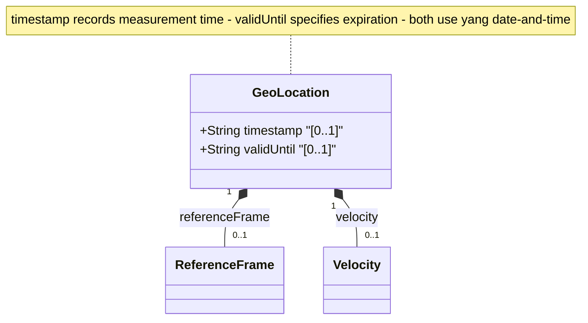

# Feature: [RFC9179-GEO] Temporal Location Attributes

## Parent Epic
- [ ] #42 - [RFC9179-GEO] A YANG Grouping for Geographic Locations (semantic linkage: this feature defines the timestamp and valid-until leaf nodes at the geo-location container level per RFC 9179 Section 3, which temporally anchor the location and velocity data)

## Description
Defines the temporal attributes of a geo-location: a timestamp recording when the location was measured, and a valid-until timestamp indicating the expiration of the location data. Both use the yang:date-and-time type (RFC 6991), which supports arbitrarily precise timestamp representation including fractional seconds and timezone offsets. The timestamp serves as the reference time for the associated velocity vector. The valid-until allows specifying a limited validity window for location data; when unspecified, the geo-location has no specific expiration.

## UML Class Diagram


## Interface Requirements

### 1. Test Data Shape
```json
{
  "timestamp": "2024-06-15T14:30:00.123456Z",
  "valid-until": "2024-06-16T14:30:00.000000Z"
}
```

### 2. Validation & Constraints

**timestamp:**
- Base type: yang:date-and-time (RFC 6991)
- Format: ISO 8601 extended format "YYYY-MM-DDThh:mm:ss[.frac]Z[+|-hh:mm]"
- Records the reference time when the geo-location was recorded/measured
- Supports fractional seconds for sub-second precision
- Time zone is REQUIRED (either Z for UTC or explicit offset)
- No explicit default value (optional leaf)
- Serves as the reference time for any associated velocity vector data

**valid-until:**
- Base type: yang:date-and-time (RFC 6991)
- Format: ISO 8601 extended format "YYYY-MM-DDThh:mm:ss[.frac]Z[+|-hh:mm]"
- Specifies the timestamp until which the geo-location data is valid
- Time zone is REQUIRED
- No explicit default value (optional leaf)
- Semantic: If unspecified, the geo-location has no specific expiration time

**Temporal Relationship Constraint:**
- No schema-level constraint enforcing timestamp < valid-until (not expressed in YANG)
- Semantic expectation: valid-until SHOULD be later than timestamp when both are present
- Applications MAY enforce this as a validation rule

**Portability Notes (RFC 9179 Section 5.1):**
- W3C Geolocation API: timestamp is a DOMTimeStamp (64-bit unsigned integer, milliseconds since UNIX epoch) — the YANG string format encompasses all representable values
- GML (Geography Markup Language): gml:validTime can be an instantaneous TimeInstant (maps to timestamp) or a time period TimePeriod (maps to timestamp + valid-until pair)
- KML: timestamp is specified as a string, directly mappable

### 3. Visual Layout & Arrangement
- The temporal attributes SHALL render within a PropertyGrid (container ID: properties_view) in a section labeled "Temporal Attributes"
- timestamp SHALL render as a DateTimeInputField component supporting full ISO 8601 entry with date picker and time picker controls
- valid-until SHALL render as a DateTimeInputField component, visually grouped alongside timestamp
- When valid-until is earlier than timestamp, a non-blocking warning indicator SHALL be displayed adjacent to the valid-until field
- Both fields SHALL support timezone selection (UTC or offset entry)
- Layout containment MUST be restricted to outer layout splitters; scrollable child panels MUST NOT use css-contain
- CSS box-sizing MUST be border-box; scoped naming MUST use CSS Modules or BEM

### 4. Interactive Flow & States
- **EMPTY State**: Both timestamp fields display empty with placeholder text ("YYYY-MM-DDThh:mm:ssZ"); no warning indicators shown
- **READ-ONLY State**: Timestamps display as formatted ISO 8601 strings with full precision
- **EDIT State**: Fields become editable with date picker overlay and time input sub-fields; timezone selector as dropdown (UTC / offset)
- **LOADING State**: Skeleton placeholder inputs while temporal data is being fetched
- **ERROR State**: Highlight fields with invalid ISO 8601 format (missing timezone, malformed date parts, invalid month/day values); display inline format error messages
- **VALIDITY WARNING State**: When valid-until is before timestamp, display a warning banner: "Expiration time precedes measurement time"
- **OPEN-ENDED State**: When valid-until is absent, display "No expiration" as a muted label below the valid-until field
- Computed-style assertions in tests MUST verify: warning banner visibility when valid-until < timestamp, error highlighting for malformed date strings, and "No expiration" label when valid-until is absent

## Given-When-Then Acceptance Criteria

### Pattern C (Decoupled Operator Console)

**AC-1: Timestamp Entry with Timezone**
- Given an operator is editing geo-location temporal attributes
- When the operator enters timestamp "2024-06-15T14:30:00.123456Z"
- Then the system SHALL store the value with full fractional-second precision and display it in ISO 8601 format

**AC-2: Valid-Until Entry**
- Given an operator is editing geo-location temporal attributes
- When the operator enters valid-until "2024-06-16T14:30:00+05:00"
- Then the system SHALL store the value with the +05:00 timezone offset and display it correctly

**AC-3: Expiration Before Measurement Warning**
- Given a geo-location has timestamp "2024-06-15T14:30:00Z"
- When the operator enters valid-until "2024-06-14T14:30:00Z" (before timestamp)
- Then the system SHALL display a warning indicating the expiration time precedes the measurement time, but SHALL NOT block the value (no schema constraint)

**AC-4: Absent Valid-Until**
- Given a geo-location has a timestamp but no valid-until value
- When the temporal attributes are displayed
- Then the display SHALL indicate "No expiration" for the valid-until field

**AC-5: Malformed Timestamp Rejection**
- Given an operator enters "2024-13-01T00:00:00Z" (invalid month 13)
- When the value is validated
- Then the system SHALL reject the value and display an error indicating invalid month

**AC-6: Missing Timezone Rejection**
- Given an operator enters "2024-06-15T14:30:00" (no timezone)
- When the value is validated
- Then the system SHALL reject the value and display an error indicating timezone is required

**AC-7: Both Temporal Attributes Absent**
- Given a geo-location has neither timestamp nor valid-until
- When the geo-location is validated
- Then the system SHALL accept the absence of both temporal attributes as valid (both leaves are optional)

## Specification Context (Verbatim)

From RFC 9179 Section 3 (YANG Module description for timestamp leaf):

"Reference time when location was recorded."

From RFC 9179 Section 3 (YANG Module description for valid-until leaf):

"The timestamp for which this geo-location is valid until. If unspecified, the geo-location has no specific expiration time."

From RFC 9179 Section 5.1.2.1 (W3C Comparison):

"timestamp (DOMTimeStamp): Specifies milliseconds since the UNIX Epoch in a 64-bit unsigned integer. The YANG data model defines the timestamp with arbitrarily large precision by using a string that encompasses all representable values of this timestamp value."

From RFC 9179 Section 5.1.3 (GML Comparison):

"Only the timestamp is mappable to and from the YANG grouping. Furthermore, 'gml:validTime' can either be an instantaneous measure ('gml:TimeInstant') or a time period ('gml:TimePeriod'). The instantaneous 'gml:TimeInstant' is mappable to and from the YANG grouping 'timestamp' value, and values down to the resolution of seconds for 'gml:TimePeriod' can be mapped using the 'valid-until' node of the YANG grouping."

## Source References
Structural Schema: ietf-geo-location@2022-02-11.yang (schema/ietf-geo-location@2022-02-11.yang) (Clause: timestamp leaf, valid-until leaf)
Normative Specification: [RFC 9179: A YANG Grouping for Geographic Locations](https://datatracker.ietf.org/doc/rfc9179/) (Clause: Section 3, YANG Module; Section 5.1, Usability & Portability)

## Logical UI & Interface Bindings
- **Target LUI Component:** PropertyGrid
- **Target Layout Container ID:** properties_view
- **Data Source Bindings:** Deferred to Feature #Feat-18 Task 2
