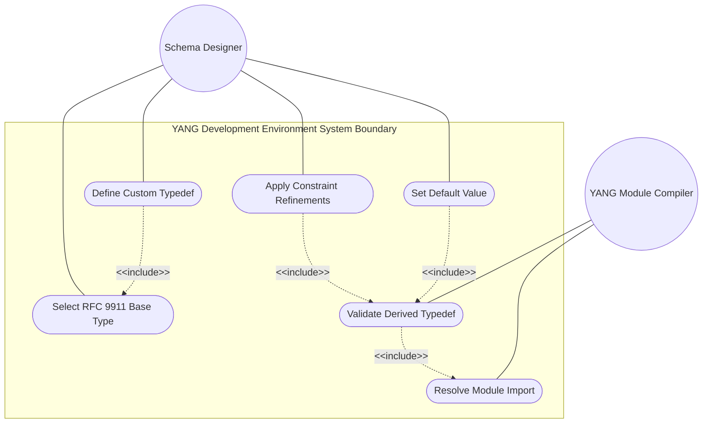
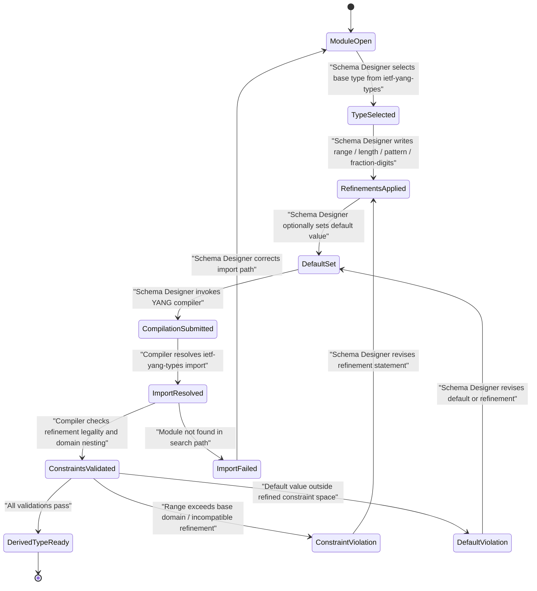

# Use Case: [RFC9911-YANG] Define Custom Data Type Derived From Base YANG Type

## Parent Epic
- [ ] #10 - [RFC9911-YANG] Common YANG Data Types (semantic linkage: this use case exercises the type-derivation and constraint-refinement patterns enabled by all RFC 9911 ietf-yang-types base typedefs)

## 1. Actors
- **Primary Actor:** Schema Designer (a human or tool-assisted YANG module author deriving custom typedefs from RFC 9911 base types)
- **Secondary Actors:** YANG Module Compiler (the schema processing toolchain that resolves import dependencies and validates derived-type constraint consistency)

## 2. Preconditions
- The target YANG module declares an `import ietf-yang-types` statement referencing RFC 9911.
- The RFC 9911 ietf-yang-types module is available in the schema search path.
- The Schema Designer has identified a semantic need for a custom type (e.g., a port counter, a temperature gauge, a device identifier) whose domain semantics are stricter than the base type.
- The Schema Designer knows the application-domain constraints to be applied (range, length, pattern, fraction-digits, or union composition).

## 3. Trigger
The Schema Designer initiates a `typedef` declaration in a YANG module that references an RFC 9911 base type (e.g., `type yang:counter32`) and specifies one or more refinement statements (`range`, `length`, `pattern`, `fraction-digits`).

## 4. Main Success Scenario (Basic Flow)
1. The Schema Designer selects an RFC 9911 base type from the ietf-yang-types module (e.g., `counter32`, `gauge64`, `object-identifier-128`, `date-and-time`, `phys-address`, `uuid`, `hex-string`, `yang-identifier`).
2. The Schema Designer writes a `typedef` declaration that names the derived type and sets its `type` to the selected RFC 9911 base type.
3. The Schema Designer applies optional refinement statements — `range` for integer types, `length` or `pattern` for string types, `fraction-digits` for decimal64, or `type` union for union base types — narrowing the value space to match the application domain.
4. The Schema Designer optionally sets a `default` value for the derived type that falls within the refined constraint space.
5. The Schema Designer optionally sets a `description`, `reference`, `units`, or `status` statement documenting the type's domain semantics.
6. The Schema Designer saves the module file and invokes the YANG Module Compiler (e.g., `pyang` or `yanglint`).
7. The YANG Module Compiler resolves the import of `ietf-yang-types` and loads the base type definitions from RFC 9911.
8. The YANG Module Compiler validates that all refinement statements are legal for the base type's YANG built-in type (e.g., `range` is valid for `uint32`-derived `counter32`; `pattern` is valid for `string`-derived `hex-string`).
9. The YANG Module Compiler validates that refinement ranges nest within the base type's allowable range (e.g., a `range "50..150"` refinement on `gauge64` with domain `0..18446744073709551615` is valid; `range "-1..100"` is rejected because negative values fall outside the gauge domain).
10. The YANG Module Compiler confirms no compilation errors and the derived typedef is ready for use in `leaf`, `leaf-list`, or further `typedef` declarations within the module.
11. The Schema Designer receives a successful compilation report.

## 5. Alternate and Exception Flows
- **5a. Refinement Exceeds Base Type Domain (Branches from Basic Flow step 9):**
  1. The YANG Module Compiler detects that a `range` refinement on a `counter32` or `gauge32` base type specifies a minimum below 0 (e.g., `range "-10..100"`), which violates the non-negative domain of counter and gauge types as defined in RFC 9911 Section 3.
  2. The YANG Module Compiler emits a compilation error with the violating range expression and the base type's legal domain, and the Schema Designer must revise the refinement to stay within the base type bounds before proceeding to step 11.
- **5b. Incompatible Refinement Statement (Branches from Basic Flow step 8):**
  1. The YANG Module Compiler detects that a `range` statement is applied to a string-derived base type such as `hex-string` or `uuid`, which does not support numeric range constraints.
  2. The YANG Module Compiler emits a compilation error identifying the illegal refinement statement, and the Schema Designer must substitute an appropriate constraint (`length` or `pattern`) before re-invoking the compiler at step 6.
- **5c. Import Resolution Failure (Branches from Basic Flow step 7):**
  1. The YANG Module Compiler cannot locate the `ietf-yang-types` module in the configured module search path.
  2. The YANG Module Compiler emits an import-resolution error with the missing module name and revision date, and the Schema Designer must correct the module search path or the import statement's revision-date before returning to step 6.
- **5d. Pattern Refinement Produces Zero-Length String Set (Branches from Basic Flow step 3):**
  1. The YANG Module Compiler detects that a `pattern` refinement applied to a `yang-identifier` or other string-derived base type defines a regular expression that matches zero characters, yielding an empty language.
  2. The YANG Module Compiler emits a warning or error per the implementation's strictness level, and the Schema Designer revises the pattern to match at least one valid string before step 11.
- **5e. Default Value Violates Derived Constraint (Branches from Basic Flow step 4):**
  1. The YANG Module Compiler detects that the specified `default` value for the derived typedef falls outside the refined constraint space (e.g., `default 999` when `range "0..500"` was applied).
  2. The YANG Module Compiler emits a compilation error identifying the default value and the valid range, and the Schema Designer must either adjust the default or widen the refinement before proceeding to step 11.
- **5f. Fraction-Digits Applied to Non-Decimal64 Base (Branches from Basic Flow step 8):**
  1. The YANG Module Compiler detects that a `fraction-digits` statement is applied to a typedef whose base built-in type is not `decimal64`.
  2. The YANG Module Compiler emits a compilation error, and the Schema Designer must remove the `fraction-digits` statement before re-invoking the compiler at step 6.

## 6. Postconditions (Guarantees)
- **Success Guarantee:** The derived typedef is valid, compiles without errors, and is available for leaf/leaf-list declarations in the authoring module. The YANG Module Compiler records the typedef in its symbol table with all inherited and refined constraints intact.
- **Failure Guarantee:** No derived typedef is registered in the module's symbol table. The YANG Module Compiler emits at least one error message identifying the specific type, refinement statement, and semantic violation. The Schema Designer retains the module source file with the offending declaration for revision.

## UML Diagrams
### Use Case Diagram

### State Machine Diagram

## 7. Operational Context
RFC 9911 defines common YANG data types that serve as base types for derived typedefs in domain-specific YANG modules. Schema designers import `ietf-yang-types` (or `ietf-inet-types`) and derive custom types with narrower constraints to match application-specific semantics. The YANG module compiler enforces that derived types respect the base type's built-in YANG type and numeric domain, ensuring constraint consistency across the module ecosystem.

## 8. Realization Matrix
### Required User Stories
- [ ] [#12](https://github.com/gintatkinson/3dgs-039/issues/12) — [RFC9911-YANG] Counter Wrapping Behavior (semantic linkage: counter-type derivations must inherit monotonically-increasing wrap semantics from base counter32/counter64 types)
- [ ] [#13](https://github.com/gintatkinson/3dgs-039/issues/13) — [RFC9911-YANG] Gauge Value Clamping Behavior (semantic linkage: gauge-type derivations must inherit peg-at-boundary clamping semantics from base gauge32/gauge64 types)
- [ ] [#14](https://github.com/gintatkinson/3dgs-039/issues/14) — [RFC9911-YANG] Object Identifier Validation (semantic linkage: object-identifier derivations must inherit ASN.1 sub-identifier structural constraints from base object-identifier/object-identifier-128 types)
- [ ] [#15](https://github.com/gintatkinson/3dgs-039/issues/15) — [RFC9911-YANG] Date-and-Time Formatting and Canonical Form (semantic linkage: date-and-time derivations must inherit canonical formatting and timezone offset rules from base date-and-time type)
- [ ] [#16](https://github.com/gintatkinson/3dgs-039/issues/16) — [RFC9911-YANG] Timeticks and Timestamp Epoch Handling (semantic linkage: timeticks and timestamp derivations must inherit modulo-2^32 wrap and zero-on-wrap behaviors)
- [ ] [#17](https://github.com/gintatkinson/3dgs-039/issues/17) — [RFC9911-YANG] Date and Time Component Validation (semantic linkage: sub-second duration type derivations must inherit range constraints from base hours32 through nanoseconds64 types)
### Required Features
- [ ] [#1](https://github.com/gintatkinson/3dgs-039/issues/1) — [RFC9911-YANG] Counter and Gauge Types (semantic linkage: provides the counter32, counter64, gauge32, gauge64, zero-based-counter32, and zero-based-counter64 base types for derivation)
- [ ] [#2](https://github.com/gintatkinson/3dgs-039/issues/2) — [RFC9911-YANG] Identifier Types (semantic linkage: provides the object-identifier and object-identifier-128 base types for derivation with ASN.1 constraints)
- [ ] [#3](https://github.com/gintatkinson/3dgs-039/issues/3) — [RFC9911-YANG] Date and Time Types (semantic linkage: provides date-and-time, date, date-no-zone, time, time-no-zone, duration, timeticks, and timestamp base types)
- [ ] [#4](https://github.com/gintatkinson/3dgs-039/issues/4) — [RFC9911-YANG] Physical Address Types (semantic linkage: provides phys-address and mac-address base types for derivation with IEEE 802 address pattern constraints)
- [ ] [#5](https://github.com/gintatkinson/3dgs-039/issues/5) — [RFC9911-YANG] XML and String Types (semantic linkage: provides xpath1.0, hex-string, uuid, dotted-quad, language-tag, and yang-identifier base types with regex pattern constraints)

## Source References
Structural Schema: [RFC 9911 YANG Module — ietf-yang-types](https://github.com/gintatkinson/3dgs-039/blob/main/schema/ietf-yang-types@2025-12-22.yang)
Normative Specification: [RFC 9911 – Common YANG Data Types](https://www.rfc-editor.org/rfc/rfc9911.html)
