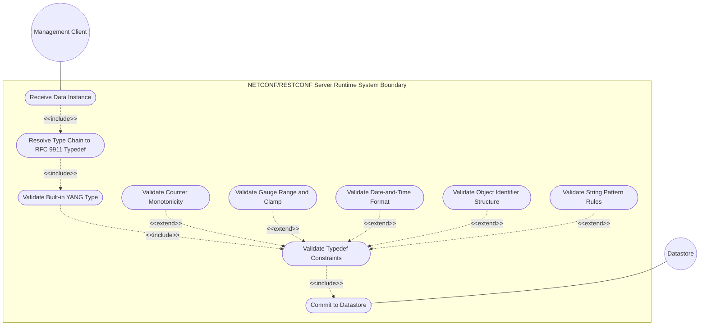
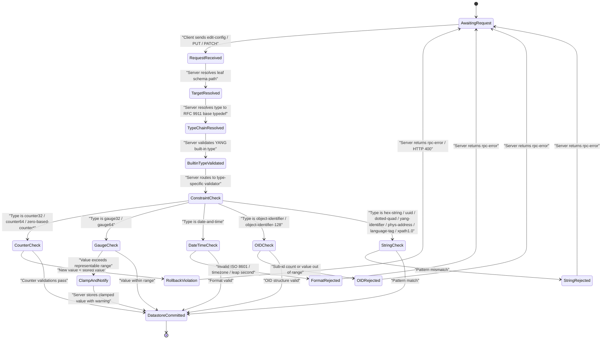

# Use Case: [RFC9911-YANG] Validate Data Instance Against RFC 9911 Type Constraint

## Parent Epic
- [ ] #10 - [RFC9911-YANG] Common YANG Data Types (semantic linkage: this use case exercises runtime data-instance validation against all constraint dimensions defined by RFC 9911 ietf-yang-types typedefs)

## 1. Actors
- **Primary Actor:** NETCONF/RESTCONF Server (the management-plane server that receives configuration and state data from clients and must validate every data instance against its declared YANG type before committing to the datastore)
- **Secondary Actors:** Management Client (a human operator or northbound orchestrator submitting configuration or querying operational state)

## 2. Preconditions
- The NETCONF/RESTCONF server has loaded the YANG module that declares the leaf or leaf-list typed with an RFC 9911 type (directly or via a derived typedef).
- The server's datastore is in a consistent state prior to the incoming edit operation.
- The server's type-resolution subsystem has resolved the leaf's type chain back to the RFC 9911 base type in ietf-yang-types.

## 3. Trigger
The Management Client transmits a NETCONF `<edit-config>` RPC, a RESTCONF `PUT`/`PATCH`/`POST` request, or a gNMI `Set` message containing a data instance for a leaf whose type resolves to an RFC 9911 typedef.

## 4. Main Success Scenario (Basic Flow)
1. The NETCONF/RESTCONF Server receives the inbound RPC or HTTP request containing the data payload.
2. The Server parses the operation target (XPath or RESTCONF resource path) and identifies the target leaf node in the schema.
3. The Server resolves the leaf's type chain to the RFC 9911 base typedef (e.g., `counter32`, `gauge64`, `date-and-time`, `object-identifier`, `uuid`, `hex-string`, `phys-address`, `yang-identifier`).
4. The Server extracts the candidate data value from the payload.
5. The Server validates the value against the base type's YANG built-in type (e.g., `uint32` for counter32, `string` for hex-string, `binary` for yang-identifier).
6. The Server validates the value against the typedef's constraint layer: range (for counter/gauge), pattern (for string types), length, or structural rules (for object-identifier).
7. The Server validates counter-specific rules: the new counter32/counter64 value must be monotonically non-decreasing relative to the current stored value; zero-based-counter values must start at 0.
8. The Server validates gauge-specific rules: gauge32/gauge64 values outside the type's representable range are clamped to the nearest boundary (0 or max) and a clamp notification is generated.
9. The Server validates date-and-time format: the value must match ISO 8601 canonical form with optional timezone offset and leap-second allowance (`23:59:60`).
10. The Server validates object-identifier structural rules: first arc ≤ 2, second arc ≤ 39 (or 40 for first arc 0), sub-identifiers within [0, 4294967295], count within [1, 128].
11. The Server validates string-type rules: hex-string matches `[0-9a-fA-F]*`, uuid matches RFC 9562 canonical hex-octet form, dotted-quad matches `(([0-9]|[1-9][0-9]|1[0-9][0-9]|2[0-4][0-9]|25[0-5])\.){3}([0-9]|[1-9][0-9]|1[0-9][0-9]|2[0-4][0-9]|25[0-5])`.
12. All validations pass. The Server commits the data instance to the target datastore and returns an `<ok/>` or `204 No Content` response to the Management Client.

## 5. Alternate and Exception Flows
- **5a. Counter Rollback Violation (Branches from Basic Flow step 7):**
  1. The Server detects that the incoming `counter32` or `counter64` value is strictly less than the currently stored value, violating the monotonically non-decreasing behavioral rule defined in RFC 9911 Section 3.
  2. The Server aborts the transaction, rolls back the candidate datastore to its pre-edit state, and returns an `<rpc-error>` with `error-tag` set to `invalid-value` and an `error-message` stating the stored and submitted counter values.
- **5b. Gauge Value Clamped (Branches from Basic Flow step 8):**
  1. The Server determines that the incoming `gauge32` value exceeds `4294967295` or the `gauge64` value exceeds `18446744073709551615`, or is negative.
  2. The Server clamps the value to the nearest valid boundary (max for overflow, 0 for underflow), stores the clamped value, emits a clamp notification via a YANG notification or syslog, and returns success to the Management Client with a `warning` element in the RPC reply indicating clamping occurred.
- **5c. Object Identifier Arc Out of Range (Branches from Basic Flow step 10):**
  1. The Server detects that a sub-identifier in the OID string exceeds the maximum value `4294967295` or that the OID contains more than 128 sub-identifiers.
  2. The Server aborts the transaction, rolls back, and returns an `<rpc-error>` with `error-tag` `invalid-value` identifying the violating sub-identifier position and value.
- **5d. Date-and-Time Invalid Timezone Offset (Branches from Basic Flow step 9):**
  1. The Server parses a `date-and-time` value with a timezone offset outside the valid range of `-23:59` to `+23:59` or `Z`.
  2. The Server aborts the transaction with an `<rpc-error>` identifying the invalid offset component and the expected ISO 8601 canonical format.
- **5e. Hex-String Invalid Character (Branches from Basic Flow step 11):**
  1. The Server detects a non-hexadecimal character in the candidate `hex-string` value (any character outside `[0-9a-fA-F]`).
  2. The Server aborts the transaction with an `<rpc-error>` specifying the invalid character position and the accepted character set.
- **5f. UUID Non-Canonical Format (Branches from Basic Flow step 11):**
  1. The Server detects that a `uuid` value deviates from the RFC 9562 canonical hex-octet format (lowercase hex digits, groups of `8-4-4-4-12` separated by hyphens).
  2. The Server aborts the transaction with an `<rpc-error>` specifying the format violation and referencing the canonical UUID format specification.
- **5g. Zero-Based Counter Non-Zero Start (Branches from Basic Flow step 7):**
  1. The Server detects that the first ever write to a `zero-based-counter32` or `zero-based-counter64` leaf has a value other than `0`.
  2. The Server aborts the transaction and returns an `<rpc-error>` with `error-tag` `invalid-value` stating that zero-based counters must be initialized to 0.
- **5h. Date-and-Time Leap Second Boundary Violation (Branches from Basic Flow step 9):**
  1. The Server detects a `date-and-time` value containing `23:59:60` on a date that is not a published leap-second date.
  2. The Server aborts the transaction with an `<rpc-error>` identifying that the leap-second value `60` is only valid on known leap-second insertion dates.

## 6. Postconditions (Guarantees)
- **Success Guarantee:** The data instance is committed to the target datastore with its type constraints fully validated. The datastore state is consistent. Counters are monotonically non-decreasing, gauges are within representable range, date-and-time values are in ISO 8601 canonical form, object identifiers satisfy ASN.1 structural rules, and string types match their prescribed patterns.
- **Failure Guarantee:** The datastore is unchanged (atomic rollback). The Management Client receives a standards-compliant `<rpc-error>` or HTTP error response (400/422) with precise error-path, error-tag, and error-message fields identifying the violating leaf, the RFC 9911 type constraint that was breached, and the offending value.

## UML Diagrams
### Use Case Diagram

### State Machine Diagram

## 7. Operational Context
In live network management deployments, every data instance written to the datastore must pass through a type-validation layer. RFC 9911 defines semantic constraints beyond simple YANG built-in type checking: counters wrap monotonically and must never decrease, gauges clamp to representable boundaries, date-and-time values support timezone offsets and leap seconds, object identifiers carry ASN.1 structural rules, and string types carry RFC-mandated regular expression patterns. The NETCONF/RESTCONF server is the enforcement point where these constraints are applied atomically to each configuration or state write.

## 8. Realization Matrix
### Required User Stories
- [ ] [#12](https://github.com/gintatkinson/3dgs-039/issues/12) — [RFC9911-YANG] Counter Wrapping Behavior (semantic linkage: server must enforce monotonically non-decreasing rule for counter32/counter64 and zero-initialization for zero-based counters)
- [ ] [#13](https://github.com/gintatkinson/3dgs-039/issues/13) — [RFC9911-YANG] Gauge Value Clamping Behavior (semantic linkage: server must clamp gauge32/gauge64 values exceeding representable range and notify on clamp)
- [ ] [#14](https://github.com/gintatkinson/3dgs-039/issues/14) — [RFC9911-YANG] Object Identifier Validation (semantic linkage: server must validate ASN.1 sub-identifier count, range, and arc placement rules)
- [ ] [#15](https://github.com/gintatkinson/3dgs-039/issues/15) — [RFC9911-YANG] Date-and-Time Formatting and Canonical Form (semantic linkage: server must validate ISO 8601 canonical form, timezone offset range, and leap-second allowance)
- [ ] [#16](https://github.com/gintatkinson/3dgs-039/issues/16) — [RFC9911-YANG] Timeticks and Timestamp Epoch Handling (semantic linkage: server must enforce timeticks modulo-2^32 wrap and timestamp zero-on-wrap semantics on write operations)
- [ ] [#17](https://github.com/gintatkinson/3dgs-039/issues/17) — [RFC9911-YANG] Date and Time Component Validation (semantic linkage: server must validate hours32-nanoseconds64 types against their specific range and precision constraints)
### Required Features
- [ ] [#1](https://github.com/gintatkinson/3dgs-039/issues/1) — [RFC9911-YANG] Counter and Gauge Types (semantic linkage: defines the counter32, counter64, gauge32, gauge64, zero-based-counter32, and zero-based-counter64 validation rules enforced at runtime)
- [ ] [#2](https://github.com/gintatkinson/3dgs-039/issues/2) — [RFC9911-YANG] Identifier Types (semantic linkage: defines the object-identifier and object-identifier-128 ASN.1 structural validation rules enforced at runtime)
- [ ] [#3](https://github.com/gintatkinson/3dgs-039/issues/3) — [RFC9911-YANG] Date and Time Types (semantic linkage: defines the date-and-time, timeticks, timestamp, and sub-second duration validation rules enforced at runtime)
- [ ] [#4](https://github.com/gintatkinson/3dgs-039/issues/4) — [RFC9911-YANG] Physical Address Types (semantic linkage: defines the phys-address and mac-address IEEE 802 pattern validation rules enforced at runtime)
- [ ] [#5](https://github.com/gintatkinson/3dgs-039/issues/5) — [RFC9911-YANG] XML and String Types (semantic linkage: defines the hex-string, uuid, dotted-quad, yang-identifier, language-tag, and xpath1.0 regex pattern validation rules enforced at runtime)

## Source References
Structural Schema: [RFC 9911 YANG Module — ietf-yang-types](https://github.com/gintatkinson/3dgs-039/blob/main/schema/ietf-yang-types@2025-12-22.yang)
Normative Specification: [RFC 9911 – Common YANG Data Types](https://www.rfc-editor.org/rfc/rfc9911.html)
