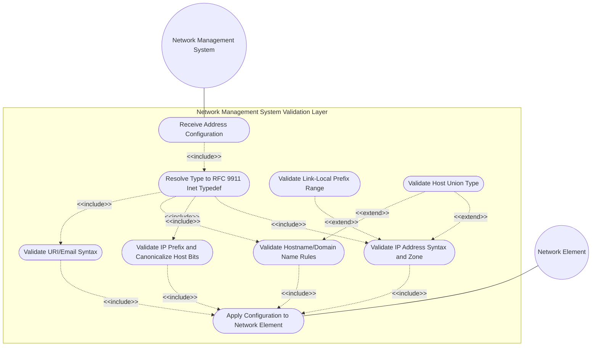
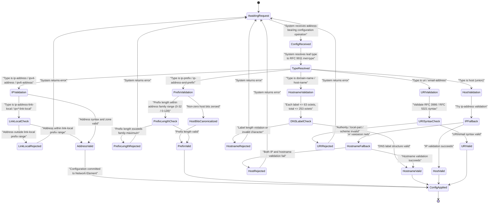

# Use Case: [RFC9911-INET] Validate Network Address Instance Against RFC 9911 Type Constraint

## Parent Epic
- [ ] #11 - [RFC9911-INET] Internet Protocol Suite Types (semantic linkage: this use case exercises runtime validation of IP addresses, prefixes, hostnames, and URIs against all constraint dimensions defined by RFC 9911 ietf-inet-types typedefs)

## 1. Actors
- **Primary Actor:** Network Management System (the management-plane subsystem that receives network configuration data — IP addresses, prefixes, hostnames, URIs — and must validate each instance against its declared RFC 9911 inet-type before persisting or applying to network elements)
- **Secondary Actors:** Network Element (a router, switch, or host that receives the validated address/prefix/hostname data as part of its running configuration)

## 2. Preconditions
- The Network Management System has loaded the YANG module that imports and uses RFC 9911 `ietf-inet-types` typedefs.
- The system's type-resolution subsystem has resolved target leaf types to their RFC 9911 base definitions in ietf-inet-types.
- A network configuration transaction is open and targeted at one or more address-bearing leaves.

## 3. Trigger
The Network Management System receives a configuration operation (NETCONF `<edit-config>`, RESTCONF `PUT`/`PATCH`, or programmatic API call) containing a data instance for a leaf typed with an RFC 9911 inet-type — for example, an `ip-address`, `ip-prefix`, `domain-name`, `host-name`, `uri`, or `email-address`.

## 4. Main Success Scenario (Basic Flow)
1. The Network Management System receives the configuration operation containing the address-bearing data instance.
2. The System resolves the target leaf's YANG schema path and traces the type chain to the RFC 9911 `ietf-inet-types` base typedef.
3. For IP address types (`ip-address`, `ipv4-address`, `ipv6-address`), the System parses the address string according to the address family: dotted-decimal for IPv4, colon-hexadecimal for IPv6.
4. For IPv6 addresses with a zone index (`ipv6-address` without the `-no-zone` qualifier), the System validates the percent-encoded zone-id suffix syntax and checks that the zone index is non-empty and conforms to RFC 4007 scoping rules.
5. For link-local address types (`ip-address-link-local`, `ipv4-address-link-local`, `ipv6-address-link-local`), the System verifies the address falls within the link-local prefix ranges: `169.254.0.0/16` for IPv4, `fe80::/10` for IPv6.
6. For IP prefix types (`ip-prefix`, `ipv4-prefix`, `ipv6-prefix`), the System extracts the address and prefix-length components, validates the prefix-length against the address family limit (0-32 for IPv4, 0-128 for IPv6), and canonicalizes non-zero host bits to zero.
7. For `ip-address-and-prefix` types, the System validates both the address and the prefix-length as in step 6, and additionally validates that the address component is a valid IP address per step 3.
8. For `domain-name` and `host-name` types, the System validates the DNS label structure: each label ≤ 63 octets, total name ≤ 253 octets, labels start and end with alphanumeric, internal hyphens allowed but not at start/end, and the `host-name` subtype additionally prohibits leading digits per RFC 952/1123.
9. For the `host` union type, the System attempts validation first as an `ip-address` (step 3); if that fails, it falls back to `domain-name` validation (step 8). If both fail, the value is rejected.
10. For `uri` and `email-address` types, the System validates against the RFC 3986 URI syntax (with `host` subcomponent validated per step 8 or step 3 for the authority) and RFC 5321/RFC 6531 email syntax respectively.
11. All validations pass. The System commits the validated address instance and propagates the configuration to the target Network Element. The Network Element acknowledges successful configuration application.

## 5. Alternate and Exception Flows
- **5a. IPv4 Address Outside Link-Local Range (Branches from Basic Flow step 5):**
  1. The System receives an `ipv4-address-link-local` value outside `169.254.0.1` through `169.254.255.254` (e.g., `192.168.1.1`), which is not within the IPv4 link-local prefix.
  2. The System aborts the transaction with an error identifying the submitted address, the expected link-local prefix `169.254.0.0/16`, and the `error-tag` `invalid-value`.
- **5b. IPv6 Zone Index Missing for Link-Local Address (Branches from Basic Flow step 4):**
  1. The System receives an `ipv6-address` value in the `fe80::/10` range without a zone index (e.g., `fe80::1` instead of `fe80::1%eth0`), which is a scoped address requiring a zone identifier for unambiguous interface binding.
  2. The System returns a validation warning or error (per implementation policy) indicating the missing zone index and that scoped addresses require a `%zone_id` suffix per RFC 4007.
- **5c. Hostname Leading Digit Violation (Branches from Basic Flow step 8):**
  1. The System receives a `host-name` value that starts with a digit (e.g., `3com-router`), which violates the RFC 952 hostname syntax rule that the first character must be a letter.
  2. The System aborts the transaction with an error identifying the violating character position, the RFC 952/1123 constraint, and the valid hostname character set `[a-zA-Z][a-zA-Z0-9-]*`.
- **5d. DNS Label Exceeds 63-Octet Limit (Branches from Basic Flow step 8):**
  1. The System detects that a DNS label within the `domain-name` value exceeds the 63-octet maximum length defined by RFC 1035 (e.g., a label with 64 or more characters between dots).
  2. The System aborts the transaction with an error identifying the violating label and its length versus the 63-octet limit.
- **5e. IP Prefix Non-Zero Host Bits (Branches from Basic Flow step 6):**
  1. The System receives an `ip-prefix` value where the host portion contains non-zero bits (e.g., `192.168.1.5/24` — the host bits `0.0.0.5` are non-zero for a `/24` prefix).
  2. The System canonicalizes the prefix by zeroing the host bits (producing `192.168.1.0/24`) and stores the canonical form, or, per strict implementation policy, aborts the transaction with an error requesting the canonical form.
- **5f. URI Authority Component Invalid (Branches from Basic Flow step 10):**
  1. The System receives a `uri` value whose authority component contains a hostname or IP address that fails `host` validation (e.g., `https://3com-host/path` where `3com-host` starts with a digit, violating host-name rules).
  2. The System aborts the transaction with an error identifying the invalid authority component and the specific host-name or IP-address validation failure.
- **5g. Prefix-Length Exceeds Address Family Maximum (Branches from Basic Flow step 6):**
  1. The System receives an `ipv4-prefix` value with a prefix-length of `33` or an `ipv6-prefix` with a prefix-length of `129`, exceeding the maximum for the respective address family.
  2. The System aborts the transaction with an error identifying the offending prefix-length and the valid range (0-32 for IPv4, 0-128 for IPv6).
- **5h. Email Address Local-Part Invalid (Branches from Basic Flow step 10):**
  1. The System receives an `email-address` value whose local-part contains characters outside the RFC 5321 allowed set (e.g., unquoted spaces, non-ASCII characters without SMTPUTF8 extension indication).
  2. The System aborts the transaction with an error identifying the violating character and the relevant RFC constraint.

## 6. Postconditions (Guarantees)
- **Success Guarantee:** The validated network address instance is committed to the configuration datastore and applied to the target Network Element. IP addresses are syntactically valid for their address family with correct zone-index formatting, prefixes are canonicalized with zeroed host bits, hostnames conform to RFC 952/1123/1035, and URIs/emails conform to their respective RFC syntax specifications.
- **Failure Guarantee:** The configuration transaction is rolled back. The Network Element's running configuration is unchanged. The Network Management System returns a precise error response identifying the violating leaf, the RFC 9911 inet-type, the specific constraint breached, and the offending value with its position in the data tree.

## UML Diagrams
### Use Case Diagram

### State Machine Diagram

## 7. Operational Context
Network management systems deploy configuration that references network endpoints by IP address, prefix, hostname, or URI. RFC 9911 ietf-inet-types define the canonical syntactic and semantic constraints for these address artifacts: IPv4 and IPv6 address formats with zone-index support for scoped addresses, link-local address prefix enforcement, prefix-length range validation, DNS label structure rules per RFC 952/1123/1035, the host union type that transparently accepts either an IP address or domain name, and URI/email syntax validation against RFC 3986 and RFC 5321/6531. Every configuration write traverses this validation layer before reaching the network element.

## 8. Realization Matrix
### Required User Stories
- [ ] [#18](https://github.com/gintatkinson/3dgs-039/issues/18) — [RFC9911-INET] IP Address Scope and Zone Handling (semantic linkage: validates zone-index syntax, enforces link-local prefix ranges, and distinguishes zone-qualified from no-zone address types)
- [ ] [#19](https://github.com/gintatkinson/3dgs-039/issues/19) — [RFC9911-INET] Hostname Validation Rules (semantic linkage: validates DNS label length limits, RFC 952/1123 character constraints, host union fallback logic, and URI/email authority component validation)
- [ ] [#20](https://github.com/gintatkinson/3dgs-039/issues/20) — [RFC9911-INET] IP Prefix and Mask Validation (semantic linkage: validates prefix-length within address family bounds and canonicalizes non-zero host bits to zero)
### Required Features
- [ ] [#6](https://github.com/gintatkinson/3dgs-039/issues/6) — [RFC9911-INET] Protocol Field Types (semantic linkage: provides ip-version, dscp, ipv6-flow-label, port-number, and as-number validation rules used in conjunction with address validation)
- [ ] [#7](https://github.com/gintatkinson/3dgs-039/issues/7) — [RFC9911-INET] IP Address Types (semantic linkage: defines the ip-address, ipv4-address, ipv6-address, no-zone and link-local family typedefs whose syntax and scope rules are enforced at runtime)
- [ ] [#8](https://github.com/gintatkinson/3dgs-039/issues/8) — [RFC9911-INET] IP Prefix Types (semantic linkage: defines the ip-prefix, ipv4-prefix, ipv6-prefix, and address-and-prefix typedefs whose prefix-length and canonicalization rules are enforced at runtime)
- [ ] [#9](https://github.com/gintatkinson/3dgs-039/issues/9) — [RFC9911-INET] Domain, Host, and URI Types (semantic linkage: defines the domain-name, host-name, host, uri, and email-address typedefs whose DNS label and syntax constraint rules are enforced at runtime)

## Source References
Structural Schema: [RFC 9911 YANG Module — ietf-inet-types](https://github.com/gintatkinson/3dgs-039/blob/main/schema/ietf-inet-types@2025-12-22.yang)
Normative Specification: [RFC 9911 – Common YANG Data Types](https://www.rfc-editor.org/rfc/rfc9911.html)
