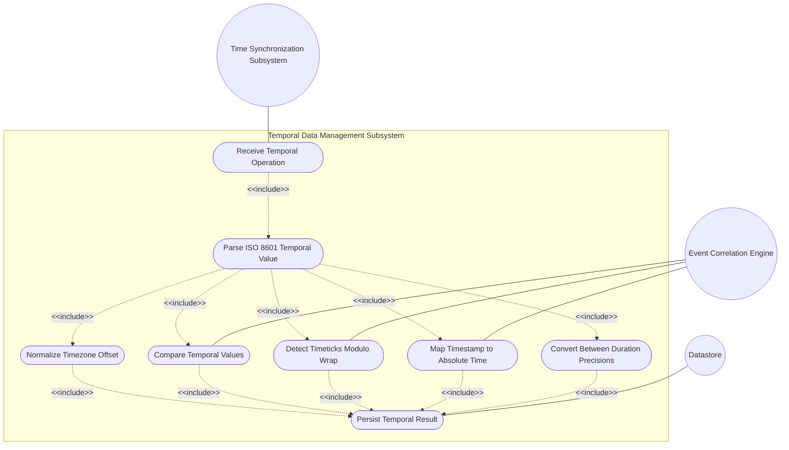
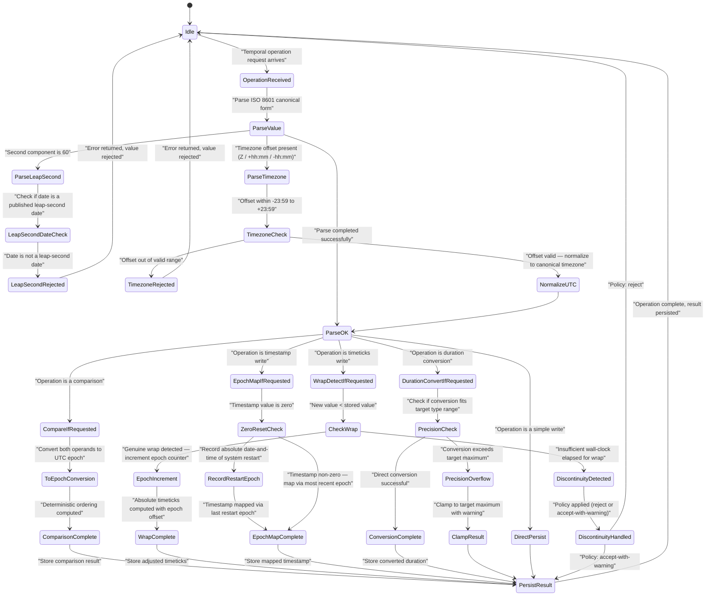

# Use Case: [RFC9911-CROSS] Manage Temporal Data Using RFC 9911 Date and Time Types

## Parent Epic
- [ ] #10 - [RFC9911-YANG] Common YANG Data Types (semantic linkage: this use case exercises temporal operations — comparison, canonical conversion, timezone normalization, epoch handling — across all RFC 9911 date-and-time, timeticks, timestamp, and sub-second duration types)

## 1. Actors
- **Primary Actor:** Time Synchronization Subsystem (the management-plane component responsible for formatting, comparing, normalizing, and storing temporal data instances that conform to RFC 9911 date-and-time type constraints)
- **Secondary Actors:** Event Correlation Engine (a subsystem that consumes timestamped data from multiple sources, computes relative event timing using timeticks and timestamps, and compares temporal values across timezones)

## 2. Preconditions
- The Time Synchronization Subsystem has access to a YANG datastore containing leaves typed as `date-and-time`, `date`, `date-no-zone`, `time`, `time-no-zone`, `timeticks`, `timestamp`, or sub-second duration types (`hours32`, `minutes32`, `seconds32`, `milliseconds32`, `microseconds32`, `microseconds64`, `nanoseconds32`, `nanoseconds64`).
- The system has a configured default timezone offset for cases where zone-less temporal values must be interpreted in a concrete timezone context.
- The system's monotonic clock is available for generating timeticks and timestamp values.

## 3. Trigger
The Time Synchronization Subsystem receives a temporal operation request — either: (a) a data write containing a `date-and-time` value from a different timezone that must be normalized to the system's canonical timezone; (b) a query requesting comparison of two temporal values; (c) a `timeticks` rollover event requiring epoch detection; or (d) a request to convert a `timestamp` value to its absolute `date-and-time` equivalent.

## 4. Main Success Scenario (Basic Flow)
1. The Time Synchronization Subsystem receives a temporal operation request targeting a YANG leaf typed with an RFC 9911 temporal type.
2. The Subsystem parses the input temporal value according to the RFC 9911 ISO 8601 canonical format: `YYYY-MM-DDThh:mm:ss[.fraction][Z|(+|-)hh:mm]` for `date-and-time`, `YYYY-MM-DD` for `date`, `hh:mm:ss[.fraction]` for `time`, and analogous formats for `date-no-zone` and `time-no-zone`.
3. For `date-and-time` values carrying a timezone offset (`+hh:mm` or `-hh:mm` or `Z`), the Subsystem normalizes the value to the system's canonical timezone by computing the offset delta and adjusting the datetime components accordingly, propagating any day/month/year boundary changes.
4. For temporal comparison operations, the Subsystem converts both operands to a normalized UTC epoch representation (seconds since 1970-01-01T00:00:00Z) and performs the comparison. For `date-no-zone` and `time-no-zone` operands, the Subsystem treats them as having no implied timezone and compares them as literal component values.
5. For `timeticks` values, the Subsystem checks whether the incoming value is less than the previously stored value, indicating a modulo-2^32 wrap event. If so, the Subsystem increments the logical epoch counter and computes the absolute value by adding `epoch * 2^32` to the raw `timeticks`.
6. For `timestamp` values, the Subsystem tracks the system's boot or reinitialization epoch. When a `timestamp` wraps to zero (indicating a system restart), the Subsystem records the absolute `date-and-time` of the restart event so that subsequent timestamps can be mapped back to absolute wall-clock time.
7. For sub-second duration types (`milliseconds32` through `nanoseconds64`), the Subsystem validates that the value falls within the type's specific precision range (e.g., `milliseconds32`: 0-4294967295 ms; `nanoseconds64`: 0-18446744073709551615 ns) and converts between precision levels by multiplying or dividing by the appropriate factor of 1000, clamping or truncating as needed.
8. The Subsystem persists the normalized, compared, or converted result and returns a success status to the caller.

## 5. Alternate and Exception Flows
- **5a. Leap Second Detected on Non-Leap-Second Date (Branches from Basic Flow step 2):**
  1. The Subsystem parses a `date-and-time` value containing `23:59:60` on a date that is not a published leap-second insertion date (e.g., `2026-03-15T23:59:60Z`).
  2. The Subsystem rejects the value with an error indicating that the second value `60` is only valid on dates published in the IERS Bulletin C leap-second schedule.
- **5b. Timezone Offset Out of Valid Range (Branches from Basic Flow step 3):**
  1. The Subsystem parses a `date-and-time` value with a timezone offset outside the valid range of `-23:59` to `+23:59` (e.g., `2026-08-09T10:00:00+25:00`).
  2. The Subsystem rejects the value with an error identifying the invalid offset component and the legal range per ISO 8601 and RFC 9911.
- **5c. Timeticks Wrap Detection False Negative (Branches from Basic Flow step 5):**
  1. The Subsystem detects that the incoming `timeticks` value is less than the stored value, but the system's monotonic clock indicates insufficient wall-clock time has elapsed for a genuine modulo-2^32 wrap (~49.7 days for centisecond timeticks).
  2. The Subsystem treats the decrease as a potential counter reset (e.g., device restart or counter reinitialization) rather than a natural wrap, records a discontinuity event, and either rejects the value or applies a configurable policy (accept-with-warning or reject).
- **5d. Sub-Second Duration Precision Overflow on Conversion (Branches from Basic Flow step 7):**
  1. The Subsystem attempts to convert a `milliseconds32` value of `4294967295` (max) to nanoseconds by multiplying by 1,000,000, resulting in a value of `4294967295000000`, which exceeds the `nanoseconds64` maximum of `18446744073709551615` — but in this case it fits. However, converting the maximum `seconds32` value of `4294967295` to nanoseconds yields `4294967295000000000`, which fits within `nanoseconds64`. If a conversion would overflow the target type's range, the Subsystem clamps the result to the target type's maximum.
  2. The Subsystem returns the clamped value with a warning indicating precision loss due to overflow, and the caller may choose to use a wider target type or accept the clamped result.
- **5e. Date-and-Time Fractional Seconds Precision Mismatch (Branches from Basic Flow step 2):**
  1. The Subsystem receives a `date-and-time` value with fractional seconds of higher precision than the system's configured datetime precision (e.g., input has 9 digits of fractional seconds but the system stores at microsecond precision).
  2. The Subsystem truncates (not rounds) the fractional digits to the configured precision and stores the truncated value, emitting a precision-loss notification to the caller.
- **5f. Timestamp Zero-on-Wrap Epoch Ambiguity (Branches from Basic Flow step 6):**
  1. Multiple `timestamp` zero-reset events occur within a short wall-clock window (e.g., rapid system restarts), making it ambiguous which reset epoch a given timestamp value belongs to.
  2. The Subsystem assigns the timestamp to the most recent epoch whose start time precedes the timestamp-adjusted value, or, if ambiguous, returns the timestamp with an epoch-ambiguity qualifier flag indicating the timestamp cannot be unambiguously mapped to a single absolute time.

## 6. Postconditions (Guarantees)
- **Success Guarantee:** The temporal data instance is stored in the system's canonical timezone with correct normalization applied. Comparisons produce a deterministic ordering consistent with UTC epoch ordering. Timeticks wrap events are correctly detected and epoch-adjusted. Timestamp values are mapped to absolute wall-clock time using the recorded restart epoch. Duration conversions maintain precision within the target type's representable range.
- **Failure Guarantee:** The temporal data instance is not persisted. The caller receives an error response identifying the violating temporal component (timezone offset, leap-second date, fractional precision), the RFC 9911 constraint that was breached, and the specific offending value. Existing temporal data in the datastore is unmodified.

## UML Diagrams
### Use Case Diagram

### State Machine Diagram

## 7. Operational Context
RFC 9911 defines a rich set of temporal data types that form the backbone of network management timestamping and scheduling. The `date-and-time` type supports ISO 8601 canonical form with timezone offsets and leap seconds. The `timeticks` type wraps modulo 2^32 at approximately 49.7 days for centisecond precision, requiring epoch-aware delta computation. The `timestamp` type captures system uptime and resets to zero on restart, requiring an external restart-epoch record to map to absolute wall-clock time. Sub-second duration types (`milliseconds32` through `nanoseconds64`) provide precision-graded representations for interval measurement, with tight range constraints per type. This use case captures the subsystem that manages all temporal data operations — parsing, normalization, comparison, wrap detection, epoch mapping, and precision conversion — across all of these RFC 9911 temporal types.

## 8. Realization Matrix
### Required User Stories
- [ ] [#15](https://github.com/gintatkinson/3dgs-039/issues/15) — [RFC9911-YANG] Date-and-Time Formatting and Canonical Form (semantic linkage: exercises ISO 8601 parsing, timezone offset normalization, fractional-second precision handling, and leap-second date validation)
- [ ] [#16](https://github.com/gintatkinson/3dgs-039/issues/16) — [RFC9911-YANG] Timeticks and Timestamp Epoch Handling (semantic linkage: exercises timeticks modulo-2^32 wrap detection, epoch counter management, timestamp zero-on-wrap restart-epoch recording, and absolute time mapping)
- [ ] [#17](https://github.com/gintatkinson/3dgs-039/issues/17) — [RFC9911-YANG] Date and Time Component Validation (semantic linkage: exercises sub-second duration type range validation, cross-precision conversion with overflow clamping, and date-no-zone/time-no-zone component-level comparison)
### Required Features
- [ ] [#3](https://github.com/gintatkinson/3dgs-039/issues/3) — [RFC9911-YANG] Date and Time Types (semantic linkage: provides the complete family of RFC 9911 temporal typedefs — date-and-time, date, date-no-zone, time, time-no-zone, timeticks, timestamp, and hours32 through nanoseconds64 — whose behavioral semantics are exercised by this use case)

## Source References
Structural Schema: [RFC 9911 YANG Module — ietf-yang-types](https://github.com/gintatkinson/3dgs-039/blob/main/schema/ietf-yang-types@2025-12-22.yang)
Normative Specification: [RFC 9911 – Common YANG Data Types](https://www.rfc-editor.org/rfc/rfc9911.html)
