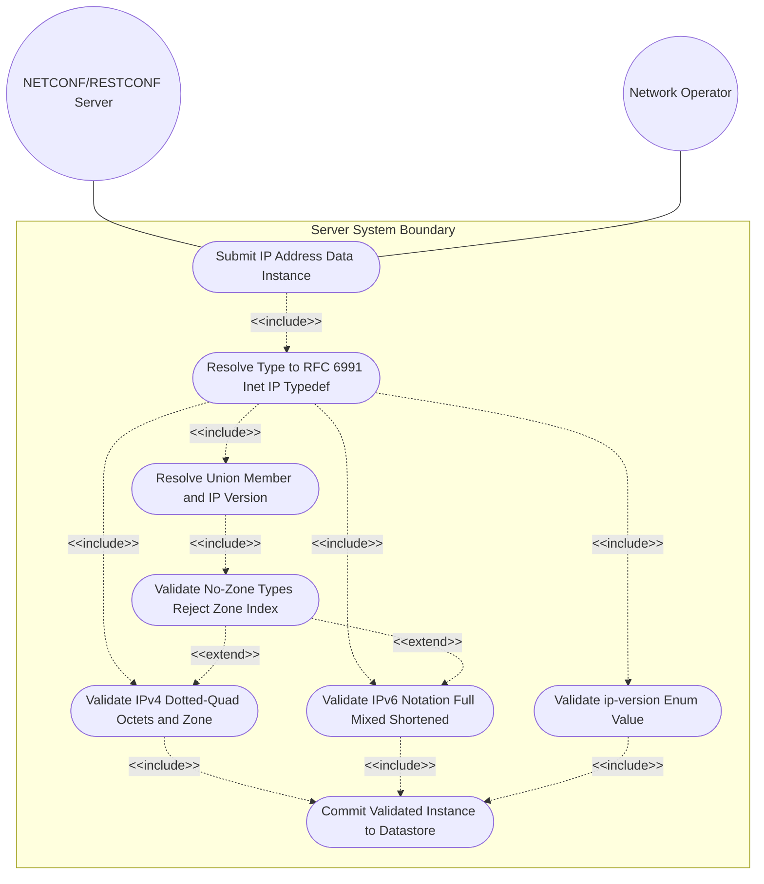
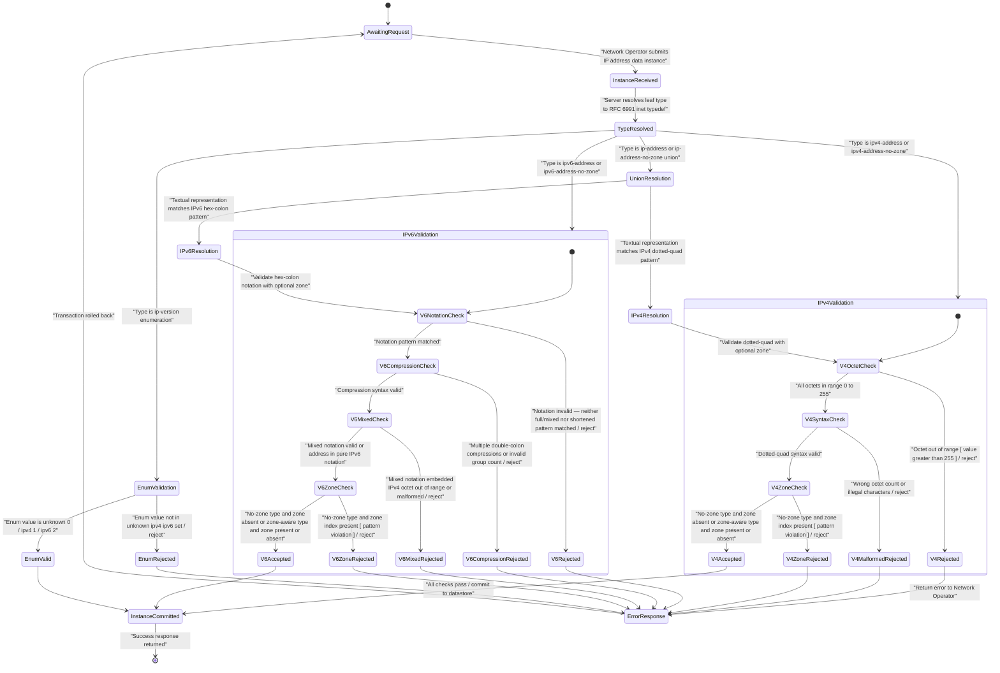

# Use Case: [RFC6991-INET] Validate IP Address Instance Against RFC 6991 Type Constraint

## Parent Epic
- [ ] #29 — [RFC6991-INET] Internet Protocol Suite Types (semantic linkage: this use case exercises runtime validation of IPv4, IPv6, zone-indexed, no-zone, and ip-version-enum IP address instances against all constraint dimensions defined by RFC 6991 Section 4 ietf-inet-types typedefs)

## 1. Actors
- **Primary Actor:** NETCONF/RESTCONF Server (the management-plane server subsystem that receives configuration or state data instances containing IP-address-typed fields and must validate each instance against its declared RFC 6991 inet-type before committing)
- **Secondary Actors:** Network Operator (the human or automation agent who submits configuration or state data instances and receives validation success or failure feedback)

## 2. Preconditions
- The NETCONF/RESTCONF Server has loaded the `ietf-inet-types` YANG module with the 2013-07-15 revision that includes the `-no-zone` address variants.
- A data instance pending validation contains a leaf or leaf-list field whose YANG type chain resolves to an RFC 6991 IP address typedef: `ip-address`, `ipv4-address`, `ipv6-address`, `ip-address-no-zone`, `ipv4-address-no-zone`, `ipv6-address-no-zone`, or `ip-version`.
- The Server's type-resolution subsystem has resolved the target leaf's type chain to the base `inet:ietf-inet-types` definitions.

## 3. Trigger
The Network Operator submits a configuration `<edit-config>` request (NETCONF) or a `PUT`/`PATCH` operation (RESTCONF) containing a data instance with one or more fields typed against an RFC 6991 inet IP address typedef, triggering the Server's instance validation pipeline.

## 4. Main Success Scenario (Basic Flow)
1. The Network Operator submits a configuration or state data instance containing an IP address field to the NETCONF/RESTCONF Server.
2. The Server resolves the target leaf's YANG schema path and traces the type chain to the RFC 6991 `ietf-inet-types` base typedef, identifying the specific IP address type (`ip-address`, `ipv4-address`, `ipv6-address`, `ip-address-no-zone`, `ipv4-address-no-zone`, `ipv6-address-no-zone`, or `ip-version`).
3. For union types (`ip-address`, `ip-address-no-zone`), the Server resolves the IP version from the textual representation of the address and selects the matching member type (`ipv4-address` or `ipv6-address`; `ipv4-address-no-zone` or `ipv6-address-no-zone`).
4. For IPv4 address types (`ipv4-address`, `ipv4-address-no-zone`), the Server validates the dotted-quad notation: four octets (0—255) separated by periods, optionally followed by `%` zone-index for `ipv4-address`; for `ipv4-address-no-zone` the zone-index is excluded by the restricting pattern `[0-9\.]*`.
5. For IPv6 address types (`ipv6-address`, `ipv6-address-no-zone`), the Server validates the address against the IPv6 notation patterns covering full, mixed, shortened, and shortened-mixed notation, optionally followed by `%` zone-index for `ipv6-address`; for `ipv6-address-no-zone` the zone-index is excluded by the restricting pattern `[0-9a-fA-F:\.]*`.
6. For no-zone types (`ip-address-no-zone`, `ipv4-address-no-zone`, `ipv6-address-no-zone`), the Server verifies that no `%` zone-identifier suffix is present in the address value.
7. For the `ip-version` enumeration type, the Server confirms the submitted value matches one of the defined enum members: `unknown` (0), `ipv4` (1), or `ipv6` (2).
8. All validations pass. The Server commits the validated instance to the configuration datastore and returns a success response to the Network Operator confirming the instance has been accepted.

## 5. Alternate and Exception Flows
- **5a. IPv4 Octet Out of Range (Branches from Basic Flow step 4):**
  1. The Server receives an `ipv4-address` value where one or more octets exceed 255 (e.g., `192.0.2.256`) and the dotted-quad pattern `(([0-9]|[1-9][0-9]|1[0-9][0-9]|2[0-4][0-9]|25[0-5])\.){3}...` fails to match the offending octet.
  2. The Server aborts the transaction with an error identifying the violating octet, the numeric bound 0—255, and the `error-tag` `invalid-value`. The configuration datastore is unmodified.
- **5b. IPv4 Address Malformed (Branches from Basic Flow step 4):**
  1. The Server receives an `ipv4-address` value with an incorrect number of octets (fewer or more than four), stray characters, or malformed delimiters (e.g., `192.0.2`, `192.0.2.1.1`, or `192.0.2.1:`).
  2. The Server aborts the transaction with an error identifying the structural violation (wrong octet count or illegal character) and the expected dotted-quad format. The configuration datastore is unmodified.
- **5c. IPv6 Address Format Invalid (Branches from Basic Flow step 5):**
  1. The Server receives an `ipv6-address` value whose textual representation matches neither the full/mixed IPv6 pattern nor the shortened/shortened-mixed pattern with `::` compression (e.g., `2001:db8:::1` with triple colon, or `gggg::1` with non-hexadecimal characters).
  2. The Server aborts the transaction with an error identifying the syntactic violation and the four supported IPv6 notation variants: full, mixed, shortened, and shortened-mixed. The configuration datastore is unmodified.
- **5d. IPv6 Compressed Syntax Invalid (Branches from Basic Flow step 5):**
  1. The Server receives an `ipv6-address` value that uses multiple `"::"` compressions (e.g., `2001::db8::1`) or resolves to an invalid group count after expansion, exceeding the eight 16-bit group limit.
  2. The Server aborts the transaction with an error identifying the ambiguous or excessive compression and stating that exactly one `"::"` compression is permitted per address. The configuration datastore is unmodified.
- **5e. Zone Index Present in No-Zone Type (Branches from Basic Flow step 6):**
  1. The Server receives an `ipv4-address-no-zone`, `ipv6-address-no-zone`, or `ip-address-no-zone` value that contains a `%` zone-identifier suffix (e.g., `192.0.2.1%eth0` for `ipv4-address-no-zone` or `fe80::1%eth0` for `ip-address-no-zone`).
  2. The Server aborts the transaction with an error identifying the no-zone type, the presence of the zone index, and the restricting pattern constraint (e.g., `[0-9\.]*` for ipv4, `[0-9a-fA-F:\.]*` for ipv6) that excludes `%` characters. The configuration datastore is unmodified.
- **5f. IPv4 Embedded in Mixed IPv6 Notation Malformed (Branches from Basic Flow step 5):**
  1. The Server receives an `ipv6-address` value in mixed notation whose embedded IPv4 component contains an octet exceeding 255 or has an incorrect octet count (e.g., `::ffff:299.168.1.1` or `::ffff:192.168.1`).
  2. The Server aborts the transaction with an error identifying the malformed embedded IPv4 address, the dotted-quad octet constraint, and the violating component within the mixed IPv6 notation. The configuration datastore is unmodified.
- **5g. Unknown ip-version Enum Value (Branches from Basic Flow step 7):**
  1. The Server receives an `ip-version` value that does not match any defined enum member: not `0` (unknown), not `1` (ipv4), and not `2` (ipv6) — for example, a string like `"tcp"` or an integer `3`.
  2. The Server aborts the transaction with an error identifying the invalid enum value and listing the three valid enum members with their numeric values: `unknown` (0), `ipv4` (1), `ipv6` (2), per RFC 6991 Section 4. The configuration datastore is unmodified.

## 6. Postconditions (Guarantees)
- **Success Guarantee:** The validated IP address instance is committed to the NETCONF/RESTCONF configuration datastore. IPv4 addresses conform to dotted-quad notation (four octets 0—255), IPv6 addresses conform to one of four supported notations (full, mixed, shortened, shortened-mixed), union types resolve to the correct member family, no-zone types contain no zone-index suffix, and `ip-version` values match a defined enum member. The Network Operator receives a success response confirming the instance was accepted.
- **Failure Guarantee:** The configuration transaction is rolled back. The configuration datastore remains unmodified. The Server returns a precise error response identifying the violating leaf path, the RFC 6991 inet-type, the specific syntactic or semantic constraint breached, the offending value, and the expected valid format or value range per RFC 6991 Section 4.

## UML Diagrams
### Use Case Diagram

### State Machine Diagram

## 7. Operational Context
From RFC 6991, Section 4 (ietf-inet-types module revision 2013-07-15):

> The ip-address type represents an IP address and is IP version neutral. The format of the textual representation implies the IP version. This type supports scoped addresses by allowing zone identifiers in the address format.

> The ipv4-address type represents an IPv4 address in dotted-quad notation. The IPv4 address may include a zone index, separated by a % sign. The zone index is used to disambiguate identical address values. For link-local addresses, the zone index will typically be the interface index number or the name of an interface. If the zone index is not present, the default zone of the device will be used. The canonical format for the zone index is the numerical format.

> The ipv6-address type represents an IPv6 address in full, mixed, shortened, and shortened-mixed notation. The IPv6 address may include a zone index, separated by a % sign. The canonical format of IPv6 addresses uses the textual representation defined in Section 4 of RFC 5952. The canonical format for the zone index is the numerical format as described in Section 11.2 of RFC 4007.

> The ip-address-no-zone type represents an IP address and is IP version neutral. The format of the textual representation implies the IP version. This type does not support scoped addresses since it does not allow zone identifiers in the address format.

> An IPv4 address without a zone index. This type, derived from ipv4-address, may be used in situations where the zone is known from the context and hence no zone index is needed. This type was added in the 2013-07-15 revision.

> An IPv6 address without a zone index. This type, derived from ipv6-address, may be used in situations where the zone is known from the context and hence no zone index is needed. This type was added in the 2013-07-15 revision.

## 8. Realization Matrix
### Required User Stories
- [ ] [#30](https://github.com/gintatkinson/3dgs-039/issues/30) — [RFC6991-INET] IP Address Scope and Zone Handling (semantic linkage: exercises the zone-index extraction and no-zone rejection behaviors validated by this use case across ipv4-address, ipv6-address, ipv4-address-no-zone, ipv6-address-no-zone, and both union types)
### Required Features
- [ ] [#26](https://github.com/gintatkinson/3dgs-039/issues/26) — [RFC6991-INET] IP Address Types (semantic linkage: defines the ip-address, ipv4-address, ipv6-address, ip-address-no-zone, ipv4-address-no-zone, ipv6-address-no-zone, and ip-version typedefs whose pattern, octet-range, compression-syntax, mixed-notation, zone-index, no-zone, and enum-member constraints are enforced at runtime by this use case)

## Source References
Structural Schema: [ietf-inet-types@2013-07-15.yang](https://raw.githubusercontent.com/gintatkinson/3dgs-039/main/schema/ietf-inet-types%402013-07-15.yang) (Collection: types related to IP addresses and hostnames — ip-address, ipv4-address, ipv6-address, ip-address-no-zone, ipv4-address-no-zone, ipv6-address-no-zone, ip-version)
Normative Specification: [RFC 6991](https://datatracker.ietf.org/doc/rfc6991/) (Section 4: Internet Protocol Suite Types, Table 2)
