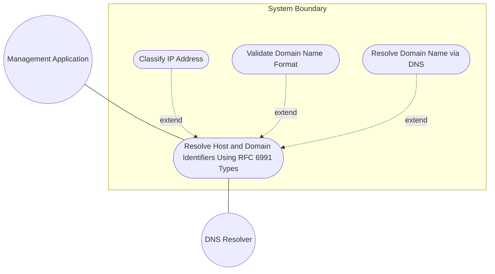
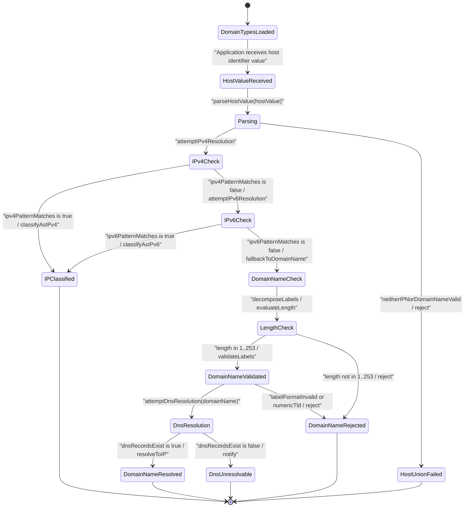

# Use Case: [RFC6991-INET] Resolve Host and Domain Identifiers Using RFC 6991 Types

## Parent Epic
- [ ] #29 - [RFC6991-INET Internet Protocol Suite Types](https://github.com/gintatkinson/3dgs-039/blob/main/docs/epics/epic-03-rfc6991-inet-types.md) (semantic linkage: this use case exercises the host union typedef and domain-name typedef resolution semantics defined in Epic #29)

## 1. Actors
- **Primary Actor:** Management Application
- **Secondary Actors:** DNS Resolver

## 2. Preconditions
- Application has a field typed with host (union of ip-address and domain-name) or domain-name.
- The ietf-inet-types module is loaded and its typedefs are available for validation.
- The DNS Resolver is reachable and configured for domain name resolution.

## 3. Trigger
Application receives a host identifier value and must determine whether it is an IP address or a DNS domain name.

## 4. Main Success Scenario (Basic Flow)
1. Management Application sends a host identifier value to the System for type classification.
2. System parses the host value by invoking the host union typedef resolution path, confirming the union aggregates ip-address and domain-name member types.
3. System attempts IP address resolution first: it tries ipv4-address pattern matching, then ipv6-address pattern matching, following the union member declaration order.
4. If a valid IP address is matched, System classifies the host as an IP address, records the IP version (IPv4 or IPv6), and returns the resolved type classification to the Management Application.
5. If no IP address pattern matches, System falls back to domain-name validation by decomposing the value into dot-separated labels and checking label format, length bounds (1-253 total characters), and TLD rules.
6. If domain-name validation passes, System classifies the host as a DNS domain name and optionally initiates DNS resolution via the DNS Resolver to obtain A/AAAA records.
7. DNS Resolver returns resolved IP addresses or confirms no records exist; System returns the resolved type classification and any resolved addresses to the Management Application.

## 5. Alternate and Exception Flows
- **5a. Domain name label exceeds 63 characters (Branches from Basic Flow step 5):**
  1. System detects that one or more labels in the domain name exceed the maximum label length of 63 characters as defined by RFC 1034.
  2. System aborts the classification, rejects the host value, and notifies the Management Application with a label-length-constraint violation error.
- **5b. Domain name label starts with hyphen (Branches from Basic Flow step 5):**
  1. System detects that a label within the domain name begins with a hyphen character, violating RFC 952 label format rules.
  2. System aborts the classification, rejects the host value, and notifies the Management Application with a label-format-start-hyphen violation error.
- **5c. Domain name label ends with hyphen (Branches from Basic Flow step 5):**
  1. System detects that a label within the domain name ends with a hyphen character, violating RFC 952 label format rules.
  2. System aborts the classification, rejects the host value, and notifies the Management Application with a label-format-end-hyphen violation error.
- **5d. Domain name exceeds 253 characters (Branches from Basic Flow step 5):**
  1. System detects that the total domain name length exceeds 253 characters, which is the textual dotted-notation maximum imposed by the 255-byte DNS encoding limit minus the length-prefix byte and trailing NUL byte.
  2. System aborts the classification, rejects the host value, and notifies the Management Application with a total-length-constraint violation error (maximum 253 characters).
- **5e. Domain name contains invalid characters (Branches from Basic Flow step 5):**
  1. System detects characters outside the permitted set of alphanumeric characters (a-z, A-Z, 0-9), hyphens, underscores, and dots within the domain name value.
  2. System aborts the classification, rejects the host value, and notifies the Management Application with an invalid-character violation error.
- **5f. TLD label is entirely numeric (Branches from Basic Flow step 5):**
  1. System identifies the rightmost label as the top-level domain and detects that it consists entirely of numeric digits (e.g., "example.123"), violating RFC 3696 Section 2.
  2. System aborts the classification, rejects the host value, and notifies the Management Application with a numeric-TLD violation error.
- **5g. Internationalized domain name not encoded as A-label (Branches from Basic Flow step 5):**
  1. System detects non-ASCII Unicode characters (U-label) in the domain name value that are not encoded as an RFC 5890 IDNA A-label.
  2. System aborts the classification, rejects the host value, and notifies the Management Application with an IDNA-encoding violation error.
- **5h. Empty domain name (Branches from Basic Flow step 5):**
  1. System detects that the domain name value is an empty string, violating the minimum length constraint of 1 character.
  2. System aborts the classification, rejects the host value, and notifies the Management Application with a minimum-length-constraint violation error.
- **5i. Host union resolution failure (Branches from Basic Flow step 3):**
  1. System fails to parse the host value as an IPv4 address, then fails to parse it as an IPv6 address, and then domain-name validation also fails.
  2. System concludes the value matches neither member of the host union (ip-address nor domain-name).
  3. System aborts the classification, rejects the host value, and notifies the Management Application with a union-resolution-failure error.
- **5j. DNS resolution failure - unresolvable hostname (Branches from Basic Flow step 6):**
  1. DNS Resolver receives the validated domain name for resolution and returns no A or AAAA records (NXDOMAIN or NODATA response).
  2. System records the host as a syntactically valid but unresolvable domain name.
  3. System notifies the Management Application that the hostname is unresolvable, returning the validated domain name without resolved IP addresses.
- **5k. Domain name canonical case normalization (Branches from Basic Flow step 5):**
  1. System detects uppercase or mixed-case US-ASCII characters in the domain name value.
  2. System normalizes the value to lowercase US-ASCII before applying pattern and label validation checks per RFC 6991 canonical format rules.
- **5l. Partially qualified domain name accepted with advisory (Branches from Basic Flow step 5):**
  1. System detects that the domain name is not fully qualified (no trailing dot and fewer than two dot-separated labels for a typical FQDN).
  2. System accepts the value for syntactic validation but records an advisory indicating the name is not fully qualified, recommending full qualification whenever possible per RFC 6991.
- **5m. RFC 952 strict host name enforcement (Branches from Basic Flow step 5):**
  1. System detects that the schema node consuming the domain-name type requires stricter RFC 952 host name syntax.
  2. System applies additional constraints: labels must start with a letter, must be at most 24 characters, and underscores are not permitted.
  3. System rejects the value and notifies the Management Application if the stricter host name constraints are violated.
- **5n. Domain name resolution metadata missing (Branches from Basic Flow step 6):**
  1. System identifies that the schema node consuming the domain-name type has no description of when and how names are resolved to IP addresses.
  2. System logs a configuration advisory and proceeds with default resolver configuration, querying A and AAAA records.
- **5o. Multiple DNS record type query (Branches from Basic Flow step 6):**
  1. DNS Resolver queries for both A records (IPv4) and AAAA records (IPv6) for the validated domain name.
  2. System merges all resolved IP addresses from all record types, applies resolver-defined precedence ordering, and returns the complete set to the Management Application.
- **5p. Domain name standards reference compliance (Branches from Basic Flow step 5):**
  1. System validates the domain name using the pattern defined per the reference chain of RFC 952, RFC 1034, RFC 1123, RFC 2782, and RFC 5890.
  2. System records the standards compliance status for each applicable RFC and aggregates the results into a conformance report returned to the Management Application.
- **5q. Host union member type structural validation (Branches from Basic Flow step 2):**
  1. System inspects the host union definition at schema load time to confirm it aggregates only ip-address and domain-name member types.
  2. System rejects any host value that references an unsupported or unknown union member type, notifying the Management Application of structural schema mismatch.
- **5r. Host union ip-address sub-union resolution (Branches from Basic Flow step 3):**
  1. System resolves the ip-address union member first to ipv4-address, then to ipv6-address per declaration order within the ip-address typedef.
  2. System records the selected IP version (IPv4 or IPv6) and reports the resolved submember classification to the Management Application.
- **5s. Domain name fallback validation after IP resolution failure (Branches from Basic Flow step 5):**
  1. System exhausts all IP address resolution attempts (IPv4 and IPv6 pattern matching) without success.
  2. System proceeds to domain-name validation as the fallback union member, decomposing the value into dot-separated labels and applying the domain-name regex pattern and length constraints.
- **5t. SMIv2 compatibility translation for host type (Branches from Basic Flow step 2):**
  1. System detects that a downstream consumer requires SMIv2 textual convention equivalents for the host type.
  2. System notes that the host type has no SMIv2 equivalent and provides the constituent ip-address and domain-name member representations instead.
- **5u. Domain name type mismatch (Branches from Basic Flow step 5):**
  1. System detects that the value provided for domain-name validation is not a string base type at the type system level.
  2. System rejects the value and notifies the Management Application of the base type mismatch before applying pattern and length checks.
- **5v. URI non-RFC 3986 conformance (Branches from Basic Flow step 5):**
  1. System parses a URI value and detects structural violations of RFC 3986 (STD 66) syntax including missing scheme, unescaped reserved characters, or invalid authority component.
  2. System rejects the value and notifies the Management Application with the specific RFC 3986 section violated.
- **5w. URI non-ASCII encoding rejection (Branches from Basic Flow step 5):**
  1. System detects non-US-ASCII characters in a URI value at the character encoding level.
  2. System rejects the value and notifies the Management Application of the US-ASCII encoding requirement violation per RFC 6991.
- **5x. URI unnecessary percent-encoding removal (Branches from Basic Flow step 5):**
  1. System detects percent-encoded characters in a URI value that correspond to unreserved characters defined in RFC 3986 Section 2.3.
  2. System normalizes the URI by removing unnecessary percent-encoding per RFC 3986 Section 6.2.2.2 before validation.
- **5y. URI case normalization applied (Branches from Basic Flow step 5):**
  1. System detects uppercase or mixed-case characters in URI scheme and host components.
  2. System normalizes the scheme and host to lowercase per RFC 3986 Section 6.2.2.1 before validation.
- **5z. URI hexadecimal digit normalization to uppercase (Branches from Basic Flow step 5):**
  1. System detects lowercase hexadecimal digits in percent-encoded triplets within a URI value.
  2. System normalizes the hexadecimal digits to uppercase per RFC 3986 Section 6.2.2.1 before validation.
- **5aa. Zero-length URI absent handling (Branches from Basic Flow step 5):**
  1. System detects a zero-length string in a field typed as uri.
  2. System treats the zero-length value as representing "URI absent" rather than raising a validation error, and notifies the Management Application that the URI field is logically empty.
- **5ab. URI scheme restriction enforcement (Branches from Basic Flow step 5):**
  1. System detects that the URI value uses a scheme (e.g., "data:" or "urn:") that the schema node has explicitly disallowed.
  2. System rejects the value and notifies the Management Application with the prohibited scheme and the list of permitted schemes.
- **5ac. URI SMIv2 equivalence mapping for downstream consumers (Branches from Basic Flow step 5):**
  1. System detects that a downstream consumer requires SMIv2 Uri textual convention equivalence per RFC 5017.
  2. System provides a bidirectional mapping between the YANG uri type and the SMIv2 Uri convention, preserving US-ASCII encoding and normalization semantics.
- **5ad. URI standards reference chain compliance audit (Branches from Basic Flow step 5):**
  1. System validates the URI against the full reference chain of RFC 3986, RFC 3305, and RFC 5017.
  2. System records compliance status for each standard and aggregates the results into a conformance report returned to the Management Application.

## 6. Postconditions (Guarantees)
- **Success Guarantee:** The host value is classified as either a valid IPv4 address, a valid IPv6 address, or a valid DNS domain name. If classified as a domain name, an attempt has been made to resolve it via DNS and any resolved IP addresses are available. The Management Application possesses an unambiguous type classification.
- **Failure Guarantee:** The host value is rejected. The System remains in a consistent state with no partial classification stored. The Management Application receives a specific error code indicating which constraint was violated (label length, label format, total length, invalid characters, numeric TLD, IDNA encoding, or union resolution failure).

## UML Diagrams
### Use Case Diagram

### State Machine Diagram

## 7. Operational Context
From RFC 6991 Section 4 (ietf-inet-types module):

> The host type represents either an IP address or a DNS domain name.

> The description clause of schema nodes using the domain-name type MUST describe when and how these names are resolved to IP addresses. Note that the resolution of a domain-name value may require to query multiple DNS records (e.g., A for IPv4 and AAAA for IPv6). The order of the resolution process and which DNS record takes precedence can either be defined explicitly or may depend on the configuration of the resolver.

> Domain-name values use the US-ASCII encoding. Their canonical format uses lowercase US-ASCII characters. Internationalized domain names MUST be A-labels as per RFC 5890.

> The encoding of DNS names in the DNS protocol is limited to 255 characters. Since the encoding consists of labels prefixed by a length bytes and there is a trailing NULL byte, only 253 characters can appear in the textual dotted notation.

## 8. Realization Matrix
### Required User Stories
- [ ] #32 - [RFC6991-INET Domain Name Validation Rules](https://github.com/gintatkinson/3dgs-039/blob/main/docs/user-stories/us-12-rfc6991-inet-domain-name-validation-rules.md) (exercises domain-name label format, length bounds, TLD rules, and canonical form validation semantics required by the domain-name resolution branch of the host union)
- [ ] #31 - [RFC6991-INET Host Identifier Resolution](https://github.com/gintatkinson/3dgs-039/blob/main/docs/user-stories/us-13-rfc6991-inet-host-identifier-resolution.md) (exercises host union member disambiguation semantics -- IP address versus domain name classification -- with IP-first resolution order)
### Required Features
- [ ] #28 - [RFC6991-INET Domain, Host, and URI Types](https://github.com/gintatkinson/3dgs-039/blob/main/docs/features/feat-13-rfc6991-inet-domain-host-and-uri-types.md) (defines the Host union type combining ip-address and domain-name, the DomainName datatype with label pattern and length constraints, and the IetfInetTypes validation component whose RESOLVE and DECOMPOSE operations are exercised by this use case)

## Source References
Structural Schema: [ietf-inet-types@2013-07-15.yang](https://raw.githubusercontent.com/gintatkinson/3dgs-039/main/schema/ietf-inet-types%402013-07-15.yang) (typedef: host -- union of inet:ip-address and inet:domain-name; typedef: domain-name -- string with pattern and length constraint)
Normative Specification: [RFC 6991](https://datatracker.ietf.org/doc/rfc6991/) (Section 4: Internet Protocol Suite Types, host and domain-name typedefs, Table 2)
