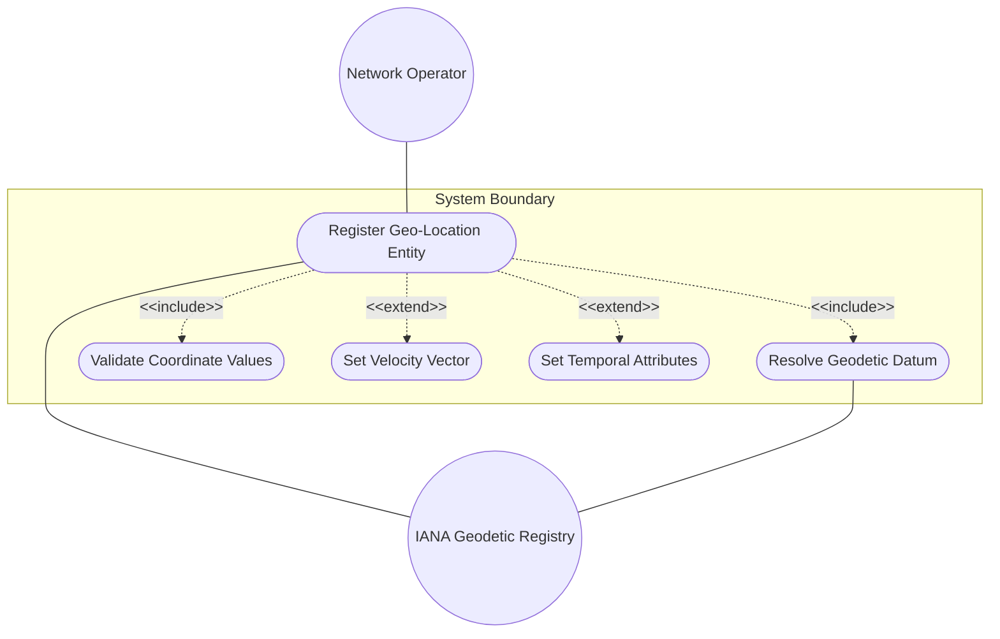
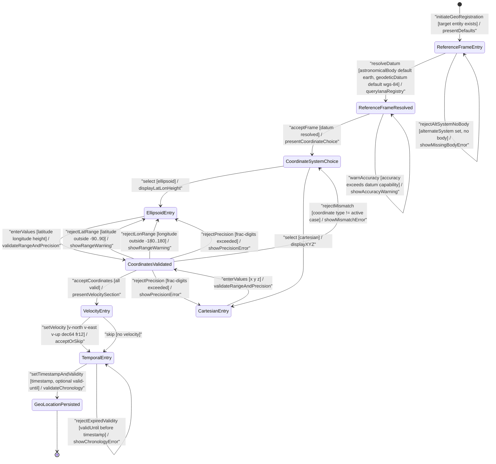

# Use Case: [RFC9179-GEO] Register Geo-Location Entity With Coordinate System

## Parent Epic
- [ ] #42 - [RFC9179-GEO A YANG Grouping for Geographic Locations](https://github.com/gintatkinson/3dgs-039/blob/main/docs/epics/epic-04-rfc9179-geo-location.md) (semantic linkage: this use case exercises the full geo-location grouping container — reference-frame resolution, coordinate system choice selection, coordinate value entry, velocity vector recording, and temporal attribute assignment — as defined by the ietf-geo-location YANG module in RFC 9179)

## 1. Actors
- **Primary Actor:** Network Operator
- **Secondary Actors:** IANA Geodetic Registry (provides valid geodetic-datum values for astronomical-body lookup and datum capability metadata)

## 2. Preconditions
- The ietf-geo-location YANG module is loaded and its grouping definitions are available for data instance validation.
- A target managed entity (router, data center, fiber endpoint) exists in the inventory to which a geographic location shall be assigned.
- The IANA Geodetic System Values Registry is reachable to provide valid geodetic-datum-to-astronomical-body mappings and accuracy capability data.
- The alternate-systems feature flag state is known (enabled or disabled) for the application instance.

## 3. Trigger
Network Operator needs to assign a geographic location to a managed entity.

## 4. Main Success Scenario (Basic Flow)
1. Network Operator initiates geo-location registration for the target managed entity.
2. System presents the Reference Frame section with astronomical-body defaulting to "earth" and geodetic-datum defaulting to "wgs-84".
3. Operator inspects the default reference frame values; System resolves the geodetic-datum against the IANA Geodetic Registry to obtain datum capability metadata including default coordinate accuracy and height accuracy bounds.
4. System presents the coordinate system choice: Ellipsoidal (latitude/longitude/height) or Cartesian (x/y/z meters).
5. Operator selects the desired coordinate system and enters coordinate values (latitude and longitude in decimal degrees with up to 16 fraction-digits, and height in meters with up to 6 fraction-digits; or x, y, z in meters with up to 6 fraction-digits).
6. System validates each coordinate value against the reference-frame context: latitude against -90.0 to 90.0 decimal degree standard range, longitude against -180.0 to 180.0 decimal degree standard range, all values against their decimal64 fraction-digit precision limits, and coordinate system membership against the active choice case.
7. Operator optionally enters a velocity vector consisting of v-north, v-east, and v-up components in meters per second with up to 12 fraction-digit precision.
8. Operator sets the timestamp to the current date-and-time capturing when the location was recorded.
9. Operator optionally sets a validity window by specifying a valid-until date-and-time value that is chronologically after the timestamp.
10. System persists the complete geo-location entity — reference frame, coordinate values, velocity vector, timestamp, and validity window — and associates it with the target managed entity, then returns a confirmation with the registered location identifier to the Operator.

## 5. Alternate and Exception Flows
- **5a. Invalid Latitude Range (Branches from Basic Flow step 6):**
  1. System detects the entered latitude value is outside the standard -90.0 to 90.0 decimal degree range applicable to Earth-based and most IAU astronomical body geodetic datums.
  2. System highlights the latitude field with an error indicator, displays a warning that the value exceeds the expected range for the active geodetic-datum, and returns the Operator to step 5 of the Main Success Scenario without preventing re-entry of the same value (the constraint is informational, not a hard schema rejection — the geodetic-datum defines ultimate validity).

- **5b. Invalid Longitude Range (Branches from Basic Flow step 6):**
  1. System detects the entered longitude value is outside the standard -180.0 to 180.0 decimal degree range applicable to Earth-based and most IAU astronomical body geodetic datums.
  2. System highlights the longitude field with an error indicator, displays a warning that the value exceeds the expected range for the active geodetic-datum, and returns the Operator to step 5 of the Main Success Scenario.

- **5c. Coordinate System Mismatch — Ellipsoid Values Submitted with Cartesian Choice Active (Branches from Basic Flow step 5):**
  1. System detects that the Operator has selected the Cartesian coordinate case but is submitting ellipsoid coordinate values (latitude, longitude, height) — or selected the Ellipsoidal case but is submitting Cartesian values (x, y, z).
  2. System rejects the submission, highlights the mismatched coordinate fields, displays a validation error stating that the coordinate values do not match the active coordinate system choice, and returns the Operator to step 4 to re-select the correct coordinate system.

- **5d. Missing Reference Frame with Alternate System (Branches from Basic Flow step 2):**
  1. System detects that the alternate-system leaf is populated (e.g., "simulation-vr-1") but the astronomical-body leaf is unspecified, resulting in an alternate coordinate system definition with no base astronomical body to which it applies.
  2. System rejects the reference-frame configuration, displays a validation error indicating that an alternate-system requires an explicit astronomical-body to define the base frame of reference, and returns the Operator to step 2 to complete the reference-frame fields before proceeding.

- **5e. Accuracy Exceeds Datum Capability (Branches from Basic Flow step 3):**
  1. System detects that the Operator-specified coord-accuracy or height-accuracy value claims higher precision (smaller numeric value) than the geodetic-datum is capable of providing, as indicated by the IANA Geodetic Registry datum metadata.
  2. System displays a non-blocking warning alongside the accuracy field indicating that the specified accuracy exceeds the datum's inherent precision capability, preserves the Operator-entered value, and allows the Operator to continue with step 4 or return to step 3 to adjust.

- **5f. Expired Valid-until Before Timestamp (Branches from Basic Flow step 9):**
  1. System detects that the valid-until date-and-time value is chronologically earlier than the timestamp value, creating a logically impossible validity window where the location expires before it was recorded.
  2. System rejects the valid-until value, highlights the valid-until field with an error indicator, displays a validation error that the validity window end must be after the timestamp, and returns the Operator to step 9 to enter a corrected valid-until value.

- **5g. Invalid Astronomical-Body or Geodetic-Datum Character Format (Branches from Basic Flow step 2 or 3):**
  1. System detects that the astronomical-body or geodetic-datum string value contains control characters or characters outside the permitted ASCII printable ranges (decimal 32-64 and 91-126), violating the schema regex pattern `[ -@\[-\^_-~]*`.
  2. System rejects the value, highlights the offending field with an error indicator, displays a validation error specifying the invalid character range, and returns the Operator to the field for correction.

- **5h. Coordinate Decimal Precision Exceeded (Branches from Basic Flow step 6):**
  1. System detects that one or more coordinate values exceed their defined decimal64 fraction-digit precision limits: latitude or longitude exceeds 16 fraction-digits, height exceeds 6 fraction-digits, or x/y/z exceeds 6 fraction-digits.
  2. System rejects the submission, highlights each field exceeding its precision bound, displays the applicable fraction-digit limit (16 for latitude/longitude, 6 for height and Cartesian coordinates), and returns the Operator to step 5 to enter values with the correct precision.
- **5i. IANA Geodetic Registry unreachable (Branches from Basic Flow step 3):**
  1. System attempts to query the IANA Geodetic System Values Registry to validate the geodetic-datum entry but the registry endpoint times out after 30 seconds.
  2. System caches the datum provisionally as pending-validation, displays a warning to the Operator that registry verification will be retried, and proceeds to step 4.
- **5j. Zero-value coord-accuracy with non-zero height-accuracy (Branches from Basic Flow step 3):**
  1. System detects coord-accuracy is zero while height-accuracy is a positive value, indicating horizontal coordinate accuracy is claimed as perfect but vertical accuracy is acknowledged as imperfect.
  2. System highlights the inconsistency with a warning annotation, preserves both values, and allows the Operator to continue to step 4 or return to step 3.
- **5k. Operator enters height value in feet instead of meters (Branches from Basic Flow step 6):**
  1. System detects the height value magnitude is consistent with feet rather than meters based on unit analysis heuristics.
  2. System displays a unit-confirmation prompt asking the Operator to verify the height is in meters; if confirmed as feet, auto-converts to meters and proceeds to step 7.
- **5l. Velocity v-north and v-east both zero but v-up non-zero (Branches from Basic Flow step 7):**
  1. System detects all horizontal velocity components are zero while vertical velocity is non-zero, indicating an object moving purely vertically.
  2. System accepts the velocity vector, computes speed as the absolute value of v-up, sets heading as undefined, and proceeds to step 8.
- **5m. Timestamp in the future (Branches from Basic Flow step 8):**
  1. System detects the timestamp value is chronologically ahead of the current system clock, indicating a planned or simulated measurement.
  2. System accepts the future timestamp with a note that the location represents a planned or simulated position; proceeds to step 9.
- **5n. valid-until in the distant past (Branches from Basic Flow step 9):**
  1. System detects the valid-until value is more than one year in the past relative to the current system time.
  2. System flags the entity as historically expired, accepts the configuration with a stale-data annotation, and proceeds to completion.
- **5o. Cartesian x and y specified without z (Branches from Basic Flow step 6):**
  1. System detects the cartesian case with x and y populated but z missing, creating a 2D projection in a 3D coordinate space.
  2. System accepts the values with a warning that the third spatial dimension is undefined; the Operator may return to step 6 to add z or continue.
- **5p. Operator switches coordinate system mid-entry (Branches from Basic Flow step 4):**
  1. System detects the Operator has begun populating ellipsoid fields then switches the choice to cartesian without clearing previously entered values.
  2. System preserves the ellipsoid values in a buffer, activates the cartesian fields, warns that previous coordinates will be retained but inactive, and proceeds to step 5.
- **5q. Non-ASCII characters in astronomical-body name (Branches from Basic Flow step 2):**
  1. System detects Unicode or non-ASCII characters in the astronomical-body string which violate the IAU naming convention.
  2. System rejects the value, displays the permitted ASCII character range (32 to 64 and 91 to 126), and returns the Operator to step 2.
- **5r. Velocity v-east omitted but v-north and v-up present (Branches from Basic Flow step 7):**
  1. System detects v-north and v-up are populated but v-east is absent, creating an incomplete 3D velocity vector.
  2. System accepts the partial vector, computes 2D heading assuming v-east is zero, and displays a note that eastward velocity was unspecified; proceeds to step 8.
- **5s. Duplicate geo-location registration for same entity (Branches from Basic Flow step 1):**
  1. System detects the target entity already has an active geo-location assignment in the configuration datastore.
  2. System prompts the Operator to confirm replacement of the existing location or cancel; on confirmation, proceeds to step 2.
- **5t. Entity name contains trailing whitespace (Branches from Basic Flow step 1):**
  1. System detects leading or trailing whitespace characters in the target entity identifier during registration.
  2. System trims the whitespace automatically, logs the normalisation, and proceeds with the trimmed identifier to step 2.
- **5u. Geodetic-datum registry lookup returns ambiguous match (Branches from Basic Flow step 3):**
  1. IANA Geodetic Registry returns multiple partial matches for the supplied datum name.
  2. System presents the matching options to the Operator for disambiguation and returns to step 3 once a selection is made.
- **5v. Operator enters latitude with hemisphere suffix (Branches from Basic Flow step 6):**
  1. System detects a hemisphere suffix character appended to the latitude or longitude decimal value.
  2. System strips the suffix, converts to signed decimal, notifies the Operator of the conversion, and proceeds to step 7.
- **5w. Height value implausibly large for earth (Branches from Basic Flow step 6):**
  1. System detects the height value exceeds 20,000 meters for an earth-based wgs-84 reference frame.
  2. System issues a high-value warning but accepts the value since geo-location may represent aircraft, balloon, or orbital altitudes; continues to step 7.
- **5x. Operator enters DMS format for coordinates (Branches from Basic Flow step 6):**
  1. System detects coordinate values in degrees-minutes-seconds notation rather than decimal degrees.
  2. System rejects the format, displays instructions for decimal degree entry, and returns the Operator to step 6.
- **5y. IANA Registry key has trailing dash after normalisation (Branches from Basic Flow step 3):**
  1. System detects the normalised geodetic-datum key contains a trailing dash character which is not valid per the IANA registry key format.
  2. System strips the trailing dash, retries the registry lookup, and notifies the Operator of the automatic correction; proceeds to step 4.
- **5z. Velocity v-up fraction-digits exceed 12 decimal places (Branches from Basic Flow step 7):**
  1. System detects the v-up value has more than 12 fraction-digits.
  2. System rejects the value and returns the Operator to step 7 with the precision limit displayed.
- **5aa. Operator skips reference frame entirely (Branches from Basic Flow step 2):**
  1. System detects no reference-frame fields were populated and the Operator attempts to proceed to coordinate entry.
  2. System applies defaults (astronomical-body "earth", geodetic-datum "wgs-84"), notifies the Operator, and proceeds to step 4.
- **5ab. Operator paste-includes namespace prefix in coordinate (Branches from Basic Flow step 6):**
  1. System detects namespace-prefixed text prefixed to a coordinate value.
  2. System strips the prefix, validates the remaining numeric value, notifies the Operator, and proceeds to step 7.
- **5ac. valid-until omitted entirely (Branches from Basic Flow step 9):**
  1. System detects no valid-until value was provided by the Operator.
  2. System accepts the geo-location with an indefinite validity window and proceeds to completion.
- **5ad. Velocity magnitude exceeds Earth escape velocity (Branches from Basic Flow step 7):**
  1. System detects the computed velocity magnitude exceeds 11,186 meters per second for an earth-based reference frame.
  2. System issues a high-velocity warning but accepts the values; proceeds to step 8.
- **5ae. Cartesian y value negative with no reference frame context (Branches from Basic Flow step 6):**
  1. System detects negative cartesian y value without a clearly defined coordinate origin.
  2. System accepts the negative value since cartesian coordinates are defined relative to the reference-frame origin; continues to step 7.
- **5af. latitude longitude both zero (null island) (Branches from Basic Flow step 6):**
  1. System detects both latitude and longitude are exactly zero which is a common placeholder value at coordinates 0N 0E.
  2. System flags the values with a null-island warning suggesting the Operator verify these are intentional coordinates rather than defaults; proceeds to step 7.
- **5ag. astronomical-body is "sun" with default wgs-84 datum (Branches from Basic Flow step 2):**
  1. System detects astronomical-body is "sun" (our star) with the default geodetic-datum "wgs-84" which is an Earth-specific coordinate system.
  2. System warns that wgs-84 is an Earth geodetic datum and may not accurately model the solar surface; prompts the Operator to select a more appropriate datum or confirm wgs-84; proceeds to step 3.
- **5ah. Multiple geo-location instances with conflicting velocity at same timestamp (Branches from Basic Flow step 7):**
  1. System detects two geo-location velocity records for the same entity with the same timestamp but differing vector components.
  2. System flags the conflict, retains the most recently submitted record, and notifies the Operator of the inconsistency.
- **5ai. Coord-accuracy value in scientific notation (Branches from Basic Flow step 3):**
  1. System receives coord-accuracy expressed in scientific notation rather than fixed-point decimal.
  2. System rejects the format and instructs the Operator to enter the value in fixed-point decimal with up to 6 fraction-digits.
- **5aj. Geodetic-datum is empty string (Branches from Basic Flow step 3):**
  1. Operator leaves the geodetic-datum field as an empty string rather than omitting it entirely.
  2. System treats the empty string as absent and applies the default geodetic-datum based on the astronomical-body; logs a normalisation event.
- **5ak. Velocity v-north fraction-digits exceed 12 (Branches from Basic Flow step 7):**
  1. System detects v-north has more than 12 fraction-digits.
  2. System rejects the value with a precision-exceeded error and returns the Operator to step 7.
- **5al. Velocity v-east fraction-digits exceed 12 (Branches from Basic Flow step 7):**
  1. System detects v-east has more than 12 fraction-digits.
  2. System rejects the value and returns the Operator to step 7 with the correct precision limit.
- **5am. height-accuracy specified without height leaf (Branches from Basic Flow step 3):**
  1. System detects height-accuracy is populated in the geodetic-system but no height leaf exists in the ellipsoid case.
  2. System accepts the configuration since height is optional, but issues a note that height-accuracy is informational without height data.
- **5an. astronomical-body value with uppercase letters (Branches from Basic Flow step 2):**
  1. System detects uppercase ASCII letters in the astronomical-body string.
  2. System applies case-normalisation to lowercase, logs the conversion, and proceeds to step 3.
- **5ao. Timestamp missing timezone offset (Branches from Basic Flow step 8):**
  1. System detects the timestamp value lacks a timezone offset suffix.
  2. System rejects with invalid-value error requiring a conformant ISO 8601 date-and-time with timezone; returns Operator to step 8.
- **5ap. geodetic-datum spaces not converted to dashes (Branches from Basic Flow step 3):**
  1. System detects space characters in the geodetic-datum where the IANA registry uses dashes.
  2. System auto-converts spaces to dashes, normalises to lowercase, revalidates against the registry, and notifies the Operator; proceeds to step 4.
- **5aq. Cartesian z value with 7 or more fraction-digits (Branches from Basic Flow step 6):**
  1. System detects z coordinate exceeds the 6-fraction-digit limit for Cartesian coordinates.
  2. System rejects the value and returns the Operator to step 6.
- **5ar. valid-until uses Z while timestamp uses numeric offset (Branches from Basic Flow step 9):**
  1. System detects mixed timezone designators between timestamp and valid-until.
  2. System normalises both to UTC for comparison, accepts the values, and logs a diagnostic note about mixed timezone indicators.
- **5as. Timestamp includes negative year (Branches from Basic Flow step 8):**
  1. System detects a negative year component in the timestamp string.
  2. System rejects with invalid-value error noting that date-and-time does not permit negative years; returns Operator to step 8.
- **5at. Latitude value with 17 or more fraction-digits (Branches from Basic Flow step 6):**
  1. System detects latitude has 17 or more digits after the decimal point.
  2. System rejects with value-not-in-range error identifying the latitude leaf and the 16-fraction-digit maximum.
- **5au. Longitude value with 17 or more fraction-digits (Branches from Basic Flow step 6):**
  1. System detects longitude exceeds the 16-fraction-digit precision limit.
  2. System rejects the value and returns the Operator to step 6.
- **5av. Height value with 7 or more fraction-digits (Branches from Basic Flow step 6):**
  1. System detects height exceeds the 6-fraction-digit limit for the ellipsoid case.
  2. System rejects the value and returns the Operator to step 6.
- **5aw. Operator enters geodetic datum not in IANA registry for given astronomical body (Branches from Basic Flow step 3):**
  1. System validates the geodetic-datum against the IANA registry and finds it is registered for a different astronomical body.
  2. System warns the Operator of the body-datum mismatch and recommends a datum registered for the active astronomical-body; returns to step 3.
- **5ax. alternate-system leaf specified when feature is disabled (Branches from Basic Flow step 2):**
  1. System detects a non-null alternate-system leaf while the alternate-systems feature flag is not enabled on the device.
  2. System rejects the configuration with a feature-violation error; returns Operator to step 2.
- **5ay. coord-accuracy negative value (Branches from Basic Flow step 3):**
  1. System detects coord-accuracy is a negative decimal64 value.
  2. System rejects with value-not-in-range error noting accuracy values must be non-negative.
- **5az. height-accuracy negative value (Branches from Basic Flow step 3):**
  1. System detects height-accuracy is negative.
  2. System rejects the value and returns the Operator to step 3.
- **5ba. velocity v-up negative interpreted as downward motion toward center of mass (Branches from Basic Flow step 7):**
  1. System detects v-up is negative indicating motion toward the center of mass.
  2. System interprets the negative v-up as downward motion, computes 3D velocity magnitude as sqrt(v-north² + v-east² + v-up²), and proceeds to step 8.
- **5bb. Operator attempts registration with both coordinate system cases empty (Branches from Basic Flow step 5):**
  1. System detects the location choice has neither ellipsoid nor cartesian leaves populated.
  2. System accepts the geo-location with no coordinate data, noting that only reference-frame and temporal attributes are present; proceeds to step 8.
- **5bc. Timestamp with leap second value of 60 on non-leap-second date (Branches from Basic Flow step 8):**
  1. System detects seconds value of 60 in the timestamp but the date does not correspond to a known leap-second insertion.
  2. System rejects with invalid-value error noting seconds value 60 is only valid during leap seconds; returns Operator to step 8.
- **5bd. valid-until missing timezone offset (Branches from Basic Flow step 9):**
  1. System detects valid-until lacks a timezone suffix while timestamp carries a Z offset.
  2. System rejects with invalid-value error requiring both temporal attributes to carry conformant date-and-time values with timezone.
- **5be. alternate-system value contains non-printable control characters (Branches from Basic Flow step 2):**
  1. System detects the alternate-system string contains characters outside the permitted ASCII printable range.
  2. System rejects with invalid-value error referencing the permitted character pattern and returns the Operator to step 2.

## 6. Postconditions (Guarantees)
- **Success Guarantee:** A fully validated geo-location entity is persisted in the system, associated with the target managed entity. The entity carries a resolved reference frame (with astronomical-body, geodetic-datum, and accuracy overrides), exactly one active coordinate case (ellipsoid or Cartesian) with validated coordinate values at the correct decimal precision, an optional velocity vector, a timestamp recording when the location was measured, and an optional validity window. The IANA Geodetic Registry lookup has been cached for the active geodetic-datum.
- **Failure Guarantee:** No partial geo-location entity is persisted. If any validation step fails, all entered data is discarded or rolled back to the state prior to the registration attempt. The target managed entity remains without an associated geographic location. The Operator receives a specific validation error message identifying the failing field and constraint.

## UML Diagrams
### Use Case Diagram

### State Machine Diagram

## 7. Operational Context
From RFC 9179 Section 2.1, Frame of Reference:

> The frame of reference ('reference-frame') defines what the location values refer to and their meaning. The referred-to object can be any astronomical body. It could be a planet such as Earth or Mars, a moon such as Enceladus, an asteroid such as Ceres, or even a comet such as 1P/Halley. This value is specified in 'astronomical-body' and is defined by the International Astronomical Union. The default 'astronomical-body' value is 'earth'.

From RFC 9179 Section 2.2, Location:

> This is the location on, or relative to, the astronomical object. It is specified using two or three coordinate values. These values are given either as 'latitude', 'longitude', and an optional 'height', or as Cartesian coordinates of 'x', 'y', and 'z'.

From RFC 9179 Section 2.3, Velocity:

> The 'velocity' container specifies the velocity of the located entity relative to the astronomical body. The velocity vector components are 'v-north', 'v-east', and 'v-up', all expressed in meters per second. If the entity is stationary, the velocity is zero.

From RFC 9179 Section 3, Geo-Location Object:

> The 'geo-location' grouping includes temporal attributes: a 'timestamp' recording when the location was determined, and an optional 'valid-until' timestamp indicating when the location information should be considered no longer valid. The timestamp uses the 'date-and-time' type defined in RFC 6991.

## 8. Realization Matrix
### Required User Stories
- [ ] #46 - [RFC9179-GEO Reference Frame Selection and Geodetic Datum Resolution](https://github.com/gintatkinson/3dgs-039/blob/main/docs/user-stories/us-15-rfc9179-geo-reference-frame-selection-and-geodetic-datum-resolution.md) (semantic linkage: this user story provides the resolution logic for astronomical-body defaulting to "earth", geodetic-datum lookup via IANA registry per astronomical body, accuracy override precedence, and parent reference-frame inheritance — exercised in Main Success Scenario steps 2-3 and Alternate Flows 5d, 5e, and 5g)
- [ ] #47 - [RFC9179-GEO Ellipsoid Coordinate Validation and Precision](https://github.com/gintatkinson/3dgs-039/blob/main/docs/user-stories/us-16-rfc9179-geo-ellipsoid-coordinate-validation-and-precision.md) (semantic linkage: this user story validates latitude/longitude/height decimal64 fraction-digit precision against the 16/16/6 fr-digit limits and ISO 6709:2008 coordinate range bounds — exercised in Main Success Scenario step 6 and Alternate Flows 5a, 5b, and 5h)
- [ ] #44 - [RFC9179-GEO Location Coordinate System Choice Resolution](https://github.com/gintatkinson/3dgs-039/blob/main/docs/user-stories/us-17-rfc9179-geo-location-coordinate-system-choice-resolution.md) (semantic linkage: this user story enforces exclusive choice between ellipsoid and Cartesian coordinate systems, handles case switching with value preservation, and governs coordinate transformation availability — exercised in Main Success Scenario steps 4-5 and Alternate Flow 5c)

### Required Features
- [ ] #37 - [RFC9179-GEO Reference Frame Definition](https://github.com/gintatkinson/3dgs-039/blob/main/docs/features/feat-14-rfc9179-geo-reference-frame-definition.md) (semantic linkage: defines the reference-frame container with astronomical-body default "earth", alternate-system conditional leaf, geodetic-system sub-container with geodetic-datum "wgs-84" default, coord-accuracy dec64 fr6, and height-accuracy dec64 fr6 — all leaves exercised in Main Success Scenario steps 2-3 and Alternate Flows 5d, 5e, and 5g)
- [ ] #38 - [RFC9179-GEO Ellipsoid Coordinate Location](https://github.com/gintatkinson/3dgs-039/blob/main/docs/features/feat-15-rfc9179-geo-ellipsoid-coordinate-location.md) (semantic linkage: defines the ellipsoid case of the location choice with latitude dec64 fr16, longitude dec64 fr16, and height dec64 fr6 — exercised in Main Success Scenario steps 5-6 and Alternate Flows 5a, 5b, and 5h)

## Source References
Structural Schema: [ietf-geo-location@2022-02-11.yang](https://raw.githubusercontent.com/gintatkinson/3dgs-039/main/schema/ietf-geo-location%402022-02-11.yang) (Clause: grouping geo-location, containers reference-frame, location with choice ellipsoid/cartesian, velocity, leaves timestamp and valid-until)
Normative Specification: [RFC 9179: A YANG Grouping for Geographic Locations](https://datatracker.ietf.org/doc/rfc9179/) (Clause: Sections 2.1 Frame of Reference, 2.2 Location, 2.3 Velocity, 3 Geo-Location Object)
