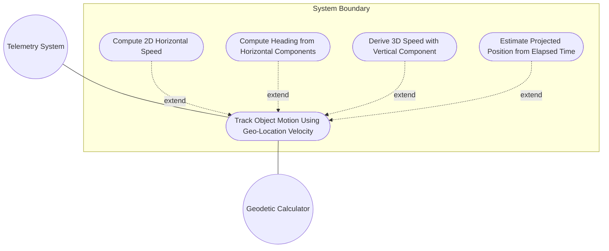
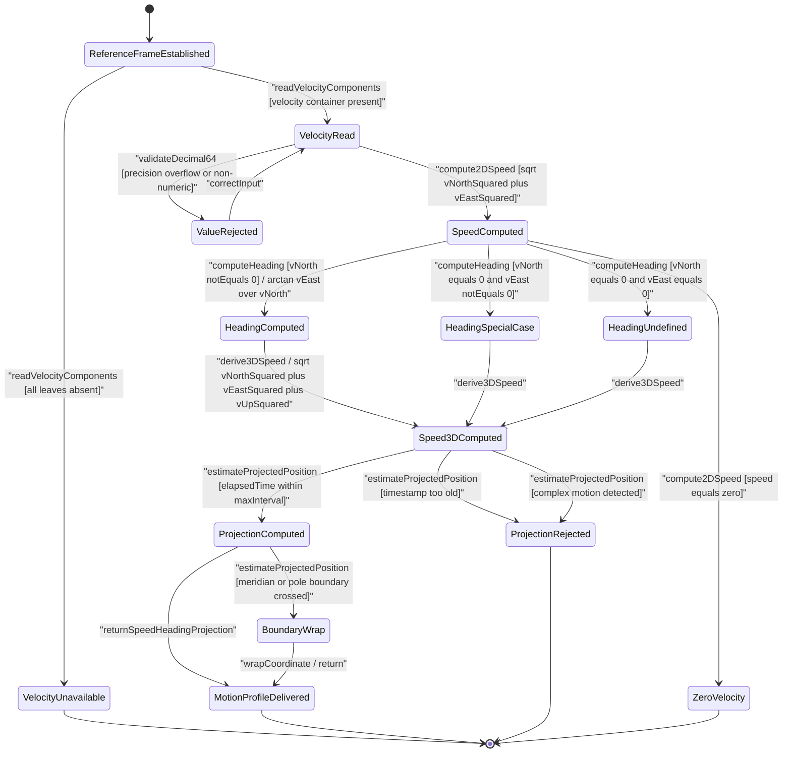

# Use Case: [RFC9179-GEO] Track Object Motion Using Geo-Location Velocity

## Parent Epic
- [ ] #42 - [RFC9179-GEO A YANG Grouping for Geographic Locations](https://github.com/gintatkinson/3dgs-039/blob/main/docs/epics/epic-04-rfc9179-geo-location.md) (semantic linkage: this use case exercises the velocity container and derived speed/heading/projection operations on the geo-location grouping defined by Epic #42)

## 1. Actors
- **Primary Actor:** Telemetry System
- **Secondary Actors:** Geodetic Calculator

## 2. Preconditions
- An object has a geo-location with velocity vector components (v-north, v-east, v-up) and a recent timestamp.
- The reference frame is established with a valid astronomical body and geodetic datum.
- All velocity components use decimal64 with 12 fraction-digits in meters per second.
- The object is in relatively stable motion at the time given by the timestamp.

## 3. Trigger
System needs to compute the object's current heading, speed, or projected position.

## 4. Main Success Scenario (Basic Flow)
1. Telemetry System reads the velocity vector components (v-north, v-east, v-up) and the geo-location timestamp from the object's current data.
2. Telemetry System computes the two-dimensional horizontal speed via the formula speed = sqrt(v_north² + v_east²) in meters per second.
3. Telemetry System computes the heading via the formula heading = arctan(v_east / v_north) in decimal degrees clockwise from true north.
4. Telemetry System derives the three-dimensional speed by incorporating the v-up component: speed3D = sqrt(v_north² + v_east² + v_up²) in meters per second.
5. Geodetic Calculator receives the current elapsed time (the difference between now and the geo-location timestamp), the velocity components, and the geodetic datum, then estimates the projected position by applying the velocity vector over the elapsed time interval.
6. Geodetic Calculator returns the projected latitude, longitude, and height displacements to the Telemetry System.
7. Telemetry System presents the computed speed, heading, and projected position to the consuming subsystem or operator.

## 5. Alternate and Exception Flows
- **5a. Zero velocity (stationary object) (Branches from Basic Flow step 2):**
  1. Telemetry System reads v-north=0.0, v-east=0.0, and v-up=0.0 from the velocity container.
  2. Telemetry System computes the horizontal speed as 0.0 m/s, the three-dimensional speed as 0.0 m/s, determines the heading is undefined, and calculates zero projected-position displacement.
  3. Telemetry System notifies the consuming subsystem that the object is stationary and suppresses position projection.
- **5b. Missing velocity vector (location only, no motion tracking) (Branches from Basic Flow step 1):**
  1. Telemetry System reads the geo-location data and detects that the velocity container or all three velocity leaves (v-north, v-east, v-up) are absent.
  2. Telemetry System aborts the motion computation, sets the speed and heading readout to not-applicable, and notifies the consuming subsystem that the object has no velocity data available for motion tracking.
- **5c. Timestamp too old for reliable projection (Branches from Basic Flow step 5):**
  1. Geodetic Calculator evaluates the elapsed time between the geo-location timestamp and the current system time and determines it exceeds the configured maximum projection interval.
  2. Geodetic Calculator declines to produce a projected position, sets the position confidence to unstale, and notifies the Telemetry System that the timestamp is too old for reliable extrapolation, recommending a fresh geo-location query.
- **5d. Coordinate system boundaries exceeded (motion crosses 180-degree meridian) (Branches from Basic Flow step 5):**
  1. Geodetic Calculator computes the projected longitude displacement from the velocity vector and detects that the resultant longitude value crosses the 180-degree meridian boundary.
  2. Geodetic Calculator wraps the longitude value by subtracting 360 degrees to stay within the canonical range of negative 180 to 180 degrees, records a meridian-crossing event, and returns the wrapped projected position to the Telemetry System.
- **5e. Heading undefined when v_north equals zero and v_east equals zero (Branches from Basic Flow step 3):**
  1. Telemetry System reads v-north=0.0 and v-east=0.0 from the velocity container and invokes the heading derivation formula.
  2. Telemetry System detects the division-by-zero condition because both horizontal components are zero, engages the zero-division guard, sets the heading display to undefined, and notifies the consuming subsystem that heading cannot be determined for a stationary or purely vertical object.
- **5f. v-east non-zero with v-north equals zero (pure easterly or westerly motion) (Branches from Basic Flow step 3):**
  1. Telemetry System reads v-north=0.0 and v-east is non-zero from the velocity container and invokes the heading derivation formula.
  2. Telemetry System detects the zero-denominator case with a non-zero numerator, computes the heading as 90.0 degrees for positive v-east (pure easterly motion) or negative 90.0 degrees for negative v-east (pure westerly motion), and returns the special-case heading.
- **5g. Negative v-east value (motion toward west) (Branches from Basic Flow step 3):**
  1. Telemetry System reads a negative v-east component value from the velocity container.
  2. Telemetry System computes the heading using the arctan formula with the negative numerator, producing a negative heading angle representing westward motion, and returns the negative heading in decimal degrees clockwise from true north.
- **5h. Negative v-up value (downward motion toward center of mass) (Branches from Basic Flow step 4):**
  1. Telemetry System reads a negative v-up component value from the velocity container, indicating motion toward the center of mass.
  2. Telemetry System incorporates the negative v-up value into the three-dimensional speed calculation, squares the negative value which becomes positive for the speed magnitude, and records the v-up sign separately as a descent indicator for the consuming subsystem.
- **5i. Fraction-digit precision overflow (more than 12 fraction-digits) (Branches from Basic Flow step 1):**
  1. Telemetry System reads a velocity component value with more than 12 fraction-digits, violating the decimal64 fraction-digits constraint specified in the YANG schema.
  2. Telemetry System truncates or rejects the value according to the field-level validation policy, notifies the consuming subsystem of the precision constraint violation, and proceeds only after the value is corrected to conform to the 12-digit fraction precision.
- **5j. Non-numeric velocity component (malformed decimal64) (Branches from Basic Flow step 1):**
  1. Telemetry System encounters a velocity component value that cannot be parsed as a valid decimal64 number.
  2. Telemetry System rejects the non-numeric value, raises a data-validation error, and notifies the consuming subsystem that one or more velocity components contain malformed input that must be corrected before motion computation can proceed.
- **5k. Velocity beyond stable-motion threshold (Branches from Basic Flow step 1):**
  1. Telemetry System reads velocity component magnitudes that exceed the configured stable-motion threshold or exhibit rate-of-change patterns inconsistent with relatively stable motion as defined by RFC 9179 Section 2.3.
  2. Telemetry System records a motion-pattern advisory, computes the speed and heading using the instantaneous values as a best-effort snapshot, and notifies the consuming subsystem that the object's motion may be too complex for reliable single-vector tracking, recommending more frequent queries.
- **5l. Missing v-up leaf (two-dimensional velocity only) (Branches from Basic Flow step 4):**
  1. Telemetry System reads valid v-north and v-east values but detects that the v-up leaf is absent from the velocity container.
  2. Telemetry System computes the two-dimensional horizontal speed and heading from the available components, sets the three-dimensional speed to the same value as the horizontal speed with a note indicating no vertical component, and notifies the consuming subsystem that only horizontal motion tracking is available.
- **5m. Reference frame not established (missing astronomical-body or geodetic-datum) (Branches from Basic Flow step 1):**
  1. Telemetry System detects that the reference-frame container or its essential sub-elements (astronomical-body, geodetic-datum) are absent or unpopulated.
  2. Telemetry System falls back to the schema defaults (astronomical-body defaults to earth, geodetic-datum defaults to wgs-84), records a reference-frame-fallback event, and proceeds with the motion computation using the default reference frame.
- **5n. Non-earth astronomical body (velocity on a different celestial body) (Branches from Basic Flow step 1):**
  1. Telemetry System reads the astronomical-body value and determines it is not earth (e.g., mars, moon, enceladus).
  2. Telemetry System resolves the geodetic-datum and coordinate reference specific to the declared astronomical body, adjusts the true-north basis vector for the heading computation accordingly, and proceeds with the motion computation using the body-specific reference frame.
- **5o. Alternate coordinate system in use (non-natural universe) (Branches from Basic Flow step 1):**
  1. Telemetry System detects that the reference-frame alternate-system leaf is populated, indicating the object exists in a non-natural-universe coordinate system (e.g., simulation, virtual reality).
  2. Telemetry System records the alternate-system context, applies the system-specific modifications to the reference-frame definitions, and proceeds with velocity computation noting that the motion semantics are defined by the alternate system rather than the natural universe.
- **5p. Object in complex motion (not relatively stable) (Branches from Basic Flow step 1):**
  1. Telemetry System evaluates the velocity vector and determines that the object is exhibiting complex motion patterns (acceleration, deceleration, trajectory changes) that exceed the scope of single-vector stable-motion tracking defined in RFC 9179.
  2. Telemetry System records a complex-motion advisory, declines to compute projected position, and notifies the consuming subsystem that complex motion tracking is outside the scope of the velocity vector grouping and requires a higher-frequency or multi-sample acquisition strategy.
- **5q. Projection under zero elapsed time (Branches from Basic Flow step 5):**
  1. Geodetic Calculator receives an elapsed time of zero (the timestamp matches the current system time exactly), resulting in zero displacement across all spatial axes.
  2. Geodetic Calculator returns the current object position as the projected position with a confidence indicator of exact-no-displacement, and notifies the Telemetry System that no extrapolation was necessary.
- **5r. Projection across pole boundary (latitude exceeds 90 degrees) (Branches from Basic Flow step 5):**
  1. Geodetic Calculator computes the projected latitude displacement from the v-north component and detects that the resultant latitude exceeds the 90-degree north pole boundary.
  2. Geodetic Calculator wraps or clamps the latitude to the canonical range of negative 90 to 90 degrees, records a pole-crossing event with the crossing timestamp, and returns the wrapped projected position to the Telemetry System.
- **5s. Projection across anti-meridian with longitude wrap (Branches from Basic Flow step 5):**
  1. Geodetic Calculator computes the projected longitude displacement and detects that the resultant longitude exceeds 180 degrees east or west.
  2. Geodetic Calculator wraps the longitude to the canonical range of negative 180 to 180 degrees, records the meridian-crossing event, and returns the wrapped projected position to the Telemetry System.
- **5t. Multiple concurrent velocity records with conflicting timestamps (Branches from Basic Flow step 1):**
  1. Telemetry System discovers two or more velocity records for the same object with different but overlapping timestamps and inconsistent component values that exceed the precision tolerance.
  2. Telemetry System selects the record with the most recent timestamp as authoritative, flags the older record as superseded, and notifies the operator of the temporal conflict.
- **5u. Velocity component values at sub-threshold magnitude (Branches from Basic Flow step 3):**
  1. Geodetic Calculator receives velocity components where v_north and v_east are both non-zero but their magnitudes are below the square root of the combined decimal64 precision floor, making the heading derivation numerically unstable.
  2. Geodetic Calculator reports the object as quasi-stationary with a derived heading of zero degrees (true north) and a note that heading is unreliable below the measurement threshold.
- **5v. Cartesian coordinate system with velocity vector (Branches from Basic Flow step 1):**
  1. Telemetry System receives a geo-location object using the Cartesian coordinate system (x, y, z) with velocity vector components v-north, v-east, and v-up, which are defined relative to true north and not directly usable with Cartesian coordinates.
  2. Telemetry System requests a coordinate system conversion from the Geodetic Calculator to transform Cartesian coordinates to ellipsoidal before applying the velocity projection.

## 6. Postconditions (Guarantees)
- **Success Guarantee:** The object's two-dimensional horizontal speed, heading, three-dimensional speed, and projected position (if elapsed time is within the valid interval) are computed and returned to the consuming subsystem. The computed values are consistent with the geodetic datum and astronomical body specified in the reference frame. The Telemetry System possesses an unambiguous motion profile for the tracked object.
- **Failure Guarantee:** The motion computation is either not performed (velocity data absent, timestamp too old, complex motion beyond scope) or aborted with partial results and a specific condition indicator. The consuming subsystem receives a classified non-success status (not-applicable, undefined, unstale, complex-motion, or precision-violation) rather than incorrect or silently degraded motion values.

## UML Diagrams
### Use Case Diagram

### State Machine Diagram

## 7. Operational Context
From RFC 9179 Section 2.3:

> Support is added for objects in relatively stable motion. For objects in relatively stable motion, the grouping provides a three-dimensional vector value. The components of the vector are v-north, v-east, and v-up, which are all given in fractional meters per second. The values v-north and v-east are relative to true north as defined by the reference frame for the astronomical body; v-up is perpendicular to the plane defined by v-north and v-east, and is pointed away from the center of mass.

> To derive the two-dimensional heading and speed, one would use the following formulas: speed equals sqrt of v_north squared plus v_east squared, heading equals arctan of v_east over v_north.

> For some applications that demand high accuracy and where the data is infrequently updated, this velocity vector can track very slow movement such as continental drift.

## 8. Realization Matrix
### Required User Stories
- [ ] #43 - [RFC9179-GEO Velocity Vector Computation and Speed Heading Derivation](https://github.com/gintatkinson/3dgs-039/blob/main/docs/user-stories/us-18-rfc9179-geo-velocity-vector-computation-and-speed-heading-derivation.md) (semantic linkage: this user story exercises the deriveSpeed and deriveHeading operations on the Velocity class, providing the BDD scenarios for speed and heading derivation that this use case elevates to a system-level interaction between the Telemetry System and the Geodetic Calculator)
### Required Features
- [ ] #40 - [RFC9179-GEO Velocity Vector](https://github.com/gintatkinson/3dgs-039/blob/main/docs/features/feat-17-rfc9179-geo-velocity-vector.md) (semantic linkage: this feature defines the Velocity container with v-north, v-east, and v-up decimal64 fr12 leaves, the deriveSpeed and deriveHeading operations, and the RFC 9179 Section 2.3 derivation formulas that are the structural foundation for the motion tracking computation exercised by this use case)

## Source References
Structural Schema: [ietf-geo-location@2022-02-11.yang](https://raw.githubusercontent.com/gintatkinson/3dgs-039/main/schema/ietf-geo-location%402022-02-11.yang) (container: geo-location/velocity, leaves: v-north v-east v-up -- decimal64 with 12 fraction-digits, meters per second)
Normative Specification: [RFC 9179: A YANG Grouping for Geographic Locations](https://datatracker.ietf.org/doc/rfc9179/) (Section 2.3: Motion, velocity vector definition, speed and heading derivation formulas, stable motion and continental drift tracking applications)
