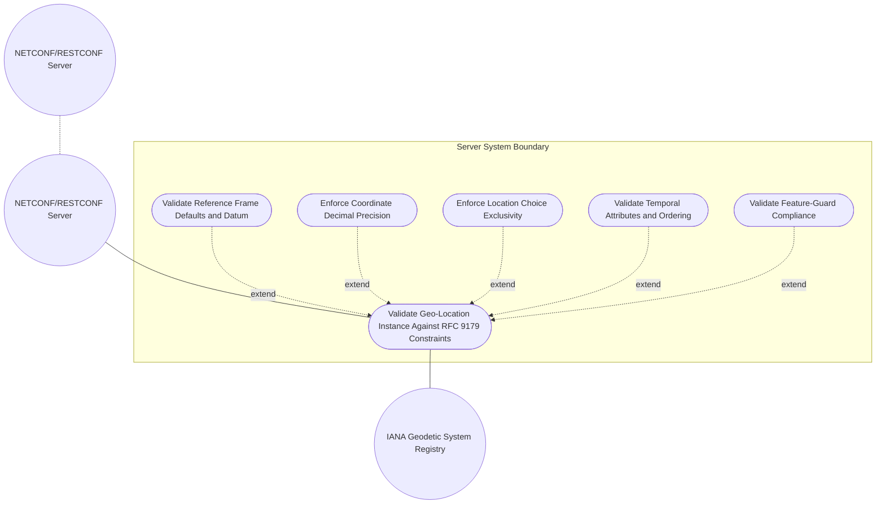
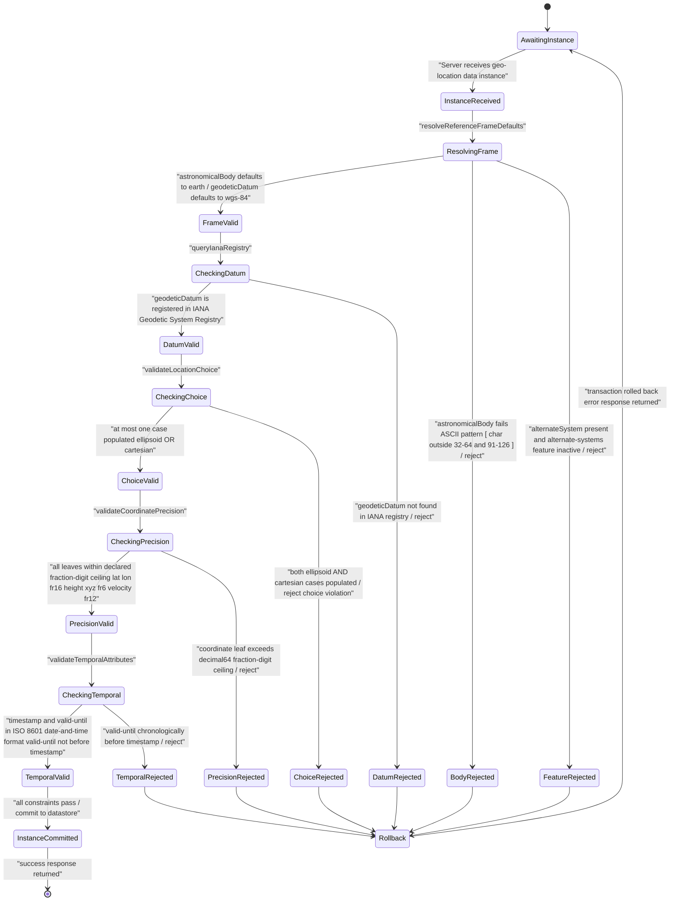

# Use Case: [RFC9179-GEO] Validate Geo-Location Instance Against RFC 9179 Constraints

## Parent Epic
- [ ] #42 - [RFC9179-GEO A YANG Grouping for Geographic Locations](https://github.com/gintatkinson/3dgs-039/blob/main/docs/epics/epic-04-rfc9179-geo-location.md) (semantic linkage: this use case exercises runtime instance validation of the complete geo-location grouping — reference-frame, location choice, velocity, and temporal attributes — against every data-model constraint defined by RFC 9179 and the ietf-geo-location YANG module)

## 1. Actors
- **Primary Actor:** NETCONF/RESTCONF Server (the management-plane server subsystem that receives configuration or state data instances containing a geo-location grouping and must validate each instance against RFC 9179 constraints before committing or forwarding)
- **Secondary Actors:** IANA Geodetic System Registry (the authoritative registry serving geodetic-datum values via the "Geodetic System Values" registry per RFC 9179 Section 6.1, First Come First Served policy per RFC 8126)

## 2. Preconditions
- Server has the `ietf-geo-location` YANG module (2022-02-11 revision) loaded and its type-resolution subsystem has resolved all typedef and import chains for the geo-location grouping.
- The IANA Geodetic System Registry is reachable and its current registry values (including "wgs-84", "wgs-84-96", "wgs-84-08", "me") are available for datum cross-reference.
- A data instance containing the `geo:geo-location` container — with zero or more of reference-frame, location choice, velocity, timestamp, and valid-until — is received by the Server and queued for pre-commit validation.

## 3. Trigger
Server receives configuration or state data containing a geo-location instance that must be validated. The trigger event is an `<edit-config>` RPC (NETCONF), a `PUT`/`PATCH` operation (RESTCONF), or an equivalent data-ingestion pathway carrying a payload whose schema path resolves to the `geo:geo-location` container.

## 4. Main Success Scenario (Basic Flow)
1. NETCONF/RESTCONF Server receives a data instance containing the `geo:geo-location` container and dispatches it to the geo-location validation subsystem.
2. Validator resolves the reference-frame container and applies default values: astronomical-body defaults to "earth" when absent; geodetic-datum defaults to "wgs-84" when astronomical-body is "earth" and no explicit datum is supplied.
3. Validator queries the IANA Geodetic System Registry to confirm the resolved geodetic-datum value is a registered entry; the Registry returns a confirmation or an authoritative list of valid datum identifiers.
4. Validator inspects the location choice and confirms mutual exclusivity: exactly zero or one case (ellipsoid OR cartesian) is populated; both cases simultaneously populated is rejected before coordinate-level checks proceed.
5. Validator enforces decimal64 fractional-digit precision on all coordinate leaves: latitude and longitude at 16 fraction-digits, height at 6 fraction-digits, Cartesian x/y/z at 6 fraction-digits, and velocity v-north/v-east/v-up at 12 fraction-digits. Every leaf that exceeds its declared fraction-digit ceiling is flagged.
6. Validator enforces timestamp and valid-until format compliance: both leaves, when present, are validated against the `yang:date-and-time` ISO 8601 extended format including mandatory timezone (Z or explicit offset).
7. When both timestamp and valid-until are present, Validator compares the chronologically normalized values. If valid-until is later than timestamp, the temporal envelope is accepted; the geo-location instance passes all RFC 9179 constraint checks.
8. Validator returns a success result and the Server commits the geo-location instance to the configuration datastore.

## 5. Alternate and Exception Flows
- **5a. Invalid astronomical-body name (Branches from Basic Flow step 2):**
  1. Validator detects that the supplied `astronomical-body` value contains control characters outside the ASCII printable ranges 32-64 and 91-126, or is an empty string, violating the `pattern '[ -@\[-\^_-~]*'` constraint.
  2. Validator aborts the transaction with an `invalid-value` error identifying the violating characters, the permitted ASCII ranges, and the International Astronomical Union (IAU) reference. The configuration datastore is unmodified.

- **5b. Unregistered geodetic-datum value (Branches from Basic Flow step 3):**
  1. Validator receives a `geodetic-datum` value from the instance and queries the IANA Geodetic System Registry; the Registry does not recognize the value as a registered datum identifier.
  2. Validator aborts the transaction with an `invalid-value` error identifying the unrecognized datum, listing the current IANA-registered values (e.g., "wgs-84", "wgs-84-96", "wgs-84-08", "me"), and referencing RFC 9179 Section 6.1. The configuration datastore is unmodified.

- **5c. Coordinate decimal precision overflow (Branches from Basic Flow step 5):**
  1. Validator examines a coordinate leaf — e.g., latitude with a value containing 17 or more decimal digits — and detects that the fractional-digit count exceeds the leaf's `decimal64` precision ceiling (16 fraction-digits for lat/long, 6 for height and Cartesian x/y/z, 12 for velocity components).
  2. Validator aborts the transaction with a `value-not-in-range` error identifying the offending leaf path, the declared fraction-digit maximum, the supplied digit count, and the unit label (decimal degrees, meters, or meters per second). The configuration datastore is unmodified.

- **5d. Both ellipsoid AND cartesian cases populated (choice violation) (Branches from Basic Flow step 4):**
  1. Validator inspects the location choice and detects that the payload contains populated leaves under both the `ellipsoid` case (latitude/longitude/height) and the `cartesian` case (x/y/z) within the same geo-location instance.
  2. Validator aborts the transaction with a `schema-violation` error identifying the exclusive choice constraint, the conflicting cases, and confirming that only one coordinate case may be active per instance. The configuration datastore is unmodified.

- **5e. valid-until chronologically before timestamp (Branches from Basic Flow step 7):**
  1. Validator normalizes both `timestamp` and `valid-until` to a common UTC reference and detects that `valid-until` is strictly earlier than `timestamp` — the expiration time precedes the measurement time.
  2. Validator aborts the transaction with an `invalid-value` error reporting the chronological inversion, the two timestamps as normalized UTC values, and stating that `valid-until` MUST represent a point in time later than or equal to `timestamp`. The configuration datastore is unmodified.

- **5f. alternate-system leaf present without feature enablement (Branches from Basic Flow step 2):**
  1. Validator detects a non-null `alternate-system` leaf value in the reference-frame container while the `alternate-systems` feature flag is not activated on the Server.
  2. Validator aborts the transaction with a `feature-violation` error identifying the `alternate-systems` feature as the guard condition, the supplied alternate-system value, and stating that the leaf is only valid when the feature is enabled. The configuration datastore is unmodified.

## 6. Postconditions (Guarantees)
- **Success Guarantee:** The validated geo-location instance is committed to the NETCONF/RESTCONF configuration datastore. The reference-frame is fully resolved with defaults applied (astronomical-body "earth" and geodetic-datum "wgs-84" when either was absent). All coordinate leaves satisfy their decimal64 fraction-digit precision ceilings. The location choice is exclusively resolved to at most one case. Timestamp and valid-until conform to ISO 8601 date-and-time format with mandatory timezone. The valid-until temporal window, when both timestamps are present, is chronologically valid (valid-until is not earlier than timestamp). The alternate-systems feature guard was respected.
- **Failure Guarantee:** The configuration transaction is rolled back. The configuration datastore remains unmodified. The Server returns a precise error response that identifies the violating schema leaf path, the RFC 9179 constraint breached, the offending value, and the expected valid format, range, or registry entry per the ietf-geo-location YANG module.

## UML Diagrams
### Use Case Diagram

### State Machine Diagram

## 7. Operational Context
From RFC 9179 Section 2.1 (Frame of Reference):

> The frame of reference (`reference-frame`) defines what the location values refer to and their meaning. The referred-to object can be any astronomical body. It could be a planet such as Earth or Mars, a moon such as Enceladus, an asteroid such as Ceres, or even a comet such as 1P/Halley. This value is specified in `astronomical-body` and is defined by the International Astronomical Union. The default `astronomical-body` value is `earth`.

From RFC 9179 Section 2.2 (Location):

> This is the location on, or relative to, the astronomical object. It is specified using two or three coordinate values. These values are given either as `latitude`, `longitude`, and an optional `height`, or as Cartesian coordinates of `x`, `y`, and `z`. In both choices, the exact meanings of all the values are defined by the `geodetic-datum` value in Section 2.1.

From the ietf-geo-location YANG module (schema/ietf-geo-location@2022-02-11.yang):

> **reference-frame/astronomical-body**: type string with pattern `[ -@\[-\^_-~]*`, default "earth". Uppercase SHOULD be converted to lowercase. ASCII values 32-64 and 91-126 only.
> **reference-frame/geodetic-system/geodetic-datum**: type string with pattern `[ -@\[-\^_-~]*`. Default "wgs-84" when astronomical-body is "earth". IANA Geodetic System Values Registry further restricts by converting spaces to dashes.
> **location choice**: Exclusive choice — `case ellipsoid` (latitude decimal64 fr16, longitude decimal64 fr16, height decimal64 fr6) OR `case cartesian` (x/y/z decimal64 fr6).
> **velocity**: `v-north`, `v-east`, `v-up` decimal64 fr12 in meters per second.
> **timestamp / valid-until**: `yang:date-and-time` (RFC 6991) — ISO 8601 extended format with mandatory timezone.

From RFC 9179 Section 4 (ISO 6709:2008 Conformance):

> For test `A.1.2.4`, representation of horizontal position: latitude/longitude values conform. For test `A.1.2.5`, representation of vertical position: height value conforms.

## 8. Realization Matrix
### Required User Stories
- [ ] #46 - [RFC9179-GEO Reference Frame Selection and Geodetic Datum Resolution](https://github.com/gintatkinson/3dgs-039/blob/main/docs/user-stories/us-15-rfc9179-geo-reference-frame-selection-and-geodetic-datum-resolution.md) (exercises reference-frame defaulting, geodetic-datum IANA lookup, and alternate-system feature-guard logic validated by this use case during instance validation)
- [ ] #47 - [RFC9179-GEO Ellipsoid Coordinate Validation and Precision](https://github.com/gintatkinson/3dgs-039/blob/main/docs/user-stories/us-16-rfc9179-geo-ellipsoid-coordinate-validation-and-precision.md) (exercises decimal64 fraction-digit precision enforcement for latitude fr16, longitude fr16, and height fr6 — the coordinate precision checks validated in step 5 of the Main Success Scenario)
- [ ] #44 - [RFC9179-GEO Location Coordinate System Choice Resolution](https://github.com/gintatkinson/3dgs-039/blob/main/docs/user-stories/us-17-rfc9179-geo-location-coordinate-system-choice-resolution.md) (exercises the exclusive choice between ellipsoid and Cartesian — the mutual-exclusivity enforcement validated in step 4 and alternate flow 5d)
- [ ] #43 - [RFC9179-GEO Velocity Vector Computation and Speed Heading Derivation](https://github.com/gintatkinson/3dgs-039/blob/main/docs/user-stories/us-18-rfc9179-geo-velocity-vector-computation-and-speed-heading-derivation.md) (exercises velocity component precision validation — v-north, v-east, v-up at decimal64 fr12 — validated in step 5)
- [ ] #45 - [RFC9179-GEO Temporal Attribute Staleness and Validity Window](https://github.com/gintatkinson/3dgs-039/blob/main/docs/user-stories/us-19-rfc9179-geo-temporal-attribute-staleness-and-validity-window.md) (exercises timestamp and valid-until format validation, staleness detection, and valid-until vs timestamp chronological ordering — validated in steps 6-7 and alternate flow 5e)
### Required Features
- [ ] #37 - [RFC9179-GEO Reference Frame Definition](https://github.com/gintatkinson/3dgs-039/blob/main/docs/features/feat-14-rfc9179-geo-reference-frame-definition.md) (defines the reference-frame container with astronomical-body default "earth", geodetic-datum ASCII pattern, IANA registry constraints, and alternate-system feature-guard whose runtime validation is exercised by this use case)

## Source References
Structural Schema: [ietf-geo-location@2022-02-11.yang](https://raw.githubusercontent.com/gintatkinson/3dgs-039/main/schema/ietf-geo-location%402022-02-11.yang) (Collection: geo-location grouping — reference-frame container with astronomical-body and geodetic-system, location choice with ellipsoid and cartesian cases, velocity container, timestamp and valid-until leaves)
Normative Specification: [RFC 9179: A YANG Grouping for Geographic Locations](https://datatracker.ietf.org/doc/rfc9179/) (Clause: Sections 2.1 Frame of Reference, 2.2 Location, 2.3 Motion, 3 YANG Module, 4 ISO 6709:2008 Conformance)
