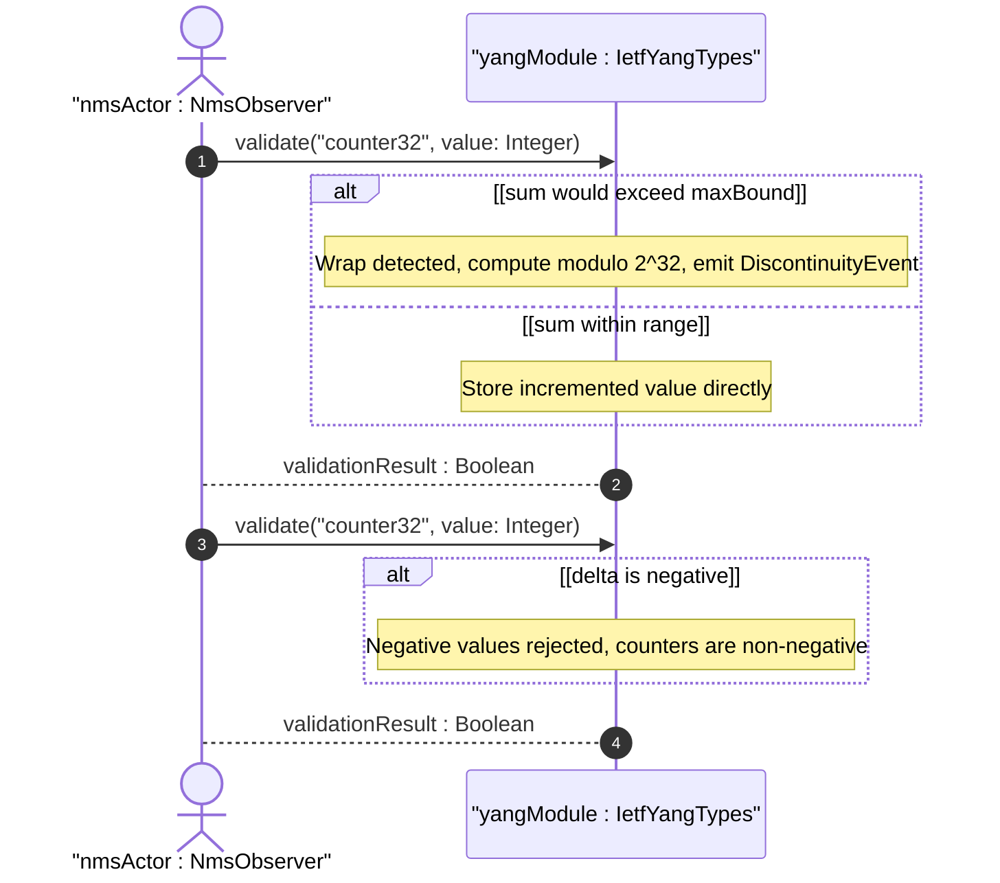
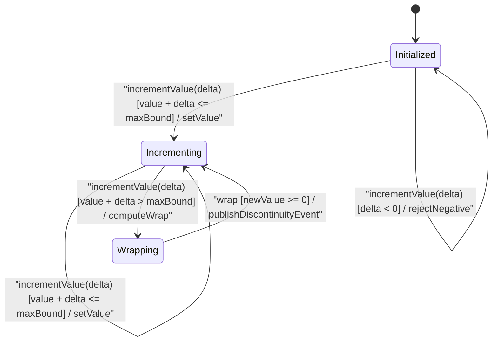

# User Story: [RFC9911-YANG] Counter Wrapping Behavior

## Parent Epic
- [ ] #10 - [RFC9911-YANG] Common YANG Data Types (semantic linkage: this story exercises the counter32 and counter64 monotonically-increasing wrap-at-max behavioral semantics defined in Epic #10 Feature #1)

## Domain Object Mapping
- **Primary Domain Objects:** Counter32, ZeroBasedCounter32, Counter64, ZeroBasedCounter64, IetfYangTypes
- **Actor/Role:** Network Management System (external actor observing counter values)

## BDD Scenario (OOA/OOD Realization)
**As a** Network Management System
**I want to** detect counter wrap events and compute meaningful deltas across wrap boundaries
**So that** the cumulative statistics remain accurate despite finite-width counter representations

### Scenario: Counter32 monotonic increase and wrap
**Given** a Counter32 instance with current value 4294967294
**When** the counter increments by 2
**Then** the value wraps to 1 and a DiscontinuityEvent is recorded with wrap timestamp

### Scenario: Counter32 valid increment within range
**Given** a Counter32 instance with current value 100
**When** the counter increments by 50
**Then** the value is 150 and no DiscontinuityEvent is raised

### Scenario: Counter64 wraparound at 2^64-1
**Given** a Counter64 instance at value 18446744073709551615
**When** the counter increments by 1
**Then** the value wraps to 0 and a DiscontinuityEvent is recorded

### Scenario: ZeroBasedCounter32 initializes at zero
**Given** a new schema node of type ZeroBasedCounter32 is created
**When** the node is first read
**Then** its value is 0

### Scenario: ZeroBasedCounter64 meaningful delta within minimum wrap time
**Given** a ZeroBasedCounter64 instance initialized to 0 at creation time T0
**When** the value is read at time T1 within the minimum wrap time
**Then** the read value represents the cumulative count since T0

### Scenario: Counter32 delta computation across wrap boundary
**Given** Counter32 value was 4294967290 at T1 and after wrap is 5 at T2
**When** the Network Management System detects the DiscontinuityEvent between T1 and T2
**Then** the delta is computed as (4294967295 - 4294967290) + 5 + 1 = 11

### Scenario: Counter rejects negative input
**Given** a Counter32 typed schema node
**When** an attempt is made to set its value to -1
**Then** validation fails with a type constraint violation error

### Scenario: Counter rejects configuration usage
**Given** a schema node with `config true` statement
**When** the schema node is typed as Counter32
**Then** a design-time warning is emitted

## UML Sequence Diagram

## UML State Machine Diagram

## Operational Context
From RFC 9911 Section 3: counters represent non-negative integers that monotonically increase until reaching maximum (2^32-1 for counter32, 2^64-1 for counter64), when they wrap around and start increasing again from zero. Counters have no defined initial value; a single counter value has no inherent information content. Zero-based-counter variants initialize at zero on creation. The minimum wrap time defines the period within which a single wrap can be assumed and deltas are meaningful. Discontinuity detection is critical for any system consuming counter data for billing, capacity planning, or anomaly detection.

## Required Features Matrix
- [ ] #1 - [RFC9911-YANG Counter and Gauge Types](https://github.com/gintatkinson/3dgs-039/blob/main/docs/features/feat-01-rfc9911-yang-counter-and-gauge-types.md) (defines the Counter32, Counter64, ZeroBasedCounter32, and ZeroBasedCounter64 types whose wrap semantics are exercised by this story)
- [ ] #3 - [RFC9911-YANG Date and Time Types](https://github.com/gintatkinson/3dgs-039/blob/main/docs/features/feat-03-rfc9911-yang-date-and-time-types.md) (provides timeticks and timestamp types needed for wrap event timestamping)

## Logical UI & Interface Bindings
<!-- Single-Channel (Visual GUI) Format -->
- **Target LUI Component:** Deferred to Feature #1 Task Y
- **Target Layout Container ID:** Deferred to Feature #1 Task Y
- **Data Source Bindings:** Deferred to Feature #1 Task Y

## Source References
Structural Schema: [ietf-yang-types@2025-12-22.yang](https://raw.githubusercontent.com/gintatkinson/3dgs-039/main/schema/ietf-yang-types%402025-12-22.yang) (typedefs: counter32, zero-based-counter32, counter64, zero-based-counter64)
Normative Specification: [RFC 9911](https://datatracker.ietf.org/doc/rfc9911/) (Section 3: Core YANG Types -- counter32, counter64, zero-based-counter32, zero-based-counter64)
