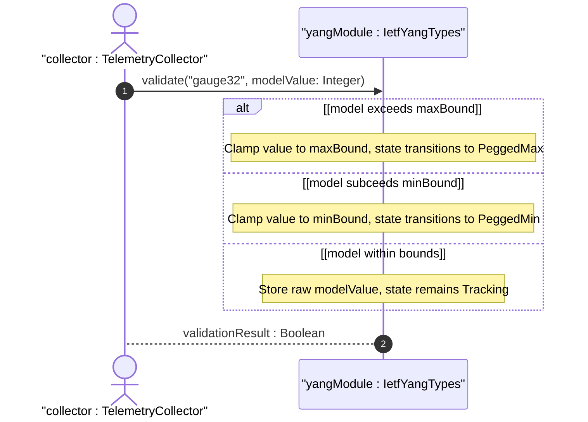
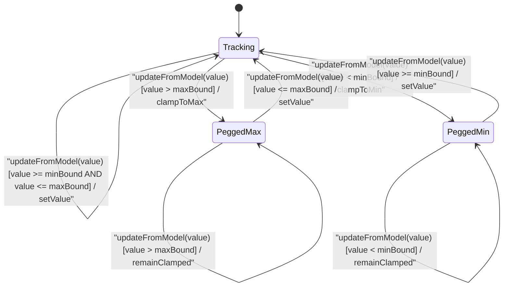

# User Story: [RFC9911-YANG] Gauge Value Clamping Behavior

## Parent Epic
- [ ] #10 - [RFC9911-YANG] Common YANG Data Types (semantic linkage: this story exercises the gauge32 and gauge64 peg-at-boundary behavioral semantics defined in Epic #10 Feature #1)

## Domain Object Mapping
- **Primary Domain Objects:** Gauge32, Gauge64, IetfYangTypes
- **Actor/Role:** Telemetry Collector (external actor observing gauge values representing modeled information)

## BDD Scenario (OOA/OOD Realization)
**As a** Telemetry Collector
**I want to** read gauge values that accurately clamp to the representable range when the underlying modeled information exceeds type boundaries
**So that** consumers see bounded, valid values rather than overflow artifacts or truncated data

### Scenario: Gauge32 pegs at maximum when modeled information exceeds max
**Given** a Gauge32 instance with current value 4294967294 and the modeled information rises to 5000000000
**When** the gauge is read
**Then** the value is clamped to 4294967295 (maximum representable value)

### Scenario: Gauge32 pegs at minimum when modeled information subceeds min
**Given** a Gauge32 instance with current value 1 and the modeled information drops to -5
**When** the gauge is read
**Then** the value is clamped to 0 (minimum representable value)

### Scenario: Gauge32 tracks modeled information within range
**Given** a Gauge32 instance with current value 100
**When** the modeled information changes to 500
**Then** the gauge value is 500

### Scenario: Gauge32 recovers from pegged maximum
**Given** a Gauge32 instance pegged at 4294967295 due to modeled information at 5000000000
**When** the modeled information drops to 1000
**Then** the gauge value decreases to 1000

### Scenario: Gauge64 pegs at maximum boundary
**Given** a Gauge64 instance with modeled information at 2^64
**When** the gauge value is read
**Then** the value is 18446744073709551615 (2^64-1)

### Scenario: Gauge32 rejects configured max exceeding 2^32-1
**Given** a Gauge32 type with a configured maximum value of 5000000000
**When** the type constraint is evaluated
**Then** configuration fails because the maximum cannot exceed 4294967295

### Scenario: Gauge32 configured min below zero is rejected
**Given** a Gauge32 type with a configured minimum value of -1
**When** the type constraint is evaluated
**Then** configuration fails because the minimum cannot be below 0

## UML Sequence Diagram

## UML State Machine Diagram

## Operational Context
From RFC 9911 Section 3: gauge32 and gauge64 represent non-negative integers that may increase or decrease but shall never exceed a maximum value nor fall below a minimum value. The maximum cannot exceed 2^32-1 (gauge32) or 2^64-1 (gauge64). The minimum cannot be smaller than 0. The gauge has its maximum value whenever the information being modeled is greater than or equal to its maximum value, and has its minimum value whenever the information being modeled is smaller than or equal to its minimum value. This is the "peg at boundary" semantic distinct from counters, which are monotonic. Gauges are the correct type for metrics like current temperature, link utilization, or queue depth where the value can fluctuate in either direction.

## Required Features Matrix
- [ ] #1 - [RFC9911-YANG Counter and Gauge Types](https://github.com/gintatkinson/3dgs-039/blob/main/docs/features/feat-01-rfc9911-yang-counter-and-gauge-types.md) (defines the Gauge32 and Gauge64 types whose clamping semantics are exercised by this story)

## Logical UI & Interface Bindings
<!-- Single-Channel (Visual GUI) Format -->
- **Target LUI Component:** Deferred to Feature #1 Task Y
- **Target Layout Container ID:** Deferred to Feature #1 Task Y
- **Data Source Bindings:** Deferred to Feature #1 Task Y

## Source References
Structural Schema: [ietf-yang-types@2025-12-22.yang](https://raw.githubusercontent.com/gintatkinson/3dgs-039/main/schema/ietf-yang-types%402025-12-22.yang) (typedefs: gauge32, gauge64)
Normative Specification: [RFC 9911](https://datatracker.ietf.org/doc/rfc9911/) (Section 3: Core YANG Types -- gauge32, gauge64)
