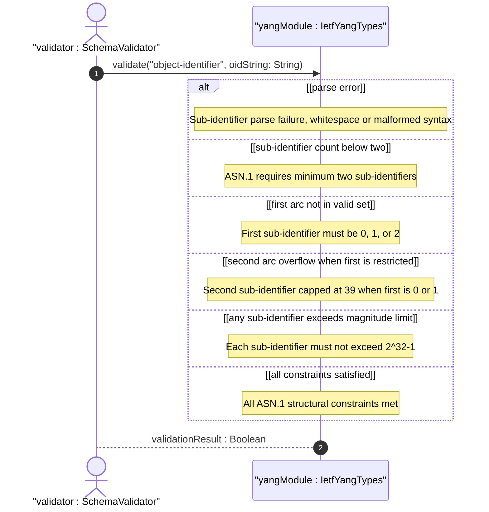
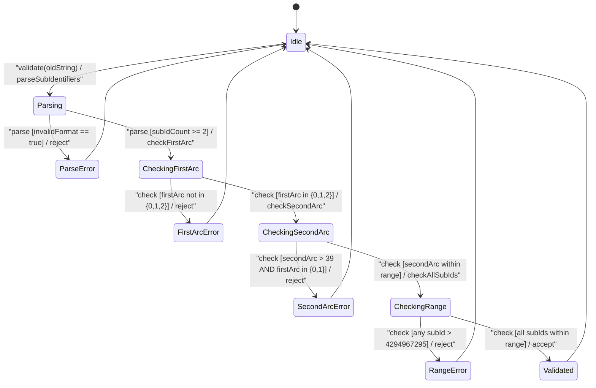

# User Story: [RFC9911-YANG] Object Identifier Validation

## Parent Epic
- [ ] #10 - [RFC9911-YANG] Common YANG Data Types (semantic linkage: this story exercises the ASN.1 sub-identifier constraint validation defined in Epic #10 Feature #2)

## Domain Object Mapping
- **Primary Domain Objects:** ObjectIdentifier, ObjectIdentifier128, IetfYangTypes
- **Actor/Role:** Schema Validator (external actor submitting OID strings for ASN.1 conformance validation)

## BDD Scenario (OOA/OOD Realization)
**As a** Schema Validator
**I want to** validate Object Identifier strings against ASN.1 structural constraints including first-arc, second-arc, sub-identifier count, and sub-identifier magnitude limits
**So that** only well-formed OIDs enter the system and malformed identifiers are rejected at the boundary

### Scenario: Valid OID with first arc 1 and controlled second arc passes
**Given** an OID string "1.3.6.1.2.1.1.3.0"
**When** the ObjectIdentifier type validates the value
**Then** validation passes

### Scenario: OID with first arc other than 0, 1, or 2 is rejected
**Given** an OID string "3.6.1.2.1"
**When** the ObjectIdentifier type validates the value
**Then** validation fails because first sub-identifier 3 is not in set {0, 1, 2}

### Scenario: OID with first arc 0 and second arc exceeding 39 is rejected
**Given** an OID string "0.40.1"
**When** the ObjectIdentifier type validates the value
**Then** validation fails because second sub-identifier 40 exceeds the 0..39 range when first arc is 0

### Scenario: OID with first arc 1 and second arc exceeding 39 is rejected
**Given** an OID string "1.40.1"
**When** the ObjectIdentifier type validates the value
**Then** validation fails because second sub-identifier 40 exceeds the 0..39 range when first arc is 1

### Scenario: OID with first arc 2 has no second-arc restriction
**Given** an OID string "2.999.1"
**When** the ObjectIdentifier type validates the value
**Then** validation passes because second-arc restriction only applies when first arc is 0 or 1

### Scenario: OID with single sub-identifier is rejected
**Given** an OID string "1"
**When** the ObjectIdentifier type validates the value
**Then** validation fails because ASN.1 requires at least two sub-identifiers

### Scenario: Sub-identifier exceeding 2^32-1 is rejected
**Given** an OID where one sub-identifier equals 4294967296
**When** the ObjectIdentifier type validates the value
**Then** validation fails because each sub-identifier must not exceed 2^32-1

### Scenario: OID with whitespace contamination is rejected
**Given** an OID string "1.3. 6.1"
**When** the ObjectIdentifier type validates the value
**Then** validation fails due to pattern violation from intermediate whitespace

### Scenario: OID with 200 sub-identifiers passes object-identifier validation
**Given** an OID with 200 valid sub-identifiers
**When** the ObjectIdentifier type validates the value
**Then** validation passes as object-identifier has no upper sub-identifier count limit

### Scenario: OID with 129 sub-identifiers is rejected by object-identifier-128
**Given** an OID with 129 valid sub-identifiers
**When** the ObjectIdentifier128 type validates the value
**Then** validation fails because the sub-identifier count exceeds 128

### Scenario: OID with exactly 128 sub-identifiers passes object-identifier-128
**Given** an OID with exactly 128 valid sub-identifiers
**When** the ObjectIdentifier128 type validates the value
**Then** validation passes

### Scenario: All sub-identifiers at maximum value 4294967295 passes
**Given** an OID where every sub-identifier equals 4294967295
**When** the ObjectIdentifier type validates the value
**Then** validation passes as each sub-identifier is within the allowed range

## UML Sequence Diagram

## UML State Machine Diagram

## Operational Context
From RFC 9911 Section 3: Object identifiers represent administratively assigned names in a registration-hierarchical-name tree. Each sub-identifier value must not exceed 2^32-1. Sub-identifiers are separated by single dots without intermediate whitespace. The ASN.1 standard restricts the first sub-identifier to 0, 1, or 2, and restricts the second sub-identifier to 0..39 when the first is 0 or 1. At least two sub-identifiers are always required. The object-identifier-128 type further restricts sub-identifier count to 128 for SMIv2 compatibility. These constraints are structural invariants that must be validated before any OID-based lookup or comparison.

## Required Features Matrix
- [ ] #2 - [RFC9911-YANG Identifier Types](https://github.com/gintatkinson/3dgs-039/blob/main/docs/features/feat-02-rfc9911-yang-identifier-types.md) (defines the ObjectIdentifier and ObjectIdentifier128 types whose ASN.1 constraint validation is exercised by this story)

## Logical UI & Interface Bindings
<!-- Single-Channel (Visual GUI) Format -->
- **Target LUI Component:** Deferred to Feature #2 Task Y
- **Target Layout Container ID:** Deferred to Feature #2 Task Y
- **Data Source Bindings:** Deferred to Feature #2 Task Y

## Source References
Structural Schema: [ietf-yang-types@2025-12-22.yang](https://raw.githubusercontent.com/gintatkinson/3dgs-039/main/schema/ietf-yang-types%402025-12-22.yang) (typedefs: object-identifier, object-identifier-128)
Normative Specification: [RFC 9911](https://datatracker.ietf.org/doc/rfc9911/) (Section 3: Core YANG Types -- object-identifier, object-identifier-128)
