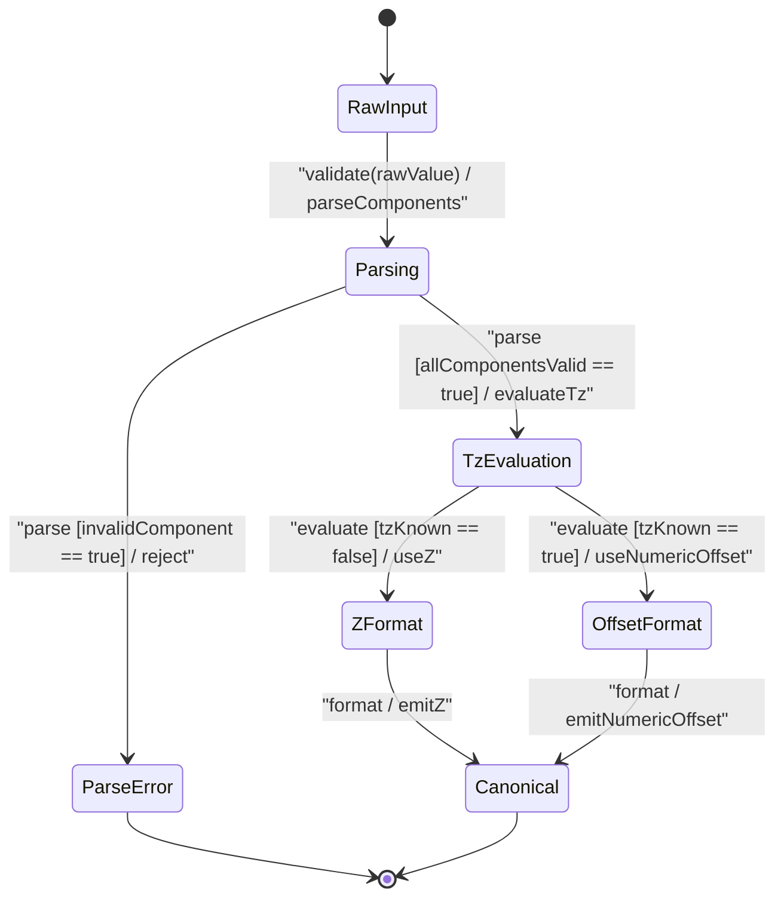

# User Story: [RFC9911-YANG] Date-and-Time Formatting and Canonical Form

## Parent Epic
- [ ] #10 - [RFC9911-YANG] Common YANG Data Types (semantic linkage: this story exercises the date-and-time canonical formatting, timezone offset, and leap second behavioral semantics defined in Epic #10 Feature #3)

## Domain Object Mapping
- **Primary Domain Objects:** DateTimeType, DateType, TimeType, IetfYangTypes
- **Actor/Role:** Time Synchronization Subsystem (external actor formatting and comparing date-and-time values)

## BDD Scenario (OOA/OOD Realization)
**As a** Time Synchronization Subsystem
**I want to** produce and consume date-and-time values in canonical form with correct timezone offset semantics and leap second support
**So that** temporal comparisons and ordering are reliable across systems with different local timezone references

### Scenario: UTC with unknown local timezone uses Z offset
**Given** a date-and-time value representing UTC when the local time zone reference point is unknown
**When** the value is formatted in canonical form
**Then** the offset is "Z"

### Scenario: UTC with known local timezone uses +00:00 offset
**Given** a date-and-time value representing UTC when the local time zone reference point is known to be UTC
**When** the value is formatted in canonical form
**Then** the offset is "+00:00"

### Scenario: Known timezone uses numeric offset in canonical form
**Given** a date-and-time value with a known time zone offset of -05:00
**When** the value is formatted in canonical form using the device's configured UTC offset
**Then** the offset is expressed as "-05:00"

### Scenario: Leap second value 60 passes validation
**Given** a date-and-time value "2025-12-31T23:59:60Z"
**When** the DateTimeType validates the value
**Then** validation passes with seconds value 60

### Scenario: Time type with leap second passes validation
**Given** a time value "23:59:60+00:00"
**When** the TimeType validates the value
**Then** validation passes

### Scenario: Negative year is rejected
**Given** a date-and-time value "-0001-01-01T00:00:00Z"
**When** the DateTimeType validates the value
**Then** validation fails because negative years are not allowed

### Scenario: Invalid month value 13 is rejected
**Given** a date-and-time value "2025-13-01T00:00:00Z"
**When** the DateTimeType validates the value
**Then** validation fails because month 13 is outside the 01-12 range

### Scenario: Invalid day value 32 is rejected
**Given** a date-and-time value "2025-01-32T00:00:00Z"
**When** the DateTimeType validates the value
**Then** validation fails because day 32 exceeds the valid range for January

### Scenario: Hour 24 is rejected
**Given** a date-and-time value "2025-01-01T24:00:00Z"
**When** the DateTimeType validates the value
**Then** validation fails because hour 24 exceeds the 00-23 range

### Scenario: Minute 60 is rejected except in leap second context
**Given** a date-and-time value "2025-01-01T00:60:00Z"
**When** the DateTimeType validates the value
**Then** validation fails because minute 60 exceeds the 00-59 range

### Scenario: Z and +00:00 are semantically equivalent for timezone-unaware comparison
**Given** two date-and-time values "2025-12-22T14:30:00Z" and "2025-12-22T14:30:00+00:00"
**When** the values are compared for temporal ordering ignoring timezone reference semantics
**Then** both represent the same moment in UTC time

## UML Sequence Diagram

```mermaid
sequenceDiagram
    autonumber
    actor timeSubsystem as "timeSubsystem : TimeSyncSubsystem"
    participant yangModule as "yangModule : IetfYangTypes"

    timeSubsystem->>yangModule: validate("date-and-time", rawValue: String)
    alt [parse error in components]
        Note over yangModule: Month, day, hour, minute component out of valid range
    else [seconds value is 60]
        Note over yangModule: Leap second accepted at valid boundaries
    else [year is negative]
        Note over yangModule: Negative years rejected per RFC 9911
    else [all components valid]
        Note over yangModule: All ISO 8601 / RFC 3339 / RFC 9557 constraints satisfied
    end
    yangModule-->timeSubsystem: validationResult : Boolean

    timeSubsystem->>yangModule: validate("date-and-time", value: String)
    alt [timezone reference unknown]
        Note over yangModule: Emit canonical form with Z offset
    else [timezone reference known]
        Note over yangModule: Emit canonical form with numeric UTC offset
    end
    yangModule-->timeSubsystem: canonicalValue : String
```

## UML State Machine Diagram

## Operational Context
From RFC 9911 Section 3: The date-and-time type is a profile of ISO 8601 defined by the date-time production in RFC 3339 Section 5.6 and updated by RFC 9557 Section 2. The time-offset Z indicates UTC with unknown local time zone reference point. The time-offset +00:00 indicates UTC with known local time zone reference point UTC. Canonical format with known time zone uses the numeric time zone offset using the device's configured UTC offset. Canonical format for UTC with unknown local TZ SHOULD use Z and MAY use -00:00. The value 60 for seconds is allowed only in the case of leap seconds. Daylight Saving Time transitions are accommodated through the numeric timezone offset mechanism; the canonical form encodes the actual offset in effect at the represented moment.

## Required Features Matrix
- [ ] #3 - [RFC9911-YANG Date and Time Types](https://github.com/gintatkinson/3dgs-039/blob/main/docs/features/feat-03-rfc9911-yang-date-and-time-types.md) (defines the DateTimeType, DateType, and TimeType whose canonical formatting and leap-second semantics are exercised by this story)

## Logical UI & Interface Bindings
- **Target LUI Component:** Deferred to Feature #3 Task Y
- **Target Layout Container ID:** Deferred to Feature #3 Task Y
- **Data Source Bindings:** Deferred to Feature #3 Task Y

## Source References
Structural Schema: [ietf-yang-types@2025-12-22.yang](https://raw.githubusercontent.com/gintatkinson/3dgs-039/main/schema/ietf-yang-types%402025-12-22.yang) (typedefs: date-and-time, date, time)
Normative Specification: [RFC 9911](https://datatracker.ietf.org/doc/rfc9911/) (Section 3: Core YANG Types -- date-and-time, date, time)
