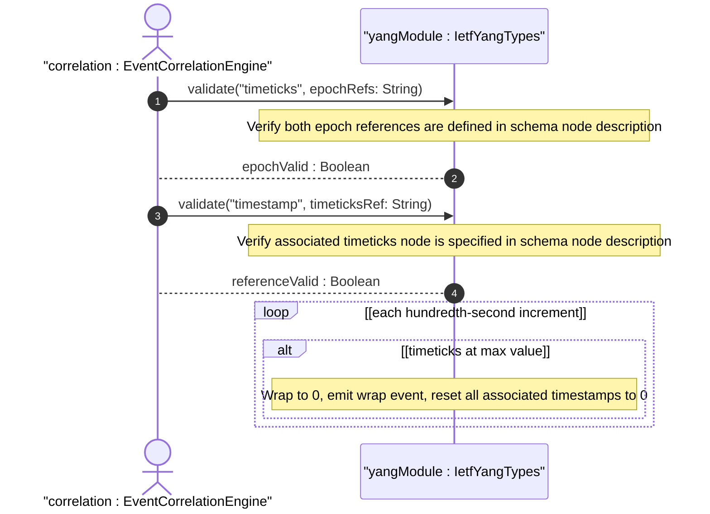
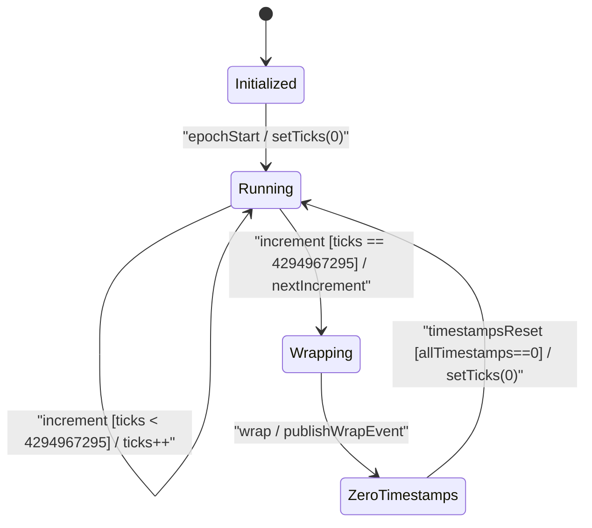

# User Story: [RFC9911-YANG] Timeticks and Timestamp Epoch Handling

## Parent Epic
- [ ] #10 - [RFC9911-YANG] Common YANG Data Types (semantic linkage: this story exercises the timeticks modulo-2^32 wrap and timestamp zero-on-wrap behavioral semantics defined in Epic #10 Feature #3)

## Domain Object Mapping
- **Primary Domain Objects:** Timeticks, Timestamp, DateTimeType, IetfYangTypes
- **Actor/Role:** Event Correlation Engine (external actor computing relative event timing from timeticks and timestamp values)

## BDD Scenario (OOA/OOD Realization)
**As an** Event Correlation Engine
**I want to** interpret timeticks and timestamp values correctly across wrap boundaries
**So that** event ordering remains reliable and timestamps accurately reflect the moment of occurrence relative to the timeticks epoch

### Scenario: Timeticks increments in hundredths of seconds
**Given** a Timeticks instance initialized at an epoch E0
**When** 1.5 seconds have elapsed since E0
**Then** the timeticks value is 150 (hundredths of seconds)

### Scenario: Timeticks wraps at modulo 2^32
**Given** a Timeticks instance with value 4294967295 representing one hundredth-second before wrap
**When** one hundredth of a second elapses
**Then** the value wraps to 0

### Scenario: Timeticks wraps after approximately 497 days
**Given** a Timeticks instance initialized at epoch E0
**When** 497 days, 2 hours, 27 minutes, and 52.95 seconds have elapsed (exceeding 2^32 hundredths)
**Then** the timeticks has wrapped at least once and its value is the remainder modulo 2^32

### Scenario: Timestamp records associated timeticks value at event occurrence
**Given** a Timestamp schema node associated with timeticks node T and T currently reads 360000 (1 hour)
**When** a specific occurrence event fires
**Then** the Timestamp value is set to 360000

### Scenario: All timestamps reset to zero when associated timeticks wraps
**Given** multiple Timestamp instances associated with timeticks node T, with values 360000, 180000, and 720000
**When** the associated timeticks T reaches 497+ days and wraps to 0
**Then** all Timestamp values associated with T are reset to 0

### Scenario: Timestamp value zero indicates occurrence before last timeticks zero
**Given** a Timestamp with value 0
**When** the Event Correlation Engine interprets the timestamp
**Then** the occurrence happened prior to the last time the associated timeticks was zero (either at initialization or after a wrap)

### Scenario: Schema node using timeticks must define both reference epochs
**Given** a YANG schema node of type timeticks
**When** the schema node description is missing epoch references
**Then** the definition is semantically incomplete (design-time validation warning)

### Scenario: Schema node using timestamp must specify associated timeticks node
**Given** a YANG schema node of type timestamp
**When** the schema node description does not specify which timeticks node it is associated with
**Then** the definition is semantically incomplete (design-time validation warning)

## UML Sequence Diagram

## UML State Machine Diagram

## Operational Context
From RFC 9911 Section 3: The timeticks type represents time modulo 2^32 in hundredths of a second between two epochs. When a schema node is defined that uses timeticks, the description of the schema node MUST identify both reference epochs. The timestamp type represents the value of an associated timeticks schema node at which a specific occurrence happened. When the timeticks reaches its maximum and wraps to zero, all timestamps using that timeticks are reset to zero. If the specific occurrence occurred before the last time the associated timeticks was zero, the timestamp value is zero. The 497-day wrap period (2^32 / 100 / 86400 = ~497.1 days) defines the operational window within which absolute event ordering from timeticks alone is unambiguous.

## Required Features Matrix
- [ ] #3 - [RFC9911-YANG Date and Time Types](https://github.com/gintatkinson/3dgs-039/blob/main/docs/features/feat-03-rfc9911-yang-date-and-time-types.md) (defines the Timeticks and Timestamp types whose modulo-wrap and zero-on-wrap semantics are exercised by this story)
- [ ] #1 - [RFC9911-YANG Counter and Gauge Types](https://github.com/gintatkinson/3dgs-039/blob/main/docs/features/feat-01-rfc9911-yang-counter-and-gauge-types.md) (timeticks shares counter-like wrap behavior at the uint32 boundary)

## Logical UI & Interface Bindings
- **Target LUI Component:** Deferred to Feature #3 Task Y
- **Target Layout Container ID:** Deferred to Feature #3 Task Y
- **Data Source Bindings:** Deferred to Feature #3 Task Y

## Source References
Structural Schema: [ietf-yang-types@2025-12-22.yang](https://raw.githubusercontent.com/gintatkinson/3dgs-039/main/schema/ietf-yang-types%402025-12-22.yang) (typedefs: timeticks, timestamp)
Normative Specification: [RFC 9911](https://datatracker.ietf.org/doc/rfc9911/) (Section 3: Core YANG Types -- timeticks, timestamp, Table 1)
