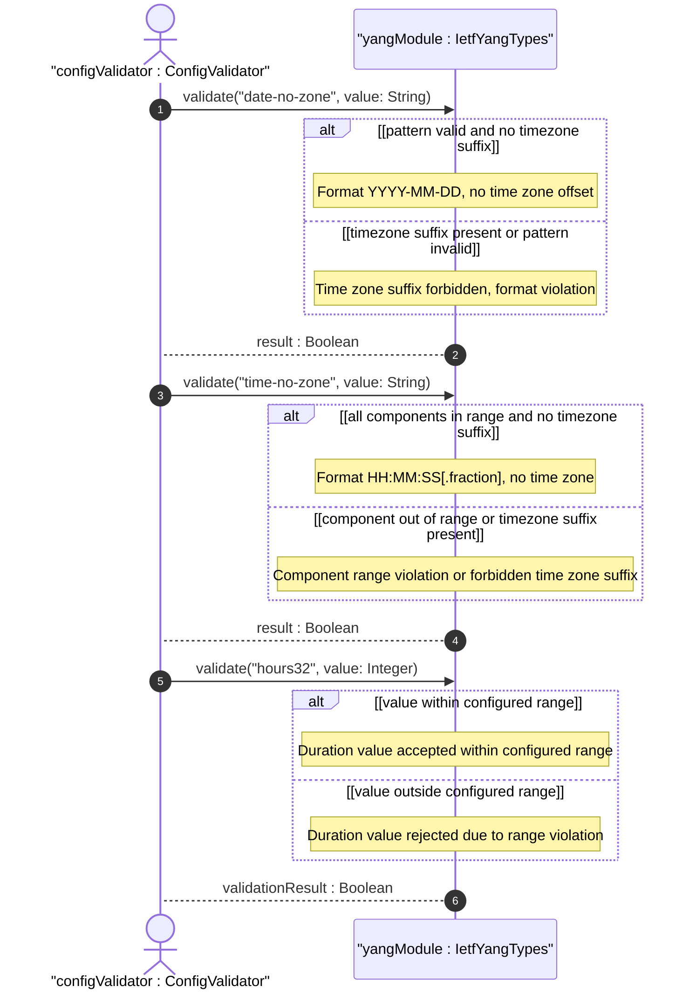
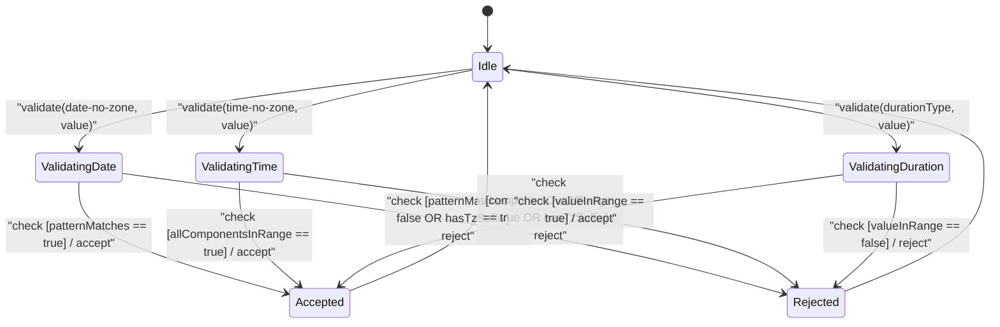

# User Story: [RFC9911-YANG] Date and Time Component Validation

## Parent Epic
- [ ] #10 - [RFC9911-YANG] Common YANG Data Types (semantic linkage: this story exercises the sub-second precision duration types and date/time component range restrictions defined in Epic #10 Feature #3)

## Domain Object Mapping
- **Primary Domain Objects:** DateNoZone, TimeNoZone, Hours32, Minutes32, Seconds32, Centiseconds32, Milliseconds32, Microseconds32, Microseconds64, Nanoseconds32, Nanoseconds64, IetfYangTypes
- **Actor/Role:** Configuration Validator (external actor validating temporal values against type-specific range and format constraints)

## BDD Scenario (OOA/OOD Realization)
**As a** Configuration Validator
**I want to** validate date-no-zone, time-no-zone, and duration types against their precise range and format constraints
**So that** temporal configuration values are guaranteed to be semantically valid before processing

### Scenario: date-no-zone accepts valid calendar date
**Given** a date-no-zone value "2025-12-22"
**When** the DateNoZone type validates the value
**Then** validation passes

### Scenario: date-no-zone rejects time zone suffix
**Given** a date-no-zone value "2025-12-22+01:00"
**When** the DateNoZone type validates the value
**Then** validation fails because time zone offset is not allowed

### Scenario: time-no-zone accepts valid wall-clock time
**Given** a time-no-zone value "14:30:00.5"
**When** the TimeNoZone type validates the value
**Then** validation passes

### Scenario: time-no-zone rejects time zone suffix
**Given** a time-no-zone value "14:30:00Z"
**When** the TimeNoZone type validates the value
**Then** validation fails because time zone suffix is not allowed

### Scenario: hours32 range-restricted to non-negative rejects negative input
**Given** an Hours32 type with range restriction "0..max"
**When** the value -1 is assigned
**Then** validation fails with range constraint violation

### Scenario: hours32 accepts value within int32 range
**Given** an Hours32 type without additional range restrictions
**When** the value 2147483647 is assigned
**Then** validation passes (maximum int32 value)

### Scenario: nanoseconds32 accepts value within range
**Given** a Nanoseconds32 type
**When** the value 2000000000 is assigned
**Then** validation passes (approximately 2 seconds)

### Scenario: nanoseconds32 rejects value exceeding int32 range
**Given** a Nanoseconds32 type
**When** the value 2147483648 is assigned
**Then** validation fails because the value exceeds int32 maximum

### Scenario: nanoseconds64 accepts large positive value
**Given** a Nanoseconds64 type
**When** the value 60000000000 (60 seconds) is assigned
**Then** validation passes (within int64 range)

### Scenario: microseconds64 accepts value spanning approximately 106751991 days
**Given** a Microseconds64 type
**When** the maximum int64 value is assigned
**Then** validation passes

### Scenario: seconds32 range-restricted to non-negative rejects negative
**Given** a Seconds32 type with range restriction "0..max"
**When** the value -3600 is assigned
**Then** validation fails with range constraint violation

### Scenario: time-no-zone rejects hour value exceeding 23
**Given** a time-no-zone value "25:00:00"
**When** the TimeNoZone type validates the value
**Then** validation fails because hour 25 exceeds the 00-23 range

### Scenario: centiseconds32 provides 10ms granularity
**Given** a Centiseconds32 type
**When** the value 500 is read
**Then** the represented duration is 5.00 seconds (500 * 10^-2 seconds)

### Scenario: Duration conversion: milliseconds32 to seconds32
**Given** a Milliseconds32 value of 5000
**When** the value is converted to seconds
**Then** the equivalent is 5 seconds, represented as Seconds32 value 5

## UML Sequence Diagram

## UML State Machine Diagram

## Operational Context
From RFC 9911 Section 3: The date-no-zone type is a date without optional time zone offset information. The time-no-zone type is a time without optional time zone offset information. The duration types (hours32 through nanoseconds64) are signed integer types whose base ranges are defined by int32 and int64 but which SHOULD be range-restricted to non-negative where appropriate. Table 1 defines the approximate equivalent ranges for each type: hours32 covers approximately -89478485 to +89478485 days, while nanoseconds32 covers only approximately -2 to +2 seconds. The choice of type depends on the required temporal granularity and the expected maximum duration being modeled.

## Required Features Matrix
- [ ] #3 - [RFC9911-YANG Date and Time Types](https://github.com/gintatkinson/3dgs-039/blob/main/docs/features/feat-03-rfc9911-yang-date-and-time-types.md) (defines the DateNoZone, TimeNoZone, Hours32 through Nanoseconds64 types whose format and range constraints are exercised by this story)

## Logical UI & Interface Bindings
- **Target LUI Component:** Deferred to Feature #3 Task Y
- **Target Layout Container ID:** Deferred to Feature #3 Task Y
- **Data Source Bindings:** Deferred to Feature #3 Task Y

## Source References
Structural Schema: [ietf-yang-types@2025-12-22.yang](https://raw.githubusercontent.com/gintatkinson/3dgs-039/main/schema/ietf-yang-types%402025-12-22.yang) (typedefs: date-no-zone, time-no-zone, hours32, minutes32, seconds32, centiseconds32, milliseconds32, microseconds32, microseconds64, nanoseconds32, nanoseconds64)
Normative Specification: [RFC 9911](https://datatracker.ietf.org/doc/rfc9911/) (Section 3: Core YANG Types -- date-no-zone, time-no-zone, duration types, Table 1)
