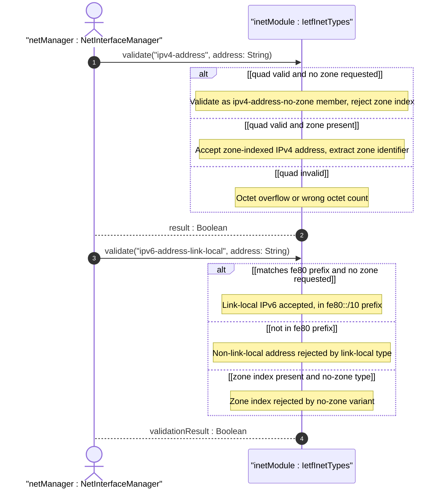
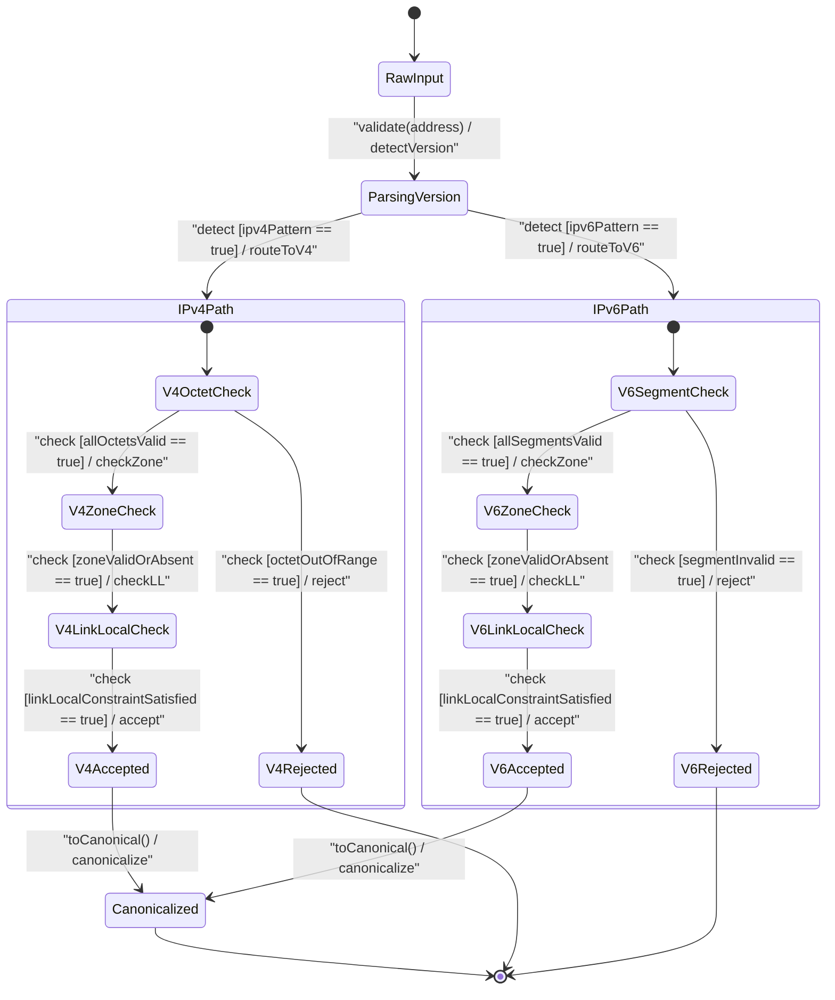

# User Story: [RFC9911-INET] IP Address Scope and Zone Handling

## Parent Epic
- [ ] #11 - [RFC9911-INET] Internet Protocol Suite Types (semantic linkage: this story exercises the zone-index, no-zone, and link-local address scoping behavioral semantics defined in Epic #11 Feature #7)

## Domain Object Mapping
- **Primary Domain Objects:** IpAddress, Ipv4Address, Ipv6Address, IpAddressNoZone, Ipv4AddressNoZone, Ipv6AddressNoZone, IpAddressLinkLocal, Ipv4AddressLinkLocal, Ipv6AddressLinkLocal, IetfInetTypes
- **Actor/Role:** Network Interface Manager (external actor configuring and resolving scoped IP addresses)

## BDD Scenario (OOA/OOD Realization)
**As a** Network Interface Manager
**I want to** represent IPv4 and IPv6 addresses with optional zone indices for scoped addresses and enforce link-local address constraints
**So that** addresses on multi-homed hosts and link-local networks are unambiguous and correctly routed

### Scenario: IPv4 address with zone index passes validation
**Given** an IPv4 address "192.0.2.1%eth0"
**When** the Ipv4Address type validates the value
**Then** validation passes, with zone index "eth0" scoping the address to interface eth0

### Scenario: IPv6 address with zone index passes validation
**Given** an IPv6 address "fe80::1%eth0"
**When** the Ipv6Address type validates the value
**Then** validation passes, with zone index "eth0"

### Scenario: IPv6 canonical zone index uses numerical format
**Given** an IPv6 address "fe80::1%2" (interface index 2)
**When** the Ipv6Address type normalizes the value to canonical form per RFC 4007 Section 11.2
**Then** the zone index remains "2" in numerical canonical format

### Scenario: IPv4 address with zone index rejected by no-zone type
**Given** an IPv4 address "192.0.2.1%eth0"
**When** the Ipv4AddressNoZone type validates the value
**Then** validation fails because zone indices are not allowed in no-zone types

### Scenario: IPv6 address with zone index rejected by no-zone type
**Given** an IPv6 address "2001:db8::1%eth0"
**When** the Ipv6AddressNoZone type validates the value
**Then** validation fails because zone indices are not allowed

### Scenario: Link-local IPv4 address in 169.254.0.0/16 passes
**Given** an IPv4 address "169.254.1.1"
**When** the Ipv4AddressLinkLocal type validates the value
**Then** validation passes because the address is in the 169.254.0.0/16 prefix

### Scenario: Non-link-local IPv4 address rejected by link-local type
**Given** an IPv4 address "192.0.2.1"
**When** the Ipv4AddressLinkLocal type validates the value
**Then** validation fails because the address is not in 169.254.0.0/16

### Scenario: Link-local IPv6 address in fe80::/10 passes
**Given** an IPv6 address "fe80::1"
**When** the Ipv6AddressLinkLocal type validates the value
**Then** validation passes because the address is in the fe80::/10 prefix

### Scenario: Non-link-local IPv6 address rejected by link-local type
**Given** an IPv6 address "2001:db8::1"
**When** the Ipv6AddressLinkLocal type validates the value
**Then** validation fails because the address is not in fe80::/10

### Scenario: ip-address-no-zone union correctly accepts IPv4 without zone
**Given** an IP address "192.0.2.1" without zone index
**When** the IpAddressNoZone union type validates the value
**Then** the value is accepted as an Ipv4AddressNoZone member

### Scenario: ip-address-link-local union accepts IPv6 link-local
**Given** an IP address "fe80::1"
**When** the IpAddressLinkLocal union type validates the value
**Then** the value is accepted as an Ipv6AddressLinkLocal member

### Scenario: ip-address union accepts zone-indexed IPv6
**Given** an IP address "fe80::1%eth0"
**When** the IpAddress union type resolves the value
**Then** the value is accepted as an Ipv6Address member with zone index "eth0"

### Scenario: IPv6 canonical formatting per RFC 5952
**Given** an IPv6 address "2001:0db8:0000:0000:0000:0000:0000:0001"
**When** the Ipv6Address type normalizes to canonical form
**Then** the canonical form is "2001:db8::1" per RFC 5952 Section 4

## UML Sequence Diagram

## UML State Machine Diagram

## Operational Context
From RFC 9911 Section 4: IP address types support scoped addresses via zone identifiers separated by % sign. The zone index disambiguates identical address values -- for link-local addresses, the zone index typically identifies the interface index or interface name. When the zone index is not present, the default zone of the device applies. The canonical format for zone indices is numerical per RFC 4007 Section 11.2. IPv6 canonical format uses the textual representation defined in RFC 5952 Section 4. No-zone types are for contexts where the zone is known from context. Link-local types restrict addresses to 169.254.0.0/16 (IPv4) and fe80::/10 (IPv6). Non-UTF-8 zone names require a transformation mechanism to UTF-8.

## Required Features Matrix
- [ ] #7 - [RFC9911-INET IP Address Types](https://github.com/gintatkinson/3dgs-039/blob/main/docs/features/feat-07-rfc9911-inet-ip-address-types.md) (defines the IpAddress, Ipv4Address, Ipv6Address, IpAddressNoZone, Ipv4AddressNoZone, Ipv6AddressNoZone, IpAddressLinkLocal, Ipv4AddressLinkLocal, and Ipv6AddressLinkLocal types whose zone, no-zone, and link-local scoping semantics are exercised by this story)

## Logical UI & Interface Bindings
- **Target LUI Component:** Deferred to Feature #7 Task Y
- **Target Layout Container ID:** Deferred to Feature #7 Task Y
- **Data Source Bindings:** Deferred to Feature #7 Task Y

## Source References
Structural Schema: [ietf-inet-types@2025-12-22.yang](https://raw.githubusercontent.com/gintatkinson/3dgs-039/main/schema/ietf-inet-types%402025-12-22.yang) (typedefs: ip-address, ipv4-address, ipv6-address, ip-address-no-zone, ipv4-address-no-zone, ipv6-address-no-zone, ip-address-link-local, ipv4-address-link-local, ipv6-address-link-local)
Normative Specification: [RFC 9911](https://datatracker.ietf.org/doc/rfc9911/) (Section 4: Internet Protocol Suite Types -- IP address types, Table 2)
