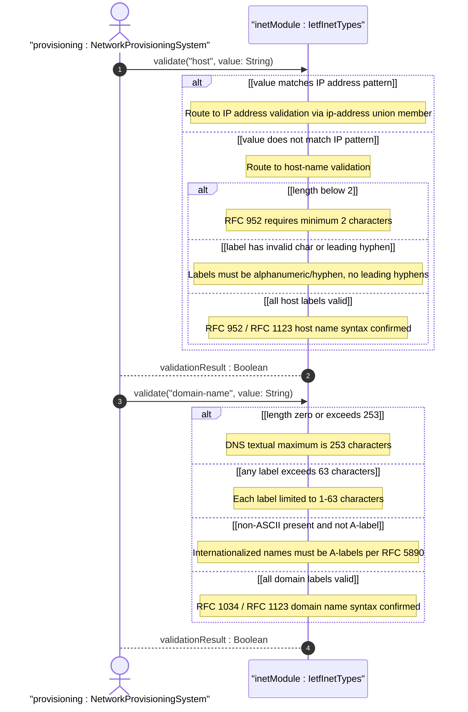
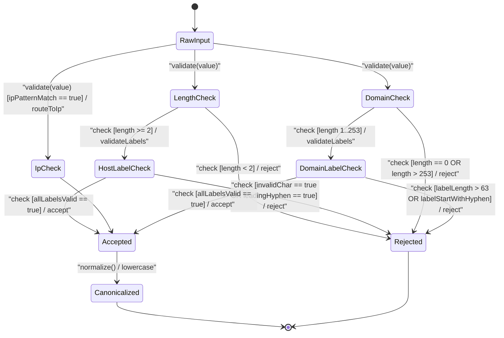

# User Story: [RFC9911-INET] Hostname Validation Rules

## Parent Epic
- [ ] #11 - [RFC9911-INET] Internet Protocol Suite Types (semantic linkage: this story exercises the domain-name, host-name, and host union type validation behavioral semantics defined in Epic #11 Feature #9)

## Domain Object Mapping
- **Primary Domain Objects:** DomainName, HostName, Host, URI, EmailAddress, IetfInetTypes
- **Actor/Role:** Network Provisioning System (external actor submitting hostnames and domain names for syntactic validation)

## BDD Scenario (OOA/OOD Realization)
**As a** Network Provisioning System
**I want to** validate hostnames against RFC 952/1123 syntax rules and domain names against DNS label structure constraints
**So that** only syntactically valid names enter the configuration and network identity management is consistent

### Scenario: Fully qualified domain name passes validation
**Given** a domain name "example.com"
**When** the DomainName type validates the value
**Then** validation passes

### Scenario: Domain name with trailing dot passes
**Given** a domain name "example.com."
**When** the DomainName type validates the value
**Then** validation passes (trailing dot indicating fully qualified name is accepted)

### Scenario: Domain name exceeding 253 characters is rejected
**Given** a domain name with 254 characters
**When** the DomainName type validates the value
**Then** validation fails with length constraint violation

### Scenario: Domain name label exceeding 63 characters is rejected
**Given** a domain name where one label has 64 characters
**When** the DomainName type validates the value
**Then** validation fails because each label is limited to 1-63 characters

### Scenario: Host name with valid RFC 952/1123 syntax passes
**Given** a host name "server1.example.com"
**When** the HostName type validates the value
**Then** validation passes

### Scenario: Host name shorter than 2 characters is rejected
**Given** a host name "a"
**When** the HostName type validates the value
**Then** validation fails with minimum length constraint violation (RFC 952 requires minimum 2 characters)

### Scenario: Host name with invalid characters is rejected
**Given** a host name "server_1.example.com"
**When** the HostName type validates the value
**Then** validation fails because underscores are not valid in host names per RFC 952

### Scenario: Host name with hyphen at start of label is rejected
**Given** a host name "-server.example.com"
**When** the HostName type validates the value
**Then** validation fails because labels must not start with a hyphen

### Scenario: Host union accepts IP address
**Given** a host value "192.0.2.1"
**When** the Host union type resolves the value
**Then** the value is accepted as an ip-address member of the union

### Scenario: Host union accepts IPv6 address
**Given** a host value "2001:db8::1"
**When** the Host union type resolves the value
**Then** the value is accepted as an ip-address member of the union

### Scenario: Host union accepts fully qualified host name
**Given** a host value "server.example.com"
**When** the Host union type resolves the value
**Then** the value is accepted as a host-name member of the union

### Scenario: Internationalized domain name must be A-label
**Given** a domain name containing non-ASCII characters (U-label) "munchen.example.com"
**When** the DomainName type validates the value
**Then** the value is rejected unless encoded as the A-label "xn--mnchen-3ya.example.com" per RFC 5890

### Scenario: Domain name with valid hyphenated labels passes
**Given** a domain name "my-server.example.com"
**When** the DomainName type validates the value
**Then** validation passes

### Scenario: Zero-length domain name is rejected
**Given** an empty string ""
**When** the DomainName type validates the value
**Then** validation fails because length must be 1-253 characters

### Scenario: Canonical form uses lowercase characters
**Given** a domain name "EXAMPLE.COM"
**When** the DomainName type normalizes the value
**Then** the canonical form is "example.com"

## UML Sequence Diagram

## UML State Machine Diagram

## Operational Context
From RFC 9911 Section 4: Internet domain names are loosely specified by RFC 1034 Section 3.5, modified by RFC 1123 Section 2.1. The domain-name pattern is intended to allow for current practice and possible future expansion. Host names have a stricter syntax described in RFC 952 than DNS recommendations -- they must be at least two characters long and are restricted to labels of letters, digits, and hyphens separated by dots. The host type is a union of ip-address and host-name, accepting either an IP address or a fully qualified host name. Domain-name values use ASCII encoding with canonical lowercase form. Internationalized domain names MUST be A-labels per RFC 5890. The DNS protocol limits encoding to 255 characters, yielding a 253-character textual maximum due to length-prefix encoding and trailing NUL.

## Required Features Matrix
- [ ] #9 - [RFC9911-INET Domain, Host, and URI Types](https://github.com/gintatkinson/3dgs-039/blob/main/docs/features/feat-09-rfc9911-inet-domain-host-and-uri-types.md) (defines the DomainName, HostName, and Host union types whose RFC 952/1123/1034 validation semantics are exercised by this story)
- [ ] #7 - [RFC9911-INET IP Address Types](https://github.com/gintatkinson/3dgs-039/blob/main/docs/features/feat-07-rfc9911-inet-ip-address-types.md) (the Host union type delegates IP address validation to the types defined in this Feature)

## Logical UI & Interface Bindings
- **Target LUI Component:** Deferred to Feature #9 Task Y
- **Target Layout Container ID:** Deferred to Feature #9 Task Y
- **Data Source Bindings:** Deferred to Feature #9 Task Y

## Source References
Structural Schema: [ietf-inet-types@2025-12-22.yang](https://raw.githubusercontent.com/gintatkinson/3dgs-039/main/schema/ietf-inet-types%402025-12-22.yang) (typedefs: domain-name, host-name, host)
Normative Specification: [RFC 9911](https://datatracker.ietf.org/doc/rfc9911/) (Section 4: Internet Protocol Suite Types -- domain-name, host-name, host, Table 2)
