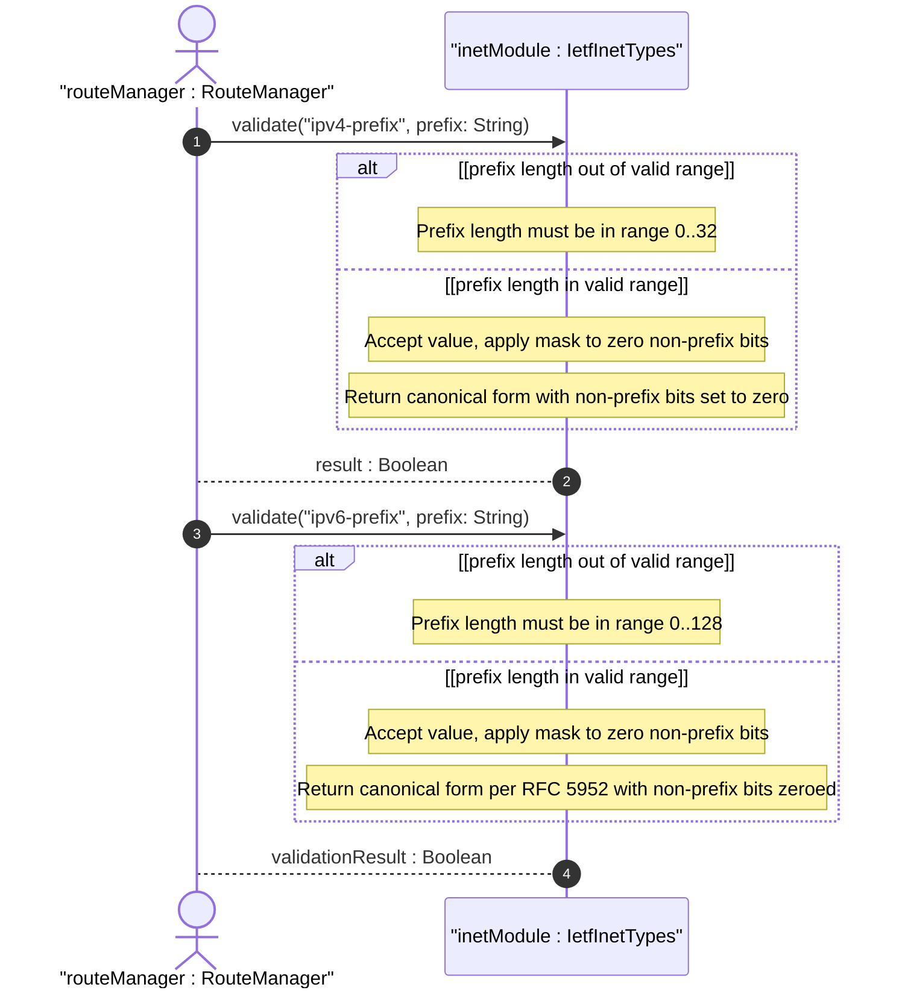
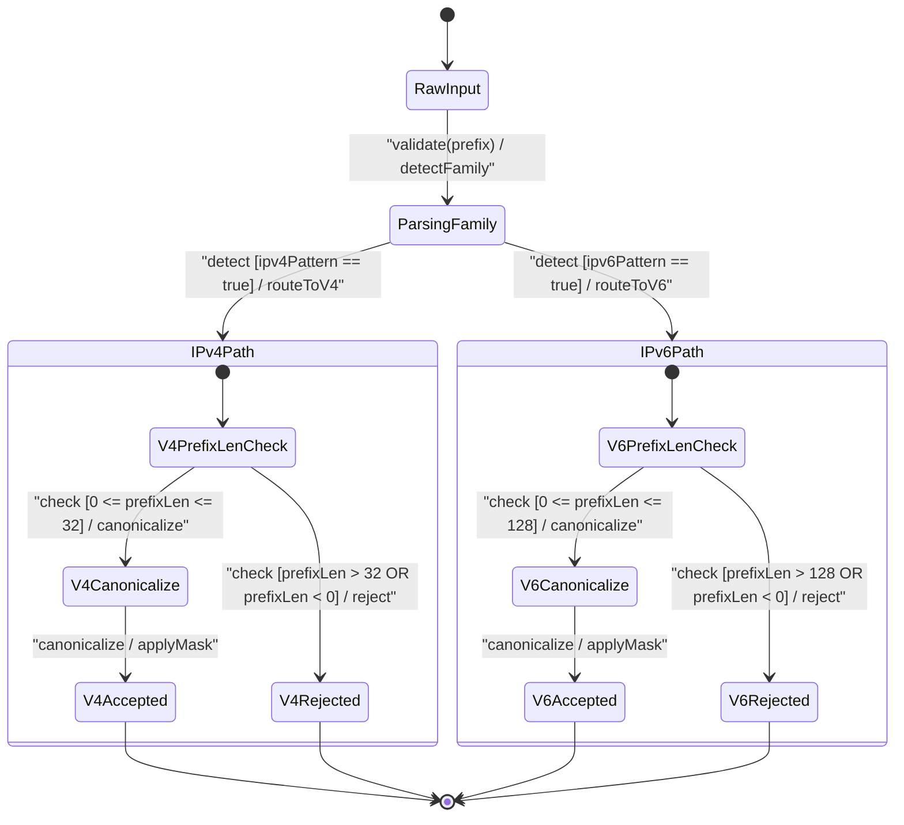

# User Story: [RFC9911-INET] IP Prefix and Mask Validation

## Parent Epic
- [ ] #11 - [RFC9911-INET] Internet Protocol Suite Types (semantic linkage: this story exercises the ip-prefix and ip-address-and-prefix canonicalization and prefix-length validation behavioral semantics defined in Epic #11 Feature #8)

## Domain Object Mapping
- **Primary Domain Objects:** IpPrefix, Ipv4Prefix, Ipv6Prefix, IpAddressAndPrefix, Ipv4AddressAndPrefix, Ipv6AddressAndPrefix, IetfInetTypes
- **Actor/Role:** Route Manager (external actor submitting network prefixes for route table updates)

## BDD Scenario (OOA/OOD Realization)
**As a** Route Manager
**I want to** validate IP prefixes with correct prefix length ranges and canonicalize non-zero host bits
**So that** route entries are unambiguous and longest-prefix-match lookups operate on correctly masked network addresses

### Scenario: IPv4 prefix in canonical form passes validation
**Given** an IPv4 prefix "192.0.2.0/24"
**When** the Ipv4Prefix type validates the value
**Then** validation passes

### Scenario: IPv4 prefix with non-zero host bits is accepted and canonicalized
**Given** an IPv4 prefix "192.0.2.1/24"
**When** the Ipv4Prefix type validates and canonicalizes the value
**Then** the value is accepted and the canonical form "192.0.2.0/24" is returned (non-prefix bits zeroed)

### Scenario: IPv4 prefix length exceeding 32 is rejected
**Given** an IPv4 prefix "192.0.2.0/33"
**When** the Ipv4Prefix type validates the value
**Then** validation fails with prefix length constraint violation

### Scenario: IPv4 prefix length zero represents default route
**Given** an IPv4 prefix "0.0.0.0/0"
**When** the Ipv4Prefix type validates the value
**Then** validation passes (prefix length 0 represents the default route)

### Scenario: IPv6 prefix in canonical form passes validation
**Given** an IPv6 prefix "2001:db8::/32"
**When** the Ipv6Prefix type validates the value
**Then** validation passes

### Scenario: IPv6 prefix with non-zero host bits is accepted and canonicalized
**Given** an IPv6 prefix "2001:db8::1/64"
**When** the Ipv6Prefix type validates and canonicalizes the value
**Then** the canonical form "2001:db8::/64" is returned (non-prefix bits zeroed)

### Scenario: IPv6 prefix length exceeding 128 is rejected
**Given** an IPv6 prefix "2001:db8::/129"
**When** the Ipv6Prefix type validates the value
**Then** validation fails with prefix length constraint violation

### Scenario: IPv4 address-and-prefix retains host address bits
**Given** an IPv4 address-and-prefix "192.0.2.1/24"
**When** the Ipv4AddressAndPrefix type validates the value
**Then** the value is accepted as-is (host bits .1 are preserved, unlike ipv4-prefix)

### Scenario: IPv4 address-and-prefix with out-of-range prefix length is rejected
**Given** an IPv4 address-and-prefix "192.0.2.1/33"
**When** the Ipv4AddressAndPrefix type validates the value
**Then** validation fails because prefix length cannot exceed 32

### Scenario: IPv6 address-and-prefix with mixed notation passes
**Given** an IPv6 address-and-prefix "::ffff:192.0.2.1/96"
**When** the Ipv6AddressAndPrefix type validates the value
**Then** validation passes (IPv4-mapped IPv6 address with prefix length 96)

### Scenario: IPv6 address-and-prefix with out-of-range prefix length is rejected
**Given** an IPv6 address-and-prefix "2001:db8::1/129"
**When** the Ipv6AddressAndPrefix type validates the value
**Then** validation fails because prefix length cannot exceed 128

### Scenario: ip-prefix union correctly identifies IPv4 prefix
**Given** an ip-prefix value "10.0.0.0/8"
**When** the IpPrefix union type resolves the family
**Then** the value is identified as IPv4 (ipv4-prefix member)

### Scenario: ip-prefix union correctly identifies IPv6 prefix
**Given** an ip-prefix value "2001:db8::/32"
**When** the IpPrefix union type resolves the family
**Then** the value is identified as IPv6 (ipv6-prefix member)

### Scenario: Negative prefix length is rejected
**Given** an IPv4 prefix "192.0.2.0/-1"
**When** the Ipv4Prefix type validates the value
**Then** validation fails because prefix length is negative

### Scenario: Missing slash separator is rejected
**Given** a string "192.0.2.0" without prefix length
**When** the Ipv4Prefix type validates the value
**Then** validation fails due to missing slash-delimited prefix length

### Scenario: Address-and-prefix non-zero host bits extraction yields network address
**Given** an IPv4 address-and-prefix "192.0.2.100/24"
**When** the subnet operation extracts the network address
**Then** the network address is "192.0.2.0/24"

## UML Sequence Diagram

## UML State Machine Diagram

## Operational Context
From RFC 9911 Section 4: The ipv4-prefix type represents an IPv4 prefix where the prefix length must be less than or equal to 32. A prefix length value of n corresponds to an IP address mask with n contiguous 1-bits from the MSB. The canonical format has all non-prefix bits set to zero. Implementations must accept non-canonical values (e.g., 192.0.2.1/24) and convert to canonical form (192.0.2.0/24). The ipv6-prefix type mirrors this for IPv6 with prefix length up to 128. The ip-address-and-prefix variants differ crucially: non-prefix bits are preserved because the value carries a specific host address and its associated prefix length, not a network prefix. This distinction is essential for DHCP lease records, interface address configurations, and routing protocol adjacencies where both the host address and prefix length are needed.

## Required Features Matrix
- [ ] #8 - [RFC9911-INET IP Prefix Types](https://github.com/gintatkinson/3dgs-039/blob/main/docs/features/feat-08-rfc9911-inet-ip-prefix-types.md) (defines the IpPrefix, Ipv4Prefix, Ipv6Prefix, IpAddressAndPrefix, Ipv4AddressAndPrefix, and Ipv6AddressAndPrefix types whose prefix-length validation and canonicalization semantics are exercised by this story)

## Logical UI & Interface Bindings
- **Target LUI Component:** Deferred to Feature #8 Task Y
- **Target Layout Container ID:** Deferred to Feature #8 Task Y
- **Data Source Bindings:** Deferred to Feature #8 Task Y

## Source References
Structural Schema: [ietf-inet-types@2025-12-22.yang](https://raw.githubusercontent.com/gintatkinson/3dgs-039/main/schema/ietf-inet-types%402025-12-22.yang) (typedefs: ip-prefix, ipv4-prefix, ipv6-prefix, ip-address-and-prefix, ipv4-address-and-prefix, ipv6-address-and-prefix)
Normative Specification: [RFC 9911](https://datatracker.ietf.org/doc/rfc9911/) (Section 4: Internet Protocol Suite Types -- ip-prefix, ipv4-prefix, ipv6-prefix, ip-address-and-prefix, ipv4-address-and-prefix, ipv6-address-and-prefix, Table 2)
