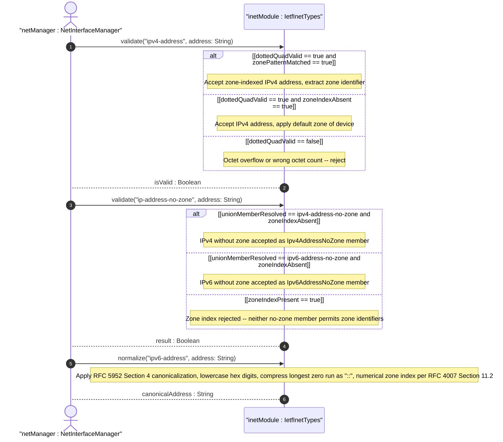
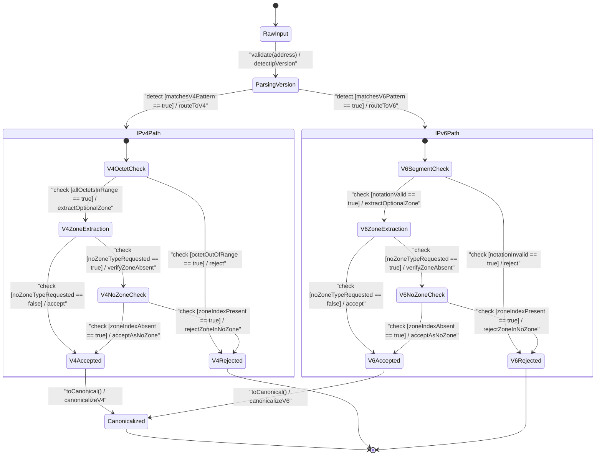

# User Story: [RFC6991-INET] IP Address Scope and Zone Handling

## Parent Epic
- [ ] #29 - [RFC6991-INET] Internet Protocol Suite Types (semantic linkage: this story exercises the zone-index and no-zone behavioral semantics of the IP address typedefs defined in Epic #29 Feature #26 per RFC 6991 Section 4)

## Domain Object Mapping
- **Primary Domain Objects:** IpAddress, Ipv4Address, Ipv6Address, IpAddressNoZone, Ipv4AddressNoZone, Ipv6AddressNoZone, IpVersion, IetfInetTypes
- **Actor/Role:** Network Interface Manager (external actor configuring and resolving scoped IP addresses on multi-homed hosts)

## BDD Scenario (OOA/OOD Realization)
**As a** Network Interface Manager
**I want to** represent IPv4 and IPv6 addresses with optional zone indices for scoped addresses and enforce zone index constraints for no-zone contexts
**So that** addresses on multi-homed hosts and link-local networks are unambiguous and correctly routed to the intended interface

### Scenario: IPv4 address with zone index passes validation
**Given** an IPv4 address "169.254.1.1%eth0"
**When** the Ipv4Address type validates the value
**Then** validation passes, with zone index "eth0" scoping the address to interface eth0

### Scenario: IPv6 address with zone index passes validation
**Given** an IPv6 address "fe80::1%eth0"
**When** the Ipv6Address type validates the value
**Then** validation passes, with zone index "eth0"

### Scenario: IPv6 canonical zone index uses numerical format per RFC 4007 Section 11.2
**Given** an IPv6 address "fe80::1%2" with numerical zone index
**When** the Ipv6Address type normalizes the value to canonical form
**Then** the zone index remains "2" in numerical canonical format

### Scenario: IPv4 address with zone index rejected by no-zone type
**Given** an IPv4 address "169.254.1.1%eth0" with a zone index
**When** the Ipv4AddressNoZone type validates the value
**Then** validation fails because zone indices are not permitted in the no-zone variant (pattern '[0-9\.]*')

### Scenario: IPv6 address with zone index rejected by no-zone type
**Given** an IPv6 address "2001:db8::1%eth0" with a zone index
**When** the Ipv6AddressNoZone type validates the value
**Then** validation fails because zone indices are not allowed in the no-zone variant (pattern '[0-9a-fA-F:\.]*')

### Scenario: ip-address union resolves zone-indexed IPv6
**Given** an IP address "fe80::1%eth0"
**When** the IpAddress union type resolves the value
**Then** the value is accepted as an Ipv6Address member with zone index "eth0"

### Scenario: ip-address-no-zone union rejects zone-indexed IPv6
**Given** an IPv6 address "fe80::1%eth0" with a zone index
**When** the IpAddressNoZone union type validates the value
**Then** validation fails because neither Ipv4AddressNoZone nor Ipv6AddressNoZone allows zone indices

### Scenario: ip-address-no-zone union correctly accepts IPv4 without zone
**Given** an IP address "192.0.2.1" without a zone index
**When** the IpAddressNoZone union type validates the value
**Then** the value is accepted as an Ipv4AddressNoZone member

### Scenario: ip-address-no-zone union correctly accepts IPv6 without zone
**Given** an IP address "2001:db8::1" without a zone index
**When** the IpAddressNoZone union type validates the value
**Then** the value is accepted as an Ipv6AddressNoZone member

### Scenario: IPv6 canonical formatting normalizes per RFC 5952 Section 4
**Given** an IPv6 address "2001:0db8:0000:0000:0000:0000:0000:0001"
**When** the Ipv6Address type normalizes to canonical form
**Then** the canonical form is "2001:db8::1" per RFC 5952 Section 4

## UML Sequence Diagram

## UML State Machine Diagram

## Operational Context
From RFC 6991, Section 4 (ietf-inet-types module revision 2013-07-15):

> The ip-address type represents an IP address and is IP version neutral. The format of the textual representation implies the IP version. This type supports scoped addresses by allowing zone identifiers in the address format.

> The zone index is used to disambiguate identical address values. For link-local addresses, the zone index will typically be the interface index number or the name of an interface. If the zone index is not present, the default zone of the device will be used. The canonical format for the zone index is the numerical format.

> The canonical format of IPv6 addresses uses the textual representation defined in Section 4 of RFC 5952. The canonical format for the zone index is the numerical format as described in Section 11.2 of RFC 4007.

> The ip-address-no-zone type represents an IP address and is IP version neutral. The format of the textual representation implies the IP version. This type does not support scoped addresses since it does not allow zone identifiers in the address format.

> An IPv4 address without a zone index. This type, derived from ipv4-address, may be used in situations where the zone is known from the context and hence no zone index is needed.

> An IPv6 address without a zone index. This type, derived from ipv6-address, may be used in situations where the zone is known from the context and hence no zone index is needed.

The ip-address-no-zone, ipv4-address-no-zone, and ipv6-address-no-zone types were added in the 2013-07-15 revision. The ip-version enumeration provides a protocol version discriminator with values unknown (0), ipv4 (1), and ipv6 (2). Non-UTF-8 zone names on legacy operating systems require a local transformation to UTF-8 for interoperable YANG data exchange.

## Required Features Matrix
- [ ] #26 - [RFC6991-INET IP Address Types](https://github.com/gintatkinson/3dgs-039/blob/main/docs/features/feat-11-rfc6991-inet-ip-address-types.md) (defines the IpAddress, Ipv4Address, Ipv6Address, IpAddressNoZone, Ipv4AddressNoZone, and Ipv6AddressNoZone types whose zone-index and no-zone scoping semantics are exercised by this story)

## Logical UI & Interface Bindings
- **Target LUI Component:** Deferred to Feature #26 Task Y
- **Target Layout Container ID:** Deferred to Feature #26 Task Y
- **Data Source Bindings:** Deferred to Feature #26 Task Y

## Source References
Structural Schema: [ietf-inet-types@2013-07-15.yang](https://raw.githubusercontent.com/gintatkinson/3dgs-039/main/schema/ietf-inet-types%402013-07-15.yang) (typedefs: ip-address, ipv4-address, ipv6-address, ip-address-no-zone, ipv4-address-no-zone, ipv6-address-no-zone, ip-version)
Normative Specification: [RFC 6991](https://datatracker.ietf.org/doc/rfc6991/) (Section 4: Internet Protocol Suite Types -- IP address types, Table 2)
