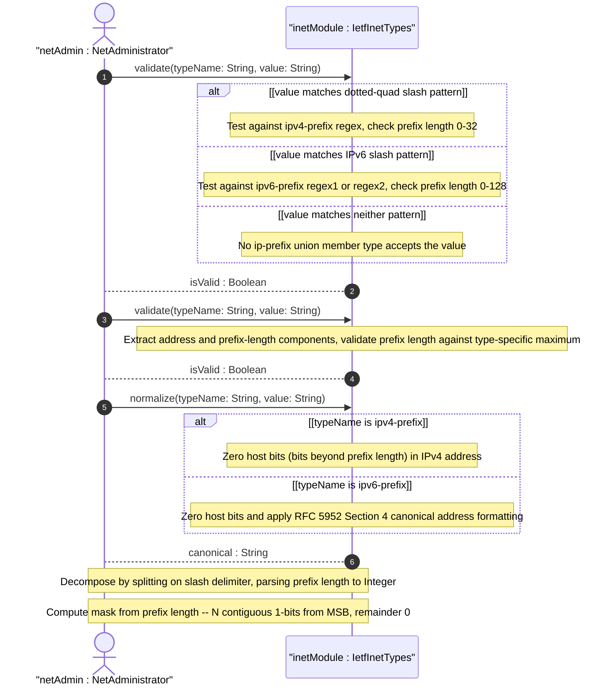

# User Story: [RFC6991-INET] IP Prefix and Mask Validation

## Parent Epic
- [ ] #29 - [RFC6991-INET] Internet Protocol Suite Types](https://github.com/gintatkinson/3dgs-039/blob/main/docs/epics/epic-03-rfc6991-inet-types.md) (semantic linkage: this story validates ip-prefix, ipv4-prefix, and ipv6-prefix typedefs declared in Feature #27 under Epic #29)

## Domain Object Mapping
- **Primary Domain Objects:** IpPrefix, Ipv4Prefix, Ipv6Prefix, IetfInetTypes
- **Actor/Role:** Network Administrator (external actor configuring and validating CIDR prefix entries)

## BDD Scenario (OOA/OOD Realization)
**As a** Network Administrator
**I want to** validate and normalize IP prefix entries in CIDR notation with correct prefix-length constraints and mask derivation
**So that** routing and subnet configurations reflect accurate prefix boundaries per RFC 6991 Section 4

### Scenario: IPv4 prefix /24 passes validation
**Given** an IPv4 prefix value "192.0.2.0/24"
**When** the Ipv4Prefix type validates the value against the regex pattern `(([0-9]|[1-9][0-9]|1[0-9][0-9]|2[0-4][0-9]|25[0-5])\.){3}([0-9]|[1-9][0-9]|1[0-9][0-9]|2[0-4][0-9]|25[0-5])/(([0-9])|([1-2][0-9])|(3[0-2]))`
**Then** validation passes with the dotted-quad address "192.0.2.0" and prefix length 24

### Scenario: IPv4 prefix /0 (default route) passes validation
**Given** an IPv4 prefix value "0.0.0.0/0"
**When** the Ipv4Prefix type validates the value
**Then** validation passes, representing the default route with prefix length 0 (all bits in host portion)

### Scenario: IPv4 prefix /32 (single host) passes validation
**Given** an IPv4 prefix value "192.0.2.1/32"
**When** the Ipv4Prefix type validates the value
**Then** validation passes, representing a single-host prefix with all 32 bits in the network mask

### Scenario: IPv4 prefix length 33 rejected
**Given** an IPv4 prefix value "192.0.2.0/33"
**When** the Ipv4Prefix type validates the value
**Then** validation fails because prefix length 33 exceeds the maximum of 32; the regex `(3[0-2])` component rejects it

### Scenario: IPv4 negative prefix length rejected
**Given** an IPv4 prefix value "192.0.2.0/-1"
**When** the Ipv4Prefix type validates the value
**Then** validation fails because the prefix-length regex requires a non-negative digit

### Scenario: IPv4 prefix with malformed address rejected
**Given** an IPv4 prefix value "192.0.2.256/24"
**When** the Ipv4Prefix type validates the value against the dotted-quad pattern
**Then** validation fails because octet 256 exceeds 255

### Scenario: IPv4 prefix missing slash separator rejected
**Given** an IPv4 prefix value "192.0.2.0"
**When** the Ipv4Prefix type validates the value
**Then** validation fails because the slash character separating address from prefix length is absent

### Scenario: IPv6 prefix /32 passes validation
**Given** an IPv6 prefix value "2001:db8::/32"
**When** the Ipv6Prefix type validates the value
**Then** validation passes with prefix length 32

### Scenario: IPv6 prefix /128 (single host) passes validation
**Given** an IPv6 prefix value "2001:db8::1/128"
**When** the Ipv6Prefix type validates the value
**Then** validation passes, representing a single-host prefix with all 128 bits in the network mask

### Scenario: IPv6 prefix /0 (default route) passes validation
**Given** an IPv6 prefix value "::/0"
**When** the Ipv6Prefix type validates the value
**Then** validation passes, representing the IPv6 default route

### Scenario: IPv6 prefix length 129 rejected
**Given** an IPv6 prefix value "2001:db8::/129"
**When** the Ipv6Prefix type validates the value against the strict pattern
**Then** validation fails because prefix length 129 exceeds the maximum of 128

### Scenario: IPv6 mixed notation prefix passes validation
**Given** an IPv6 prefix value "::ffff:192.0.2.0/120"
**When** the Ipv6Prefix type validates the value
**Then** validation passes; the mixed-notation IPv4-mapped IPv6 address matches the third alternative in the first regex pattern

### Scenario: IPv6 shortened notation prefix passes validation
**Given** an IPv6 prefix value "fe80::/10"
**When** the Ipv6Prefix type validates the value against the second (shortened) pattern
**Then** validation passes with the shortened-notation address

### Scenario: IPv6 prefix with malformed address rejected
**Given** an IPv6 prefix value "2001:db8:xyz::/32"
**When** the Ipv6Prefix type validates the value
**Then** validation fails because the hex digit pattern rejects non-hex characters

### Scenario: IPv6 prefix missing slash separator rejected
**Given** an IPv6 prefix value "2001:db8::"
**When** the Ipv6Prefix type validates the value
**Then** validation fails because no slash-prefix-length segment is present

### Scenario: ip-prefix union resolves IPv4 member
**Given** an ip-prefix value "192.0.2.0/24"
**When** the IpPrefix union type validates the value
**Then** the Ipv4Prefix member type is selected and validation succeeds

### Scenario: ip-prefix union resolves IPv6 member
**Given** an ip-prefix value "2001:db8::/32"
**When** the IpPrefix union type validates the value
**Then** the Ipv6Prefix member type is selected and validation succeeds

### Scenario: ip-prefix union rejects invalid prefix
**Given** an ip-prefix value "not-a-prefix"
**When** the IpPrefix union type validates the value
**Then** validation fails because neither Ipv4Prefix nor Ipv6Prefix member type accepts the value

### Scenario: Prefix mask computed from length 24
**Given** a prefix length of 24 for IPv4
**When** the IetfInetTypes module computes the subnet mask from the prefix length
**Then** the resulting mask is "255.255.255.0" with 24 contiguous 1-bits from the MSB

### Scenario: Prefix mask computed from length 128
**Given** a prefix length of 128 for IPv6
**When** the IetfInetTypes module computes the subnet mask
**Then** the resulting mask has all 128 bits set to 1

### Scenario: Canonical form zeros host bits for IPv4
**Given** an IPv4 prefix value "192.0.2.42/24" where bits 8-31 (host portion) are non-zero
**When** the Ipv4Prefix type normalizes to canonical form
**Then** host bits are zeroed, producing "192.0.2.0/24"

### Scenario: Canonical form zeros host bits and applies RFC 5952 for IPv6
**Given** an IPv6 prefix value "2001:0db8:0000:0000:0000:0000:0000:abcd/32" with non-canonical address and non-zero host bits
**When** the Ipv6Prefix type normalizes to canonical form per RFC 5952 Section 4
**Then** host bits are zeroed and the address becomes "2001:db8::/32"

### Scenario: Decompose extracts address and prefix length from IPv4 prefix
**Given** an IPv4 prefix value "192.0.2.0/24"
**When** the IetfInetTypes module decomposes the prefix
**Then** the address component is "192.0.2.0" and the prefix-length component is 24

### Scenario: Decompose extracts address and prefix length from IPv6 prefix
**Given** an IPv6 prefix value "2001:db8::/32"
**When** the IetfInetTypes module decomposes the prefix
**Then** the address component is "2001:db8::" and the prefix-length component is 32

## UML Sequence Diagram

## UML State Machine Diagram

```mermaid
stateDiagram-v2
    [*] --> RawInput
    RawInput --> VersionDetection : "validate(value) / detectPrefixVersion"
    VersionDetection --> IPv4PrefixPath : "detect [ipv4PrefixPattern == true] / routeToV4"
    VersionDetection --> IPv6PrefixPath : "detect [ipv6PrefixPattern == true] / routeToV6"
    VersionDetection --> Rejected : "detect [noPatternMatch == true] / rejectUnionMember"

    state IPv4PrefixPath {
        [*] --> V4AddressCheck
        V4AddressCheck --> V4PrefixLengthCheck : "check [dottedQuadValid == true] / extractPrefixLength"
        V4PrefixLengthCheck --> V4Accepted : "check [prefixLength >= 0 and prefixLength <= 32] / acceptV4"
        V4AddressCheck --> V4Malformed : "check [dottedQuadInvalid == true] / rejectMalformed"
        V4PrefixLengthCheck --> V4LengthOOB : "check [prefixLength > 32 or prefixLength < 0] / rejectLengthOOB"
    }

    state IPv6PrefixPath {
        [*] --> V6AddressCheck
        V6AddressCheck --> V6PrefixLengthCheck : "check [addressNotationValid == true] / extractPrefixLength"
        V6PrefixLengthCheck --> V6Accepted : "check [prefixLength >= 0 and prefixLength <= 128] / acceptV6"
        V6AddressCheck --> V6Malformed : "check [addressNotationInvalid == true] / rejectMalformed"
        V6PrefixLengthCheck --> V6LengthOOB : "check [prefixLength > 128 or prefixLength < 0] / rejectLengthOOB"
    }

    V4Accepted --> Canonicalized : "normalize() / zeroHostBitsForV4"
    V6Accepted --> Canonicalized : "normalize() / zeroHostBitsAndRFC5952"
    Canonicalized --> [*]

    V4Malformed --> [*]
    V4LengthOOB --> [*]
    V6Malformed --> [*]
    V6LengthOOB --> [*]
    Rejected --> [*]
```

## Operational Context
From RFC 6991 Section 4 (ietf-inet-types module), typedef definitions for IP prefix types:

The ip-prefix type is a union of the ipv4-prefix and ipv6-prefix types and is IP version neutral -- the format of the textual representation implies the IP version. The ipv4-prefix type represents an IPv4 address prefix in dotted-quad notation followed by a slash and a prefix length less than or equal to 32. A prefix length value of n corresponds to an IP address mask with n contiguous 1-bits from the most significant bit (MSB) and all other bits set to 0. The canonical format of an IPv4 prefix has all bits of the IPv4 address set to zero that are not part of the IPv4 prefix. The ipv6-prefix type represents an IPv6 address prefix followed by a slash and a prefix length less than or equal to 128. The canonical format of an IPv6 prefix has all host bits zeroed and the IPv6 address represented per RFC 5952 Section 4. No zone indices are supported in prefix types -- the ipv4-prefix and ipv6-prefix patterns do not include the zone identifier syntax present in the corresponding address types. Prefix types carry no SMIv2 textual convention equivalence.

## Required Features Matrix
- [ ] #27 - [RFC6991-INET IP Prefix Types](https://github.com/gintatkinson/3dgs-039/blob/main/docs/features/feat-12-rfc6991-inet-ip-prefix-types.md) (defines the IpPrefix union, Ipv4Prefix, and Ipv6Prefix types whose validation, normalisation, decomposition, and mask-computation semantics are exercised by this story)

## Logical UI & Interface Bindings
- **Target LUI Component:** Deferred to Feature #27 Task Y
- **Target Layout Container ID:** Deferred to Feature #27 Task Y
- **Data Source Bindings:** Deferred to Feature #27 Task Y

## Source References
Structural Schema: [ietf-inet-types@2013-07-15.yang](https://raw.githubusercontent.com/gintatkinson/3dgs-039/main/schema/ietf-inet-types%402013-07-15.yang) (typedefs: ip-prefix lines 288-297, ipv4-prefix lines 299-318, ipv6-prefix lines 320-351)
Normative Specification: [RFC 6991](https://datatracker.ietf.org/doc/rfc6991/) (Section 4: Internet Protocol Suite Types -- IP Prefix Types, Table 2)
