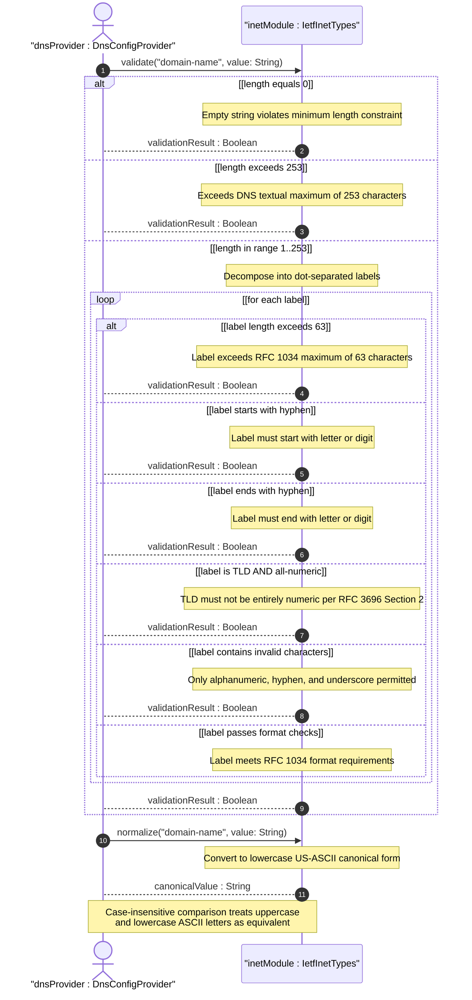
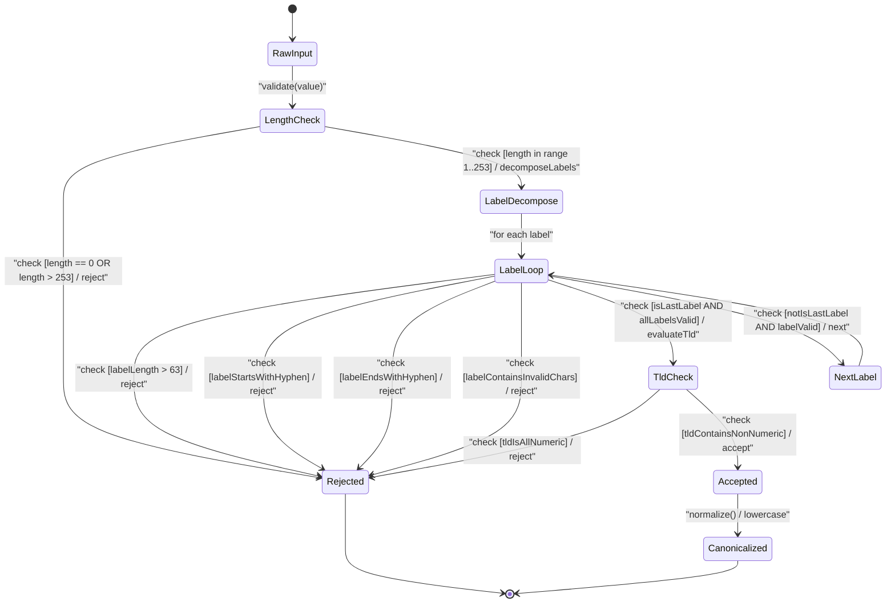

# User Story: [RFC6991-INET] Domain Name Validation Rules

## Parent Epic
- [ ] #29 - [RFC6991-INET Internet Protocol Suite Types](https://github.com/gintatkinson/3dgs-039/blob/main/docs/epics/epic-03-rfc6991-inet-types.md) (semantic linkage: this story exercises the domain-name typedef validation behavioral semantics defined in Epic #29 Feature #28)

## Domain Object Mapping
- **Primary Domain Objects:** DomainName, IetfInetTypes
- **Actor/Role:** DNS Configuration Provider (external actor submitting domain names for syntactic validation)

## BDD Scenario (OOA/OOD Realization)
**As a** DNS Configuration Provider
**I want to** validate domain names against RFC 1034/1035 label structure constraints, including label format, length limits, TLD rules, and case-insensitive comparison
**So that** only syntactically valid DNS domain names are accepted into the configuration system

### Scenario: Fully qualified domain name passes validation
**Given** a domain name "www.example.com"
**When** the DomainName type validates the value
**Then** validation passes

### Scenario: Domain name with trailing dot passes validation
**Given** a fully qualified domain name "example.com."
**When** the DomainName type validates the value
**Then** validation passes (trailing dot indicating FQDN is accepted)

### Scenario: Single-label domain name passes validation
**Given** a domain name "localhost"
**When** the DomainName type validates the value
**Then** validation passes

### Scenario: Domain name with hyphenated labels passes validation
**Given** a domain name "my-host.example.com"
**When** the DomainName type validates the value
**Then** validation passes

### Scenario: Domain name label starts with letter or digit passes
**Given** a domain name label begins with an alphabetic character or numeric digit
**When** the DomainName type validates the value
**Then** the label passes format validation

### Scenario: Domain name label ends with letter or digit passes
**Given** a domain name label ends with an alphabetic character or numeric digit
**When** the DomainName type validates the value
**Then** the label passes format validation

### Scenario: Label with interior hyphens passes validation
**Given** a domain name label "my-domain" containing hyphens in the interior position
**When** the DomainName type validates the value
**Then** the label passes format validation (hyphens permitted in non-terminal positions)

### Scenario: Label exceeding 63 characters is rejected
**Given** a domain name where one label has 64 characters
**When** the DomainName type validates the value
**Then** validation fails because each label is limited to a maximum of 63 characters per RFC 1034

### Scenario: Total domain name exceeding 253 characters is rejected
**Given** a domain name with total length of 254 characters
**When** the DomainName type validates the value
**Then** validation fails with length constraint violation (DNS textual maximum is 253 characters per RFC 1035 encoding limits)

### Scenario: Empty domain name is rejected
**Given** an empty string ""
**When** the DomainName type validates the value
**Then** validation fails because minimum length is 1 character

### Scenario: TLD label with all-numeric characters is rejected
**Given** a domain name "example.123"
**When** the DomainName type validates the value
**Then** validation fails because the top-level domain label must not be entirely numeric per RFC 3696 Section 2

### Scenario: Domain name label starting with hyphen is rejected
**Given** a domain name label "-example.com"
**When** the DomainName type validates the value
**Then** validation fails because labels must not start with a hyphen

### Scenario: Domain name label ending with hyphen is rejected
**Given** a domain name label "example-.com"
**When** the DomainName type validates the value
**Then** validation fails because labels must not end with a hyphen

### Scenario: Case-insensitive comparison passes
**Given** two domain names "Example.COM" and "example.com"
**When** the DomainName type performs equality comparison
**Then** the values are determined to be equal (case-insensitive ASCII comparison)

### Scenario: Canonical form converts to lowercase
**Given** a domain name "EXAMPLE.COM"
**When** the DomainName type normalizes the value
**Then** the canonical form is "example.com" using lowercase US-ASCII characters

### Scenario: Domain name label with underscore passes validation
**Given** a domain name label "my_host"
**When** the DomainName type validates the value
**Then** validation passes (underscores are permitted in domain-name per the YANG pattern allowing current practice)

### Scenario: Internationalized domain name as A-label passes validation
**Given** an internationalized domain name encoded as the A-label "xn--fsq.example.com"
**When** the DomainName type validates the value
**Then** validation passes (A-labels per RFC 5890 are valid domain-name values)

### Scenario: Internationalized domain name as U-label is rejected
**Given** an internationalized domain name containing non-ASCII Unicode characters (U-label)
**When** the DomainName type validates the value
**Then** the value is rejected unless encoded as an A-label per RFC 5890

### Scenario: DNS root represented by dot passes validation
**Given** a domain name "." representing the DNS root
**When** the DomainName type validates the value
**Then** validation passes

## UML Sequence Diagram

## UML State Machine Diagram

## Operational Context
From RFC 6991 Section 4 (ietf-inet-types module): The domain-name type represents a DNS domain name. The name SHOULD be fully qualified whenever possible. Internet domain names are only loosely specified -- Section 3.5 of RFC 1034 recommends a syntax modified in Section 2.1 of RFC 1123. The pattern in the YANG typedef is intended to allow for current practice in domain name use and possible future expansion. It is designed to hold various types of domain names including names used for A or AAAA records (host names) and SRV records. Note that Internet host names have a stricter syntax (RFC 952) than general DNS recommendations. The encoding of DNS names in the DNS protocol is limited to 255 characters. Since encoding consists of labels prefixed by length bytes with a trailing NUL byte, only 253 characters can appear in textual dotted notation. Domain-name values use US-ASCII encoding with canonical lowercase form. Internationalized domain names MUST be A-labels per RFC 5890 (IDNA). TLD labels must not be entirely numeric per RFC 3696 Section 2. Case-insensitive comparison treats uppercase and lowercase ASCII letters as equivalent.

## Required Features Matrix
- [ ] #28 - [RFC6991-INET Domain, Host, and URI Types](https://github.com/gintatkinson/3dgs-039/blob/main/docs/features/feat-13-rfc6991-inet-domain-host-and-uri-types.md) (defines the DomainName datatype and IetfInetTypes validation component whose RFC 1034/1035/3696 domain-name validation semantics are exercised by this story)

## Logical UI & Interface Bindings
- **Target LUI Component:** Deferred to Feature #28 Task Y
- **Target Layout Container ID:** Deferred to Feature #28 Task Y
- **Data Source Bindings:** Deferred to Feature #28 Task Y

## Source References
Structural Schema: [ietf-inet-types@2013-07-15.yang](https://raw.githubusercontent.com/gintatkinson/3dgs-039/main/schema/ietf-inet-types%402013-07-15.yang) (typedef: domain-name, lines 355-407)
Normative Specification: [RFC 6991](https://datatracker.ietf.org/doc/rfc6991/) (Section 4: domain-name typedef, Table 2)
