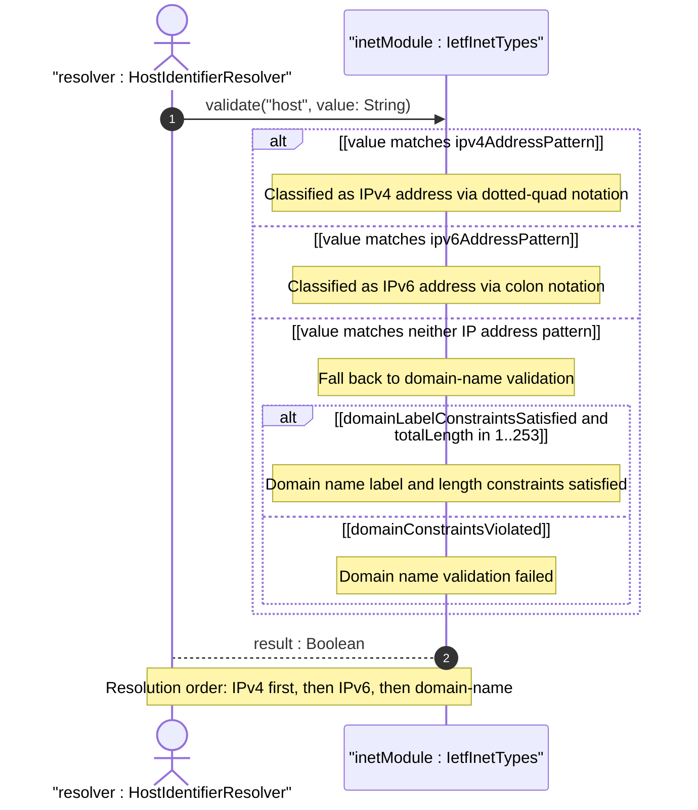
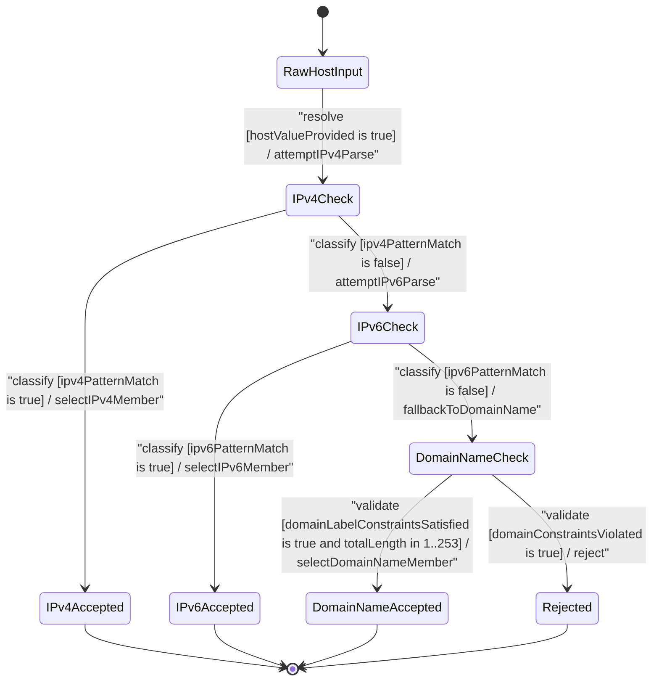

# User Story: [RFC6991-INET] Host Identifier Resolution

## Parent Epic
- [ ] #29 - [RFC6991-INET] Internet Protocol Suite Types (semantic linkage: this story exercises the host union type resolution behavioral semantics defined in Epic #29 Feature #28, which declares the host typedef as a union of ip-address and domain-name)

## Domain Object Mapping
- **Primary Domain Objects:** Host, IpAddress, Ipv4Address, Ipv6Address, DomainName, IetfInetTypes
- **Actor/Role:** Host Identifier Resolver (external actor submitting host values for union member disambiguation and type classification)

## BDD Scenario (OOA/OOD Realization)
**As a** Host Identifier Resolver
**I want to** classify a host value as either an IPv4 address, an IPv6 address, or a DNS domain name by attempting IP address parsing first and falling back to domain-name validation
**So that** downstream consumers can handle each host representation according to its resolved type without ambiguity

### Scenario: Host resolves as IPv4 address via dotted-quad notation
**Given** a host value "192.0.2.1"
**When** the Host union type resolves the value
**Then** the ip-address member type is selected, the value is classified as an IPv4 address via the ipv4-address member, and resolution succeeds

### Scenario: Host resolves as IPv6 address via colon notation
**Given** a host value "2001:db8::1"
**When** the Host union type resolves the value
**Then** the ip-address member type is selected, the value is classified as an IPv6 address via the ipv6-address member, and resolution succeeds

### Scenario: Host resolves as domain name when IP parsing fails
**Given** a host value "server.example.com"
**When** the Host union type resolves the value
**Then** the value does not match IP address patterns, falls back to domain-name validation, and resolution succeeds

### Scenario: IPv4 address with zone index resolves correctly
**Given** a host value "169.254.1.1%eth0"
**When** the Host union type resolves the value
**Then** the ip-address member type is selected, the zone index is preserved, and the value is classified as IPv4 via the ipv4-address member

### Scenario: IPv6 address with zone index resolves correctly
**Given** a host value "fe80::1%2"
**When** the Host union type resolves the value
**Then** the ip-address member type is selected, zone index "2" is recognized, and the value is classified as IPv6 via the ipv6-address member

### Scenario: Host resolution fails for invalid value
**Given** a host value "not-a-valid-host!!"
**When** the Host union type resolves the value
**Then** the value matches neither ip-address patterns nor domain-name constraints, and resolution fails with union validation failure

### Scenario: Host resolves single-label domain name
**Given** a host value "localhost"
**When** the Host union type resolves the value
**Then** the value does not match IPv4 or IPv6 address patterns, domain-name validation passes for the single label, and resolution succeeds

### Scenario: Host resolution order prioritizes IP address over domain name
**Given** a host value "192.168.1.1" (which could be both a valid IPv4 address and a syntactically valid domain name)
**When** the Host union type resolves the value
**Then** the IP address path is attempted first and succeeds, so the value is classified as an IPv4 address rather than a domain name

## UML Sequence Diagram

## UML State Machine Diagram

## Operational Context
From RFC 6991 Section 4: The host type represents either an IP address or a DNS domain name. The ip-address type is itself a union of ipv4-address and ipv6-address, providing IP version neutrality where the textual representation format implies the IP version. The domain-name type represents a DNS domain name with 1-253 character length and dot-separated labels of 1-63 characters each. Domain names use US-ASCII encoding with canonical lowercase form, and internationalized domain names MUST be A-labels per RFC 5890. The host union type has no SMIv2 equivalent. Schema nodes using host MUST describe when and how names are resolved to IP addresses. The resolution order is not explicitly mandated by RFC 6991 but follows from the structural union semantics where each member type is tried in declaration order until one succeeds.

## Required Features Matrix
- [ ] #28 - [RFC6991-INET Domain, Host, and URI Types](https://github.com/gintatkinson/3dgs-039/blob/main/docs/features/feat-13-rfc6991-inet-domain-host-and-uri-types.md) (defines the Host union type and DomainName datatype whose member selection and domain-name validation semantics are exercised by this story)
- [ ] #26 - [RFC6991-INET IP Address Types](https://github.com/gintatkinson/3dgs-039/blob/main/docs/features/feat-11-rfc6991-inet-ip-address-types.md) (defines the IpAddress, Ipv4Address, and Ipv6Address types whose pattern-based disambiguation semantics are exercised during the IP address resolution branch of the host union)

## Logical UI & Interface Bindings
- **Target LUI Component:** Deferred to Feature #28 Task Y
- **Target Layout Container ID:** Deferred to Feature #28 Task Y
- **Data Source Bindings:** Deferred to Feature #28 Task Y

## Source References
Structural Schema: [ietf-inet-types@2013-07-15.yang](https://raw.githubusercontent.com/gintatkinson/3dgs-039/main/schema/ietf-inet-types%402013-07-15.yang) (typedef: host -- union of inet:ip-address and inet:domain-name)
Normative Specification: [RFC 6991](https://datatracker.ietf.org/doc/rfc6991/) (Section 4: Internet Protocol Suite Types, Table 2 -- host, ip-address, domain-name typedefs)
