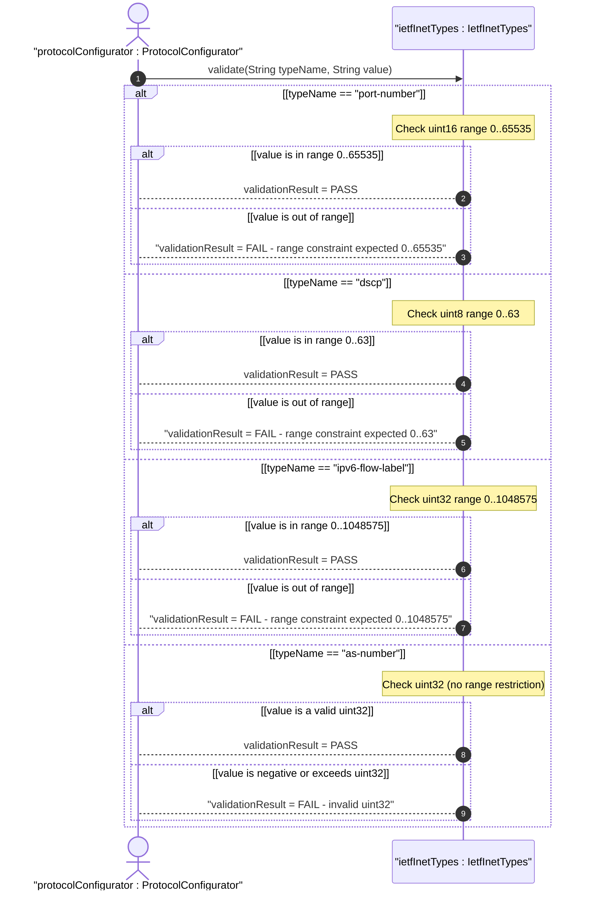
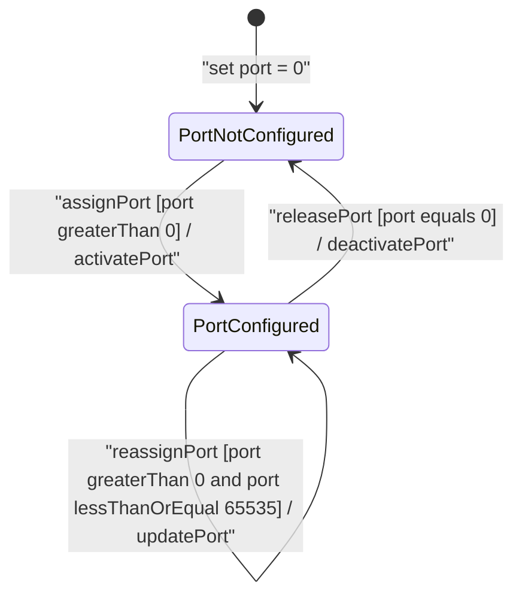

# User Story: [RFC6991-INET] Port Number and Protocol Field Validation

## Parent Epic
- [ ] #29 - [RFC6991-INET Internet Protocol Suite Types](https://github.com/gintatkinson/3dgs-039/blob/main/docs/epics/epic-03-rfc6991-inet-types.md) (semantic linkage: this user story validates the port-number, dscp, ipv6-flow-label, and as-number typedefs defined under the RFC 6991 Section 4 protocol field types category)

## Domain Object Mapping
- **Primary Domain Objects:** port-number, dscp, ipv6-flow-label, as-number
- **Actor/Role:** ProtocolConfigurator — the subsystem that supplies raw protocol field values and requires validation against RFC 6991 type-specific range and semantic constraints

## BDD Scenario (OOA/OOD Realization)
**As a** ProtocolConfigurator
**I want to** validate raw protocol field values against RFC 6991 type-specific range and semantic constraints
**So that** only well-formed port numbers, DSCP code points, IPv6 flow labels, and AS numbers are accepted into system configuration

**Given** an IetfInetTypes validation component configured with RFC 6991 Section 4 type definitions
**When** a port-number, dscp, ipv6-flow-label, or as-number value is submitted for validation
**Then** the component returns pass with the validated value if all range and semantic constraints are satisfied, or returns fail with the specific constraint violation details if any constraint is breached

## UML Sequence Diagram

## UML State Machine Diagram

## Operational Context
From RFC 6991 Section 4, port-number type description:

> The port-number type represents a 16-bit port number of an Internet transport-layer protocol such as UDP, TCP, DCCP, or SCTP. Port numbers are assigned by IANA. Note that the port number value zero is reserved by IANA. In situations where the value zero does not make sense, it can be excluded by subtyping the port-number type.

From RFC 6991 Section 4, dscp type description:

> The dscp type represents a Differentiated Services Code Point that may be used for marking packets in a traffic stream. In the value set and its semantics, this type is equivalent to the Dscp textual convention of the SMIv2.

From RFC 6991 Section 4, ipv6-flow-label type description:

> The ipv6-flow-label type represents the flow identifier or Flow Label in an IPv6 packet header that may be used to discriminate traffic flows. In the value set and its semantics, this type is equivalent to the IPv6FlowLabel textual convention of the SMIv2.

From RFC 6991 Section 4, as-number type description:

> The as-number type represents autonomous system numbers which identify an Autonomous System (AS). Autonomous system numbers were originally limited to 16 bits. BGP extensions have enlarged the autonomous system number space to 32 bits. This type therefore uses an uint32 base type without a range restriction.

Textual representation of AS numbers follows RFC 5396: `asplain` (decimal), `asdot+` (high-order.low-order), and `asdot` notation.

## Required Features Matrix
- [ ] #25 - [RFC6991-INET Protocol Field Types](https://github.com/gintatkinson/3dgs-039/blob/main/docs/features/feat-10-rfc6991-inet-protocol-field-types.md) (semantic linkage: this user story exercises the dscp range 0..63, ipv6-flow-label range 0..1048575, port-number range 0..65535 with port-zero reserved semantics, and as-number uint32 validation constraints defined in feat-10 acceptance criteria)

## Logical UI & Interface Bindings
<!-- Single-Channel (Visual GUI) Format -->
- **Target LUI Component:** Deferred to Feature #25 Task Y
- **Target Layout Container ID:** Deferred to Feature #25 Task Y
- **Data Source Bindings:** Deferred to Feature #25 Task Y

## Source References
Structural Schema: [ietf-inet-types@2013-07-15.yang](https://raw.githubusercontent.com/gintatkinson/3dgs-039/main/schema/ietf-inet-types%402013-07-15.yang) (Collection of types related to protocol fields: typedef dscp, typedef ipv6-flow-label, typedef port-number; Collection of types related to autonomous systems: typedef as-number)
Normative Specification: [RFC 6991](https://datatracker.ietf.org/doc/rfc6991/) (Section 4: ietf-inet-types module, protocol field type definitions, Table 2) — Obsoleted by [RFC 9911](https://datatracker.ietf.org/doc/rfc9911/) (2025)
