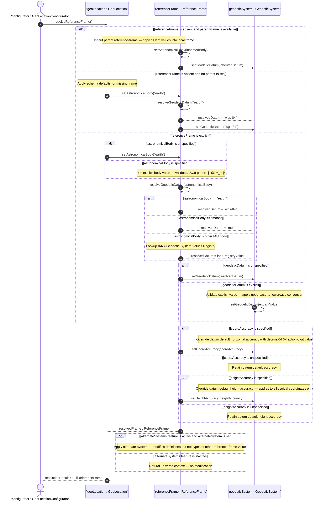
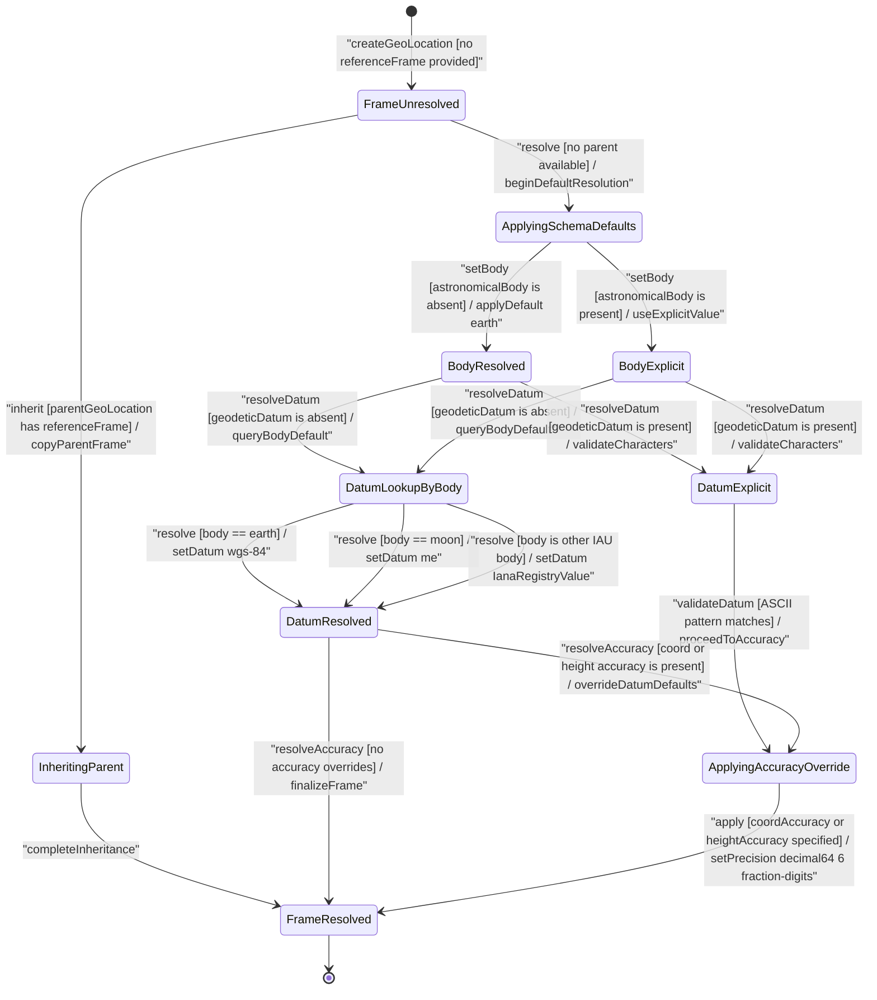

# User Story: [RFC9179-GEO] Reference Frame Selection and Geodetic Datum Resolution

## Parent Epic
- [ ] #42 - [RFC9179-GEO] A YANG Grouping for Geographic Locations](https://github.com/gintatkinson/3dgs-039/blob/main/docs/epics/epic-04-rfc9179-geo-location.md) (semantic linkage: this user story exercises the reference-frame container resolution logic — default astronomical-body, geodetic-datum lookup by body, accuracy override precedence, and nested inheritance — as defined by RFC 9179 Section 2.1)

## Domain Object Mapping
- **Primary Domain Objects:** GeoLocation, ReferenceFrame, GeodeticSystem
- **Actor/Role:** GeoLocationConfigurator — the operator or automated subsystem that supplies raw or partial reference-frame data and requires the system to resolve defaults, select the appropriate geodetic datum, and inherit a parent location's reference frame when none is explicitly supplied

## BDD Scenario (OOA/OOD Realization)
**As a** GeoLocationConfigurator
**I want to** resolve the applicable reference frame and geodetic datum for a geo-location when only partial or no reference-frame data is supplied
**So that** every location always has a fully resolved astronomical body, geodetic datum, and accuracy context consistent with the schema defaults and parent-location inheritance rules

**Given** a GeoLocation resolver configured with the RFC 9179 Section 2.1 reference-frame schema defaults and the IANA Geodetic System Values Registry
**When** a geo-location is submitted with an unspecified astronomical-body, an unspecified geodetic-datum, and no parent reference-frame to inherit
**Then** the resolver applies the default astronomical-body "earth", selects the default geodetic-datum "wgs-84", and preserves any explicit coord-accuracy or height-accuracy values that override the datum defaults

## UML Sequence Diagram

## UML State Machine Diagram

## Operational Context
From RFC 9179 Section 2.1:

> The frame of reference (`reference-frame`) defines what the location values refer to and their meaning. The referred-to object can be any astronomical body. It could be a planet such as Earth or Mars, a moon such as Enceladus, an asteroid such as Ceres, or even a comet such as 1P/Halley. This value is specified in `astronomical-body` and is defined by the International Astronomical Union. The default `astronomical-body` value is `earth`.

From the schema (ietf-geo-location@2022-02-11.yang) — Reference frame resolution semantics:
- **astronomical-body** defaults to `"earth"`; uppercase SHOULD be converted to lowercase; values match ASCII printable pattern `[ -@\[-\^_-~]*` (ranges 32-64, 91-126)
- **geodetic-datum** defaults to `"wgs-84"` when the astronomical body is `"earth"`; the IANA registry defines body-specific datum values (e.g., `"me"` for moon — Mean Earth/Polar Axis); values match the same ASCII printable pattern and IANA further restricts by converting spaces to dashes
- **coord-accuracy** and **height-accuracy** override the default accuracy implied by the geodetic-datum when specified; both are `decimal64` with 6 fraction-digits; height-accuracy carries `units "meters"` and applies to ellipsoidal coordinates only
- **alternate-system** is conditionally present (guarded by `if-feature "alternate-systems"`); when present it "modifies the definition (but not the type) of the other values in the reference frame"
- Nested location containers inherit the parent's reference-frame when their own reference-frame is absent (structural containment implies semantic inheritance)

## Required Features Matrix
- [ ] #37 - [RFC9179-GEO Reference Frame Definition](https://github.com/gintatkinson/3dgs-039/blob/main/docs/features/feat-14-rfc9179-geo-reference-frame-definition.md) (semantic linkage: this user story exercises the resolution, defaulting, and inheritance logic for every leaf and container defined in feat-14 — astronomical-body defaulting, geodetic-datum body-specific default resolution, coord-accuracy and height-accuracy override semantics, alternate-system conditional guarding, and the ReferenceFrame-to-GeodeticSystem containment path)

## Logical UI & Interface Bindings
- **Target LUI Component:** PropertyGrid (reference-frame section with conditional alternate-system visibility and nested geodetic-system subsection)
- **Target Layout Container ID:** properties_view
- **Data Source Bindings:** Deferred to Feature #37 Task 2

## Source References
Structural Schema: [ietf-geo-location@2022-02-11.yang](https://raw.githubusercontent.com/gintatkinson/3dgs-039/main/schema/ietf-geo-location%402022-02-11.yang) (Clause: reference-frame container, astronomical-body leaf with default "earth", alternate-system leaf with if-feature, geodetic-system container with geodetic-datum, coord-accuracy decimal64 fraction-digits 6, height-accuracy decimal64 fraction-digits 6 with units meters)
Normative Specification: [RFC 9179: A YANG Grouping for Geographic Locations](https://datatracker.ietf.org/doc/rfc9179/) (Clause: Section 2.1, Frame of Reference)
