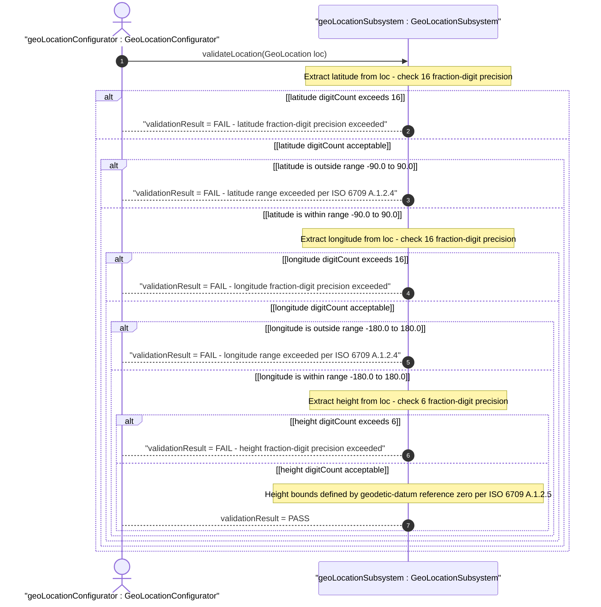
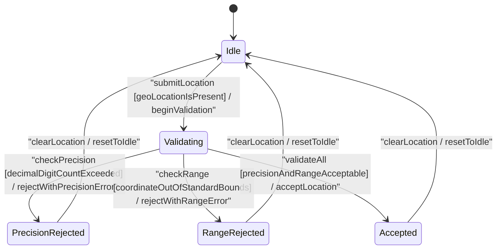

# User Story: [RFC9179-GEO] Ellipsoid Coordinate Validation and Precision

## Parent Epic
- [ ] #42 - [RFC9179-GEO A YANG Grouping for Geographic Locations](https://github.com/gintatkinson/3dgs-039/blob/main/docs/epics/epic-04-rfc9179-geo-location.md) (semantic linkage: this user story validates decimal64 fraction-digit precision and ISO 6709:2008 range constraints for the latitude, longitude, and height leaves of the ellipsoid coordinate case defined within the geo-location grouping)

## Domain Object Mapping
- **Primary Domain Objects:** latitude, longitude, height (ellipsoid case of the location choice) — contextualized by ReferenceFrame.geodeticDatum
- **Actor/Role:** GeoLocationConfigurator — the subsystem that supplies raw ellipsoid coordinate values and requires validation against decimal64 fraction-digit precision constraints, ISO 6709:2008 coordinate range bounds, and geodetic-datum context

## BDD Scenario (OOA/OOD Realization)
**As a** GeoLocationConfigurator
**I want to** validate latitude, longitude, and height values against their RFC 9179 decimal64 fraction-digit precision constraints and ISO 6709:2008 coordinate range bounds
**So that** only coordinate values with the correct number of decimal places and admissible geographic ranges are accepted into the geo-location data model

**Given** a GeoLocationSubsystem validation component configured with the reference-frame geodetic-datum "wgs-84"
**When** a GeoLocation containing ellipsoid coordinate values is submitted via validateLocation
**Then** the subsystem returns true if all fraction-digit precision and range constraints are satisfied, or returns false with the specific constraint violation details if any constraint is breached

## UML Sequence Diagram

## UML State Machine Diagram

## Operational Context
From the ietf-geo-location schema (latitude leaf):

> The latitude value on the astronomical body. The definition and precision of this measurement is indicated by the reference-frame.

From the ietf-geo-location schema (longitude leaf):

> The longitude value on the astronomical body. The definition and precision of this measurement is indicated by the reference-frame.

From the ietf-geo-location schema (height leaf):

> Height from a reference 0 value. The precision and '0' value is defined by the reference-frame.

From RFC 9179 Section 4 (ISO 6709:2008 Conformance):

> For test 'A.1.2.4', representation of horizontal position: latitude/longitude values conform. For test 'A.1.2.5', representation of vertical position: height value conforms.

From ISO 6709:2008 Annex A.1.2.4:

> Representation of horizontal position — latitude and longitude shall be expressed in decimal degrees with sufficient precision to maintain the accuracy of the coordinate representation.

From ISO 6709:2008 Annex A.1.2.5:

> Representation of vertical position — height or depth shall be expressed in metres with sufficient precision to maintain the accuracy of the vertical representation.

Precision requirements:
- latitude: decimal64 with 16 fraction-digits — value must not exceed 16 digits after the decimal point; at this precision, 1 digit represents approximately 0.001 meters (sub-micron accuracy) at the equator
- longitude: decimal64 with 16 fraction-digits — same precision constraints and accuracy characteristic as latitude
- height: decimal64 with 6 fraction-digits — value must not exceed 6 digits after the decimal point, with reference zero defined by the geodetic-datum (e.g., WGS-84 ellipsoid surface for Earth)

Standard coordinate ranges (informational, context-dependent on geodetic-datum):
- latitude: -90.0 to +90.0 decimal degrees
- longitude: -180.0 to +180.0 decimal degrees (or alternatively 0 to 360 per ISO 6709)

## Required Features Matrix
- [ ] #38 - [RFC9179-GEO Ellipsoid Coordinate Location](https://github.com/gintatkinson/3dgs-039/blob/main/docs/features/feat-15-rfc9179-geo-ellipsoid-coordinate-location.md) (semantic linkage: this user story validates the latitude dec64 fr16, longitude dec64 fr16, and height dec64 fr6 leaves defined in feat-15's ellipsoid case, enforcing the fraction-digit precision constraints and coordinate range bounds specified in the feature acceptance criteria)
- [ ] #37 - [RFC9179-GEO Reference Frame Definition](https://github.com/gintatkinson/3dgs-039/blob/main/docs/features/feat-14-rfc9179-geo-reference-frame-definition.md) (semantic linkage: the geodetic-datum defined in feat-14 provides the semantic context for latitude/longitude range validity, height reference zero, and coordinate precision expectations — latitude and longitude meaning is entirely dependent on the geodetic-datum value)

## Logical UI & Interface Bindings
<!-- Single-Channel (Visual GUI) Format -->
- **Target LUI Component:** Deferred to Feature #38 Task Y
- **Target Layout Container ID:** Deferred to Feature #38 Task Y
- **Data Source Bindings:** Deferred to Feature #38 Task Y

## Source References
Structural Schema: [ietf-geo-location@2022-02-11.yang](https://raw.githubusercontent.com/gintatkinson/3dgs-039/main/schema/ietf-geo-location%402022-02-11.yang) (Clause: choice location, case ellipsoid, leaves latitude dec64 fr16, longitude dec64 fr16, height dec64 fr6)
Normative Specification: [RFC 9179: A YANG Grouping for Geographic Locations](https://datatracker.ietf.org/doc/rfc9179/) (Clause: Section 2.2 Location, Section 4 ISO 6709:2008 Conformance)
