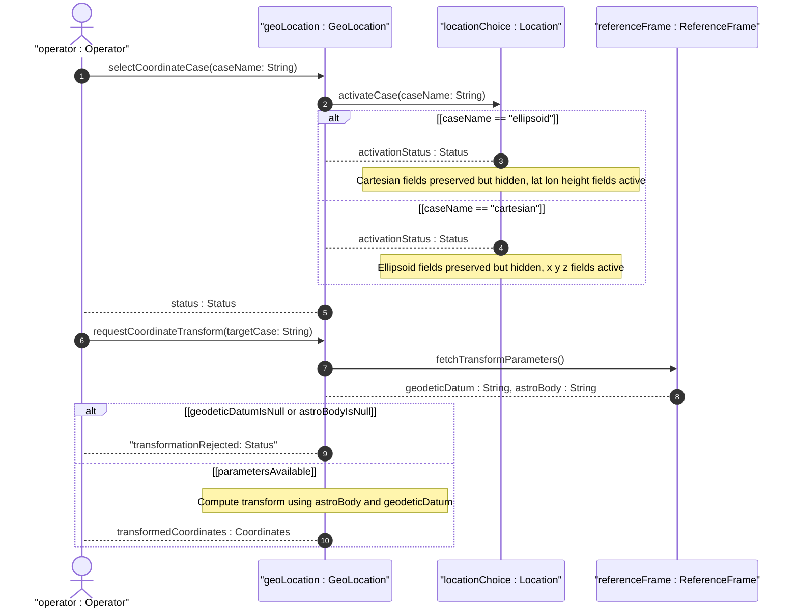
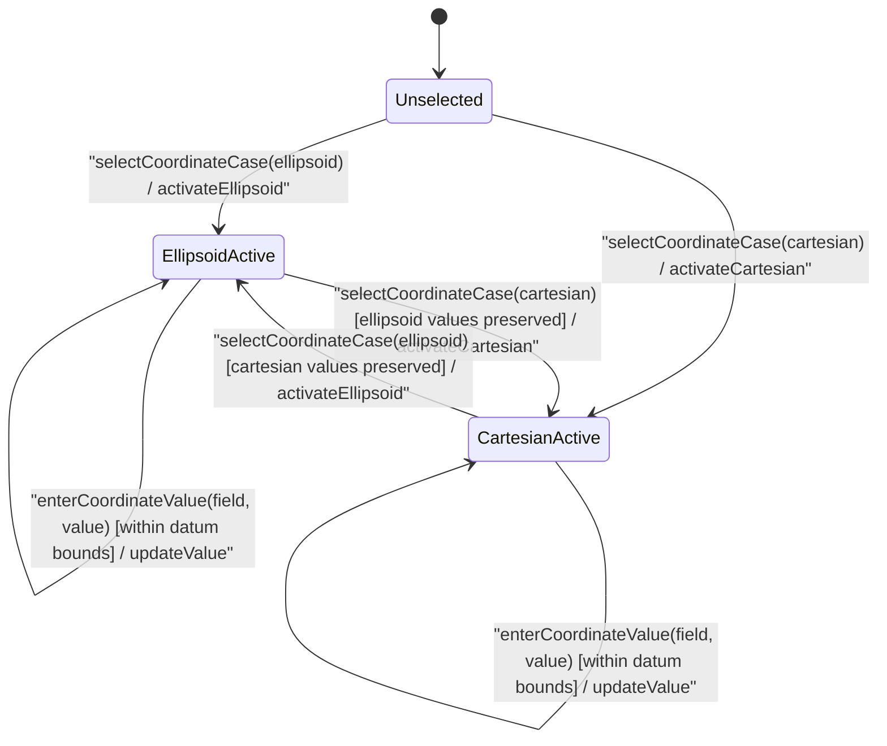

# User Story: [RFC9179-GEO] Location Coordinate System Choice Resolution

## Parent Epic
- [ ] #42 - [RFC9179-GEO] A YANG Grouping for Geographic Locations](https://github.com/gintatkinson/3dgs-039/blob/main/docs/epics/epic-04-rfc9179-geo-location.md) (semantic linkage: this story exercises the exclusive location choice between ellipsoid and cartesian coordinate systems defined by the geo-location grouping)

## Domain Object Mapping
- **Primary Domain Objects:** GeoLocation, Location, Ellipsoid, Cartesian, ReferenceFrame, GeodeticSystem
- **Actor/Role:** System Operator (external actor configuring a geographic location)

## BDD Scenario (OOA/OOD Realization)
**As a** System Operator
**I want to** select between ellipsoidal and Cartesian coordinate systems for a geographic location
**So that** the location data matches the reference frame's coordinate system requirements and only one coordinate case is active at a time

### Scenario: Activate ellipsoid coordinate case
**Given** a geo-location container with no active coordinate case
**When** the operator selects the ellipsoid coordinate system
**Then** the latitude, longitude, and height fields become active and the Cartesian fields remain hidden

### Scenario: Switch from ellipsoid to Cartesian
**Given** the ellipsoid case is active with latitude 40.7127753, longitude -74.0059728, and height 10.000000
**When** the operator switches to the Cartesian coordinate system
**Then** the ellipsoid fields are hidden, the stored values are preserved, Cartesian fields become active, and only the Cartesian case is the active coordinate system

### Scenario: Switch from Cartesian to ellipsoid
**Given** the Cartesian case is active with x=1330585.123456, y=-4652198.654321, and z=4136871.000000
**When** the operator switches to the ellipsoid coordinate system
**Then** the Cartesian fields are hidden, the stored values are preserved, ellipsoid fields become active, and only the ellipsoid case is the active coordinate system

### Scenario: Neither coordinate case selected at initialization
**Given** a geo-location container is first created
**When** the location section is rendered
**Then** neither coordinate case is pre-selected and the operator must explicitly choose ellipsoid or Cartesian before entering coordinate values

### Scenario: Exclusive choice enforcement prevents simultaneous case activation
**Given** the ellipsoid case is active
**When** an attempt is made to simultaneously activate the Cartesian case without deactivating ellipsoid
**Then** the system rejects the request and only the ellipsoid case remains active

### Scenario: Coordinate transformation from ellipsoid to Cartesian
**Given** the ellipsoid case is active and the reference frame specifies astronomical body "earth" with geodetic datum "wgs-84"
**When** the operator requests a coordinate transformation from ellipsoid to Cartesian
**Then** the system computes the Cartesian x, y, z values using the astronomical body and geodetic datum transformation parameters and populates the Cartesian fields

### Scenario: Empty choice valid
**Given** neither the ellipsoid nor Cartesian case has any leaves specified
**When** the geo-location container is validated
**Then** validation succeeds with no mandatory coordinate constraint imposed

### Scenario: Transformation unavailable without reference frame
**Given** the geodetic datum or astronomical body is not specified in the reference frame
**When** the operator requests a coordinate system transformation
**Then** the system rejects the transformation request indicating that the reference frame parameters are required for coordinate conversion

## UML Sequence Diagram


## UML State Machine Diagram


## Operational Context
From RFC 9179 Section 2.2: "This is the location on, or relative to, the astronomical object. It is specified using two or three coordinate values. These values are given either as 'latitude', 'longitude', and an optional 'height', or as Cartesian coordinates of 'x', 'y', and 'z'."

The location choice is exclusive: only one case (ellipsoid or Cartesian) may be active at a time. The choice node enforces mutual exclusivity at the schema level. The application selects the ellipsoid case for standard Earth-like use with latitude/longitude coordinates, and the Cartesian case for non-standard systems or reference frames that define a Cartesian coordinate origin. Mapping between coordinate systems requires knowledge of the astronomical body and geodetic datum from the reference frame, as the transformation parameters (reference ellipsoid shape, origin offset, axis orientation) are datum-specific. Without a defined geodetic datum and astronomical body, coordinate transformation is not mathematically determined.

## Required Features Matrix
- [ ] #38 - [RFC9179-GEO Ellipsoid Coordinate Location](https://github.com/gintatkinson/3dgs-039/blob/main/docs/features/feat-15-rfc9179-geo-ellipsoid-coordinate-location.md) (defines the ellipsoid case of the location choice with latitude, longitude, and height leaves -- the target case when the operator selects ellipsoidal coordinates)
- [ ] #39 - [RFC9179-GEO Cartesian Coordinate Location](https://github.com/gintatkinson/3dgs-039/blob/main/docs/features/feat-16-rfc9179-geo-cartesian-coordinate-location.md) (defines the Cartesian case of the location choice with x, y, and z leaves -- the target case when the operator selects Cartesian coordinates)
- [ ] #37 - [RFC9179-GEO Reference Frame Definition](https://github.com/gintatkinson/3dgs-039/blob/main/docs/features/feat-14-rfc9179-geo-reference-frame-definition.md) (defines the reference-frame container with astronomical body and geodetic datum -- required for coordinate system transformation between ellipsoid and Cartesian)

## Logical UI & Interface Bindings
<!-- Single-Channel (Visual GUI) Format -->
- **Target LUI Component:** SegmentedControl
- **Target Layout Container ID:** properties_view
- **Data Source Bindings:** Deferred to Feature #38 Task 2

## Source References
> [!IMPORTANT]
> **Dynamic Schema Locator**: You MUST inspect the active workspace directories (e.g. `schema/`) to build schema locators dynamically. Do NOT hardcode legacy paths like `standard/ietf/RFC/`.

Structural Schema: [ietf-geo-location@2022-02-11.yang](https://raw.githubusercontent.com/gintatkinson/3dgs-039/main/schema/ietf-geo-location%402022-02-11.yang) (Clause: choice location, cases ellipsoid and cartesian)
Normative Specification: [RFC 9179: A YANG Grouping for Geographic Locations](https://datatracker.ietf.org/doc/rfc9179/) (Clause: Section 2.2, Location)

> [!WARNING]
> **Mermaid Block Closing Constraints & Code Fence Integrity:**
> - Every Mermaid diagram MUST be strictly closed with ``` on a new line. Leaking Mermaid blocks (e.g. having headings like `##` inside an unclosed diagram) or stray/unclosed code fences will fail downstream validation checks.
> - Ensure there are no stray backticks or unmatched code fences in the document.
> - **All Mermaid syntax constraints are defined in `rules/platform-independence.md` and MUST be observed in full** — including the prohibition on semicolons in `Note` and message text, colons in class members and note strings, stereotypes on relationship lines, and curly braces in class member lines. Do not maintain a local subset here; subsets drift (issue #289).
