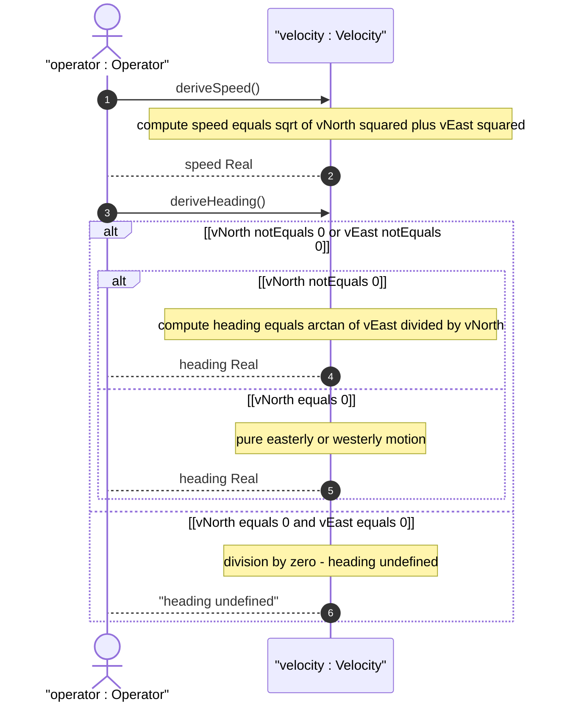
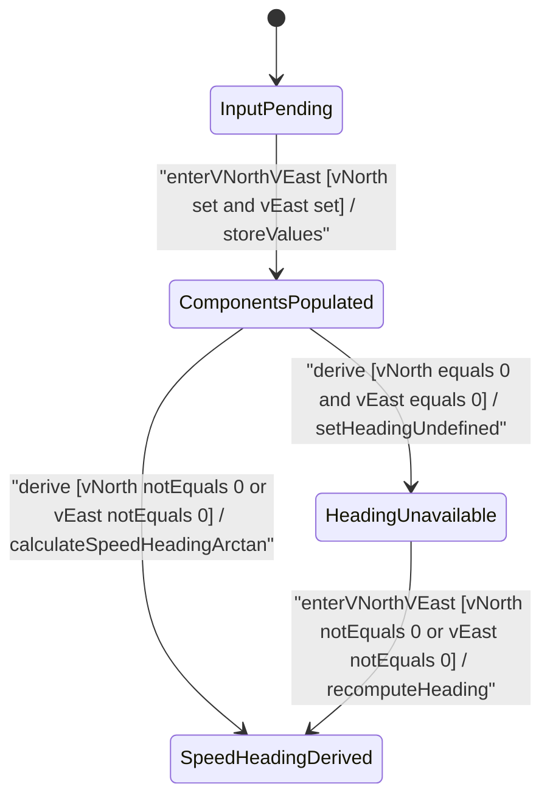

# User Story: [RFC9179-GEO] Velocity Vector Computation and Speed Heading Derivation

## Parent Epic
- [ ] #42 - [RFC9179-GEO A YANG Grouping for Geographic Locations](https://github.com/gintatkinson/3dgs-039/blob/main/docs/epics/epic-04-rfc9179-geo-location.md) (semantic linkage: this user story exercises the speed and heading derivation formulas applied to the v-north, v-east, and v-up velocity vector components defined under the RFC 9179 geo-location grouping)

## Domain Object Mapping
- **Primary Domain Objects:** Velocity (v-north, v-east, v-up leaves), derived speed, derived heading
- **Actor/Role:** Operator — the user or subsystem that supplies velocity component values and observes the computed speed and heading readout

## BDD Scenario (OOA/OOD Realization)
**As a** Operator
**I want to** enter velocity vector components and have the system compute speed and heading from them
**So that** I can determine object motion characteristics without performing manual trigonometric calculations

**Given** the velocity container holds stored v-north and v-east component values
**When** the velocity display is rendered
**Then** the system SHALL compute derived speed as sqrt of v_north squared plus v_east squared in meters per second and derived heading as arctan of v_east over v_north in decimal degrees clockwise from true north

**Given** the velocity container holds v-north equal to zero and v-east equal to zero
**When** the heading is derived
**Then** the system SHALL display heading as undefined — division by zero guard engaged

**Given** the velocity container holds v-north equal to zero and v-east is non-zero
**When** the heading is derived
**Then** the system SHALL display heading as 90 degrees for pure easterly motion or -90 degrees for pure westerly motion

**Given** any velocity component value changes
**When** the velocity display is refreshed
**Then** the derived speed and heading SHALL recalculate reactively using the updated stored values

## UML Sequence Diagram

## UML State Machine Diagram

## Operational Context
From RFC 9179 Section 2.3:

> To derive the two-dimensional heading and speed, one would use the following formulas: speed = sqrt(v_north^2 + v_east^2), heading = arctan(v_east / v_north).

From RFC 9179 Section 2.3:

> For some applications that demand high accuracy and where the data is infrequently updated, this velocity vector can track very slow movement such as continental drift.

From RFC 9179 Section 2.3:

> Tracking more complex forms of motion is outside the scope of this work. The intent of the grouping being defined here is to identify where something is located, and generally this is expected to be somewhere on, or relative to, Earth (or another astronomical body).

The heading derivation is relative to true north as defined by the reference-frame geodetic-system. Both v-north and v-east values are in meters per second with 12 fraction-digit precision. The velocity vector describes motion at the time given by the geo-location timestamp, supporting applications requiring high accuracy with infrequent updates such as tracking continental drift. Rapidly changing objects require more frequent queries.

## Required Features Matrix
- [ ] #40 - [RFC9179-GEO Velocity Vector](https://github.com/gintatkinson/3dgs-039/blob/main/docs/features/feat-17-rfc9179-geo-velocity-vector.md) (semantic linkage: this user story exercises the deriveSpeed and deriveHeading operations on the Velocity class, and validates the v-north, v-east leaf decimal64 fr12 values that are the inputs to the computation)
- [ ] #37 - [RFC9179-GEO Reference Frame Definition](https://github.com/gintatkinson/3dgs-039/blob/main/docs/features/feat-14-rfc9179-geo-reference-frame-definition.md) (semantic linkage: the reference-frame geodetic-system defines what true north means, which is the directional basis for the heading derivation and the v-north/v-east axis orientation)

## Logical UI & Interface Bindings
<!-- Single-Channel (Visual GUI) Format -->
- **Target LUI Component:** Deferred to Feature #40 Task Y
- **Target Layout Container ID:** Deferred to Feature #40 Task Y
- **Data Source Bindings:** Deferred to Feature #40 Task Y

## Source References
Structural Schema: [ietf-geo-location@2022-02-11.yang](https://raw.githubusercontent.com/gintatkinson/3dgs-039/main/schema/ietf-geo-location%402022-02-11.yang) (velocity container, v-north/v-east/v-up leaves: decimal64 with 12 fraction-digits, meters per second)
Normative Specification: [RFC 9179: A YANG Grouping for Geographic Locations](https://datatracker.ietf.org/doc/rfc9179/) (Section 2.3: Motion, speed and heading derivation formulas)
