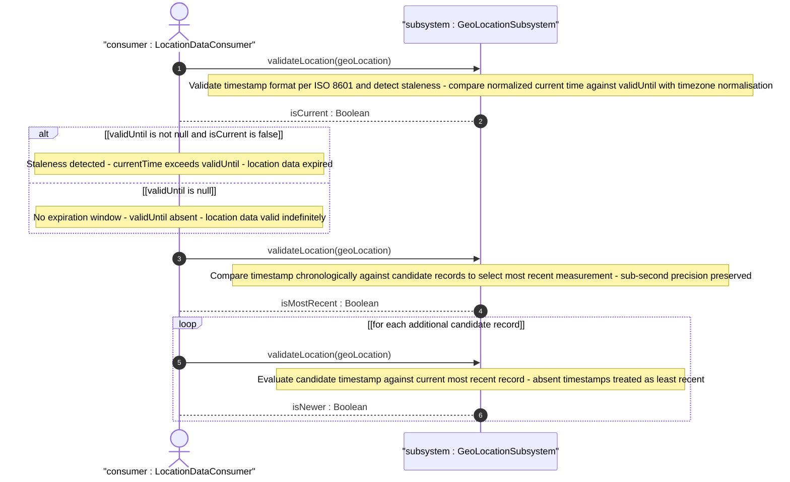
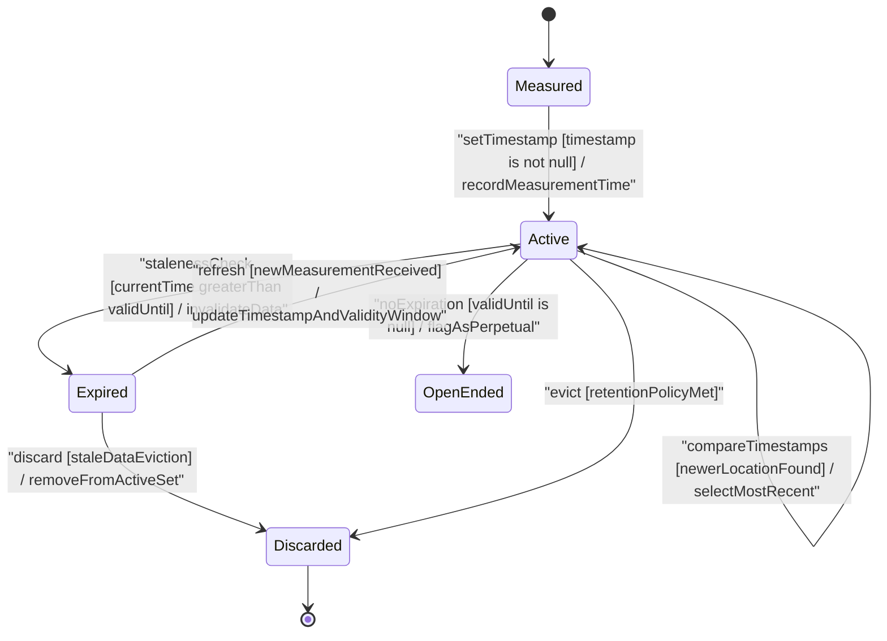

# User Story: [RFC9179-GEO] Temporal Attribute Staleness and Validity Window

## Parent Epic
- [ ] #42 - [RFC9179-GEO] A YANG Grouping for Geographic Locations (semantic linkage: this story validates the temporal staleness detection, validity window expiration, and timestamp-based recency comparison semantics across geo-location instances defined in Epic #42)

## Domain Object Mapping
- **Primary Domain Objects:** GeoLocation (timestamp, validUntil), GeoLocationSubsystem
- **Actor/Role:** Location Data Consumer (external entity that consumes geo-location records and must determine data freshness and validity)

## BDD Scenario (OOA/OOD Realization)
**As a** Location Data Consumer
**I want to** detect stale geo-location data by comparing the current time against the valid-until timestamp and select the most recent location record by comparing timestamps
**So that** only current, non-expired location data is used for navigation, tracking, and operational decisions

### Scenario: Staleness detection when valid-until is exceeded
**Given** a GeoLocation record with timestamp "2024-06-15T14:30:00Z" and validUntil "2024-06-16T14:30:00Z"
**When** the current system time is "2024-06-17T00:00:00Z" (after validUntil)
**Then** the geo-location is flagged as expired and MUST NOT be used for operational decisions

### Scenario: Valid location when current time is before valid-until
**Given** a GeoLocation record with timestamp "2024-06-15T14:30:00Z" and validUntil "2024-06-16T14:30:00Z"
**When** the current system time is "2024-06-15T18:00:00Z" (before validUntil)
**Then** the geo-location is within its validity window and MAY be used for operational decisions

### Scenario: No expiration when valid-until is absent
**Given** a GeoLocation record with timestamp "2024-06-15T14:30:00Z" and no validUntil value
**When** the staleness check is performed at any current time
**Then** the geo-location has no specific expiration and remains valid indefinitely

### Scenario: Recency comparison selects most recent timestamp
**Given** Location A with timestamp "2024-06-15T10:00:00Z" and Location B with timestamp "2024-06-15T14:30:00Z"
**When** the Location Data Consumer compares the two records by timestamp
**Then** Location B is selected as the most recent measurement

### Scenario: Staleness detection at exact boundary
**Given** a GeoLocation record with validUntil "2024-06-16T14:30:00Z"
**When** the current system time equals validUntil exactly
**Then** the geo-location is NOT expired (a location is valid through the end of its validity window)

### Scenario: Staleness with sub-second precision
**Given** a GeoLocation record with validUntil "2024-06-16T14:30:00.500000Z"
**When** the current system time is "2024-06-16T14:30:00.500001Z"
**Then** the geo-location is flagged as expired (sub-second precision is preserved in the comparison)

### Scenario: Staleness across timezone offsets
**Given** a GeoLocation record with validUntil "2024-06-16T14:30:00+05:00" (equivalent to "2024-06-16T09:30:00Z")
**When** the current UTC time is "2024-06-16T10:00:00Z" (after the UTC-equivalent of validUntil)
**Then** the geo-location is flagged as expired (timezone offsets are correctly normalised before comparison)

### Scenario: Recency comparison with absent timestamps
**Given** Location A has no timestamp value and Location B has timestamp "2024-06-15T14:30:00Z"
**When** the Location Data Consumer compares the two records by timestamp
**Then** Location B is selected as the most recent (an absent timestamp is treated as less recent than any present timestamp)

### Scenario: Both temporal attributes absent
**Given** a GeoLocation record has neither timestamp nor validUntil
**When** staleness detection and recency comparison are performed
**Then** the record is treated as having unknown recency and no expiration (both leaves are optional per RFC 9179)

## Compliance Table

| Rule | Status | Evidence |
| --- | --- | --- |
| Lifeline aliasing (name : Classifier) | PASS | All lifelines use `alias as "name : Classifier"` syntax |
| Open return arrows (-->) | PASS | All return messages use `-->` |
| Return value assignments (no method call format) | PASS | Returns use value descriptions without parentheses |
| Given-When-Then BDD scenarios | PASS | Nine BDD scenarios covering staleness, recency, boundaries, sub-second, timezone, and absent attributes |
| State diagram (mandatory for temporal lifecycle) | PASS | stateDiagram-v2 models Measured, Active, Expired, OpenEnded, and Discarded states |
| Combined fragment guards in square brackets | PASS | All guards use `[guard]` format |
| Actor vs participant keyword | PASS | External actor uses `actor` keyword, internal objects use `participant` |
| No colons in note or message strings | PASS | Notes and messages avoid colons |
| No semicolons in note or message text | PASS | Notes and messages avoid semicolons |
| No unquoted less-than or greater-than in diagrams | PASS | No unquoted angle brackets present |
| Mermaid block properly closed | PASS | All diagrams closed with matching ``` fences |
| Requires at least one BDD scenario | PASS | As-a/I-want-to/So-that plus nine Given-When-Then scenarios |
| Required Features Matrix present and non-empty | PASS | Matrix contains one linked feature with semantic justification |

## UML Sequence Diagram


## UML State Machine Diagram


## Operational Context
From RFC 9179 Section 3 (YANG Module description for timestamp leaf):
"Reference time when location was recorded."

From RFC 9179 Section 3 (YANG Module description for valid-until leaf):
"The timestamp for which this geo-location is valid until. If unspecified, the geo-location has no specific expiration time."

From RFC 9179 Section 5.1.2.1 (W3C Geolocation API Comparison):
"The YANG data model defines the timestamp with arbitrarily large precision by using a string that encompasses all representable values of this timestamp value." The timestamp leaf maps to a DOMTimeStamp (milliseconds since UNIX Epoch in a 64-bit unsigned integer), and the YANG date-and-time string encompasses all representable DOMTimeStamp values.

From RFC 9179 Section 5.1.3 (GML Comparison):
"gml:validTime can either be an instantaneous measure (gml:TimeInstant) or a time period (gml:TimePeriod). The instantaneous gml:TimeInstant is mappable to and from the YANG grouping timestamp value, and values down to the resolution of seconds for gml:TimePeriod can be mapped using the valid-until node of the YANG grouping." The valid-until leaf serves as the upper bound of a GML TimePeriod validity window.

### Algorithmic & Calculation Summary

**Staleness Detection Algorithm:**
1. Retrieve the validUntil value from the GeoLocation record.
2. If validUntil is absent, the record has no expiration — return "not expired".
3. Parse validUntil as an ISO 8601 date-and-time string, normalising timezone offsets to a common reference (e.g., UTC).
4. Obtain the current system time, normalised to the same reference.
5. If currentTime is strictly greater than validUntil, the record is stale/expired.
6. If currentTime is less than or equal to validUntil, the record is within its validity window.

**Recency Comparison Algorithm:**
1. Retrieve timestamps from all candidate GeoLocation records.
2. Records with absent timestamps are ordered last (least recent).
3. Parse each present timestamp as an ISO 8601 date-and-time string.
4. Sort records by their timestamp values in descending chronological order.
5. The record with the greatest timestamp is the most recent measurement.
6. Ties at full-second or fractional-second granularity are resolved by retaining the record that was evaluated first.

**Portability Alignment:**
- W3C DOMTimeStamp values (milliseconds since UNIX epoch) are representable as ISO 8601 strings with millisecond precision for staleness and recency operations.
- GML TimePeriod valid-until values at second resolution and above are directly comparable using the same ISO 8601 comparison logic.

## Required Features Matrix
- [ ] #41 - [RFC9179-GEO Temporal Location Attributes](https://github.com/gintatkinson/3dgs-039/blob/main/docs/features/feat-18-rfc9179-geo-temporal-location-attributes.md) (defines the timestamp and valid-until leaf nodes on the geo-location container at schema lines 264-275 whose staleness detection, recency comparison, and validity window lifecycle are exercised by this story)

## Logical UI & Interface Bindings
- **Target LUI Component:** Deferred to Feature #41 Task Y
- **Target Layout Container ID:** Deferred to Feature #41 Task Y
- **Data Source Bindings:** Deferred to Feature #41 Task Y

## Source References
Structural Schema: [ietf-geo-location@2022-02-11.yang](https://raw.githubusercontent.com/gintatkinson/3dgs-039/main/schema/ietf-geo-location%402022-02-11.yang) (Clause: timestamp leaf at line 264, valid-until leaf at line 269)
Normative Specification: [RFC 9179: A YANG Grouping for Geographic Locations](https://datatracker.ietf.org/doc/rfc9179/) (Clause: Section 3, YANG Module; Section 5.1, Usability & Portability)
